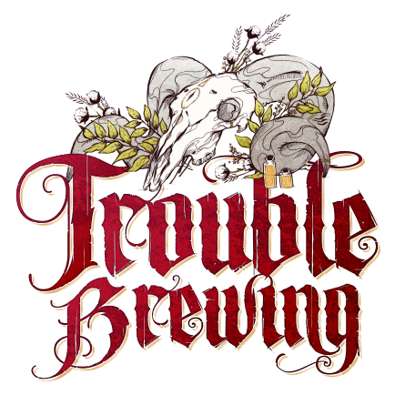
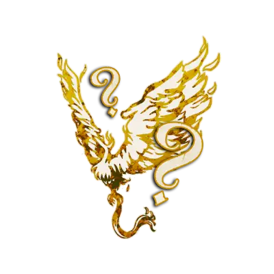
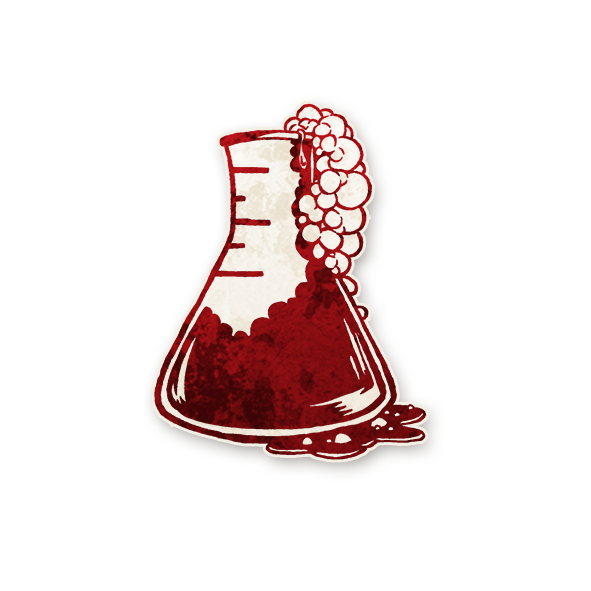

  

  

<button id="theme-toggle">☀️ Mode clair</button>

  

# 📚Wiki Francophone 🇫🇷 de *Blood 🩸 on the Clocktower* 🕰️
---

Bienvenue sur le **Wiki Francophone** de **Blood on the Clocktower** !  
Ce projet a pour but de proposer des **traductions fidèles**, des **conseils** et des **ressources** pour aider les communautés francophones à jouer dans un cadre **inclusif 🤝 et bienveillant.** 🫶🏻

---

## 📖 Page principale
Bienvenue sur le wiki francophone de Blood 🩸 on the Clocktower : toutes les règles, astuces et stratégies réunies au même endroit.

## 📜 Règles du jeu

Vous débutez sur *Blood 🩸 on the Clocktower* ?  
- 📖 Consultez les [**Règles complètes**](regles.md) pour découvrir l’univers, la mise en place et le déroulement du jeu.

## 🔢 Mise en Place

- ⚖️ [**Répartition du Village**](repartition.md)  

---

## 📖 Glossaire  

- 📘 [Glossaire des termes](glossaire.md)

##  🎭Catégories 

- [**Villageois**](villageois.md)  
- [**Étrangers**](etrangers.md) 
- [**Sbires**](sbires.md)  
- [**Démons**](demons.md)  

---
## Rôles par édition

  [Blood on the Clocktower](blood_on_the_clocktower.md)

  [Trouble Brewing](trouble_brewing.md)  
  
  [Bad Moon Rising](#) *(à venir)*  
 
  [Sects & Violets](#) *(à venir)*  
 
  [Voyageurs](voyageurs/index.md) 
 
  [Légendaires](#) *(à venir)*  
 
  [Rôles Expérimentaux](#) *(à venir)*  
 
---

  [Scripts personnalisés](#) *(à venir)* 

---
## 🛠️ Ressources
- 🧮 [Outil 🔧 officiel de création de scripts](https://script.bloodontheclocktower.com/)  
- 🧪 [Générateur d’informations pour le Savant🦽](https://savant.thegrim.gg/)  
- 📚 [Wiki Officel en anglais](https://wiki.bloodontheclocktower.com/Main_Page)
- 🎮 [Pour Jouer en ligne à Blood🩸on the Clocktower 🕰️](https://botc.app/)  
 
---

## 🔗 Réseaux Sociaux  
Rejoignez le Discord de **BambiBluePotato** pour jouer en ligne, partager de bons moments et participer à nos parties streamées.  
- 💬 [Discord](https://discord.gg/tGDVmZfZpE)  
- 🎥 [YouTube](https://www.youtube.com/@Bambipotato)  
- 🎮 [Twitch](https://www.twitch.tv/bambibluepotato)  
- 📸 [Instagram](https://www.instagram.com/bambibluepotato/)  
- 🌐 [Bluesky](https://bsky.app/profile/bambibluepotato.bsky.social)

---

## 🩸🕰️ Jouer en personne

Vous voulez découvrir *Blood 🩸on the Clocktower🕰️* autour d’une vraie table ?  
Rejoignez le groupe **Meetup Blood on the Clocktower Paris**, mené par Pierre :  

👉 [Blood on the Clocktower Paris – Meetup](https://www.meetup.com/blood-on-the-clocktower-paris/)  

Organisateur : **Pierre**  

---

🌎 Qui sommes-nous ?

Notre but est de partager *Blood on the Clocktower* en français et de le rendre accessible à toutes et à tous : que vous soyez débutant·e, joueur·se confirmé·e ou membre d’une nouvelle communauté, vous êtes les bienvenu·e·s.

✨ Ce projet a été initié par **BambiPotato**, mais il vit grâce à l’implication de nombreuses joueuses et joueurs passionnés, n’hésitez pas à proposer vos idées ou vos corrections.

---

⬅️ [Retour à l’accueil](README.md)
