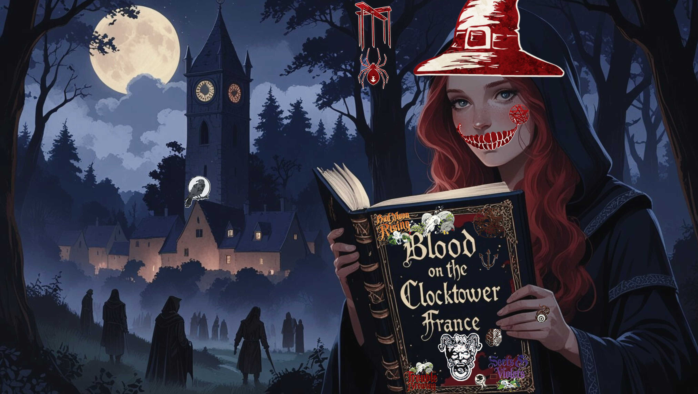

  

   
 <!-- 🏠 PAGE D’ACCUEIL - WIKI BOTC FR -->

  <h1 style="color:#b58b52; font-size:46px; font-weight:bold; text-shadow:2px 2px 6px #000;">
    📜 PAGE PRINCIPALE
  </h1>

  <h2 style="color:#b58b52; font-size:36px; font-weight:bold; text-shadow:2px 2px 6px #000; margin-top:20px;">
    🚪 Bienvenue sur le Wiki Francophone 🇫🇷 🌍 * "non officiel"*  de  
    Blood 🩸 on the Clocktower 🕰️
  </h2>

  

    « Explorez les rôles, les stratégies et les secrets de chaque édition. »
  

  

    Ce projet a pour but de proposer des
    traductions fidèles,
    des conseils et des
    ressources
    pour aider les communautés francophones à jouer dans un cadre
    inclusif 🤝 et bienveillant. 🫶🏻
  

<button id="theme-toggle">☀️ Mode clair</button>

  

---

<!-- ====== INFORMATIONS SUR LE JEU ====== -->

<h1 style="color:#b58b52; font-size:46px; font-weight:bold; text-shadow:2px 2px 6px #000; margin-bottom:10px;">
  📜 Informations sur le Jeu
</h1>

  <!-- 📘 Glossaire FR -->
  <a class="home-card" href="./glossaire.html" aria-label="Glossaire des termes Français">
    📘 Glossaire des termes 🇫🇷
  </a>

  <!-- 📘 Glossaire EN -->
  <a class="home-card" href="./glossaireengfr.html" aria-label="Glossaire des termes anglais">
    📘 Glossary des termes en anglais
  </a>

  <!-- 📘 Conseils Conteurs -->
  <a class="home-card" href="./conteur.html" aria-label="Conseils pour les Conteurs et Conteuses">
    📘 Conseils pour les Conteurs et Conteuses
  </a>

  <!-- 📘 Conseils Joueurs -->
  <a class="home-card" href="./strategie.html" aria-label="Conseils et Stratégies pour les joueurs et joueuses">
    📘 Conseils & Stratégies pour les joueurs et joueuses
  </a>

<!-- ====== /INFORMATIONS SUR LE JEU ====== -->

---
<!-- 📖 Livre des Règles-->
<h1 style="color:#b58b52; font-size:46px; font-weight:bold; text-shadow:2px 2px 6px #000;">
    📜 Livre des Règles
  </h1>

- 🏗️ [**Installation**](installation.md)

- 📜 *Vous débutez sur Blood 🩸 on the Clocktower ?* [**Venez Découvrir le Jeu Blood on the Clocktower**](blood_on_the_clocktower.md)

- 📜 Consultez les [**Explications des Règles**](regles.md) pour découvrir l’univers, la mise en place et le déroulement du jeu.

- ⚖️ [**Répartition du Village**](repartition.md)   

- 📋 [**Capacités**](capacite.md) 

- 🌀 [**États**](etats.md) 

- 🐥 [**Teensyville**](teensyville.md) 

- 🔧 Créez des scripts uniques [**Outil de Script**](outildescript.md)

---

## 👺 Rôles par Édition

<!-- ====== GRID D'ACCUEIL (cartes cliquables, 3 par ligne) ====== -->

  <!-- 🍺 Trouble Brewing -->
  <a class="home-card" href="./trouble_brewing.html">
    
    🍺 Trouble Brewing
  </a>

  <!-- 🌛 Bad Moon Rising -->
  <a class="home-card" href="./bmr.html">
    
    🌛 Bad Moon Rising
  </a>

  <!-- 🌸 Sects & Violets -->
  <a class="home-card" href="./sv.html">
    
    🌸 Sects &amp; Violets
  </a>

  <!-- 🚶 Voyageurs et Voyageuses (à venir)-->
  <a class="home-card" href="#" onclick="return false;">
    
    🚶 Voyageurs et Voyageuses
    à venir
  </a>

  <!-- 🏰 Légendaires (à venir) -->
  <a class="home-card" href="#" onclick="return false;">
    
    🏰 Légendaires
    à venir
  </a>

  <!-- 🎠 The Carousel Expérimental (à venir)--->
  <a class="home-card" href="./experimentaux.html">
    
    🎠 The Carousel Expérimental
    à venir
  </a>

<!-- ====== /GRID D'ACCUEIL ====== -->

---
<!-- ====== CATEGORIES (cartes cliquables, 2 par ligne) ====== -->

<h2 style="color:#b58b52; font-weight:bold; font-size:20px; margin-top:18px;">🎭 Catégories</h2>

<!-- Ligne 1 : Villageois & Étrangers -->

Rôles du Bien

  <a class="cat-card" role="listitem" href="./villageois.html" aria-label="Villageois">
    
    🔵 Villageois
  </a>

  <a class="cat-card" role="listitem" href="./etrangers.html" aria-label="Étrangers">
    
    🔵 Étrangers
  </a>

<!-- Ligne 2 : Sbires & Démons -->

Rôles du Mal

  <a class="cat-card" role="listitem" href="./sbires.html" aria-label="Sbires">
    
    🔴 Sbires
  </a>

  <a class="cat-card" role="listitem" href="./demons.html" aria-label="Démons">
    
    🔴 Démons
  </a>

<!-- Ligne 3 : Voyageurs & Légendaires -->

Modules spéciaux

  <a class="cat-card" role="listitem" href="./voyageurs/voyageurs.html" aria-label="Voyageurs et Voyageuses">
    
    🟣 Voyageurs et Voyageuses
  </a>

  <a class="cat-card" role="listitem" href="#" onclick="return false;" aria-label="Légendaires">
    
    🏰 Légendaires
    à venir
  </a>

<!-- ====== /CATEGORIES ====== -->

---

<!-- ====== SCRIPTS PERSONNALISÉS ====== -->

<h2 style="color:#b58b52; font-weight:bold; font-size:22px;">🪄 Scripts personnalisés</h2>

  <!-- 📜 Scripts personnalisés -->
  <a class="home-card" href="#" onclick="return false;" aria-label="Scripts personnalisés">
    
    📜 Scripts personnalisés
    à venir
  </a>

<!-- ====== /SCRIPTS PERSONNALISÉS ====== -->

---

  <h2 style="color:#b58b52; font-weight:bold; font-size:26px; margin-bottom:10px;">
    🛠️ Ressources
  </h2>

  <ul style="list-style:none; padding-left:0; font-size:19px; color:#e0c99d;">
    <li>🎮 <a href="https://botc.app/" target="_blank" style="color:#ffb84d; font-weight:bold; text-decoration:none;">Pour jouer en ligne à Blood 🩸 on the Clocktower 🕰️</a></li>
    <li>📜 <a href="https://wiki.bloodontheclocktower.com/Main_Page" target="_blank" style="color:#ffb84d; font-weight:bold; text-decoration:none;">Wiki officiel BotC🩸TPI</a></li>
         <li>📚 <a href="https://www.botcscripts.com" target="_blank" style="color:#ffb84d; font-weight:bold; text-decoration:none;">BotC Scripts</a></li>
    <li>🧮 <a href="https://script.bloodontheclocktower.com/" target="_blank" style="color:#ffb84d; font-weight:bold; text-decoration:none;">Outil 🔧 officiel de création de scripts</a></li>
    <li>🧪 <a href="https://savant.thegrim.gg/" target="_blank" style="color:#ffb84d; font-weight:bold; text-decoration:none;">Générateur d’informations pour le Savant 🦽</a></li>
  
  </ul>

  

  <h2 style="color:#b58b52; font-weight:bold; font-size:26px; margin-bottom:10px;">
    🔗 Réseaux Sociaux
  </h2>

  

    Rejoignez notre petite communaité sur Discord pour jouer en ligne, partager de bons moments et participer à nos parties streamées :
  

  <ul style="list-style:none; padding-left:0; font-size:19px; color:#e0c99d;">
    <li>💬 <a href="https://discord.gg/tGDVmZfZpE" target="_blank" style="color:#ffb84d; font-weight:bold; text-decoration:none;">Discord</a></li>
    <li>🎥 <a href="https://www.youtube.com/@Bambipotato" target="_blank" style="color:#ffb84d; font-weight:bold; text-decoration:none;">YouTube</a></li>
    <li>🎮 <a href="https://www.twitch.tv/bambibluepotato" target="_blank" style="color:#ffb84d; font-weight:bold; text-decoration:none;">Twitch</a></li>
    <li>📸 <a href="https://www.instagram.com/bambibluepotato/" target="_blank" style="color:#ffb84d; font-weight:bold; text-decoration:none;">Instagram</a></li>
    <li>🌐 <a href="https://bsky.app/profile/bambibluepotato.bsky.social" target="_blank" style="color:#ffb84d; font-weight:bold; text-decoration:none;">Bluesky</a></li>
  </ul>

---

  <h2 style="color:#d4a76a; font-size:34px; font-weight:bold; text-shadow:1px 1px 4px #000;">
    🩸🕰️ Jouer en personne ?
  </h2>

  

    Vous voulez découvrir <em>Blood 🩸on the Clocktower🕰️</em> autour d’une vraie table ? 
    Rejoignez le groupe Meetup Blood on the Clocktower Paris,
    mené par Pierre 💫
  

  

    👉 <a href="https://www.meetup.com/blood-on-the-clocktower-paris/" target="_blank" style="color:#ffb84d; font-weight:bold; text-decoration:none;">
      Blood on the Clocktower Paris – Meetup
    </a>
  

  

  <h3 style="color:#b58b52; font-size:28px; font-weight:bold;">Qui sommes-nous ?</h3>

  

    Notre but est de partager Blood on the Clocktower en français
    et de le rendre accessible à toutes et à tous : 
    que vous soyez <em>débutant·ou débutante</em>, <em>joueur·ou joueuse confirmé·e</em> ou membre d’une nouvelle communauté,
    vous êtes les bienvenu·e·s.
  

  

    ✨ Ce projet vit grâce à l’implication de nombreuses joueuses et joueurs passionnés. 
    N’hésitez pas à proposer vos idées ou vos corrections.
  

