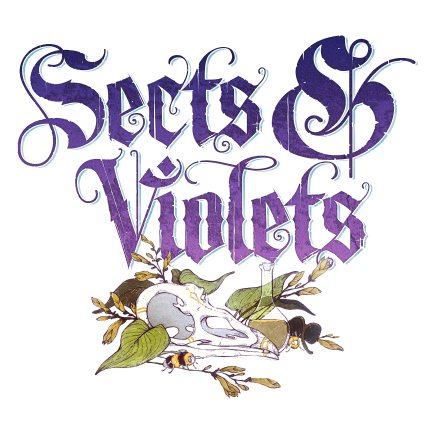
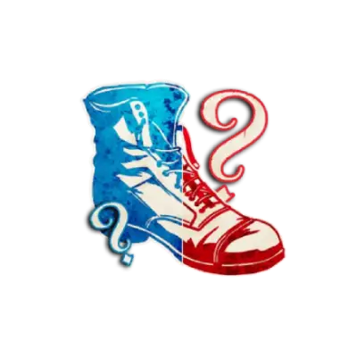
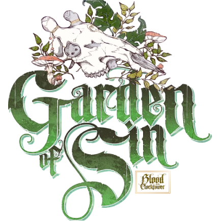
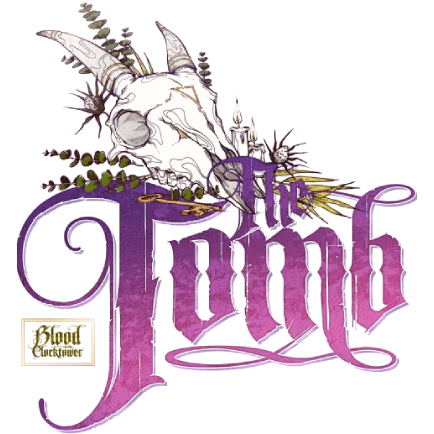
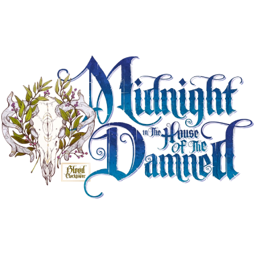
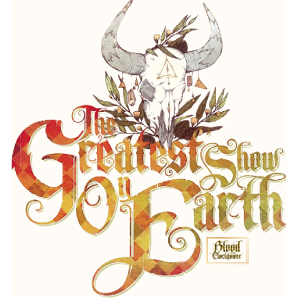
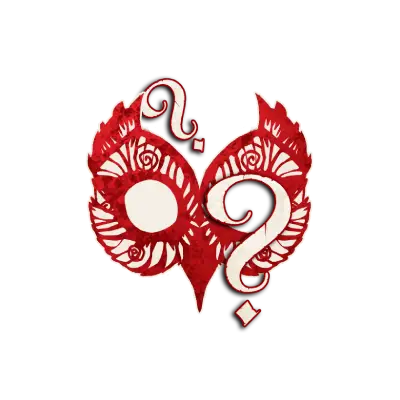
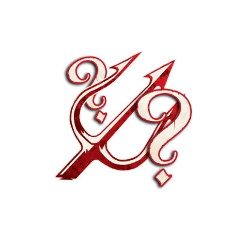
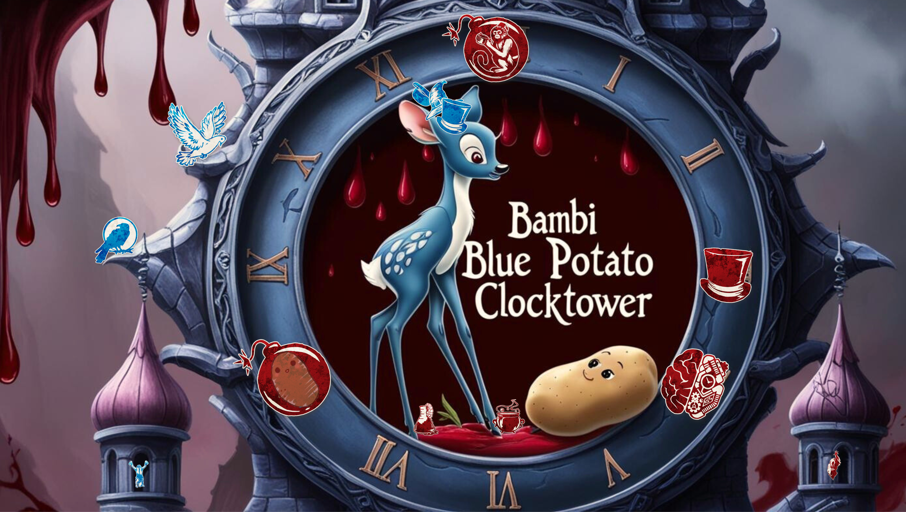

  

<!-- PATCH LISIBILITÉ + BANNIÈRE ÉCLAIRCIE (version plus sombre et équilibrée) -->

<!--  PAGE D’ACCUEIL - WIKI BOTC FR -->

  <h1 style="color:#b58b52; font-size:24px; font-weight:bold; text-shadow:2px 2px 6px #000; margin-top:20px;">
     Bienvenue sur le Wiki Francophone « non officiel » de  
    Blood on the Clocktower
  </h1>

  

    « Explorez les rôles, les stratégies et les secrets de chaque édition. »
  

  

    Traductions fidèles,
    des conseils et des
    ressources
    pour aider les communautés francophones à jouer dans un cadre
    inclusif et bienveillant.
  

  

    Ce site web est né de l’amour de
    <a href="https://bloodontheclocktower.com/"
       target="_blank" rel="noopener noreferrer"
       style="color:#d4a76a; font-weight:bold; text-decoration:none;">
      Blood on the Clocktower
    </a>
    et il n’a aucun but lucratif. 
    Tout le contenu de
    <a href="https://bloodontheclocktower.com/"
       target="_blank" rel="noopener noreferrer"
       style="color:#d4a76a; font-weight:bold; text-decoration:none;">
      Blood on the Clocktower
    </a>
    appartient à
    The Pandemonium Institute.
  

<!-- ====== INFORMATIONS SUR LE JEU ====== -->

<h1 style="
  color:#b58b52;
  font-size:20px;
  font-weight:bold;
  text-shadow:2px 2px 6px #000;
  padding-left:16px;
  margin-bottom:10px;
">
  Informations sur le Jeu
</h1>

<table class="rules-table">
  <tr>
    <td class="rules-cell">
      <a class="rules-link" href="./glossaire.html" aria-label="Glossaire des termes Français">
        
Glossaire des termes 

        
Liste des termes en français

      </a>
    </td>

    <td class="rules-cell">
      <a class="rules-link" href="./glossaireengfr.html" aria-label="Glossaire des termes anglais">
        
Glossary des termes en anglais

        
Termes anglais & équivalents

      </a>
    </td>

    <td class="rules-cell">
      <a class="rules-link" href="./conteur.html" aria-label="Conseils pour les Conteurs et Conteuses">
        
Conseils pour les Conteurs et Conteuses

        
Astuces, bonnes pratiques

      </a>
    </td>

    <td class="rules-cell">
      <a class="rules-link" href="./strategie.html" aria-label="Conseils et Stratégies pour les joueurs et joueuses">
        
Conseils & Stratégies pour les joueurs et joueuses

        
Pistes de réflexion en partie

      </a>
    </td>
  </tr>
</table>

<!-- ====== /INFORMATIONS SUR LE JEU ====== -->

<!--  Livre des Règles (version table, sans 
) -->
<h1 style="
  color:#b58b52;
  font-size:20px;
  font-weight:bold;
  text-shadow:2px 2px 6px #000;
  padding-left:16px;
  margin-bottom:14px;
">
  Livre des Règles
</h1>

<table class="rules-table">
  <tr>
    <td class="rules-cell">
      <a class="rules-link" href="./blood_on_the_clocktower.html">
        
Découvrir le jeu

        
Premiers pas, esprit du jeu

      </a>
    </td>
    <td class="rules-cell">
      <a class="rules-link" href="./regles.html">
        
Explications des règles

        
Univers, signaux, déroulé

      </a>
    </td>
    <td class="rules-cell">
      <a class="rules-link" href="./repartition.html">
        
Répartition du village

        
Configuration officielle

      </a>
    </td>
    <td class="rules-cell">
      <a class="rules-link" href="./installation.html">
        
Installation

        
Mise en place étape par étape

      </a>
    </td>
  </tr>
  <tr>
    <td class="rules-cell">
      <a class="rules-link" href="./capacite.html">
        
Capacités

        
Quand et comment elles s’appliquent

      </a>
    </td>
    <td class="rules-cell">
      <a class="rules-link" href="./etats.html">
        
États

        
Ivresse, empoisonnement…

      </a>
    </td>
    <td class="rules-cell">
      <a class="rules-link" href="./teensyville.html">
        
Teensyville

        
Format 5–6 joueurs et joueuses

      </a>
    </td>
    <td class="rules-cell">
      <a class="rules-link" href="./outildescript.html">
        
Outil de Script

        
Créez vos scripts personnalisés

      </a>
    </td>
  </tr>
</table>

<!-- Rôles par Édition -->
<h1 style="
  color:#b58b52;
  font-size:20px;
  font-weight:bold;
  text-shadow:2px 2px 6px #000;
  padding-left:16px;
  margin-bottom:14px;
">
  Rôles par Édition
</h1>

<table class="roles-grid" role="presentation" aria-label="Rôles par Édition">
  <tr>
    <!--  Trouble Brewing -->
    <td>
      <a href="./trouble_brewing.html">
        
          
        
        Trouble Brewing
      </a>
    </td>

    <!--  Bad Moon Rising -->
    <td>
      <a href="./bmr.html">
        
          
        
        Bad Moon Rising
      </a>
    </td>

    <!--  Sects & Violets -->
    <td>
      <a href="./sv.html">
        
          
        
        Sects &amp; Violets
      </a>
    </td>
  </tr>

  <tr>
    <!--  Voyageurs -->
    <td>
      <a href="./voyageurs/voyageurs.html">
        
          
        
        Voyageurs
      </a>
    </td>

    <!--  The Carousel Expérimental -->
    <td>
      <a href="./experimentaux.html">
        
          
        
        The Carousel Expérimentaux
      </a>
    </td>

    <!--  Légendaires -->
    <td>
      <a href="./legendaire.html">
        
          
        
        Légendaires
      </a>
    </td>
  </tr>

  <tr>
    <!--  Lorics -->
    <td>
      <a href="./loric.html">
        
          
        
        Lorics
      </a>
    </td>

    <!--  Garden of Sin -->
    <td>
      <a href="./gardenofsin.html">
        
          
        
        Garden of Sin
        Prochainement
      </a>
    </td>

    <!--  The Tomb -->
    <td>
      <a href="./thetomb.html">
        
          
        
        The Tomb
        Prochainement
      </a>
    </td>
  </tr>

  <tr>
    <!-- Midnight in the House of the Damned -->
    <td>
      <a href="./mind.html">
        
          
        
        Midnight in the House of the Damned
        Prochainement
      </a>
    </td>

    <!-- The Greatest Show on Earth -->
    <td>
      <a href="./gshow.html">
        
          
        
        The Greatest Show on Earth
        Prochainement
      </a>
    </td>

    <!-- Placeholder vide pour compléter la ligne -->
    <td aria-hidden="true"></td>
  </tr>
</table>
<!-- ====== /GRID D'ACCUEIL ====== -->

<!-- Catégories -->
<h2 style="
  color:#b58b52;
  font-weight:bold;
  font-size:20px;
  text-shadow:2px 2px 6px #000;
  padding-left:16px;
  margin-bottom:14px;
">
  Catégories
</h2>

<table style="width:100%; border-collapse:separate; border-spacing:16px;">
  <tr>
    <!-- Villageois -->
    <td style="width:50%; text-align:center; padding:12px; background:rgba(0,0,0,0.45); border:1px solid #b58b52; border-radius:12px;">
      <a href="./villageois.html" style="text-decoration:none; display:inline-block;">
        
        
Villageois

      </a>
    </td>

    <!-- Étrangers -->
    <td style="width:50%; text-align:center; padding:12px; background:rgba(0,0,0,0.45); border:1px solid #b58b52; border-radius:12px;">
      <a href="./etrangers.html" style="text-decoration:none; display:inline-block;">
        
        
Étrangers

      </a>
    </td>
  </tr>

  <tr>
    <!-- Sbires -->
    <td style="width:50%; text-align:center; padding:12px; background:rgba(0,0,0,0.45); border:1px solid #b58b52; border-radius:12px;">
      <a href="./sbires.html" style="text-decoration:none; display:inline-block;">
        
        
Sbires

      </a>
    </td>

    <!-- Démons -->
    <td style="width:50%; text-align:center; padding:12px; background:rgba(0,0,0,0.45); border:1px solid #b58b52; border-radius:12px;">
      <a href="./demons.html" style="text-decoration:none; display:inline-block;">
        
        
Démons

      </a>
    </td>
  </tr>

  <tr>
    <!-- Voyageurs -->
    <td style="width:50%; text-align:center; padding:12px; background:rgba(0,0,0,0.45); border:1px solid #b58b52; border-radius:12px;">
      <a href="./voyageurs/voyageurs.html" style="text-decoration:none; display:inline-block;">
        
        
Voyageurs

      </a>
    </td>

    <!-- Légendaires -->
    <td style="width:50%; text-align:center; padding:12px; background:rgba(0,0,0,0.45); border:1px solid #b58b52; border-radius:12px;">
      <a href="./legendaire.html" style="text-decoration:none; display:inline-block; opacity:0.8;">
        
        
Légendaires

      </a>
    </td>
  </tr>
</table>

<!-- ====== SCRIPTS PERSONNALISÉS ====== -->

<h2 style="
  color:#b58b52;
  font-weight:bold;
  font-size:20px;
  text-shadow:2px 2px 6px #000;
  padding-left:16px;
  margin-bottom:14px;
">
  Scripts personnalisés
</h2>

  <!-- Scripts personnalisés -->
  <a class="home-card" href="#" onclick="return false;" aria-label="Scripts personnalisés">
    
    Scripts personnalisés
    à venir
  </a>

<!-- ====== /SCRIPTS PERSONNALISÉS ====== -->

  <h2 style="
    color:#b58b52;
    font-weight:bold;
    font-size:20px;
    margin-bottom:10px;
  ">
     Ressources en ligne pour Blood on the Clocktower
  </h2>

  <!-- Petite icône Blood on the Clocktower -->
  

  

     Le jeu Blood on the Clocktower
     a été créé par The Pandemonium Institute.
  

  <ul style="
    list-style:none;
    padding-left:0;
    font-size:16px;
    color:#e0c99d;
  ">
    
    <!-- LIENS EN PREMIER -->
    <li>
      <a href="https://bloodontheclocktower.com/" target="_blank"
         style="color:#ffb84d; font-weight:bold; text-decoration:none;">
         Site Officiel Blood on the Clocktower 
      </a>
    </li>

    <li>
      <a href="https://discord.gg/eD4zvq6RvB" target="_blank"
         style="color:#ffb84d; font-weight:bold; text-decoration:none;">
         Discord Unofficial
      </a>
    </li>

    <!-- LIENS DÉJÀ EXISTANTS -->
    <li>
      <a href="https://botc.app/" target="_blank"
         style="color:#ffb84d; font-weight:bold; text-decoration:none;">
         Application pour jouer en ligne 
      </a>
    </li>

    <li>
      <a href="https://wiki.bloodontheclocktower.com/Main_Page" target="_blank"
         style="color:#ffb84d; font-weight:bold; text-decoration:none;">
         Wiki officiel The Pandemonium Institute
      </a>
    </li>

    <li>
      <a href="https://www.botcscripts.com" target="_blank"
         style="color:#ffb84d; font-weight:bold; text-decoration:none;">
         La librairie des scripts BotC
      </a>
    </li>

    <li>
      <a href="https://script.bloodontheclocktower.com/" target="_blank"
         style="color:#ffb84d; font-weight:bold; text-decoration:none;">
         Outil officiel de création de scripts
      </a>
    </li>

    <li>
      <a href="https://savant.thegrim.gg/" target="_blank"
         style="color:#ffb84d; font-weight:bold; text-decoration:none;">
         Générateur d’informations pour le rôle du Savant
      </a>
    </li>

    <!-- YOUTUBE -->
    <li>
      <a href="https://www.youtube.com/@BloodontheClocktower" target="_blank"
         style="color:#ffb84d; font-weight:bold; text-decoration:none;">
         YouTube  
      </a>
    </li>

    <!-- TWITCH OFFICIEL -->
    <li>
      <a href="https://www.twitch.tv/thepandemoniuminstitute" target="_blank"
         style="color:#ffb84d; font-weight:bold; text-decoration:none;">
        Twitch 
      </a>
    </li>

    <!-- INSTAGRAM -->
    <li>
      <a href="https://www.instagram.com/stories/bloodontheclocktower/" target="_blank"
         style="color:#ffb84d; font-weight:bold; text-decoration:none;">
         Instagram 
      </a>
    </li>

    <!-- PATREON -->
    <li>
      <a href="https://www.patreon.com/c/botconline/posts" target="_blank"
         style="color:#ffb84d; font-weight:bold; text-decoration:none;">
         Patreon 
      </a>
    </li>

    <!-- CONTACT OFFICIEL -->
    <li>
      <a href="mailto:butler@bloodontheclocktower.com"
         style="color:#ffb84d; font-weight:bold; text-decoration:none;">
         Contact : butler@bloodontheclocktower.com
      </a>
    </li>

  </ul>

  <h2 style="color:#b58b52; font-weight:bold; font-size:18px; margin-bottom:10px;">
     Open Sesame Games
  </h2>

  <!-- Petite icône Open Sesame Games -->
  

  

     Le jeu Blood on the Clocktower en français est édité par Open Sesame Games.
  

  <ul style="list-style:none; padding-left:0; font-size:16px; color:#e0c99d;">

    <li>
      <a href="https://open-sesame.games" target="_blank"
         style="color:#ffb84d; font-weight:bold; text-decoration:none;">
         Site officiel Open Sesame Games
      </a>
    </li>

    <li>
      <a href="https://discord.gg/7jM7F9bZGf" target="_blank"
         style="color:#ffb84d; font-weight:bold; text-decoration:none;">
         Discord 
      </a>
    </li>

    <li>
      <a href="https://www.youtube.com/@opensesamegames1793" target="_blank"
         style="color:#ffb84d; font-weight:bold; text-decoration:none;">
         YouTube 
      </a>
    </li>

    <li>
      <a href="https://www.instagram.com/opensesamegames/" target="_blank"
         style="color:#ffb84d; font-weight:bold; text-decoration:none;">
         Instagram 
      </a>
    </li>

    <li>
      <a href="mailto:contact@open-sesame.games"
         style="color:#ffb84d; font-weight:bold; text-decoration:none;">
         Contact : contact@open-sesame.games
      </a>
    </li>

  </ul>

  <h2 style="color:#b58b52; font-weight:bold; font-size:18px; margin-bottom:10px;">
    Wiki Francophone « non officiel »
  </h2>

  <!-- Petit icône communauté -->
  

  

    Rejoignez notre petite communauté sur Discord pour jouer en ligne et participer à nos parties streamées :
  

  <ul style="list-style:none; padding-left:0; font-size:16px; color:#e0c99d;">
    <li> <a href="https://discord.gg/tGDVmZfZpE" target="_blank" style="color:#ffb84d; font-weight:bold; text-decoration:none;">Discord</a></li>
    <li> <a href="https://www.youtube.com/@Bambipotato" target="_blank" style="color:#ffb84d; font-weight:bold; text-decoration:none;">YouTube</a></li>
    <li> <a href="https://www.twitch.tv/bambibluepotato" target="_blank" style="color:#ffb84d; font-weight:bold; text-decoration:none;">Twitch</a></li>
    <li> <a href="https://www.instagram.com/bambibluepotato/" target="_blank" style="color:#ffb84d; font-weight:bold; text-decoration:none;">Instagram</a></li>
  </ul>

  <!-- Ligne de contact -->
  

    Pour toute question, suggestion ou amélioration du wiki, 
    vous pouvez me contacter :  
    <a href="mailto:bambibluepotato@gmail.com"
       style="color:#ffb84d; font-weight:bold; text-decoration:none;">
       BambiBluePotato
    </a>
  

  <h2 style="color:#d4a76a; font-size:18px; font-weight:bold; text-shadow:1px 1px 4px #000;">
    Jouer en personne ou en ligne&nbsp;?
  </h2>

  

    Que vous découvriez <em>Blood on the Clocktower</em> autour d’une table ou à distance,  
    ce wiki est là pour vous aider à créer des parties passionnantes, accessibles et équilibrées.
  

  

    Chaque communauté, qu’elle soit locale ou en ligne, est encouragée à jouer dans un
    cadre bienveillant, respectueux et sain,  
    où l’amusement, la confiance et l’inclusivité passent toujours avant la compétition.
  

  

    Si vous souhaitez jouer en personne, dans un cadre bienveillant,  
    plusieurs groupes francophones organisent régulièrement des parties :
  

  <ul style="color:#e0c99d; font-size:16px; line-height:1.7; margin-left:30px;">
    <li>
      <a href="https://www.meetup.com/blood-on-the-clocktower-paris/"
         target="_blank"
         style="color:#ffb84d; font-weight:bold; text-decoration:none;">
        Blood on the Clocktower Paris Meetup
      </a>
    </li>
    <li>
      <a href="https://www.meetup.com/blood-on-the-clocktower-nantes/"
         target="_blank"
         style="color:#ffb84d; font-weight:bold; text-decoration:none;">
        Blood on the Clocktower Nantes Meetup
      </a>
    </li>
  </ul>

  <!-- Séparation visuelle nette -->
  

  

    Ce site est créé par et pour les fans de
    Blood on the Clocktower
    et n’a aucun but lucratif. 
    Tout le contenu lié à
    Blood on the Clocktower
    appartient à
    The Pandemonium Institute.
  

  

    Soutenez : 
    <a href="https://bloodontheclocktower.com/"
       target="_blank" rel="noopener noreferrer"
       style="color:#d4a76a; font-weight:bold; text-decoration:none;">
      The Pandemonium Institute
    </a>
    &nbsp;•&nbsp;
    <a href="https://open-sesame.games/"
       target="_blank" rel="noopener noreferrer"
       style="color:#d4a76a; font-weight:bold; text-decoration:none;">
      Open Sesame Games
    </a>
  

  

    
  

