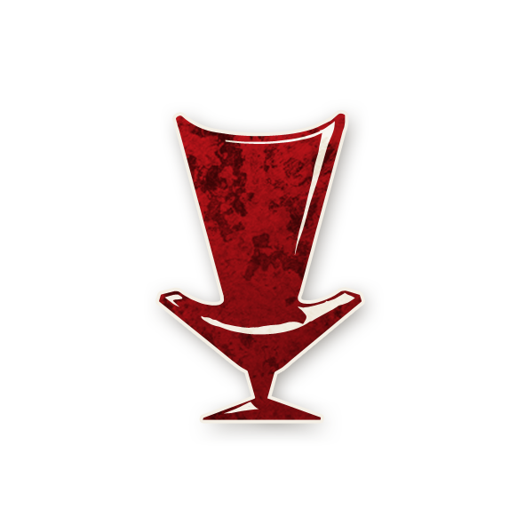
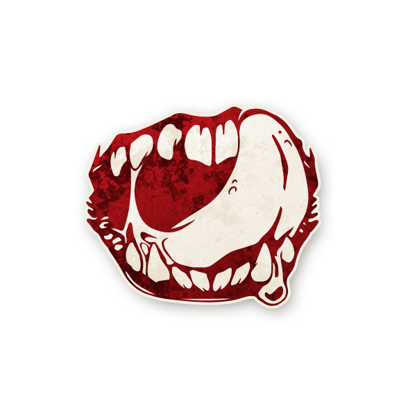
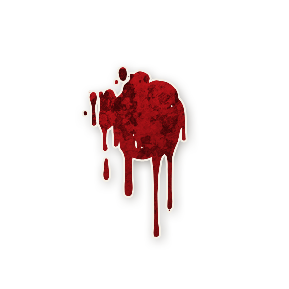

  

<!-- 🌕 Logo centré cliquable -->

  <a href="./bmr.html" style="text-decoration:none;">
    
     
    Bad Moon Rising
  </a>

  « Les morts dansent sous la lune, et les vivants leur tiennent la chandelle… »

---

## 📑 Sommaire

1. [📖 Synopsis](#-synopsis)  
2. [🎲 Gameplay](#-gameplay)  
3. [Villageois](#villageois)  
4. [Étrangers](#étrangers)  
5. [Sbires](#sbires)  
6. [Démons](#démons)  
7. [📥 Télécharger & Imprimer](#-télécharger--imprimer)  

---

## 📖 Synopsis

Le soleil est avalé par un horizon déchiqueté, alors qu’un autre jour d’hiver cède la place à la nuit. 
Des éclats orangés et rouges se fondent en bruns plus profonds, la forêt se transformant en silence, dans l’attente de la neige à venir.

Des loups affamés hurlent depuis les entrailles d’un ravin rocailleux au-delà des frontières de la ville, envoyant les oiseaux fuir leurs nids. 
Les voyageurs se hâtent vers l’auberge, cherchant refuge contre le froid mordant. 
Ils se réchauffent avec du thé brûlant, des airs de musique douce et de la bière épaisse, sans savoir que des yeux étranges et maléfiques les observent depuis les ruines de cette ancienne cité.

Ce soir, même le bétail sait qu’il y a… <strong>Bad Moon Rising</strong>.

---

## 🎲 Gameplay

<strong>Bad Moon Rising</strong> est une véritable <strong>fête de la mort</strong>.

<ul style="color:#e0c99d; font-size:18px; line-height:1.7; margin-left:40px;">
  <li>Les Démons tuent plusieurs fois par nuit.</li>
  <li>Les Sbires ont eux aussi des capacités meurtrières.</li>
  <li>Les Villageois peuvent prendre de gros risques pour obtenir des infos fiables… mais risquent de tuer leurs amis par erreur.</li>
</ul>

Heureusement, beaucoup d’options permettent de garder des joueurs en vie bien plus longtemps qu’ils ne l’auraient cru possible. 
Mais si l’équipe du Bien ne parvient pas à identifier les Sbires et Démons précis en jeu, leur défaite est presque certaine.

👉 Niveau : <strong>Intermédiaire</strong> 
<em>*Recommandé pour les joueurs et joueuses proactif·ves, attentif·ves à la coopération d’équipe et qui n’ont pas peur de mourir.*</em>

## [**Villageois**](villageois.md)

    
  [**Grand-Mère**](bmr_roles/grandmere.md)

    
  [**Marin**](bmr_roles/marin.md)

    
  [**Femme de Chambre**](bmr_roles/femmedechambre.md)

    
  [**Exorciste**](bmr_roles/exorciste.md)

    
  [**Aubergiste**](bmr_roles/aubergiste.md)

    
  [**Parieur**](bmr_roles/parieur.md)

    
  [**Commère**](bmr_roles/commere.md)

    
  [**Courtisan**](bmr_roles/courtisan.md)

    
  [**Professeur**](bmr_roles/professeur.md)

    
  [**Ménestrel**](bmr_roles/menestrel.md)

    
  [**Dame de Thé**](bmr_roles/damedethe.md)

    
  [**Fou**](bmr_roles/fou.md)

---

## [**Étrangers**](etrangers.md)

    
  [**Brute**](bmr_roles/brute.md)

    
  [**Lunatique**](bmr_roles/lunatique.md)

    
  [**Bricoleur**](bmr_roles/bricoleur.md)

    
  [**Enfant de la Lune**](bmr_roles/enfantdelalune.md)

---

## [**Sbires**](sbires.md)

    
  [**Parrain**](bmr_roles/parrain.md)

    
  [**Avocat du Diable**](bmr_roles/avocatdudiable.md)

    
  [**Assassin**](bmr_roles/assassin.md)

    
  [**Cerveau**](bmr_roles/cerveau.md)

---

## [**Démons**](demons.md)

    
  [**Zombuul**](bmr_roles/zombuul.md)

    
  [**Pukka**](bmr_roles/pukka.md)

    
  [**Shabaloth**](bmr_roles/shabaloth.md)

    
  [**Po**](bmr_roles/po.md)

---

## 📥 Télécharger & Imprimer

Ces ressources sont pratiques pour <strong>imprimer</strong> et <strong>jouer en personne</strong>.

<h3 style="color:#ffa64d; font-weight:bold; font-size:22px;">📄 PDF complet</h3>

👉 <a href="./images/bmr-roles.pdf" style="color:#d4a76a; font-weight:bold; text-decoration:none;">📄 Télécharger le PDF de Bad Moon Rising</a>

<h3 style="color:#ffa64d; font-weight:bold; font-size:22px;">🖼️ Images pratiques</h3>

  
  
  

---
<ul style="color:#e0c99d; font-size:18px; line-height:1.7;">
  <li>🏠 <a href="./index.html" style="color:#d4a76a; font-weight:bold; text-decoration:none;">Retour à la page d’accueil</a></li>
  <li>📘 <a href="./trouble_brewing.html" style="color:#d4a76a; font-weight:bold; text-decoration:none;">Trouble Brewing</a></li>
  <li>💐 <a href="./sv.html" style="color:#d4a76a; font-weight:bold; text-decoration:none;">Sects & Violets</a></li>
</ul>
