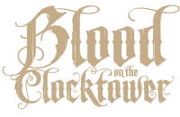
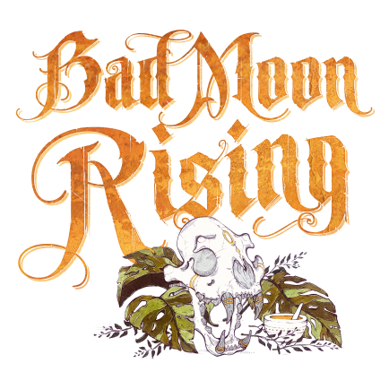

  

#  Brute  

 [**Brute**](../bmr_roles/brute.md)

---

## ℹ️ Informations  

- **Type :** [Étranger](../etrangers.md)  
- **Artiste :** Caitlin Murphy  

> *« Oui patron. Je lui ai bien expliqué les choses à ce type. Il ne veut surtout pas que je réexplique. Non patron, pas besoin de docteur – c’est qu’un coup de couteau. Ça ira mieux demain matin. »*

---

## 🎭 Apparaît dans  

 [**Bad Moon Rising**](../bmr.md)  

*Cult of the Clocktower* – épisode par Andrew Nathenson  

---

## 📖 Résumé  

**« Chaque nuit, le premier joueur qui vous choisit avec sa capacité est ivre jusqu'au crépuscule. Vous devenez son alignement. »**

La **Brute** est immunisée contre les capacités nocturnes des autres joueurs… mais change d’alignement à chaque fois qu’elle en rend un ivre !

- Chaque nuit, la première fois qu’un joueur **utilise sa capacité sur la Brute**, il devient **ivre immédiatement**.  
  Sa capacité échoue pour cette nuit et jusqu’au crépuscule suivant.  
- Si un autre joueur choisit la Brute plus tard dans la même nuit, **sa capacité fonctionne normalement**.  
- Dès qu’un joueur devient ivre à cause d’elle, la Brute **change d’alignement pour correspondre au sien**.  
- La Brute change d’alignement même si le joueur était déjà ivre ou empoisonné.  
- Si la Brute est attaquée par l’[Assassin](assassin.md), elle meurt, mais devient alors **maléfique**.  

---

## 🎬 Comment Conter  

- La nuit, si un joueur choisit la Brute et qu’aucun jeton de rappel **IVRE (Brute)** n’est encore placé,  
  marquez ce joueur avec le jeton **IVRE (Brute)**.  
  Il devient immédiatement **ivre**, et sa capacité échoue.  

- Si son alignement est différent de celui de la Brute, **faites pivoter** le jeton de la Brute pour refléter son nouvel alignement :  
  - Jeton à l’endroit = Bon  
  - Jeton à l’envers = Maléfique  

- Réveillez la Brute, indiquez-lui son nouvel alignement (pouce levé pour Bon, pouce baissé pour Maléfique), puis rendormez-la.  
- Au crépuscule suivant, le joueur marqué **IVRE (Brute)** redevient **sobre**.  

---

## 🧾 Exemples  

- Le [Courtisan](courtisan.md) choisit la Brute : la Brute devient **bonne**, et le Courtisan devient **ivre**.  
- Le [Shabaloth](shabaloth.md) attaque la Brute, puis la [Commère](commere.md).  
  Comme le Shabaloth est devenu ivre en choisissant la Brute, **personne ne meurt cette nuit-là**, et la Brute devient **maléfique**.  
- La nuit suivante, le Shabaloth attaque le [Parieur](parieur.md), puis la Brute :  
  le Parieur meurt, le Shabaloth devient à nouveau ivre, et la Brute reste en vie, toujours maléfique.  
- La [Femme de Chambre](femmedecha.md) choisit la Brute et le [Ménestrel](menestrel.md), et apprend un résultat erroné car elle est **ivre**.  
- La [Dame de Thé](damedethe.md) est voisine d’une Brute bonne et d’un [Bricoleur](bricoleur.md).  
  Le Bricoleur est exécuté mais ne meurt pas. Le lendemain, la Brute est devenue maléfique ; le Bricoleur est exécuté à nouveau et meurt.  

---

## 💡 Astuces & Stratégie  

La **Brute** est un rôle imprévisible : vous ne saurez peut-être jamais de quel côté vous jouez avant la fin !  
Rester discret peut être judicieux : observez, bluffez et découvrez comment votre alignement évolue.  

### 😇 Si vous êtes du Bien  

- Vous êtes très difficile à tuer la nuit : la plupart des capacités échouent avant de vous atteindre.  
  Même un [Pukka](pukka.md) devient ivre avant de pouvoir vous empoisonner.  
  Seul l’[Assassin](assassin.md) peut vous éliminer directement.  
- Si vous devenez maléfique tôt dans la partie, révélez-vous peut-être : cela peut inciter les deux camps à **se battre pour vous rallier**.  
  Mais attention : la ville pourrait choisir de vous exécuter par prudence.  
- En fin de partie, votre alignement actuel déterminera probablement votre victoire ou défaite.  
  Si vous êtes bon, aidez l’équipe : annoncez quand votre alignement a changé — cela peut correspondre à des échecs d’actions nocturnes, et donc révéler des rôles maléfiques !  

### 😈 Si vous êtes maléfique  

- Semez le chaos ! Vous pouvez feindre d’être bon, inventer un rôle, ou manipuler les votes.  
- Identifier les autres membres du Mal peut vous aider à coordonner la fin de partie.  
- Si vous redevenez bon par accident, tentez de brouiller les pistes : vous pouvez faire croire à un simple malentendu de rôle.  

---

## 🎭 Bluff : se faire passer pour la Brute  

### Pour un joueur Bon  

- Bluff difficile mais crédible.  
  Attendez quelques jours avant de vous révéler : une Brute qui parle trop tôt est souvent exécutée.  
  Observez d’abord, puis adaptez votre histoire selon les morts nocturnes et les rôles révélés.  
- Pour un bluff convaincant, indiquez précisément **quand** vous pensez être devenu bon ou mauvais.  
  Les nuits où vous prétendez être devenu mauvais doivent correspondre à **des nuits sans morts**, car les capacités des [Démons](../demons.md) auraient échoué.  
- Vous pouvez aussi inciter d’autres joueurs à vous cibler pour "redevenir bon" — ou prétendre qu’ils l’ont fait.  

### Pour un joueur maléfique  

- Déclarez-vous **Brute maléfique** dès le début.  
  Le Village hésitera à vous exécuter, espérant que vous redeviendrez bon.  
  Ironiquement, exécuter une Brute bonne peut parfois aider le village…  
  tandis que garder une Brute maléfique peut aussi s’avérer utile !  
  Profitez de cette ambiguïté.  

---

## 📂 Navigation  

- 🏠 [Retour à l’accueil](readme.md/botc-fr-bambi/)  
- 🌙 [Retour à Bad Moon Rising](../bmr.md)  
- 📂 **Catégories :** [Bad Moon Rising](../bmr.md) · [Étranger](../etrangers.md)
