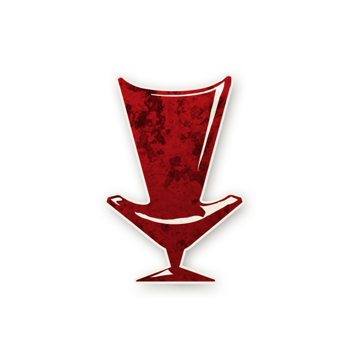
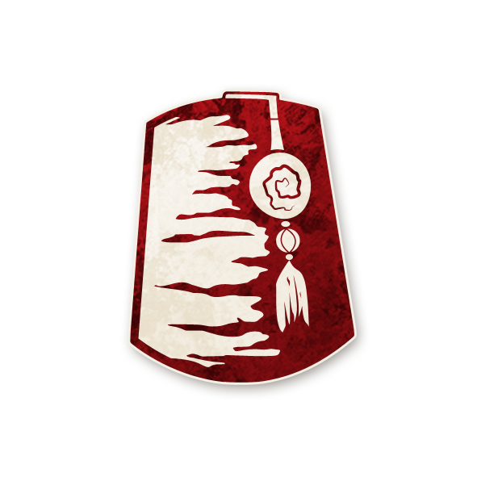
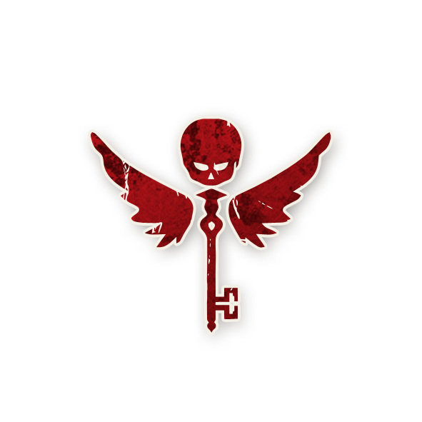

  

#  Conspirateur

<!-- 🧩 Image centrée cliquable avec nom centré en dessous -->

  <a href="./cerveau.html" style="text-decoration:none;">
    
     
    Conspirateur
  </a>

---

<h2 style="margin-top:10px;">
  Informations
</h2>

<ul style="color:#f5f5f5; font-size:18px; line-height:1.7; margin-left:40px;">
  <li>
    <strong>Type :</strong>
    <a href="../sbires.html" style="color:#d45b5b; font-weight:bold; text-decoration:none;">Sbires</a>
  </li>
  <li>
    <strong>Artiste :</strong> Aidan Roberts
  </li>
  <li>
    <strong>Nom original :</strong>
    <a href="https://wiki.bloodontheclocktower.com/Mastermind"
       target="_blank"
       rel="noopener noreferrer"
       style="color:#d45b5b; font-weight:bold; text-decoration:none;">Mastermind</a>
  </li>
</ul>



  « Les tentacules de ce monstre sont cloués aux portes de l’église.  
  Les mères et les enfants dansent dans la rue. Excellent.  
  Tout se déroule exactement comme je l’avais prévu. »

---

##  Apparaît dans  

#  Bad Moon Rising

  « Les morts dansent sous la lune, et les vivants leur tiennent la chandelle… »

---

  <a href="../bmr.html" style="text-decoration:none;">
    
     
    Bad Moon Rising
  </a>

  "Cult of the Clocktower – épisode par Andrew Nathenson"

---

##  Résumé

  <strong>« Si le Démon meurt par exécution (mettant fin à la partie), jouez un jour de plus.  
  Si un joueur est ensuite exécuté, son équipe perd. »</strong>

  Le <strong>Conspirateur</strong> est un <strong>Sbire</strong> machiavélique capable de donner une dernière chance aux
  Maléfiques.  
  Même après la mort du Démon, il peut faire basculer la victoire.

<ul style="color:#f5f5f5; font-size:18px; line-height:1.7; margin-left:40px;">
  <li>Si le Démon est exécuté et meurt, la partie ne se termine pas immédiatement.</li>
  <li>Le lendemain, si un joueur est exécuté, <strong>son équipe perd</strong> :
    <ul style="margin-left:20px;">
      <li>si c’est un joueur bon → le Mal gagne ;</li>
      <li>si c’est un joueur maléfique ou si aucun joueur n’est exécuté → le Bien gagne.</li>
    </ul>
  </li>
</ul>

  Cette capacité prolonge la partie d’un jour complet, même s’il ne reste que deux joueurs vivants.

---

##  Comment Conter  

<ul style="color:#f5f5f5; font-size:18px; line-height:1.7; margin-left:40px;">
  <li>Si le Démon est exécuté et meurt, ne terminez pas la partie.  
      (Ajoutez un linceul comme d’habitude. Ne dites pas que le Démon est mort.)</li>
  <li>Continuez avec une nuit normale, en ignorant le Démon mort.</li>
  <li>Le lendemain :
    <ul style="margin-left:20px;">
      <li>si un joueur bon est exécuté → le Mal gagne ;</li>
      <li>si un joueur maléfique est exécuté ou si personne n’est exécuté → le Bien gagne.</li>
    </ul>
  </li>
</ul>

---

##  Exemples  

<ul style="color:#f5f5f5; font-size:18px; line-height:1.7; margin-left:40px;">
  <li>Le <a href="../bmr_roles/shabaloth.html" style="color:#d45b5b; font-weight:bold; text-decoration:none;">Shabaloth</a> est exécuté et meurt.  
      Le lendemain, le
      <a href="../bmr_roles/professeur.html" style="color:#4ea3ff; font-weight:bold; text-decoration:none;">Professeur</a> est exécuté :
      <strong>les Maléfiques gagnent</strong>.</li>

  <li>Le <a href="../bmr_roles/po.html" style="color:#d45b5b; font-weight:bold; text-decoration:none;">Po</a> est exécuté et meurt.  
      Le lendemain, le
      <a href="../bmr_roles/parrain.html" style="color:#d45b5b; font-weight:bold; text-decoration:none;">Parrain</a>
      est exécuté mais survit grâce à l’
      <a href="../bmr_roles/avocatdudiable.html" style="color:#d45b5b; font-weight:bold; text-decoration:none;">Avocat du Diable</a>.  
      Comme un joueur maléfique a été exécuté, <strong>le Bien gagne</strong>.</li>

  <li>Le <a href="../bmr_roles/zombuul.html" style="color:#d45b5b; font-weight:bold; text-decoration:none;">Zombuul</a> est exécuté,  
      mais sa mort ne met pas fin à la partie (il était encore « vivant »).  
      Lorsqu’il est exécuté une seconde fois et meurt pour de bon,  
      la capacité du <strong>Conspirateur</strong> s’active : la partie continue un jour de plus.</li>

  <li>Il ne reste que trois joueurs vivants.  
      Le Démon meurt par exécution.  
      Le lendemain, avec seulement deux joueurs en vie, le groupe n’exécute personne → <strong>le Bien gagne</strong>.</li>
</ul>

---

##  Astuces &amp; Stratégies  

  Le <strong>Conspirateur</strong> est un stratège implacable.  
  Il attend le moment parfait pour transformer la victoire du Bien en défaite.

###  Jouer sur la durée  

<ul style="color:#f5f5f5; font-size:18px; line-height:1.7; margin-left:40px;">
  <li><strong>Restez en vie à tout prix.</strong>  
      Si vous mourez avant le Démon, votre capacité ne se déclenche pas.  
      Infiltrez le camp du Bien, gagnez sa confiance et bluffez intelligemment.</li>

  <li>Bluffez un rôle inoffensif et crédible comme la
      <a href="../bmr_roles/damedethe.html" style="color:#4ea3ff; font-weight:bold; text-decoration:none;">Dame de Thé</a>,
      le <a href="../bmr_roles/pacifiste.html" style="color:#4ea3ff; font-weight:bold; text-decoration:none;">Pacifiste</a>
      ou le <a href="../bmr_roles/menestrel.html" style="color:#4ea3ff; font-weight:bold; text-decoration:none;">Ménestrel</a>.  
      Ces rôles n’agissent pas la nuit, ce qui évite la suspicion de la
      <a href="../bmr_roles/femmedechambre.html" style="color:#4ea3ff; font-weight:bold; text-decoration:none;">Femme de Chambre</a>.</li>
</ul>

---

###  Manipuler la fin de partie  

<ul style="color:#f5f5f5; font-size:18px; line-height:1.7; margin-left:40px;">
  <li>Encouragez la culture de l’exécution :  
      poussez le groupe à exécuter tous les jours, même sans certitude.  
      Ainsi, lorsqu’ils exécuteront le Démon, ils feront probablement
      une exécution supplémentaire fatale le lendemain.</li>

  <li>Si vous sentez que le Démon est sur le point d’être exécuté, préparez le terrain :
    <ul style="margin-left:20px;">
      <li>décrédibilisez les appels à « ne pas exécuter demain » ;</li>
      <li>insistez sur l’importance de « vérifier les suspicions » ;</li>
      <li>si possible, coordonnez-vous avec un
          <a href="../bmr_roles/assassin.html" style="color:#d45b5b; font-weight:bold; text-decoration:none;">Assassin</a>
          ou un <a href="../bmr_roles/parrain.html" style="color:#d45b5b; font-weight:bold; text-decoration:none;">Parrain</a>
          pour créer des morts nocturnes et brouiller les pistes.</li>
    </ul>
  </li>
</ul>

---

###  Ruse et désinformation  

<ul style="color:#f5f5f5; font-size:18px; line-height:1.7; margin-left:40px;">
  <li>Faites croire à la présence d’un autre Sbire :
    <ul style="margin-left:20px;">
      <li>parlez d’un possible
          <a href="../bmr_roles/avocatdudiable.html" style="color:#d45b5b; font-weight:bold; text-decoration:none;">Avocat du Diable</a>
          si une exécution échoue ;</li>
      <li>accusez un
          <a href="../bmr_roles/parrain.html" style="color:#d45b5b; font-weight:bold; text-decoration:none;">Parrain</a>
          d’être responsable d’une mort supplémentaire ;</li>
      <li>mentionnez l’ombre d’un
          <a href="../bmr_roles/assassin.html" style="color:#d45b5b; font-weight:bold; text-decoration:none;">Assassin</a>
          pour justifier des morts inhabituelles.</li>
    </ul>
      Si le Bien croit savoir quels Sbires sont en jeu, il baissera sa garde.</li>

  <li>Si le Démon est exécuté, faites tout pour qu’un joueur bon soit exécuté le jour suivant :
      argumentez, semez le doute, ou poussez le groupe à « vérifier » un rôle suspect.</li>
</ul>

---

##  Combattre le Conspirateur 

<ul style="color:#f5f5f5; font-size:18px; line-height:1.7; margin-left:40px;">
  <li>Observez le comportement des morts et des protections.  
      Si aucune trace visible d’un
      <a href="../bmr_roles/parrain.html" style="color:#d45b5b; font-weight:bold; text-decoration:none;">Parrain</a>,
      d’un <a href="../bmr_roles/assassin.html" style="color:#d45b5b; font-weight:bold; text-decoration:none;">Assassin</a>
      ou d’un <a href="../bmr_roles/avocatdudiable.html" style="color:#d45b5b; font-weight:bold; text-decoration:none;">Avocat du Diable</a>
      n’est détectée, soupçonnez un Conspirateur.</li>

  <li>Si une nuit se passe sans mort, soyez extrêmement prudent le lendemain :  
      c’est souvent un signe que le Démon vient d’être exécuté.</li>

  <li>Ne faites exécuter personne le jour suivant la mort probable du Démon,
      sauf certitude absolue. Ce simple choix peut sauver la partie.</li>

  <li>Et surtout, tuez les Sbires dès que possible :  
      plus le <strong>Conspirateur</strong> vit longtemps, plus le Mal a de chances de triompher.</li>
</ul>

---
<h2 style="color:#d45b5b; font-size:22px; margin-top:30px;">
  🧞 Jinxes liés
</h2>

<ul style="color:#f5f5f5; font-size:18px; line-height:1.7; margin-left:40px;">

  <!-- AL-HADIKHIA -->
  <li>
    🧞
    
    <a href="../roles_experimentaux/alhadikhia.html"
       style="color:#d45b5b; font-weight:bold; text-decoration:none;">Al-Hadikhia</a> :
    Si l'Al-Hadikhia meurt par exécution
    alors que le Conspirateur est vivant,
    Al-Hadikhia choisit 3 joueurs bons cette nuit :
    si les 3 choisissent de vivre, le Mal gagne ; sinon, le Bien gagne.
  </li>

  <!-- ALCHIMISTE -->
  <li>
    🧞
    
    <a href="../roles_experimentaux/alchemist.html"
       style="color:#4ea3ff; font-weight:bold; text-decoration:none;">Alchimiste</a> :
    Un Alchimiste–Conspirateur
    n’a <strong>pas</strong> la capacité du Conspirateur et le Conspirateur n'est
    <strong>pas en jeu</strong>.
  </li>

  <!-- LEECH -->
  <li>
    🧞
    
    <a href="../roles_experimentaux/lleech.html"
       style="color:#d45b5b; font-weight:bold; text-decoration:none;">Lleech</a> :
    Si le Conspirateur est vivant
    et que l’hôte de la Sangsue
    meurt par exécution, la Sangsue survit mais <strong>perd sa capacité</strong>.
  </li>

  <!-- VIGORMORTIS -->
  <li>
    🧞
    
    <a href="../sv_roles/vigormortis.html"
       style="color:#d45b5b; font-weight:bold; text-decoration:none;">Vigormortis</a> :
    Un Conspirateur qui possède
    encore sa capacité la <strong>conserve</strong> même si le
    Vigormortis meurt.
  </li>

</ul>

---

   <a href="/botc-fr-bambi/" style="color:#f5f5f5; font-weight:bold; text-decoration:none;">Retour à l’accueil</a> 
   <a href="../sbires.html" style="color:#d45b5b; font-weight:bold; text-decoration:none;">Retour aux Sbires</a> 
   <a href="../bmr.html" style="color:#ffa64d; font-weight:bold; text-decoration:none;">Retour à Bad Moon Rising</a>

