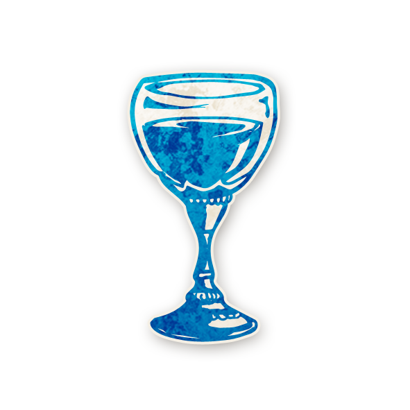

  

---

# 🍸 Courtisan  

 [**Courtisan**](../bmr_roles/courtisan.md)

---

## ℹ️ Information  

- **Type :** [**Villageois**](../villageois.md)  
- **Artiste :** Aidan Roberts  
- *« Je crains davantage une armée de cent moutons menée par un lion qu’une armée de cent lions menée par un mouton. »*  

---

## 🎭 Apparaît dans  

 [**Bad Moon Rising**](../bmr.md)  

*Cult of the Clocktower* – épisode par Andrew Nathenson  

---

## 📖 Résumé  

« Une fois par partie, la nuit, choisissez un rôle : il est ivre pendant **3 nuits et 3 jours**. »  

Le **Courtisan** choisit un **rôle** (et non un joueur) qui devient ivre pendant trois nuits et trois jours, à partir de cette nuit.  

- Le Courtisan ne sait pas si son choix est valide (si ce rôle est en jeu ou non).  
- Il ne peut utiliser son pouvoir **qu’une seule fois par partie**.  
- Si le Courtisan est ivre ou empoisonné lorsqu’il utilise son pouvoir → il échoue.  
- Si le Courtisan rend un personnage ivre, puis devient lui-même ivre/empoisonné → l’effet cesse. Quand il redevient sobre/sain → l’effet reprend.  
- Le joueur ivre **ne le sait pas**, mais son pouvoir ne fonctionne plus tant que dure l’ivresse.  

---

## 🎬 Comment Conter  

- Chaque nuit (sauf la première), réveillez le Courtisan.  
- Il peut passer son tour ou désigner un **rôle** (icône sur la fiche).  
- Si ce rôle est en jeu → le joueur correspondant devient ivre pendant 3 nuits et 3 jours.  
- Utilisez les jetons rappels comme **IVRE 1 / IVRE 2 / IVRE 3** pour suivre la durée.  
- Après ce cycle → retirez les jetons de rappel et marquez le Courtisan comme **sans pouvoir**.  
- Une fois son pouvoir utilisé → ne le réveillez plus.  

---

## 🧾 Exemples  

- Le Courtisan attend la 5ᵉ nuit et cible le [Shabaloth](shabaloth.md). → Pendant 3 nuits, le Shabaloth se réveille, mais ne tue personne.  

- Le Courtisan est ivre et choisit le [Po](po.md). → Rien ne se passe.  

- Le Courtisan cible le [Cerveau](cerveau.md). → Le Démon est exécuté, mais comme le Cerveau est ivre, il n’octroie pas la victoire au Mal. Le Bien gagne.  

---

## 💡 Astuces & Conseils  

- ⚔️ **Démon** : c’est la cible la plus puissante. Si vous réussissez, vous donnez 3 nuits de répit au Bien. Observez le rythme des morts nocturnes pour identifier si vous faites face à un [Shabaloth](shabaloth.md), [Po](po.md), [Pukka](pukka.md) ou [Zombuul](zombuul.md).  

- 🩸 **Sbires** :  
  - [Assassin](assassin.md) ou [Parrain](parrain.md) ivres → plus de morts surprises.  
  - [Avocat du Diable](avocatdudiable.md) ivre → ne sauve personne.  
  - [Cerveau](cerveau.md) ivre → prive le Mal d’une victoire inattendue.  

- 🛡️ **Villageois** : ce n’est pas optimal, mais peut être utile :  
  - [Bricoleur](bricoleur.md) ivre → ne meurt plus au hasard.  
  - [Grand-Mère](grandmere.md) ivre → survit si son petit-enfant meurt.  
  - [Enfant de la Lune](enfantdelalune.md) ivre → ne provoque pas de mort supplémentaire.  

- 🎯 **Tester les menteurs** : si un joueur prétend être [Exorciste](exorciste.md), rendez « Exorciste » ivre. Si malgré tout, il continue à bloquer le Démon, c’est un menteur.  

- ⏳ **Utilisation unique** : choisissez bien le moment.  
  - Tôt = vous êtes sûrs de l’activer avant de mourir.  
  - Tard = vous avez plus d’infos pour cibler au mieux.  

- ❌ Si vous ne savez pas qui viser → ciblez un rôle dangereux. Même si ce rôle n’est pas en jeu, vous pouvez l’éliminer de vos déductions.  

---

## 🎭 Bluff en tant que Courtisan  

- ⏱️ Attendez quelques jours avant de dire que vous avez utilisé votre pouvoir. Un vrai Courtisan ne l’active pas dès le départ.  

- ✅ Version simple : « J’ai ciblé le Démon, mais il n’était pas le bon. » → crédible et peu risqué.  

- 🎲 Version risquée : affirmez avoir rendu ivre un rôle actif. Par exemple : « J’ai ciblé l’Exorciste, il est ivre, ses infos ne valent rien. » → cela sème le chaos.  

- 😈 Si vous êtes [Cerveau](cerveau.md), prétendez avoir ciblé « le Cerveau ». → le Bien croira qu’il est neutralisé, et sera pris au piège.  

- 🧪 Si vous êtes [Pukka](pukka.md), prétendez avoir ciblé le Pukka. Quand les morts continuent malgré tout, tout le monde pensera qu’un autre Démon est en jeu.  

- 🎭 Feignez d’avoir neutralisé un rôle clé (ex. [Avocat du Diable](avocatdudiable.md)). Le Bien cessera d’y penser, et vous pourrez surprendre.  

---

## 📂 Navigation  

- 🏠 [Retour à l’accueil](/botc-fr-bambi/)  
- 🌙 [Retour à Bad Moon Rising](../bmr.md)  
- 📂 **Catégories :** [Bad Moon Rising](../bmr.md) · [Villageois](../villageois.md)  

 
