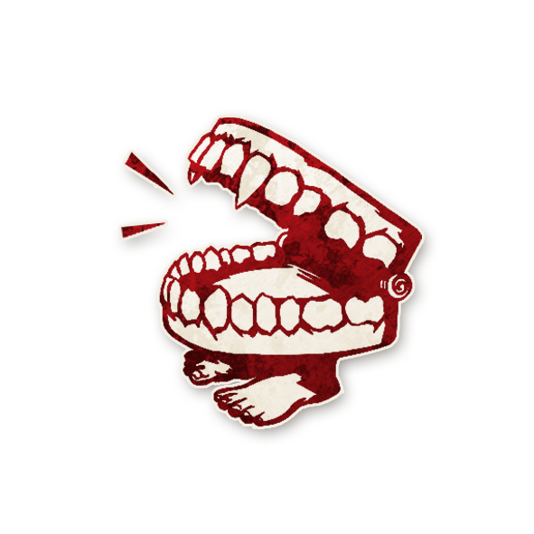

  

#   Exorciste  

<!-- 🧩 Image centrée cliquable avec nom centré en dessous -->

  <a href="./exorciste.html" style="text-decoration:none;">
    
     
    Exorciste
  </a>

---

##  Informations

<ul style="color:#f5f5f5; font-size:18px; line-height:1.7; margin-left:40px;">
  <li>
    <strong>Type :</strong>
    <a href="../villageois.html" style="color:#4ea3ff; font-weight:bold; text-decoration:none;">
      Villageois
    </a>
  </li>

  <li>
    <strong>Artiste :</strong> Aidan Roberts
  </li>

  <li>
    <strong>Nom original :</strong>
    <a href="https://wiki.bloodontheclocktower.com/Exorcist"
       target="_blank"
       rel="noopener noreferrer"
       style="color:#4ea3ff; font-weight:bold; text-decoration:none;">
    Exorcist
    </a>
  </li>
</ul>

> *« Nous vous chassons, tous les esprits impurs, toutes les puissances sataniques,  toutes les attaques de l’adversaire infernal, toutes les légions, tous les groupes et sectes diaboliques,  
au nom et par la puissance de Notre Seigneur Jésus-Christ.  
Nous vous ordonnons de partir et de vous éloigner de l’Église de Dieu,  
des âmes créées par Dieu à son image et rachetées par le sang précieux de l’Agneau divin. »*

---

##  Apparaît dans  

#  Bad Moon Rising

  « Les morts dansent sous la lune, et les vivants leur tiennent la chandelle… »

---

  <a href="../bmr.html" style="text-decoration:none;">
    
     
    Bad Moon Rising
  </a>

"Cult of the Clocktower – épisode par Andrew Nathenson"

---

##  Résumé  

<strong> « Chaque nuit*, choisissez un joueur (différent de la nuit précédente) :</strong>
  
<strong> si c’est le [Démon](../demons.md), il apprend qui vous êtes puis ne se réveille pas cette nuit»</strong>
 

**L’EXORCISTE** empêche le [Démon](../demons.md) de se réveiller pour attaquer.

- Chaque nuit, l’Exorciste choisit un joueur. S’il choisit un joueur qui n’est pas le Démon, le Démon peut encore attaquer.  
S’il choisit le Démon, le Démon ne se réveille pas cette nuit-là, et donc ne choisit pas de joueurs à attaquer cette nuit-là.   
Le Démon apprend qu’il ne peut pas attaquer, et qui est l’Exorciste.  

- Les autres capacités du Démon continuent de fonctionner :  
 – le  [Zombuul](../bmr_roles/zombuul.md), reste en vie s’il est tué, le [Pukka](../bmr_roles/pukka.md) tue un joueur attaqué lors de la nuit précédente, et le [Shabaloth](../bmr_roles/shabaloth.md) recrache un joueur.
 
- L’Exorciste ne peut pas choisir le même joueur deux nuits d’affilée.

---

##  Comment Conter    

- Chaque nuit, sauf la première, réveillez l’Exorciste. Il désigne n’importe quel joueur.  
Marquez le jeton de rôle du joueur choisi avec le jeton CHOISI. L’Exorciste se rendort.

- Si l’Exorciste a choisi le Démon, réveillez le Démon. 
Montrez-lui la tuile <strong>CE RÔLE VOUS A CHOISI</strong> et le jeton Exorciste, puis montrez le joueur Exorciste. Le Démon se rendort. Plus tard cette nuit-là, ne réveillez pas le Démon. 

⚠️ *Un Démon choisi par l’Exorciste ne se réveillera pas pour utiliser sa capacité de Démon,   
mais se réveillera tout de même s’il doit le faire à cause des capacités d’autres rôles.   
Gardez cela en tête si vous utilisez l’Exorciste avec des rôles qui viennent d’autres modules.*

---

##  Exemples      

- L’Exorciste choisit le [Shabaloth](../bmr_roles/shabaloth.md).  
  → Cette nuit-là, personne ne meurt.  

- L’Exorciste choisit le [Pukka](../bmr_roles/pukka.md).  
  → Le Pukka n’attaque pas cette nuit, mais la victime qu’il avait ciblée la veille meurt tout de même.  

- L’Exorciste choisit le [Po](../bmr_roles/po.md).  
  → Le Po ne se réveille pas et n’attaque pas. La nuit suivante, il pourra choisir jusqu’à **3 victimes**.  

---

##  Astuces & Conseils   

- Si vous choisissez un joueur et qu’il n’y a **aucune mort** cette nuit-là, vous avez peut-être trouvé le [Démon](../demons.md) !  
  - Vous pouvez révéler publiquement votre identité.  
  - Ou attendre et cibler à nouveau ce joueur pour confirmer.  

- Si une mort a lieu malgré tout, c’est sûrement que vous avez ciblé un non-Démon.  
  → Passez à un autre joueur.  

- En début de partie, vous êtes fragile et sans info.  
  → Plus la partie avance, plus votre pouvoir devient puissant.  

- Attendez d’avoir quelques nuits d’infos avant de révéler votre rôle.  
  → Sinon, vous serez la cible prioritaire du [Démon](../demons.md) et de ses [Sbires](../sbires.md).  

- Si vous suspectez un [Zombuul](../bmr_roles/zombuul.md), vous pouvez cibler les joueurs morts.  
  → Une nuit sans mort dans ce cas est un indice fort.  

- Une fois découvert, le [Démon](../demons.md) saura qui vous êtes :  
  → Surveillez qui cherche à vous éliminer ensuite.  

- Chaque jour, vous pouvez convaincre le groupe de tester **deux suspects** :  
  - L’un est exécuté.  
  - L’autre, vous l’« exorcisez » pendant la nuit.  

---

##  Bluffer Exorciste  

- Ne révélez pas votre rôle trop tôt : un vrai Exorciste **reste discret**.  
- Utilisez ce bluff pour parler en privé avec les [Sbires](../sbires.md) ou le [Démon](../demons.md).  
- Profitez des nuits sans morts pour accuser un joueur bon :  
  → Ex. : accusez une [Tisanière](../bmr_roles/damedethe.md) ou un [Pacifiste](../bmr_roles/pacifiste.md) de mentir.  
- Coopérez avec un [Po](../bmr_roles/po.md) : il peut choisir de **ne tuer personne** pour renforcer votre bluff.  
- Vous pouvez prétendre avoir « neutralisé » un Démon pour innocenter un complice.  
- Associez votre bluff à des rôles qui influencent les morts :  
  → ex. [Assassin](../bmr_roles/assassin.md), [Avocat du Diable](../bmr_roles/avocatdudiable.md), [Commère](../bmr_roles/commere.md)…  

---
## 🧞 Jinxes liés

<ul style="color:#f5f5f5; font-size:18px; line-height:1.7; margin-left:40px;">
  
  <li>
    🧞
    
    <a href="../roles_experimentaux/leviathan.html" 
       style="color:#d45b5b; font-weight:bold; text-decoration:none;">Léviathan</a> :
    Si le Léviathan 
    nomme puis exécute le joueur choisi par 
    l’<a href="../bmr_roles/exorciste.html" style="color:#4ea3ff; font-weight:bold; text-decoration:none;">Exorciste</a>,  
    le Bien gagne.
  </li>

  <li>
    🧞
    
    <a href="../roles_experimentaux/riot.html" 
       style="color:#d45b5b; font-weight:bold; text-decoration:none;">Riot</a> :
    Si le Riot 
    nomme puis exécute le joueur choisi par  
    l’<a href="../bmr_roles/exorciste.html" style="color:#4ea3ff; font-weight:bold; text-decoration:none;">Exorciste</a>,  
    le Bien gagne.
  </li>

  <li>
    🧞
    
    <a href="../roles_experimentaux/yaggababble.html" 
       style="color:#d45b5b; font-weight:bold; text-decoration:none;">Yaggababble</a> :
    Si l’<a href="../bmr_roles/exorciste.html" style="color:#4ea3ff; font-weight:bold; text-decoration:none;">Exorciste</a> 
    choisit le Yaggababble,  
   le Yaggababble ne tue personne cette nuit.
  </li>
  
</ul>


---

   <a href="/botc-fr-bambi/" style="color:#f5f5f5; font-weight:bold; text-decoration:none;">Retour à l’accueil</a> 
   <a href="../villageois.html" style="color:#4ea3ff; font-weight:bold; text-decoration:none;">Retour aux Villageois</a> 
   <a href="../bmr.html" style="color:#ffa64d; font-weight:bold; text-decoration:none;">Retour à Bad Moon Rising</a>

