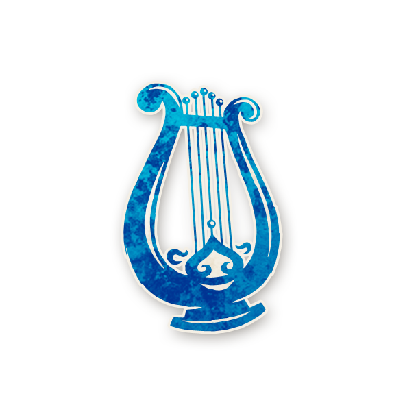

  

#   Menestrel  

<!-- 🧩 Image centrée cliquable avec nom centré en dessous -->

  <a href="./menestrel.html" style="text-decoration:none;">
    
     
    Menestrel
  </a>

---

##  Informations

<ul style="color:#f5f5f5; font-size:18px; line-height:1.7; margin-left:40px;">
  <li>
    <strong>Type :</strong>
    <a href="../villageois.html" style="color:#4ea3ff; font-weight:bold; text-decoration:none;">
      Villageois
    </a>
  </li>

  <li>
    <strong>Artiste :</strong> John Grist
  </li>

  <li>
    <strong>Nom original :</strong>
    <a href="https://wiki.bloodontheclocktower.com/Minstrel"
       target="_blank"
       rel="noopener noreferrer"
       style="color:#4ea3ff; font-weight:bold; text-decoration:none;">
   Minstrel
    </a>
  </li>
</ul>

« File la laine, File la laine, de mes moutons dondaine.  
Cousez mitaines, cousez mitaines, pour de belles capitaines. »

---

##  Apparaît dans  

#  Bad Moon Rising

  « Les morts dansent sous la lune, et les vivants leur tiennent la chandelle… »

---

  <a href="../bmr.html" style="text-decoration:none;">
    
     
    Bad Moon Rising
  </a>

"Cult of the Clocktower – épisode par Andrew Nathenson"

##  Résumé  

**Lorsqu’un Sbire meurt par exécution, tous les autres joueurs (sauf les Voyageurs) sont ivres jusqu’au crépuscule du lendemain.**

**LE MÉNESTREL** enivre tout le monde si un Sbire meurt.

- Si un [Sbire](../sbires.md) meurt par exécution, tous les joueurs (sauf le Ménestrel) deviennent immédiatement ivres  - et le restent toute la nuit, et toute la journée du lendemain. Les [Villageois](../villageois.md), les [Marginaux](../etrangers.md), les [Sbires](../sbires.md) et même les [Démons](../demons.md) deviennent ivres.  Seuls les [Voyageurs](../voyageurs/voyageurs.md)) y échappent. Cet effet ne survient pas si le Sbire meurt pendant la nuit.

- Si un Sbire mort est exécuté, la capacité du Ménestrel ne se déclenche pas.  Un rôle mort ne peut pas mourir à nouveau.   Si un Sbire est exécuté, mais ne meurt pas, la capacité du Ménestrel ne se déclenche pas.  Si le Ménestrel est ivre ou empoisonné lorsqu’un Sbire meurt par exécution, la capacité du Ménestrel ne se déclenche pas.
  
---

##  Comment Conter  

**Instruction au Conteur**

- Pendant la journée, si un Sbire meurt par exécution, tous les autres joueurs, à l’exception des Voyageurs, deviennent ivres.   Placez le jeton **TOUT LE MONDE EST IVRE** du Ménestrel au milieu de la partie gauche du Grimoire.   Le lendemain, au crépuscule, tous les joueurs enivrés par le Ménestrel deviennent sobres   — retirez le jeton **TOUT LE MONDE EST IVRE**. 

---

##  Exemples  

- Lors du remier jour, le [Pacifiste](pacifiste.md) meurt. Rien ne se passe, cette nuit-là, les joueurs agissent normalement  - car le [Pacifiste](pacifiste.md) n’est pas un Sbire.
 
- Lors du deuxième jour, le [Juge](../voyageurs/judge.md) fait exécuter le [Parrain](parrain.md). Cette nuit-là, tout le monde est ivre, y compris le [Démon](../demons.md), donc personne ne meurt.  
  
- Lors du troisième jour, un [Sbire](../sbires.md) protégé par l’[Avocat du Diable](avocatdudiable.md) est exécuté et meurt, car l’[Avocat du Diable] est ivre.  Une fois encore, comme un Sbire est mort pendant la journée, le Ménestrel enivre tout le monde.

- L’[Assassin](assassin.md) est exécuté donc le Ménestrel enivre tout le monde.  
  Le lendemain, le [Parrain](parrain.md) est exécuté.  À nouveau, le Ménestrel enivre tout le monde. Le Démon n’a pu tuer lors d’aucune des deux nuits. 
- Le jour suivant, l'[Apprenti](../voyageurs/apprentice.md) Voyageur maléfique avec la capacité du [Conspirateur](cerveau.md) est exilé, tout le monde redevient sobre, car un exil de [Voyageur](../voyageurs/voyageurs.md) ne déclenche pas la capacité du Ménestrel.  

- Pedant la journée, l’[Assassin](assassin.md) meurt, donc le Ménestrel enivre tout le monde. 
Le lendemain, le [Zombuul](zombuul.md) est exécuté et meurt pour la première fois.  
Le Bien gagne, car le [Zombuul](zombuul.md) est ivre et n’a donc aucune capacité.

---

##  Astuces & Stratégie  

Le **Ménestrel** semble faible, mais il fournit en réalité **des informations extrêmement fiables**.  

- Après une exécution, si quelqu’un meurt durant la nuit, vous savez que l’exécuté **n’était pas un [Sbire](../sbires.md)**.  
- Comme l’exécution d’un [Démon](../demons.md) met souvent fin à la partie (sauf cas particuliers comme un [Zombuul](zombuul.md) ou un [Conspirateur](cerveau.md) en jeu), vous pouvez en déduire qu’il s’agissait d’un **joueur du Bien** !  

###  Interpréter les nuits sans mort    

Si un [Sbire](../sbires.md) est exécuté, votre capacité s’active et **personne ne meurt cette nuit-là**.  
Mais attention : dans *Bad Moon Rising*, il existe **de nombreuses raisons** à l’absence de mort ([Exorciste](exorciste.md), [Aubergiste](aubergiste.md), [Po](po.md), etc.).  

Pour confirmer que votre capacité est en cause :  
- Observez les résultats inhabituels des rôles à information ([Femme de Chambre](femmedecha.md), [Parieur](parieur.md)...).  
- Notez si des protections cessent de fonctionner ([Pacifiste](pacifiste.md), [Avocat du Diable](avocatdudiable.md)).  
- Vérifiez si des morts aléatoires (comme le [Bricoleur](bricoleur.md)) ne se produisent pas.  

###   Favorisez les exécutions    

Plus il y a d’exécutions, plus vous avez de chances d’éliminer un [Sbire](../sbires.md).  
Même si les bons joueurs hésitent à exécuter souvent, éliminer un [Assassin](assassin.md) peut offrir **une nuit de répit**.  

###  Survivre plus longtemps      

Les [Démons](../demons.md) sous-estiment souvent le Ménestrel, le laissant en vie.  
Profitez-en pour garder votre identité secrète jusqu’à ce qu’un [Sbire](../sbires.md) tombe — l’effet sera spectaculaire !  

---

##  Bluffer Ménestrel  

Le **Ménestrel** est un **excellent bluff passif** : facile à maintenir, crédible et discret.  

- Faites en sorte qu’aucune mort ne survienne une nuit, par exemple demandez à votre [Démon](../demons.md) de ne pas tuer.  
  Cela simulera votre capacité après la mort d’un [Sbire](../sbires.md) et désorientera les rôles à information.  
- Si un allié du [Mal](../sbires.md) est exécuté, laissez le [Démon](../demons.md) tuer normalement.  
  Les joueurs croiront que l’exécuté était bon.  
- Encouragez les exécutions sauf celles visant le [Démon](../demons.md) ou vous-même.  
- Si un vrai Ménestrel est en jeu et que vous êtes le [Démon](../demons.md), sautez quelques attaques nocturnes : cela créera la confusion.  

---
<h2 style="color:#4ea3ff; font-size:22px; margin-top:30px;">
  🧞 Jinxes liés
</h2>

 <ul style="color:#f5f5f5; font-size:18px; line-height:1.7; margin-left:40px;">

  <li>
    🧞
    
    <a href="../roles_experimentaux/legion.html"
       style="color:#d45b5b; font-weight:bold; text-decoration:none;">Légion</a> :
    Si une Légion 
    est morte par exécution aujourd’hui,  
    elle conserve sa capacité, mais le <a href="../bmr_roles/menestrel.html"
    style="color:#4ea3ff; font-weight:bold; text-decoration:none;">Ménestrel</a>  
    pourrait apprendre qu’elle est une Légion.
  </li>

</ul>

---

   <a href="/botc-fr-bambi/" style="color:#f5f5f5; font-weight:bold; text-decoration:none;">Retour à l’accueil</a> 
   <a href="../villageois.html" style="color:#4ea3ff; font-weight:bold; text-decoration:none;">Retour aux Villageois</a> 
   <a href="../bmr.html" style="color:#ffa64d; font-weight:bold; text-decoration:none;">Retour à Bad Moon Rising</a>

