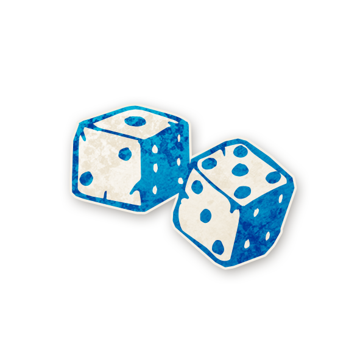

  

---

# 🎲 Parieur  

 [**Parieur**](../bmr_roles/parieur.md)

---

## ℹ️ Information  

- **Type :** [**Villageois**](../villageois.md)  
- **Artiste :** Aidan Roberts  
- *« Pile, je gagne. Face, tu perds. »*  

---

## 🎭 Apparaît dans  

 [**Bad Moon Rising**](../bmr.md)  

*Cult of the Clocktower* – épisode par Andrew Nathenson  

---

## 📖 Résumé  

« Chaque nuit* (sauf la première), choisissez un joueur et devinez son rôle : Si vous vous trompez, **vous mourez**. »  

Le **Parieur** peut confirmer qui est qui… mais paye le prix ultime en cas d’erreur.  

- Chaque nuit sauf la première, choisissez **un joueur**.  
- Montrez ensuite **le jeton de rôle** auquel vous pensez.  
- Si votre choix est **correct**, rien ne se passe.  
- Si votre choix est **faux**, vous **mourez**.  
- Vous ne saurez jamais directement si vous avez eu raison ou tort.  

---

## 🎬 Comment Conter  

- Chaque nuit (sauf la première), réveillez le Parieur.  
- Il désigne un joueur vivant ou mort (il peut même se choisir).  
- Ensuite, il désigne un jeton de rôle sur la feuille des personnages.  
- Endormez le Parieur.  

➡️ Si le joueur choisi a **un rôle différent** de celui indiqué, le Parieur **meurt** (posez un jeton **MORT**).  

---

## 🧾 Exemples  

- Le Parieur pointe la [Ménestrel](menestrel.md), puis le jeton Ménestrel. → Il a raison. Il survit. (Mais il est tué par le Démon cette même nuit.)  

- L’[Avocat du Diable](avocatdudiable.md) bluffe en [Pacifiste](pacifiste.md). Cette nuit, le Parieur désigne l’Avocat du Diable et le jeton Pacifiste. → Faux. Le Parieur **meurt**.  

---

## 💡 Astuces & Conseils  

- Vous êtes un rôle **à haut risque et haute récompense** : vous obtenez une info fiable, mais mettez votre vie en jeu chaque nuit.  

- Confirmez en priorité des **joueurs bons** :  
  → Cela construit de la confiance et crée un cercle solide d’informations.  
  → Par exemple, confirmer qu’un [Pacifiste](pacifiste.md) est bien en jeu peut être aussi utile que de confirmer une [Femme de Chambre](femmedecha.md).  

- Jouez vos cartes tôt : vous avez peu de chances de survivre jusqu’au bout.  
  → Maximisez vos choix avant la fin.  

- Deviner les **rôles maléfiques** est plus risqué :  
  → Si vous soupçonnez quelqu’un d’être un Sbire ou le Démon, il vous faut deviner **exactement** lequel.  
  → Mieux vaut se concentrer sur confirmer des Villageois ou Étrangers.  

- Pour éviter de mourir sans raison, vous pouvez vous choisir vous-même :  
  → Vous savez que vous êtes le Parieur → votre pouvoir ne peut pas vous tuer.  

- Après plusieurs confirmations réussies, vous pouvez **prouver** que vous êtes le Parieur en prédisant votre propre mort :  
  → Confiez en privé à un joueur de confiance que vous allez deviner faux → puis faites-le.  

---

## 🎭 Bluff en tant que Parieur  

- Aidez vos alliés maléfiques : confirmez publiquement que leurs bluffs sont vrais.  
  → Ex. si le [Po](po.md) prétend être la [Dame de Thé](damedethe.md), affirmez l’avoir « vérifié » la nuit dernière.  

- Vous pouvez semer le doute : affirmez que vous avez deviné un rôle faux et « survécu », laissant entendre que le joueur est maléfique.  

- Si vous mourez la nuit, servez-vous-en comme preuve :  
  → « J’ai deviné ce joueur → je suis mort → c’était faux. »  

- Après quelques nuits, feignez de « jouer la sécurité » en disant que vous vous devinez vous-même. Cela explique pourquoi vous êtes encore vivant.  

---

## 📂 Navigation  

- 🏠 [Retour à l’accueil](/botc-fr-bambi/)  
- 🌙 [Retour à Bad Moon Rising](../bmr.md)  
- 📂 **Catégories :** [Bad Moon Rising](../bmr.md) · [Villageois](../villageois.md)  
