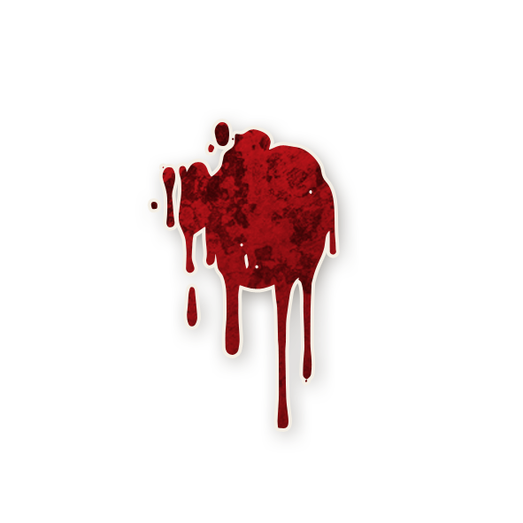

  

# 🩸 Po  

<!-- 🧩 Image centrée cliquable avec nom centré en dessous -->

  <a href="./po.html" style="text-decoration:none;">
    
     
    Po
  </a>

---

## ℹ️ Informations  

- **Type :**[Démon](../demons.md)  
- **Artiste :** Anica Kelsen   

> *« Souhaitez-vous une fleur ? Je me sens si seul. »*

---

## 🎭 Apparaît dans  

# 🌝 Bad Moon Rising

  « Les morts dansent sous la lune, et les vivants leur tiennent la chandelle… »

---

  <a href="../bmr.html" style="text-decoration:none;">
    
     
    Bad Moon Rising
  </a>

"Cult of the Clocktower – épisode par Andrew Nathenson"

## 📖 Résumé  

**« Chaque nuit*, vous pouvez choisir un joueur : il meurt.  
Si votre dernier choix était “personne”, choisissez 3 joueurs cette nuit. »**

Le **Po** est un Démon capable de **retenir son attaque** pour mieux frapper ensuite : s’il ne tue **personne** une nuit, il **doit** tuer **trois** joueurs la nuit suivante.

---

## 📖 Comment Conter  

- **Chaque nuit (sauf la première)** : réveillez le Po.  
  - S’il **pointe un joueur** → ce joueur **meurt**.  
  - S’il **secoue la tête** (personne) → marquez le Po pour **3 attaques** la nuit suivante.  
- **Nuit suivante avec 3 attaques** : il **doit** désigner **trois** joueurs, un par un ; ils **meurent** dans l’ordre choisi.  
- Si le Po a choisi « personne » alors qu’il était **ivre/empoisonné**, il dispose **quant même** de 3 attaques la nuit suivante.  
- Être empêché par l’[**Exorciste**](./exorciste.md) ne compte **pas** comme avoir choisi « personne ».  

---

## 🧾 Exemples  

- N2 : le Po tue 1 joueur. N3 : il ne tue personne. N4 : il tue **3 joueurs**.  
- Le Po choisit « personne » en étant ivre. La nuit d’après, empoisonné, il cible 3 joueurs mais **aucun ne meurt**. La nuit suivante, sobre, il tue 1 joueur.  
- Le Po attaque l’[Enfant de la Lune](./enfantdelalune.md), puis la [Brute](brute.md), puis la [Grand-Mère](grandmere.md). Seule l’[Enfant de la Lune](./enfantdelalune.md) meurt car le Po devient ivre en ciblant la [Brute](brute.md).  

---

## 💡 Astuces & Stratégie  

### Choisir votre rythme  
- **Profil discret** : tuez **chaque nuit** → vous ressemblez à un [Zombuul](./zombuul.md) ou un [Pukka](./pukka.md).  
- **Coup de massue** : alternez **zéro mort → triple mise à mort**. C’est lisible, mais **dévastateur**.  
- **Mix & match** : chargez quand cela vous arrange pour surprendre la ville.

### Synergies maléfiques  
- [Assassin](./assassin.md) : créez une mort pendant votre **nuit de charge** pour masquer votre motif.  
- [Parrain](./parrain.md) : profitez d’un Étranger exécuté pour **ajouter** une mort.  
- [Cerveau](./cerveau.md) : si vous êtes exécuté, la **partie continue** un jour de plus.

### Contres à anticiper  
- **Préventions** : [Dame de Thé](./damedethe.md), [Fou](./fou.md), [Aubergiste](./aubergiste.md), [Marin](./marin.md), [Brute](brute.md).  
- **Contrôles** : [Courtisan](./courtisan.md) (vous rend ivre 3 nuits/jours), [Exorciste](./exorciste.md) (vous empêche d’agir une nuit cruciale).  

---

## ⚔️ Combattre le Po 

- Vérifiez que le Po est en jeu dès que possible. 
- Déterminez les morts de nuit **de 1 à 0 puis 3** morts de nuit : c’est typique du Po, (le [Shabaloth](./shabaloth.md) tue 2 joueurs par nuit,
jamais 3).  
- **Exécutez tous les jours** : avec **5 personnes vivantes**, il ne faut pas exécuter, au risque d'avoir **Trois Morts** décisifs.  
- Coordonnez les protections ([Dame de Thé](./damedethe.md), [Aubergiste](./aubergiste.md), [Fou](fou.md), [Marin](./marin.md), [Brute](brute.md)) et neutralisez le Démon grâce aux capacité d'un **[Courtisan](courtisan.md)** ou d'un **[Exorciste](exorciste)**.  
- Méfiez-vous des morts « parasites » de la [Commère](./commere.md) ou du [Parieur](./parieur.md) qui peuvent masquer une **nuit de charge**.  
- Si vous pensez qu'un Po est en jeu et que 4, 5 ou même 6 joueurs sont encore en vie, réfléchissez bien à qui vous exécuterez ce jour-là… ce sera peut-être votre dernier !
---


<ul style="color:#e0c99d; font-size:18px; line-height:1.7;">
  <li>🏠 <a href="/botc-fr-bambi/" style="color:#d4a76a; font-weight:bold; text-decoration:none;">Retour à l’accueil</a></li>
  <li>🌛 <a href="../bmr.html" style="color:#d4a76a; font-weight:bold; text-decoration:none;">Bad Moon Rising</a></li>
  <li>🍺 <a href="../trouble_brewing.html" style="color:#d4a76a; font-weight:bold; text-decoration:none;">Trouble Brewing</a></li>
  <li>🌸 <a href="../sv.html" style="color:#d4a76a; font-weight:bold; text-decoration:none;">Sects & Violets</a></li>
  <li>👹 <a href="../demons.html" style="color:red; font-weight:bold; text-decoration:none;">Catégorie : Démons</a></li>
</ul>
