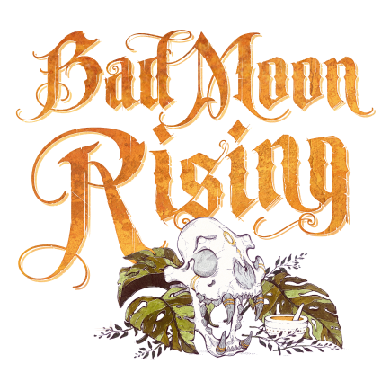

  

#   Professeur  

<!-- 🧩 Image centrée cliquable avec nom centré en dessous -->

  <a href="./professeur.html" style="text-decoration:none;">
    
     
    Professeur
  </a>

---

## ℹ️ Informations  

- **Type :** [**Villageois**](../villageois.md)  
- **Artiste :** Aidan Roberts 
> *« Le processus est simple. Connectez le confabulateur hydraulique à l’amplificateur de matrice chi modifié, ajoutez 20 cc de pseudodorafine, gardez ses niveaux Z au-dessus de 20 %, et votre mari ira bien. Maintenant, tout ce dont nous avons besoin, c’est d’un éclair. »*

---

## 🎭 Apparaît dans  

# 🌝 Bad Moon Rising

  « Les morts dansent sous la lune, et les vivants leur tiennent la chandelle… »

---

  <a href="../bmr.html" style="text-decoration:none;">
    
     
    Bad Moon Rising
  </a>

"Cult of the Clocktower – épisode par Andrew Nathenson"

---

## 📖 Résumé  

> **Une fois par partie, pendant la nuit, choisissez un joueur mort : si c’est un Villageois, il revient à la vie.** 
> **Le Professeur peut ressusciter un joueur.**  

* Une fois par partie, il choisit un joueur mort. Si ce joueur est un [Villageois](../villageois.md), il est ressuscité.  
* Si le joueur est un [Étranger](../etrangers.md), un [Sbire](../sbires.md) ou un [Démon](../demons.md), rien ne se passe.  
* Un Villageois ressuscité récupère son pouvoir, même si c’était un pouvoir « une fois par partie ».  

---

## 🎬 Mise en place  

- Chaque nuit (sauf la première), réveillez le Professeur.  
- Il peut secouer la tête (ne rien faire) ou choisir un joueur mort.  
- Si le joueur choisi est un [Villageois](../villageois.md), il revient à la vie.  
- Annoncez au lever du jour quels joueurs sont vivants ou morts (sans dire pourquoi).  

---

## 🧾 Exemples  

- Le Professeur choisit un joueur mort prétendant être la [Dame de Thé](damedethe.md). En réalité, c’était le [Lunatique](lunatique.md). → Personne n’est ressuscité.  

- Le Professeur ressuscite la [Grand-Mère](grandmere.md), qui apprend à nouveau l’identité de son petit-enfant.  

- Le Professeur ivre tente de ressusciter le [Ménestrel](menestrel.md), déjà régurgité par le [Shabaloth](shabaloth.md). Comme il est ivre, rien ne se passe.  

---

## 💡 Astuces & Conseils  

- Utilisez votre pouvoir **tôt** : les joueurs Maléfiques tenteront sûrement de vous tuer rapidement.  
- Utilisez-le **tard** : ressusciter un joueur confirmé en fin de partie peut totalement renverser la situation.  
- Si votre pouvoir échoue, le joueur ciblé était soit [Étranger](../etrangers.md), soit [Maléfique](../demons.md).  
- Ressuscitez de préférence des morts de nuit : il est plus probable qu’ils aient été victimes du [Démon](../demons.md).  
- Un joueur exécuté peut aussi être ressuscité si vous pensez que le village a fait une erreur.  
- Si vous réussissez, vous et le joueur ressuscité deviendrez probablement très fiables aux yeux du village.  

---

## 🎭 Bluff en tant que Professeur  

- Préparez une explication si votre capacité « échoue ».  
- Prétendez avoir essayé de ressusciter un joueur suspect : si ça ne marche pas, cela vous rend crédible.  
- Utilisez la confusion autour du [Zombuul](zombuul.md) ou du [Shabaloth](shabaloth.md) pour renforcer votre bluff.  
- Si vous êtes un [Sbire](../sbires.md), mourir exécuté après un « échec » peut sauver le [Démon](../demons.md).  

---

<ul style="color:#e0c99d; font-size:18px; line-height:1.7;">
  <li>🏠 <a href="/botc-fr-bambi/" style="color:#d4a76a; font-weight:bold; text-decoration:none;">Retour à l’accueil</a></li>
  <li>🌛 <a href="../bmr.html" style="color:#d4a76a; font-weight:bold; text-decoration:none;">Bad Moon Rising</a></li>
  <li>🍺 <a href="../trouble_brewing.html" style="color:#d4a76a; font-weight:bold; text-decoration:none;">Trouble Brewing</a></li>
  <li>🌸 <a href="../sv.html" style="color:#d4a76a; font-weight:bold; text-decoration:none;">Sects & Violets</a></li>
  <li>🧑‍🌾 <a href="../villageois.html" style="color:blue; font-weight:bold; text-decoration:none;">Catégorie : Villageois</a></li>
</ul> 
