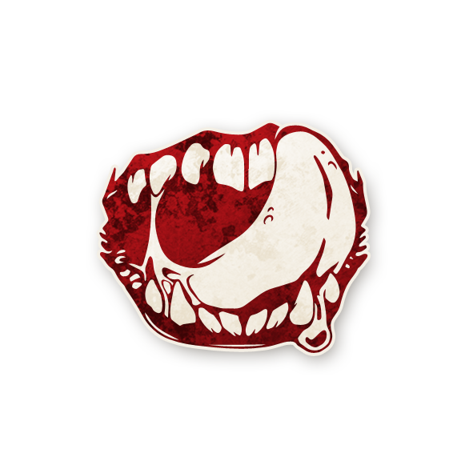

  

<!-- TITRE -->

<!-- Image centrée cliquable avec nom centré en dessous -->

  <a href="./shabaloth.html" style="text-decoration:none;">
    
     
    Shabaloth
  </a>

	

<!-- INFORMATIONS -->

<h2 style="margin-top:10px;">
  Informations
</h2>

<ul style="color:#f5f5f5; font-size:18px; line-height:1.7; margin-left:40px;">
  <li>
    <strong>Type :</strong>
    <a href="../demons.html" style="color:#d45b5b; font-weight:bold; text-decoration:none;">Démons</a>
  </li>

  <li>
    <strong>Artiste :</strong> Anica Kelsen
  </li>

  <li>
    <strong>Nom original :</strong>
    <a href="https://wiki.bloodontheclocktower.com/Shabaloth"
       target="_blank"
       rel="noopener noreferrer"
       style="color:#d45b5b; font-weight:bold; text-decoration:none;">
      Shabaloth
    </a>
  </li>
</ul>

  « Blarg f'taag nm mataan ! No sho gumtha m’sik na yuuu.   Fluuuuuuuuurg h-sikkkh. »

	

<!-- APPARAÎT DANS -->

<h2> Apparaît dans</h2>

  <a href="../bmr.html" style="text-decoration:none;">
    
     
    Bad Moon Rising
  </a>

<!-- RÉSUMÉ -->

<h2> Résumé</h2>

	

« Chaque nuit*, choisissez 2 joueurs : ils meurent. Un joueur mort que vous avez choisi lors de la nuit précédente pourrait être recraché. » 

LE SHABALOTH dévore deux joueurs par nuit, mais peut en recracher un lors de la nuit suivante.

• Contrairement à la plupart des <a href="../demons.html" style="color:#d45b5b; font-weight:bold; text-decoration:none;">Démons</a>, le <strong>Shabaloth</strong> attaque deux fois par nuit. 
La nuit qui suit l’attaque, le Conteur peut décider que l’un des deux joueurs attaqués par le <strong>Shabaloth</strong> ressuscite.

• Ce peut être un joueur en vie qui a été tué, ou un joueur mort qui a été attaqué.

• Le joueur recraché regagne sa capacité, même s’il s’agit d’une capacité de type « une fois par partie » déjà utilisée. 
S’il avait une capacité unique de première nuit ou une capacité « Lors de votre première nuit, vous apprenez », il peut l’utiliser à nouveau.

<h2>Comment Conter</h2>

---

Instructions au Conteur

• Chaque nuit, sauf la première, réveillez le <strong>Shabaloth</strong>. 
Il désigne deux joueurs, un à la fois. 
Le <strong>Shabaloth</strong> se rendort. 
Dans l’ordre donné, chaque joueur choisi meurt — marquez-les d’un jeton <strong>MORT</strong>.

• Chaque nuit suivante, juste avant de réveiller le <strong>Shabaloth</strong>, vous pouvez choisir un rôle marqué d’un des jetons <strong>MORT</strong> du <strong>Shabaloth</strong>, et faire revenir à la vie le joueur choisi.

• Remplacez son jeton <strong>MORT</strong> par le jeton <strong>EN VIE</strong> du <strong>Shabaloth</strong> et retirez son linceul. 
Il se réveille cette nuit-là s’il doit normalement se réveiller. 
S’il ne se réveille que la première nuit, il se réveille immédiatement pour utiliser sa capacité.

• À l’aube, après avoir annoncé quels joueurs sont morts, annoncez quel joueur est à nouveau en vie. 
(Ne dites pas pourquoi.)

Comme le <strong>Shabaloth</strong> ne peut pas se recracher lui-même (il n’a pas de capacité une fois mort), il est préférable de le faire recracher une ou deux fois par partie seulement. 
En général, cela suffit.




<h2>Exemples</h2>

---

• Le <strong>Shabaloth</strong> attaque la <a href="./commere.html" style="color:#4ea3ff; font-weight:bold; text-decoration:none;">Commère</a>, puis le <a href="./parieur.html" style="color:#4ea3ff; font-weight:bold; text-decoration:none;">Parieur</a>. 
La <a href="./commere.html" style="color:#4ea3ff; font-weight:bold; text-decoration:none;">Commère</a> meurt, mais le <a href="./parieur.html" style="color:#4ea3ff; font-weight:bold; text-decoration:none;">Parieur</a>, qui était protégé par l’<a href="./aubergiste.html" style="color:#4ea3ff; font-weight:bold; text-decoration:none;">Aubergiste</a>, reste en vie.

• Le <strong>Shabaloth</strong> attaque le <a href="./courtisan.html" style="color:#4ea3ff; font-weight:bold; text-decoration:none;">Courtisan</a> en vie et l’<a href="./exorciste.html" style="color:#4ea3ff; font-weight:bold; text-decoration:none;">Exorciste</a> mort. 
Le <a href="./courtisan.html" style="color:#4ea3ff; font-weight:bold; text-decoration:none;">Courtisan</a> meurt. 
La nuit suivante, le Conteur décide que l’<a href="./exorciste.html" style="color:#4ea3ff; font-weight:bold; text-decoration:none;">Exorciste</a> retrouve la vie. 
L’<a href="./exorciste.html" style="color:#4ea3ff; font-weight:bold; text-decoration:none;">Exorciste</a> n’agit pas cette nuit-là – il agit normalement avant le <strong>Shabaloth</strong>.

• Le <strong>Shabaloth</strong> attaque le voisin de la <a href="./damedethe.html" style="color:#4ea3ff; font-weight:bold; text-decoration:none;">Tisanière</a>, puis la <a href="./damedethe.html" style="color:#4ea3ff; font-weight:bold; text-decoration:none;">Tisanière</a> elle-même. 
Le voisin de la <a href="./damedethe.html" style="color:#4ea3ff; font-weight:bold; text-decoration:none;">Tisanière</a>, qui est protégé par la <a href="./damedethe.html" style="color:#4ea3ff; font-weight:bold; text-decoration:none;">Tisanière</a>, ne meurt pas ; en revanche, la <a href="./damedethe.html" style="color:#4ea3ff; font-weight:bold; text-decoration:none;">Tisanière</a> meurt.

<h2>Conseils &amp; Astuces</h2>

---

• Le puissant <strong>Shabaloth</strong> est le <a href="../demons.html" style="color:#d45b5b; font-weight:bold; text-decoration:none;">Démon</a> le plus redoutable de Bad Moon Rising par sa brutalité et sa régularité. 
Ni le <a href="./pukka.html" style="color:#d45b5b; font-weight:bold; text-decoration:none;">Pukka</a> ni le <a href="./zombuul.html" style="color:#d45b5b; font-weight:bold; text-decoration:none;">Zombuul</a> ne peuvent rivaliser seuls avec vos multiples morts par nuit, et même si le <a href="./po.html" style="color:#d45b5b; font-weight:bold; text-decoration:none;">Po</a> peut vous dépasser en nombre sur une seule nuit, vous reprenez la couronne grâce à son besoin de se charger. 
L’équipe du bien peut, et devrait, paniquer à juste titre lorsqu’elle soupçonne votre présence : seule la régurgitation accidentelle de l’une de vos victimes lui offrira un moyen de vous contrer !

• Tuez agressivement, sans laisser à l’équipe du bien le temps de reprendre son souffle. 
Vous n’êtes pas le plus… subtil des <a href="../demons.html" style="color:#d45b5b; font-weight:bold; text-decoration:none;">Démons</a>, mais pour être honnête, personne n’a jamais prétendu le contraire. 
Défoncez le village comme Godzilla dans un bon jour, en dévorant tous les joueurs dont les rôles ne peuvent pas vous bloquer. 
La <a href="./femmedechambre.html" style="color:#4ea3ff; font-weight:bold; text-decoration:none;">Femme de chambre</a> ne pourra pas découvrir que votre bluff est faux si vous l’avez mangée. 
Avec des choix judicieux et une bonne écoute des joueurs protégés la nuit, vous pouvez terminer cette partie deux fois plus vite que n’importe quel autre <a href="../demons.html" style="color:#d45b5b; font-weight:bold; text-decoration:none;">Démon</a>.

• À l’inverse, vous pouvez choisir de jouer de manière plus discrète. 
Vous êtes peut-être un monstre hideux et éternellement affamé, mais cela ne veut pas dire que vous êtes incapable d’un peu de stratégie. 
Cacher volontairement votre deuxième mort peut semer le doute sur le <a href="../demons.html" style="color:#d45b5b; font-weight:bold; text-decoration:none;">Démon</a> en jeu : l’équipe du bien restera toujours paranoïaque tant qu’elle ne pourra pas l’identifier avec certitude, car se relâcher un instant est précisément le moment où le <a href="./po.html" style="color:#d45b5b; font-weight:bold; text-decoration:none;">Po</a> peut frapper brutalement. 
Cela peut vous aider, puisque les stratégies contre les autres <a href="../demons.html" style="color:#d45b5b; font-weight:bold; text-decoration:none;">Démons</a> sont très différentes de celles contre vous, et la pauvre équipe du bien sera prise au dépourvu lorsque vous vous révélerez ! 
Cela peut aussi vous aider à éviter l’ivresse dévastatrice d’un <a href="./courtisan.html" style="color:#4ea3ff; font-weight:bold; text-decoration:none;">Courtisan</a> — qui cherchera le moindre indice fiable sur le <a href="../demons.html" style="color:#d45b5b; font-weight:bold; text-decoration:none;">Démon</a> en jeu — du moins jusqu’à ce que vous le trouviez et le mangiez.

• Le méchant Village a exécuté votre <a href="../sbires.html" style="color:#d45b5b; font-weight:bold; text-decoration:none;">Sbire</a> ? 
Simplement pour le crime d’adorer un <a href="../demons.html" style="color:#d45b5b; font-weight:bold; text-decoration:none;">Démon</a> éternellement affamé qui veut tous les dévorer ? 
Quelle cruauté ! Quelle injustice ! 
Heureusement pour lui, vous êtes unique parmi vos semblables : votre salive possède des propriétés curatives. 
Dévorez le cadavre de votre <a href="../sbires.html" style="color:#d45b5b; font-weight:bold; text-decoration:none;">Sbire</a> pendant la nuit pour essayer de le ramener à la vie. 
Vous serez soumis aux caprices du Conteur… mais peut-être aura-t-il pitié de vous et vous rendra-t-il votre <a href="../sbires.html" style="color:#d45b5b; font-weight:bold; text-decoration:none;">Sbire</a> bien-aimé, surtout si l’équipe du mal est en difficulté. 
Cela a aussi l’avantage de faire paraître votre <a href="../sbires.html" style="color:#d45b5b; font-weight:bold; text-decoration:none;">Sbire</a> très bon, car en général, vous ne régurgitez que des joueurs bons.

• Parfois, votre reflux acide prendra le dessus (ou le Conteur décidera que vous vous en sortez trop bien), et vous vomirez un joueur bon, le ramenant à la vie de manière inattendue. 
Cela peut vous causer plusieurs problèmes : d’abord, à moins de sortir un bluff de <a href="./professeur.html" style="color:#4ea3ff; font-weight:bold; text-decoration:none;">Professeur</a> incroyablement convaincant, cela confirmera qu’un <strong>Shabaloth</strong> est en jeu, ce qui peut poser problème selon votre stratégie. 
Plus urgent encore : le joueur revenu à la vie sera très probablement considéré comme bon, et les autres joueurs lui feront confiance assez facilement. 
La meilleure façon de contrer cela est tout simplement de le tuer à nouveau immédiatement, de préférence avant qu’il ait l’occasion d’utiliser sa capacité pour obtenir de nouvelles informations.

• Bluffez bien, et faites tout votre possible pour répandre de fausses informations. 
Il deviendra probablement assez vite évident qu’un <strong>Shabaloth</strong> est en jeu, et là où le <a href="./zombuul.html" style="color:#d45b5b; font-weight:bold; text-decoration:none;">Zombuul</a> ou le <a href="./pukka.html" style="color:#d45b5b; font-weight:bold; text-decoration:none;">Pukka</a> perturbent les informations de l’équipe du bien grâce à leur capacité, vous n’avez pas ce luxe. 
Si l’équipe du bien ne sait pas que vous êtes en jeu, vous pouvez gagner en la convainquant de ne pas exécuter lorsqu’il ne reste que 4 joueurs vivants, puis en tuant 2 joueurs cette nuit-là et en réduisant soudainement le nombre de joueurs vivants à 2. 
Si vous avez un <a href="./assassin.html" style="color:#d45b5b; font-weight:bold; text-decoration:none;">Assassin</a> vivant qui n’a pas encore utilisé sa capacité, ou une <a href="./commere.html" style="color:#4ea3ff; font-weight:bold; text-decoration:none;">Commère</a> ou un <a href="./parieur.html" style="color:#4ea3ff; font-weight:bold; text-decoration:none;">Parieur</a> imprudent que vous pouvez convaincre d’utiliser sa capacité cette nuit-là, vous pouvez même obtenir cette victoire surprise lorsqu’il reste 5 ou 6 joueurs vivants.

<h2>Combattre le Shabaloth</h2>

---

• Le <strong>Shabaloth</strong> a tendance à être un <a href="../demons.html" style="color:#d45b5b; font-weight:bold; text-decoration:none;">Démon</a> évident. 
Lorsqu’il tue deux fois par nuit, vous pouvez généralement comprendre assez vite quel <a href="../demons.html" style="color:#d45b5b; font-weight:bold; text-decoration:none;">Démon</a> est en jeu. 
Cependant, comme il tue deux fois plus qu’un <a href="../demons.html" style="color:#d45b5b; font-weight:bold; text-decoration:none;">Démon</a> normal, la partie arrive très rapidement au dernier jour. 
Une fois que vous avez compris qu’un <strong>Shabaloth</strong> est en jeu, concentrez-vous sur l’identification du joueur qui l’incarne. 
Des rôles comme le <a href="./courtisan.html" style="color:#4ea3ff; font-weight:bold; text-decoration:none;">Courtisan</a>, l’<a href="./exorciste.html" style="color:#4ea3ff; font-weight:bold; text-decoration:none;">Exorciste</a> ou la <a href="./femmedechambre.html" style="color:#4ea3ff; font-weight:bold; text-decoration:none;">Femme de chambre</a> peuvent vous y aider directement, ce qui peut être plus efficace que la stratégie habituelle consistant à trouver les joueurs maléfiques en identifiant les joueurs bons grâce à des rôles comme le <a href="./fou.html" style="color:#4ea3ff; font-weight:bold; text-decoration:none;">Fou du roi</a>, la <a href="./damedethe.html" style="color:#4ea3ff; font-weight:bold; text-decoration:none;">Tisanière</a>, le <a href="./pacifiste.html" style="color:#4ea3ff; font-weight:bold; text-decoration:none;">Pacifiste</a> ou le <a href="./parieur.html" style="color:#4ea3ff; font-weight:bold; text-decoration:none;">Parieur</a>.

• Si un joueur est régurgité, c’est une excellente nouvelle. 
Les joueurs régurgités ne peuvent pas être le <strong>Shabaloth</strong> et sont généralement bons. 
Il arrive parfois qu’un <a href="../sbires.html" style="color:#d45b5b; font-weight:bold; text-decoration:none;">Sbire</a> soit régurgité, mais c’est rare. 
Il est donc généralement conseillé de garder les joueurs régurgités en vie, de ne pas les exécuter et de leur faire confiance lorsqu’ils annoncent leur rôle.

• Dans Trouble Brewing et Sects &amp; Violets, l’équipe du bien peut sans danger ne pas exécuter lorsqu’il ne reste que 4 joueurs vivants. 
Comme le <a href="../demons.html" style="color:#d45b5b; font-weight:bold; text-decoration:none;">Démon</a> ne peut tuer qu’un seul joueur, il restera encore 3 joueurs vivants le lendemain.

• Dans Bad Moon Rising, en revanche, ce n’est pas le cas, car des morts supplémentaires peuvent survenir la nuit. 
Si un <strong>Shabaloth</strong> est en jeu, qu’il reste 4 joueurs vivants (ou même 5 si des rôles comme l’<a href="./assassin.html" style="color:#d45b5b; font-weight:bold; text-decoration:none;">Assassin</a> ou le <a href="./parieur.html" style="color:#4ea3ff; font-weight:bold; text-decoration:none;">Parieur</a> sont encore vivants), et que personne n’est exécuté aujourd’hui, alors l’équipe du mal gagnera cette nuit. 
Lorsqu’un <strong>Shabaloth</strong> est en jeu, vous devez exécuter des joueurs chaque jour, en particulier lorsqu’il reste 4 ou 5 joueurs vivants.

<!-- FOOTER LIENS -->

   <a href="/botc-fr-bambi/" style="color:#f5f5f5; font-weight:bold; text-decoration:none;">Retour à l’accueil</a> 
   <a href="../demons.html" style="color:#d45b5b; font-weight:bold; text-decoration:none;">Retour aux Démons</a> 
   <a href="../bmr.html" style="color:#ffa64d; font-weight:bold; text-decoration:none;">Retour à Bad Moon Rising</a>

