

  

<!-- EN-TÊTE / ANCRE DE HAUT DE PAGE (ALIGNÉ CÔTÉ À CÔTÉ) -->

  

    
    <!-- CARTE TEXTE D'ACCUEIL -->
    

      

        GUIDE DU JOUEUR · BOTC.APP
      

      <h1>COMMENT JOUER SUR L'APPLICATION OFFICIELLE</h1>
      

        Vous trouverez ici tout ce dont vous avez besoin pour rejoindre une partie en ligne, parler aux autres joueurs et gérer votre grimoire sur l'application officielle de <strong>Blood on the Clocktower</strong>.
      

    

    <!-- CARTE TUTO VIDÉO -->
    

      <h3>Tuto vidéo</h3>
      

        <iframe src="https://www.youtube-nocookie.com/embed/O2ksf5eTeSI" title="Tutoriel pour jouer sur l'application" allow="accelerometer; autoplay; clipboard-write; encrypted-media; gyroscope; picture-in-picture" allowfullscreen></iframe>
      

      
Une petite démonstration en vidéo pour vous guider pas à pas sur l'application.

    

  

  <!-- SOMMAIRE LATÉRAL -->
  <nav class="guide-sidebar">
    <a href="https://botc.app/login" target="_blank" rel="noopener noreferrer" style="text-align: center; background: rgba(181,139,82,.25); border: 1px solid #ffd97d; border-radius: 8px; color: #ffd97d !important; font-weight: bold; padding: 10px; margin-bottom: 15px; display: block !important;">
      🌐 Ouvrir BOTC.APP ↗
    </a>

    <h3>1. Inscription</h3>
    <ul>
      <li><a href="#step-1">1. S’enregistrer sur le site</a></li>
    </ul>

    <h3>2. Rejoindre une partie</h3>
    <ul>
      <li><a href="#step-2">2. Rejoindre une partie</a></li>
      <li><a href="#step-3">3. Prendre un siège</a></li>
      <li><a href="#step-4">4. Configurer caméra & micro</a></li>
    </ul>

    <h3>3. Parler aux joueurs</h3>
    <ul>
      <li><a href="#step-5">5. Lever la main</a></li>
      <li><a href="#step-6">6. Répondre à un chat privé</a></li>
      <li><a href="#step-7">7. Demander un chat privé</a></li>
      <li><a href="#step-8">8. Envoyer un chuchotement</a></li>
    </ul>

    <h3>4. Profil & Siège</h3>
    <ul>
      <li><a href="#step-9">9. Changer de nom & d'avatar</a></li>
      <li><a href="#step-10">10. Quitter son siège</a></li>
      <li><a href="#step-11">11. Accès au Grimoire</a></li>
      <li><a href="#step-12">12. Quitter la partie</a></li>
    </ul>

    <h3>5. Script, Jetons & Dépannage</h3>
    <ul>
      <li><a href="#step-13">13. Ouvrir l'onglet Rôles</a></li>
      <li><a href="#step-14">14. Jetons de rôles & rappels</a></li>
      <li><a href="#step-15">15. Caméra/Micro en panne</a></li>
      <li><a href="#step-16">16. Jeton introuvable</a></li>
    </ul>
  </nav>

  <!-- CONTENU PRINCIPAL -->
  

    <!-- ÉTAPE 1 -->
    

      

        
1

        <h2 style="color: #ffffff !important; font-size: 26px !important; font-weight: 900 !important; font-style: italic !important; margin: 0 !important;">S’ENREGISTRER SUR LE SITE</h2>
      

      
Pour jouer avec l’application <strong>Blood 🩸 on the Clocktower 🕰️</strong>, vous devez créer un <strong>compte gratuit</strong>.

      

        

          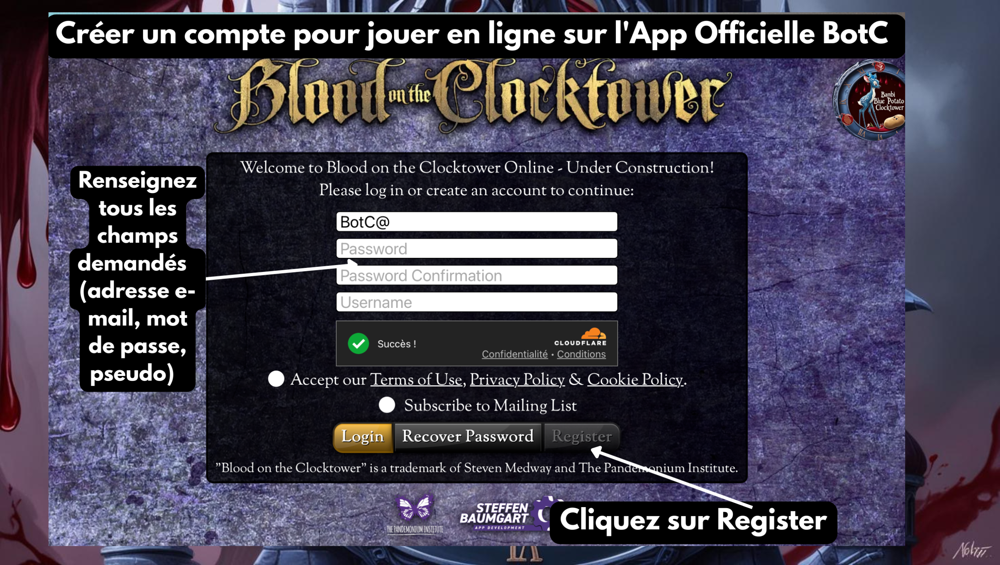
          

            <h4 class="sub-step-title">1️⃣ Rendez-vous sur le site officiel :</h4>
            

              <a href="https://botc.app/login" target="_blank" rel="noopener noreferrer" style="color: #ffd97d !important; font-weight: bold; text-decoration: underline;">https://botc.app/login 🔗</a>
            

            <h4 class="sub-step-title">2️⃣ Cliquez sur S'inscrire :</h4>
            

              Remplissez les champs <em>(adresse e-mail, mot de passe, pseudonyme)</em>. 
              ➡️ <strong style="color: #ff6b6b !important;">Ne cliquez pas sur Patreon.</strong>
            

          

        

        

          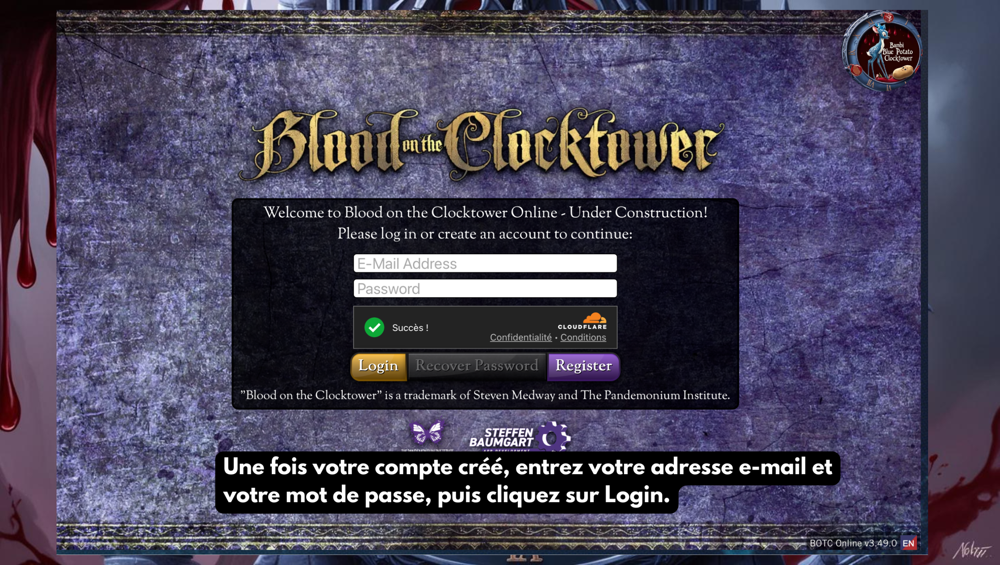
          

            <h4 class="sub-step-title">3️⃣ Connectez-vous :</h4>
            

              Entrez vos identifiants puis cliquez sur <strong>Connexion</strong>.
            

            

              👏🏻 BRAVO 
              Votre compte est créé ! 
              Passez à l'étape suivante pour rejoindre une table.
            

          

        

      

    

    <!-- ÉTAPE 2 -->
    

      

        
2

        <h2 style="color: #ffffff !important; font-size: 26px !important; font-weight: 900 !important; font-style: italic !important; margin: 0 !important;">REJOINDRE UNE PARTIE</h2>
      

      

        

          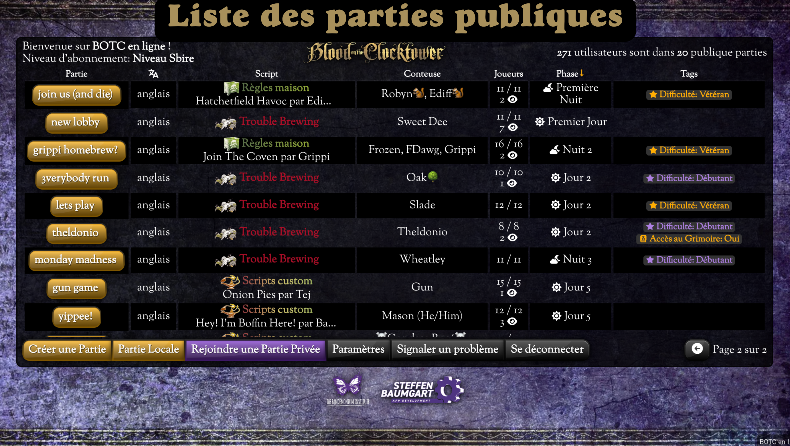
          

            <h4 class="sub-step-title">Rejoindre une partie publique</h4>
            
Une fois connecté, vous verrez la liste des parties publiques disponibles. Choisissez-en une pour vous installer ou simplement observer la partie.

          

        

        

          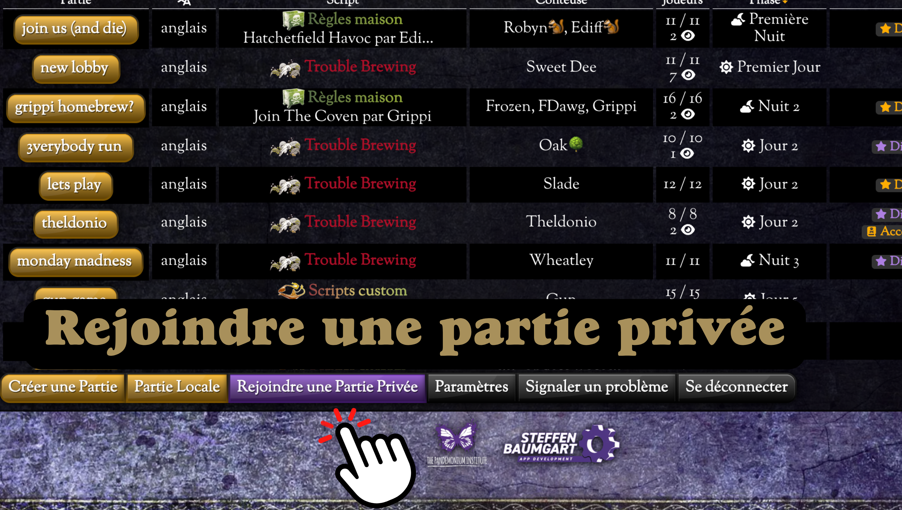
          

            <h4 class="sub-step-title">Rejoindre une partie privée</h4>
            
La plupart du temps, le Conteur vous enverra un lien direct. Il suffit de cliquer dessus : 
            <strong style="color: #ffd97d !important; font-size: 16px;">https://botc.app/join/66666666</strong>

          

        

        

          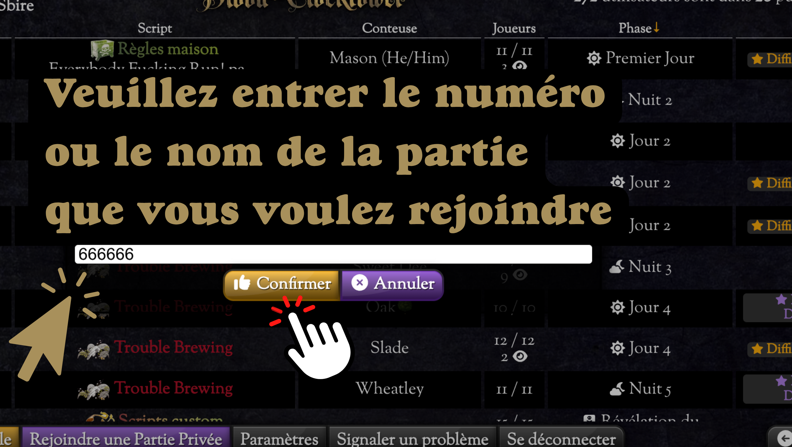
          

            — OU —
            
Cliquez sur <strong>Rejoindre une partie privée</strong> et entrez le code donné par le Conteur.

          

        

      

    

    <!-- ÉTAPE 3 -->
    

      

        
3

        <h2 style="color: #ffffff !important; font-size: 26px !important; font-weight: 900 !important; font-style: italic !important; margin: 0 !important;">PRENDRE UN SIÈGE</h2>
      

      

        

          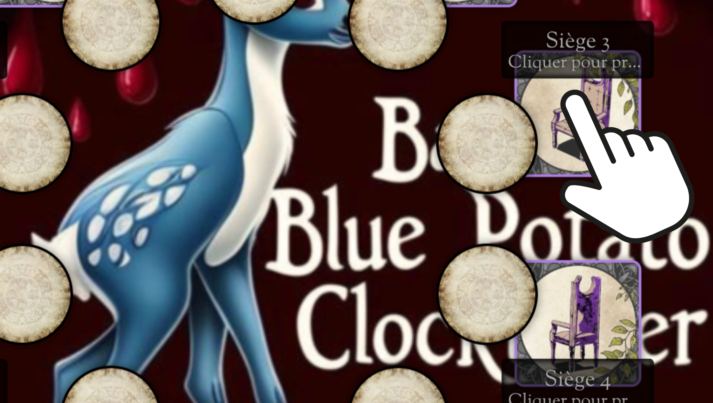
          

            
Une fois arrivé dans le village, cliquez sur un siège libre autour du cercle pour vous y installer.

          

        

      

    

    <!-- ÉTAPE 4 : CONFIGURER CAMÉRA & MICRO -->
    

      

        
4

        <h2 style="color: #ffffff !important; font-size: 26px !important; font-weight: 900 !important; font-style: italic !important; margin: 0 !important;">CONFIGURER CAMÉRA & MICRO</h2>
      

      

        <!-- Image 1 -->
        

          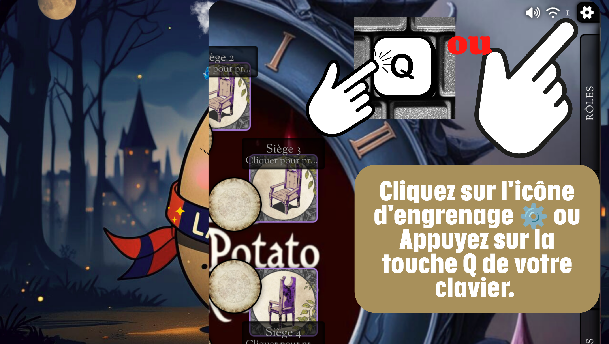
          

            

              ★ À FAIRE 
              Appuyez sur la touche Q de votre clavier.
              — OU —
              Cliquez sur l'icône ⚙️ d'engrenage.
            

          

        

        <!-- Image 2 -->
        

          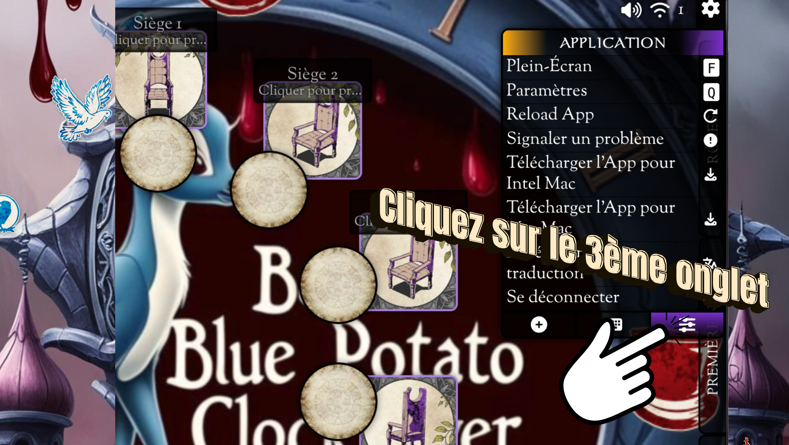
          

            

              ★ À FAIRE 
              Cliquez sur le 3ème onglet.
            

          

        

        <!-- Image 3 -->
        

          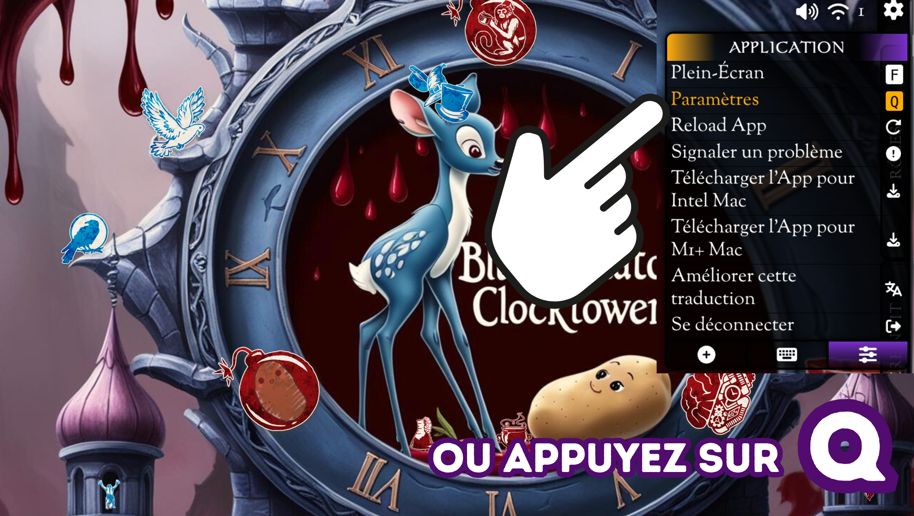
          

            

              ★ À FAIRE 
              Cliquez sur <strong>Paramètres</strong>.
            

          

        

        <!-- Image 4 -->
        

          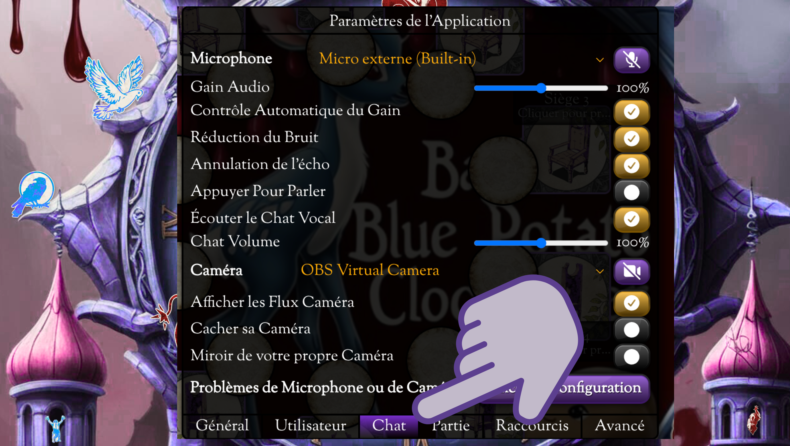
          

            

              ★ À FAIRE 
              Cliquez sur le 3ème onglet, <strong>Chat</strong>.
            

          

        

        <!-- Image 5 -->
        

          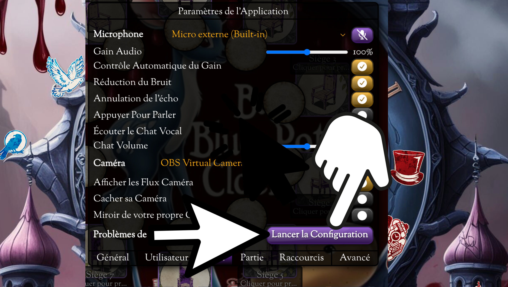
          

            

              ★ À FAIRE 
              Cliquez sur <strong>Lancer la configuration</strong>.
            

          

        

        <!-- Image 6 -->
        

          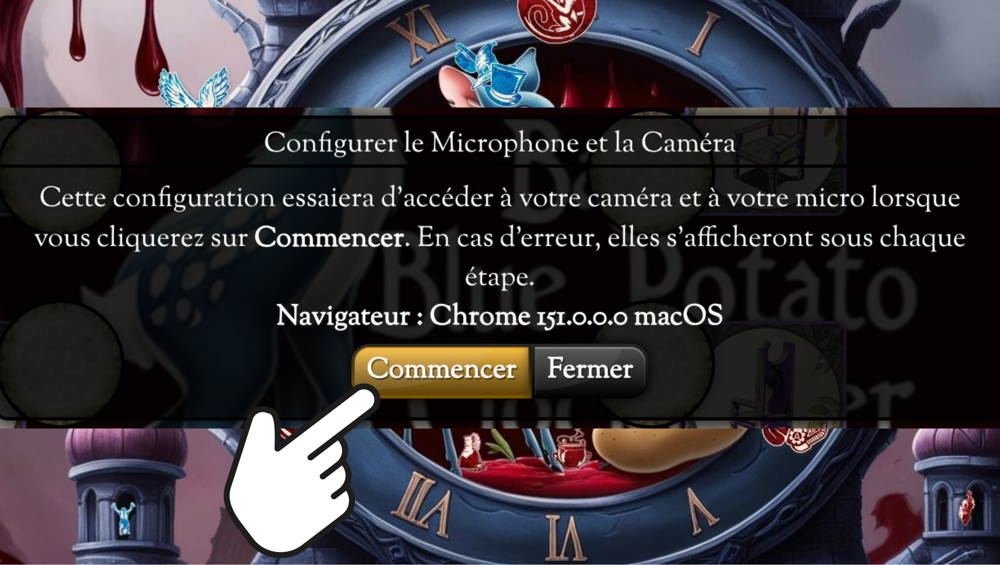
          

            

              ★ À FAIRE 
              Cliquez sur <strong>Commencer</strong>.
            

          

        

        <!-- Image 7 -->
        

          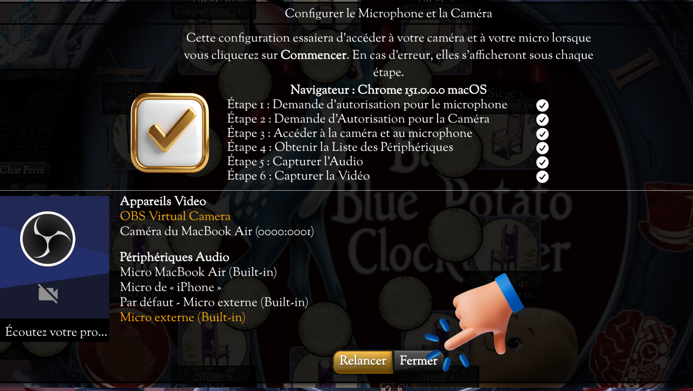
          

            

              ★ À FAIRE 
              Choisissez la caméra et le microphone à utiliser. Lorsque la caméra est bien réglée, vous vous verrez ; lorsque le micro fonctionne, des <strong style="color: #ffd97d !important;">barres jaunes</strong> bougent au rythme de votre voix. Une fois terminé, cliquez sur <strong>Fermer</strong>.
            

          

        

        <!-- Image 8 -->
        

          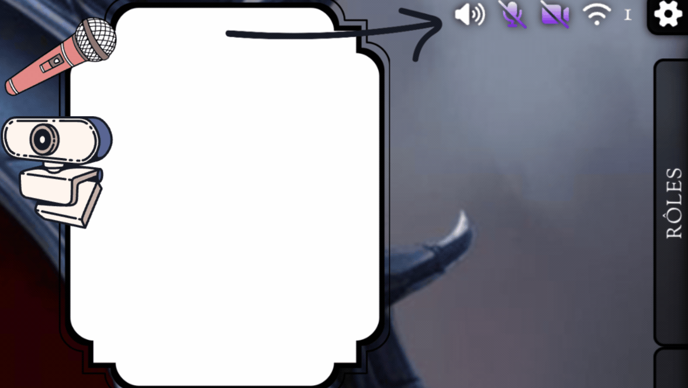
          

            

              ★ À FAIRE 
              De retour sur la place du village, vous commencerez avec votre micro en sourdine et votre caméra coupée. Réactivez-les à l'aide des boutons situés dans le coin supérieur droit.
            

          

        

      

    

    <!-- ÉTAPE 5 -->
    

      

        
5

        <h2 style="color: #ffffff !important; font-size: 26px !important; font-weight: 900 !important; font-style: italic !important; margin: 0 !important;">LEVER LA MAIN</h2>
      

      

        

          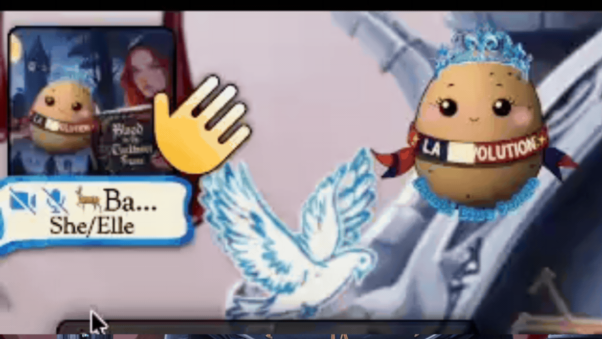
          

            
Levez la main pour demander la parole ou pour voter pendant les phases d'exécution.

            

              ★ À FAIRE 
              Appuyez sur la barre ESPACE pour lever ou baisser la main.
            

          

        

      

    

    <!-- ÉTAPE 6 -->
    

      

        
6

        <h2 style="color: #ffffff !important; font-size: 26px !important; font-weight: 900 !important; font-style: italic !important; margin: 0 !important;">RÉPONDRE À UNE DEMANDE DE CHAT PRIVÉ</h2>
      

      

        

          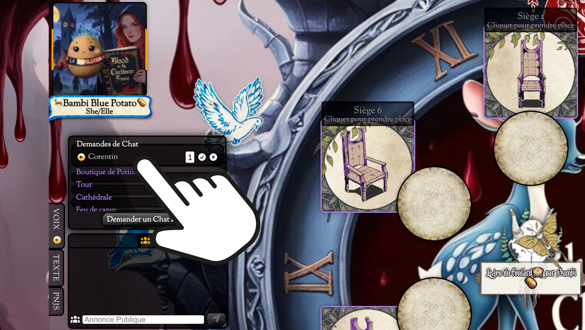
          

            

              ★ À FAIRE 
              Si un joueur veut discuter en privé avec vous, un signal sonore retentit et son nom apparaît dans l'onglet <strong style="color: #ffd97d !important;">VOIX</strong> à gauche. Cliquez sur son nom pour accepter la discussion.
            

          

        

        

          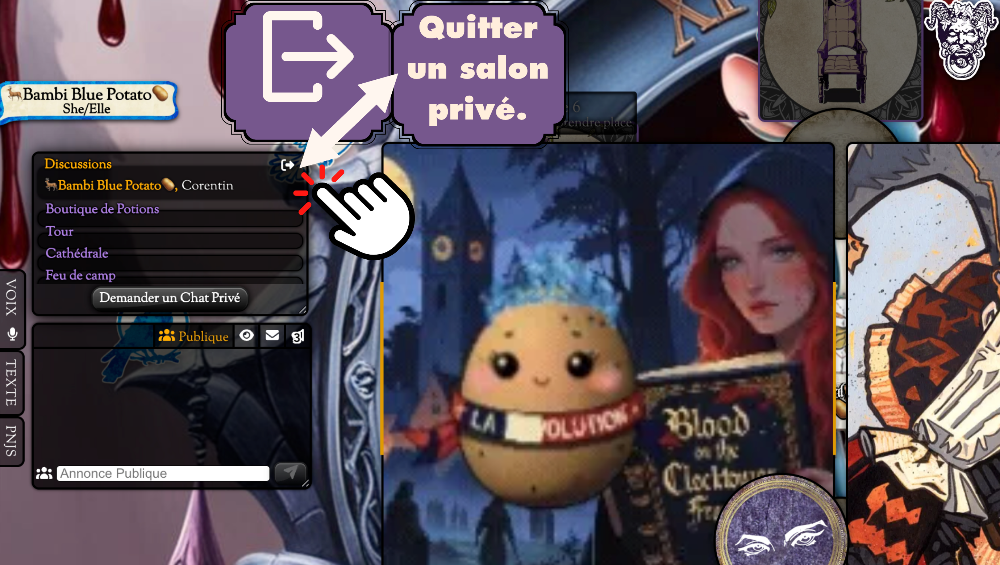
          

            

              ★ À FAIRE 
              Pour quitter un salon privé, cliquez sur <strong>Quitter</strong> ou appuyez sur la touche RETOUR ARRIÈRE (Effacer) de votre clavier.
            

          

        

      

    

    <!-- ÉTAPE 7 -->
    

      

        
7

        <h2 style="color: #ffffff !important; font-size: 26px !important; font-weight: 900 !important; font-style: italic !important; margin: 0 !important;">DEMANDER UN CHAT PRIVÉ</h2>
      

      

        

          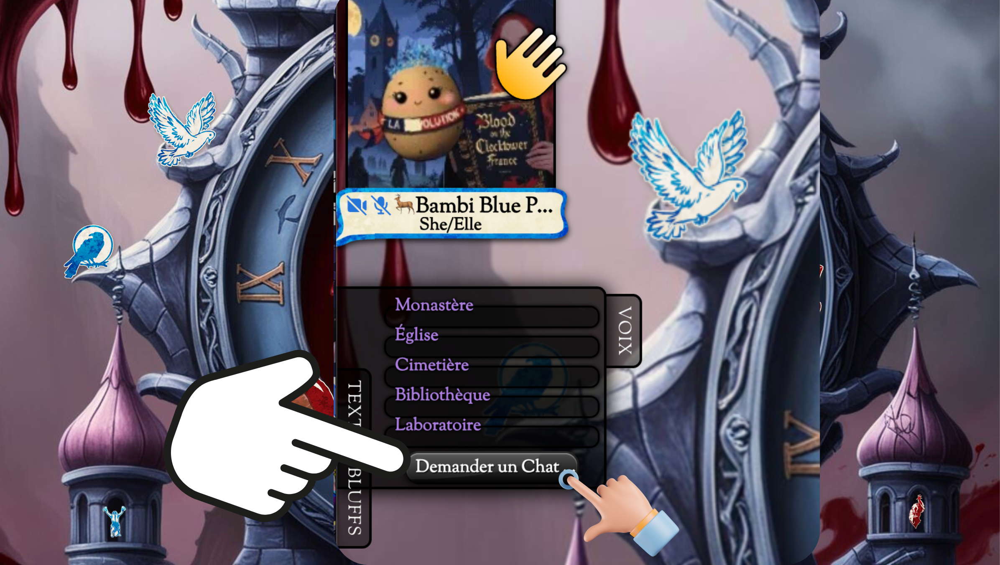
          

            

              ★ À FAIRE 
              Appuyez sur la touche ENTRÉE.
              — OU —
              Dans l'onglet <strong style="color: #ffd97d !important;">VOIX</strong>, cliquez sur <strong>Demander un chat privé</strong>.
            

          

        

        

          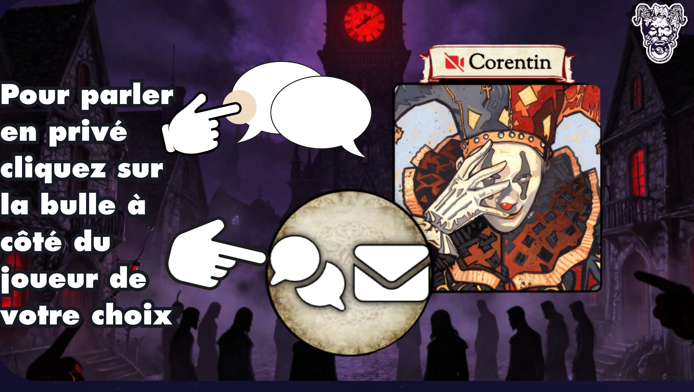
          

            

              ★ À FAIRE 
              Cliquez directement sur l'icône 💬 de bulle à côté du joueur que vous souhaitez contacter.
            

          

        

      

    

    <!-- ÉTAPE 8 -->
    

      

        
8

        <h2 style="color: #ffffff !important; font-size: 26px !important; font-weight: 900 !important; font-style: italic !important; margin: 0 !important;">ENVOYER UN CHUCHOTEMENT</h2>
      

      

        

          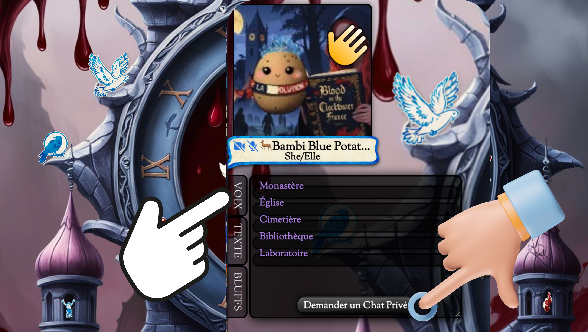
          

            

              ★ À FAIRE 
              Appuyez sur la touche ENTRÉE.
              — OU —
              Dans l'onglet Vocal, cliquez sur <strong>Demander un chat privé</strong>.
            

          

        

        

          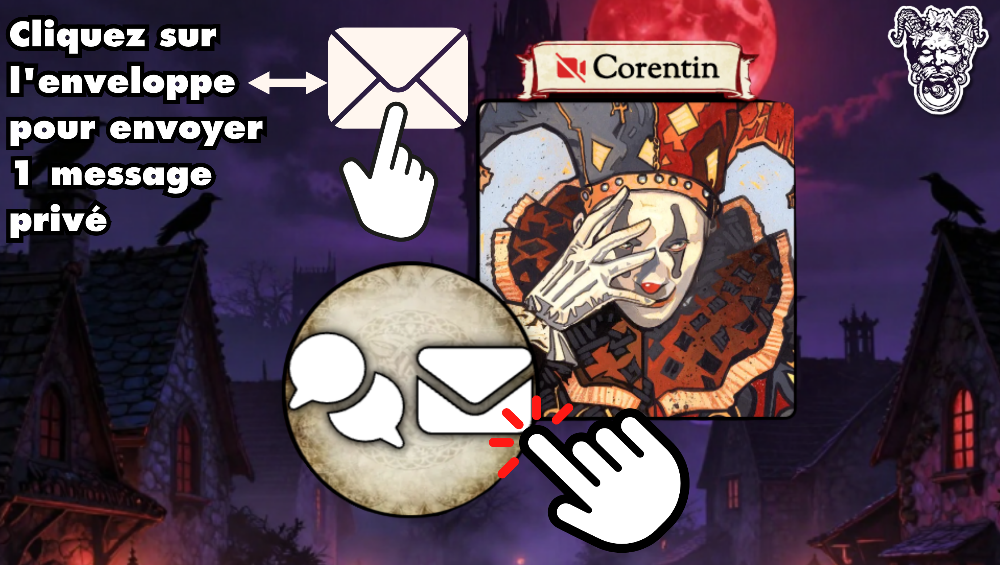
          

            

              ★ À FAIRE 
              Cliquez sur l'enveloppe pour envoyer un chuchotement. Vous ne pouvez chuchoter qu'à vos <strong>voisins directs</strong> et au <strong>Conteur</strong>. Une animation d'enveloppe se joue — sa taille s'adapte à la longueur de votre message.
            

          

        

        

          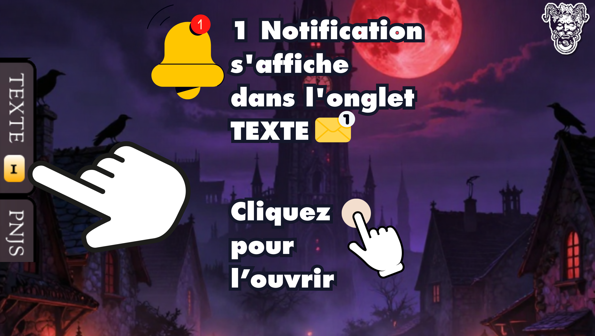
          

            

              ★ À FAIRE 
              Les notifications de nouveaux messages s'affichent dans l'onglet Texte. Appuyez sur la touche TAB pour l'ouvrir.
            

          

        

        

          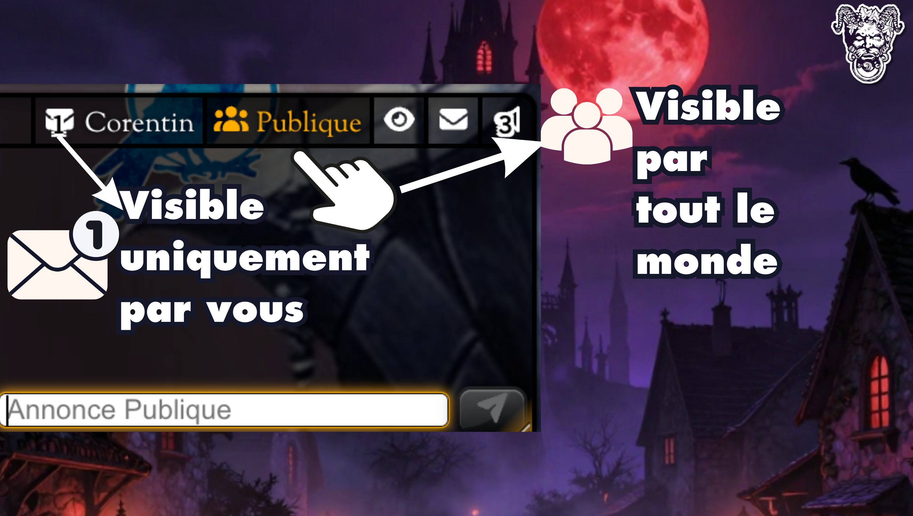
          

            

              ★ À FAIRE 
              Il existe également un chat public visible par tout le monde. Les messages disparaissent après un certain temps.
            

          

        

      

    

    <!-- ÉTAPE 9 -->
    

      

        
9

        <h2 style="color: #ffffff !important; font-size: 26px !important; font-weight: 900 !important; font-style: italic !important; margin: 0 !important;">CHANGER DE NOM & D'AVATAR</h2>
      

      

        

          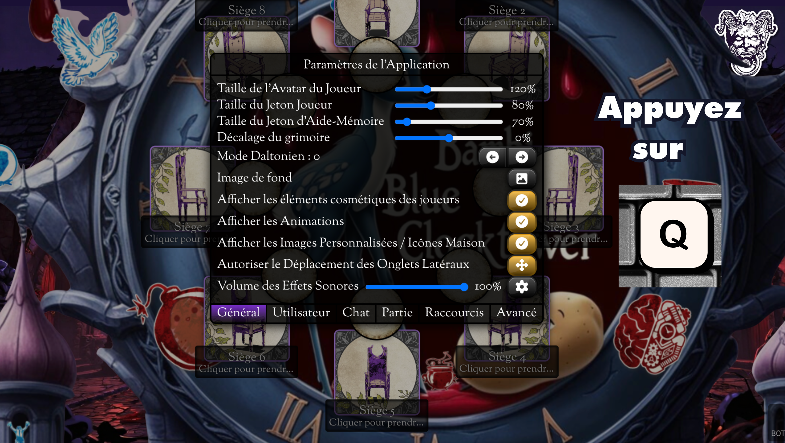
          

            
Appuyez sur Q pour ouvrir le menu des réglages de l'application.

          

        

        

          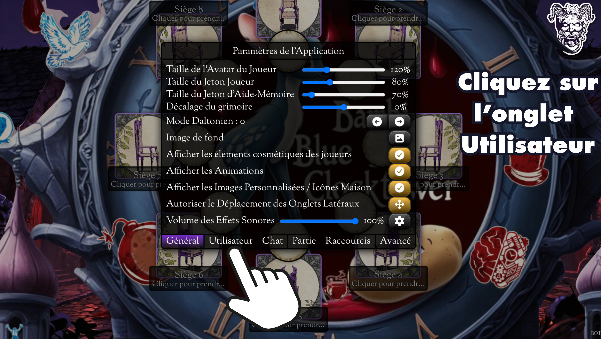
          

            
Cliquez sur le 2ème onglet, <strong>Utilisateur</strong>.

          

        

        

          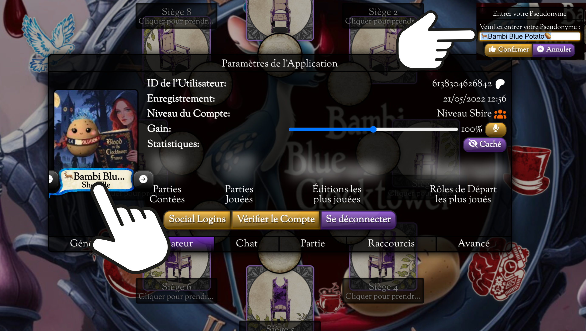
          

            
Cliquez sur votre nom pour le modifier.

          

        

        

          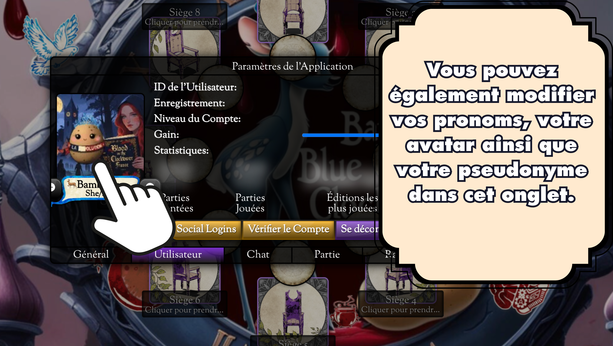
          

            

              Cliquez sur l'avatar pour changer votre image (nécessite un abonnement <a href="https://www.patreon.com/cw/botconline/membership" target="_blank" rel="noopener noreferrer" style="color: #ffd97d !important; font-weight: bold; text-decoration: underline;">Patreon 🔗</a>).
            

          

        

      

    

    <!-- ÉTAPE 10 -->
    

      

        
10

        <h2 style="color: #ffffff !important; font-size: 26px !important; font-weight: 900 !important; font-style: italic !important; margin: 0 !important;">QUITTER SON SIÈGE</h2>
      

      

        

          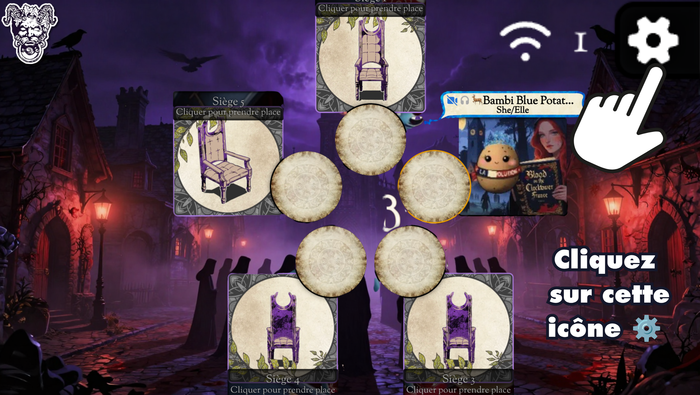
          

            
Cliquez sur l'icône ⚙️ d'engrenage.

          

        

        

          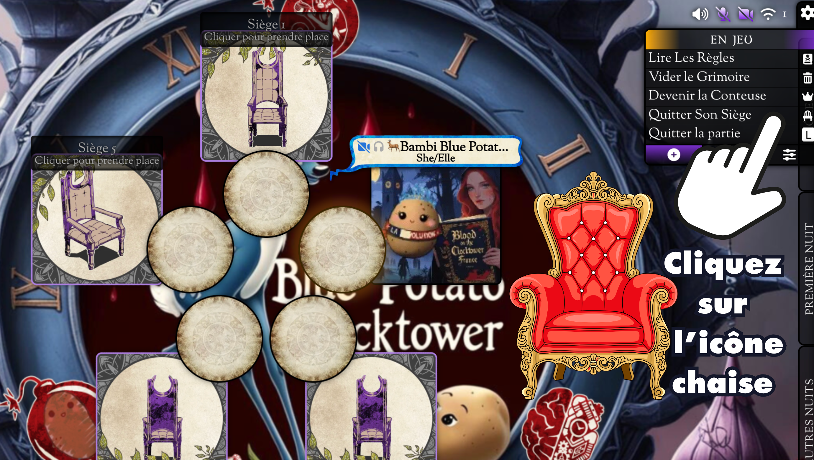
          

            
Cliquez sur <strong>Quitter son siège</strong>. Vous restez dans la partie en tant que Spectateur — vous pouvez chuchoter au Conteur et discuter avec les autres spectateurs.

          

        

      

    

    <!-- ÉTAPE 11 -->
    

      

        
11

        <h2 style="color: #ffffff !important; font-size: 26px !important; font-weight: 900 !important; font-style: italic !important; margin: 0 !important;">DEMANDER L'ACCÈS AU GRIMOIRE</h2>
      

      

        

          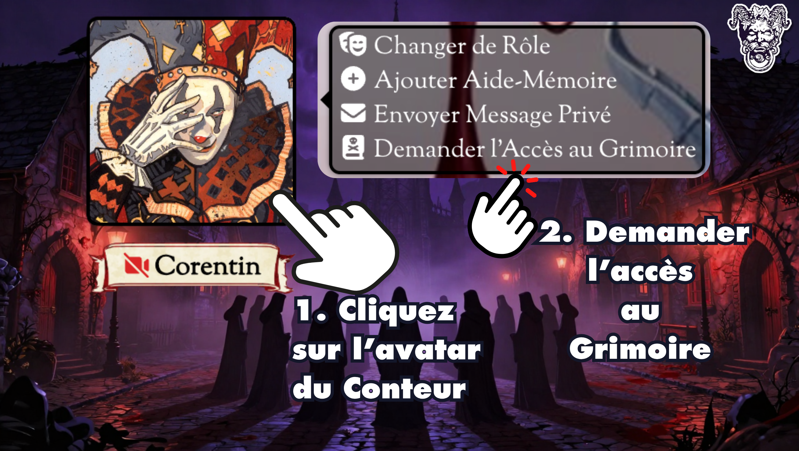
          

            
Cliquez sur le jeton du Conteur puis sélectionnez <strong>Demander l'accès au Grimoire</strong> pour voir l'ensemble des rôles de la partie en tant que spectateur.

          

        

      

    

    <!-- ÉTAPE 12 -->
    

      

        
12

        <h2 style="color: #ffffff !important; font-size: 26px !important; font-weight: 900 !important; font-style: italic !important; margin: 0 !important;">QUITTER LA PARTIE</h2>
      

      

        

          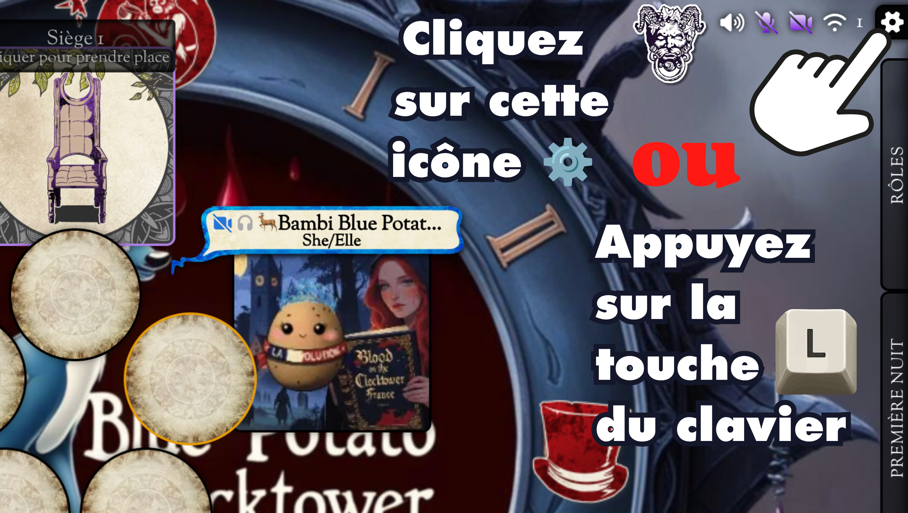
          

            
Appuyez sur la touche L du clavier — un message d'avertissement apparaît pour éviter les déconnexions accidentelles.

          

        

        

          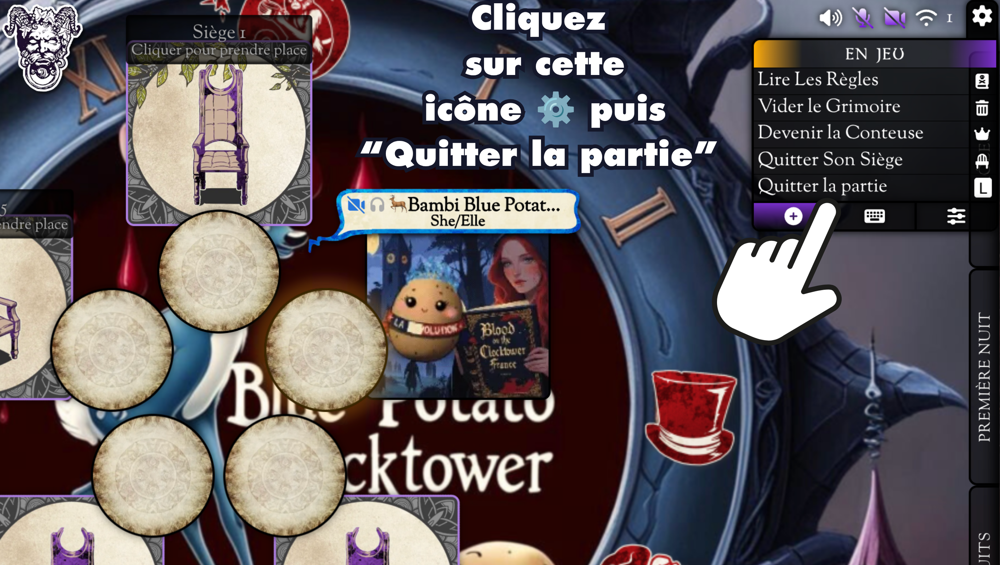
          

            — OU —
            
Cliquez sur l'icône ⚙️ d'engrenage puis sur <strong>Quitter la partie</strong>.

          

        

      

    

    <!-- ÉTAPE 13 -->
    

      

        
13

        <h2 style="color: #ffffff !important; font-size: 26px !important; font-weight: 900 !important; font-style: italic !important; margin: 0 !important;">OUVRIR L'ONGLET RÔLES</h2>
      

      

        

          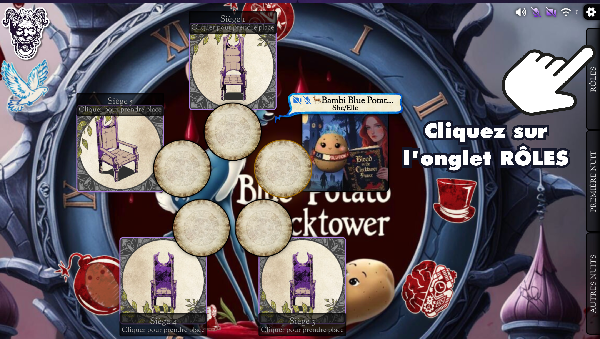
          

            
Cliquez sur l'onglet <strong>RÔLES</strong> pour afficher la liste simplifiée des personnages du script.

          

        

        

          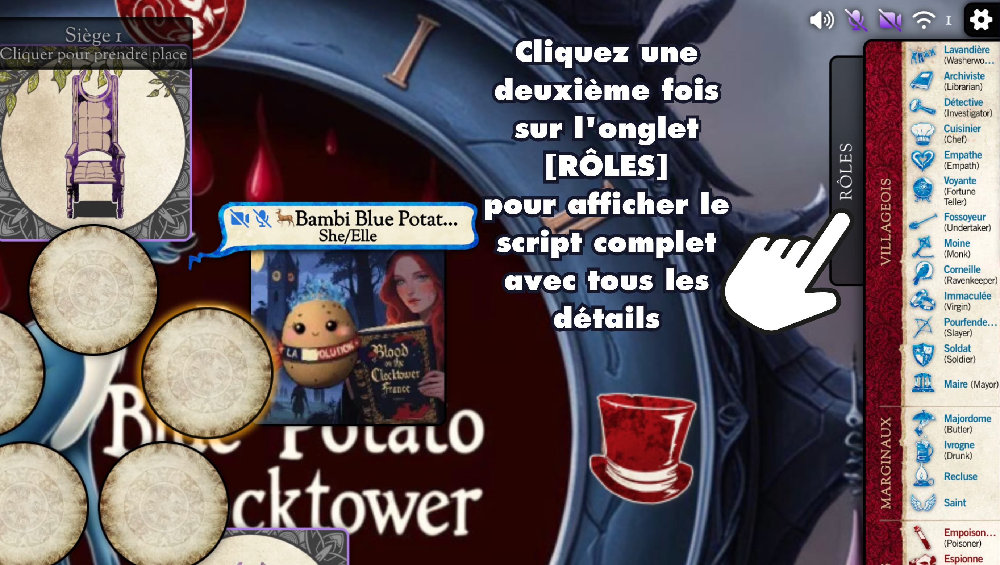
          

            
Cliquez une deuxième fois sur l'onglet <strong>RÔLES</strong> pour afficher le script complet avec tous les détails.

          

        

        

          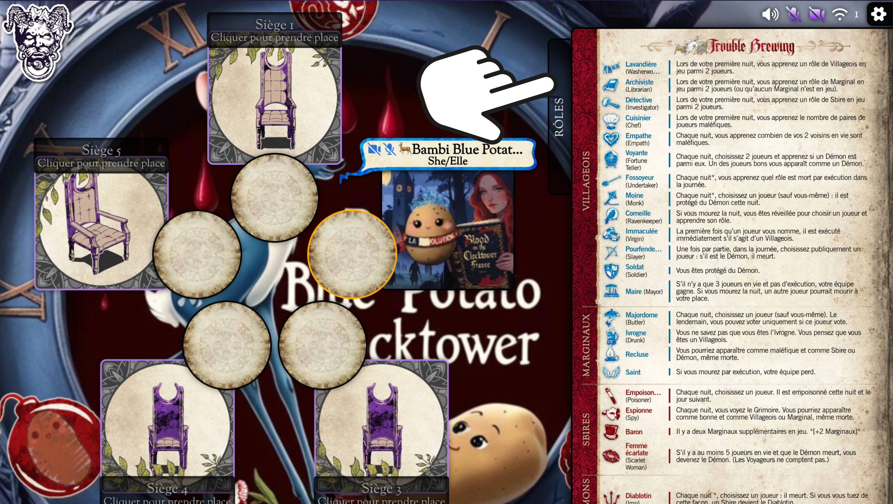
          

            
Cliquez une troisième fois sur l'onglet <strong>RÔLES</strong> pour le fermer.

          

        

      

    

    <!-- ÉTAPE 14 -->
    

      

        
14

        <h2 style="color: #ffffff !important; font-size: 26px !important; font-weight: 900 !important; font-style: italic !important; margin: 0 !important;">JETONS DE RÔLES & RAPPELS</h2>
      

      

        

          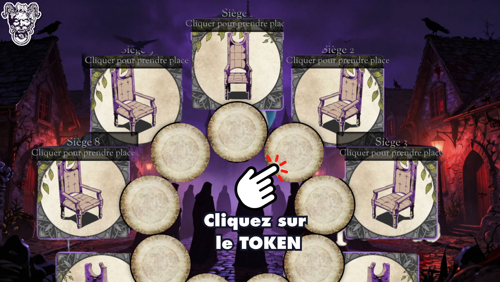
          

            <h4 class="sub-step-title">Définir un jeton</h4>
            
Vous pouvez modifier le jeton d'un joueur en cliquant directement dessus.

          

        

        

          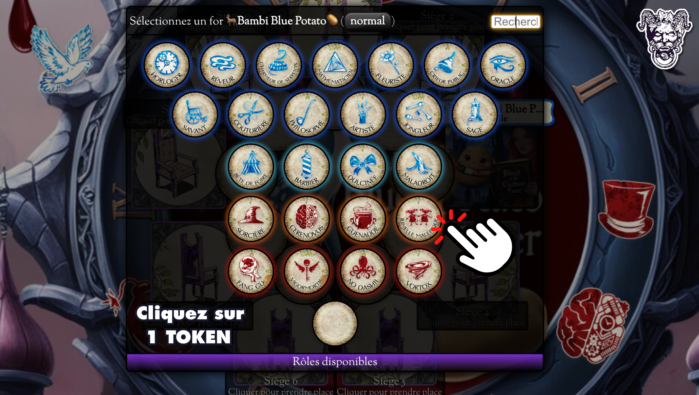
          

            
Définir le jeton d’un joueur est une information <strong>visible uniquement par vous</strong>. Cela ne change le rôle de personne (pas même le vôtre) — très pratique pour prendre des notes !

          

        

        

          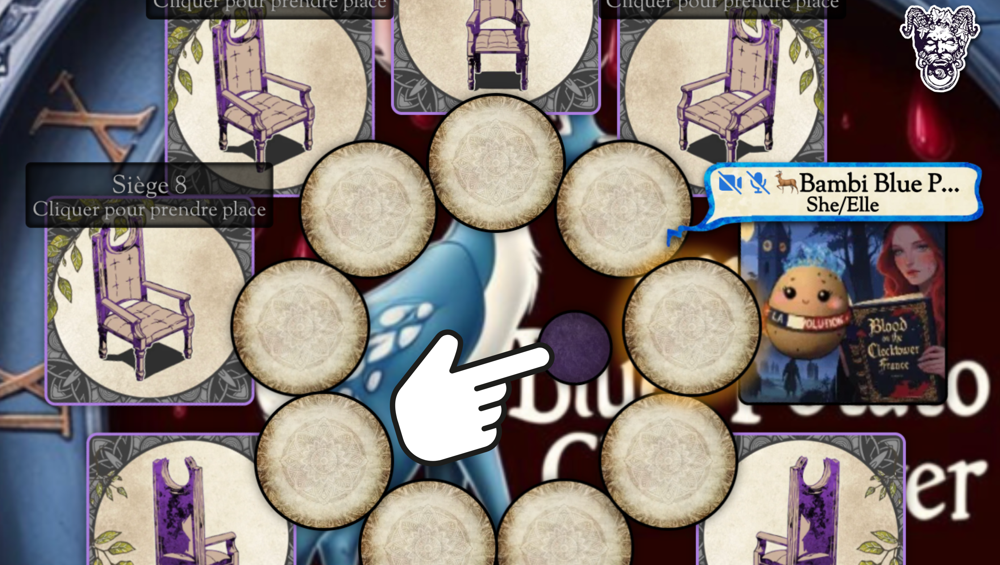
          

            <h4 class="sub-step-title">Placer des rappels</h4>
            
Ajoutez plusieurs jetons de rappel sur un joueur. Survolez le cercle intérieur jusqu'à ce qu'un jeton violet vierge apparaisse, puis cliquez sur le jeton de rappel souhaité.

          

        

        

          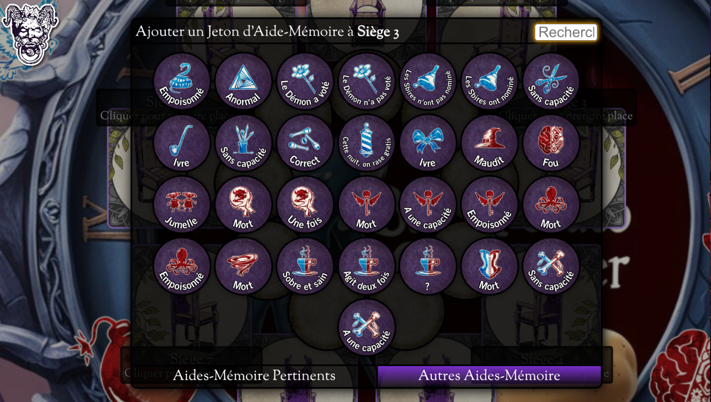
          

            
Choisissez n'importe quel jeton de rappel disponible dans la partie.

          

        

        

          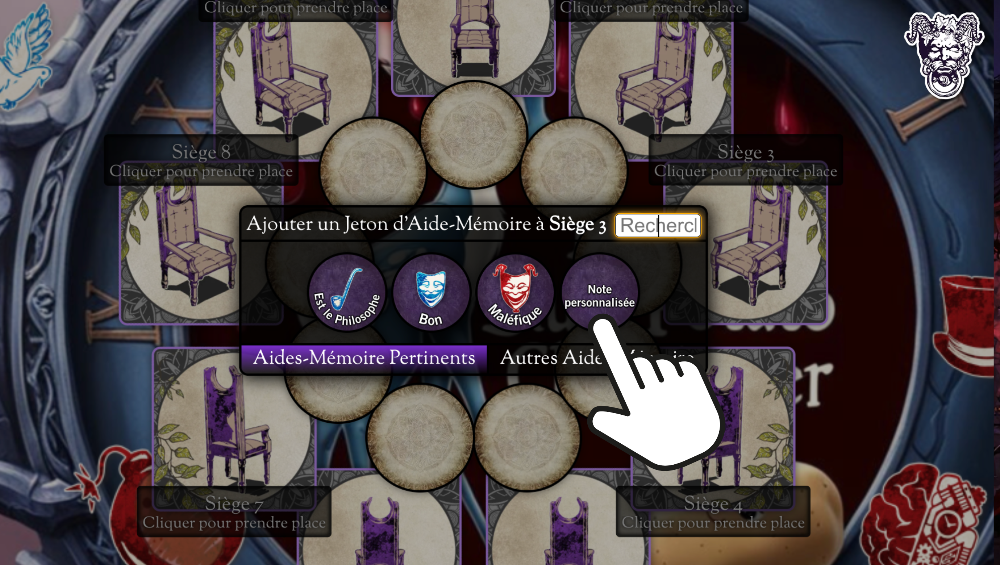
          

            
Vous pouvez également créer vos propres jetons de rappel personnalisés.

          

        

        

          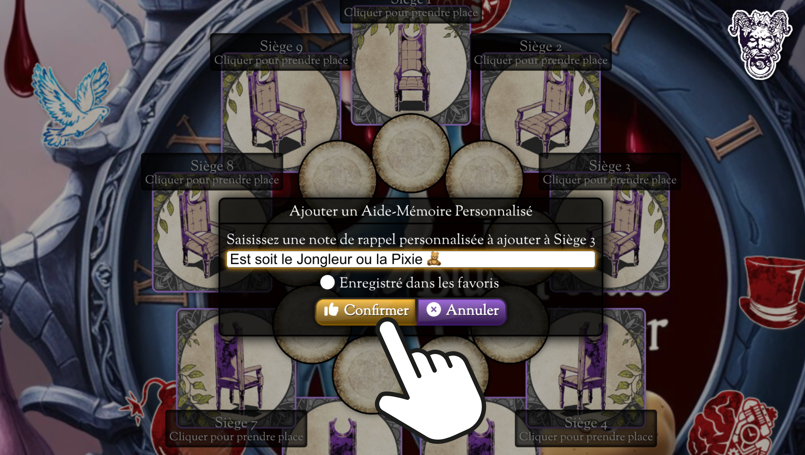
          

            
Parfait pour suivre plusieurs revendications de rôles, les infos du Savant, la cible de la Commère... et bien plus encore !

          

        

      

    

    <!-- ÉTAPE 15 -->
    

      

        
15

        <h2 style="color: #ffffff !important; font-size: 26px !important; font-weight: 900 !important; font-style: italic !important; margin: 0 !important;">CAMÉRA OU MICRO QUI NE FONCTIONNE PAS ?</h2>
      

      

        

          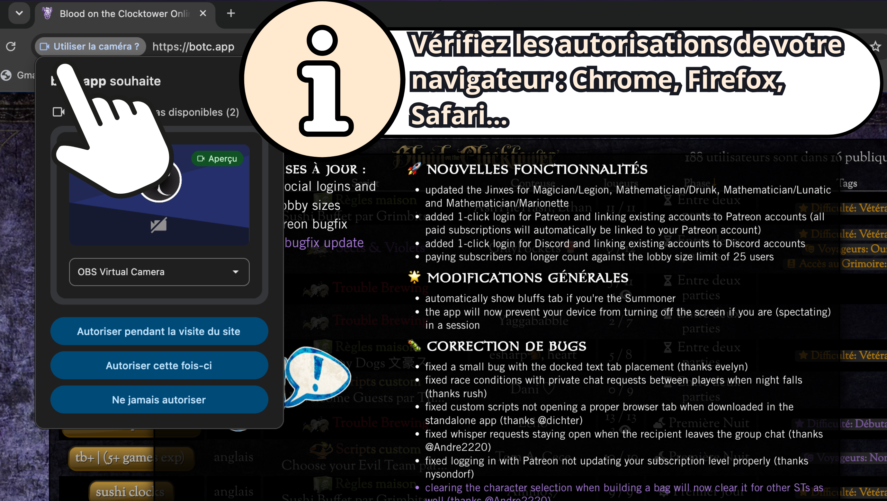
          

            

              ★ À FAIRE 
              
Rafraîchissez votre page web pour réinitialiser la connexion audio/vidéo :

              <ul style="margin-top: 8px; margin-bottom: 8px; padding-left: 20px;">
                <li style="color: #ffffff !important;"><strong>Sous Windows / Linux :</strong> Appuyez sur F5 ou forcez avec CTRL + F5.</li>
                <li style="color: #ffffff !important;"><strong>Sous Mac OS :</strong> Cliquez sur le bouton <strong>Actualiser 🔄</strong> du navigateur ou faites ⌘ CMD + R.</li>
              </ul>
            

          

        

      

    

    <!-- ÉTAPE 16 -->
    

      

        
16

        <h2 style="color: #ffffff !important; font-size: 26px !important; font-weight: 900 !important; font-style: italic !important; margin: 0 !important;">IMPOSSIBLE DE VOIR VOTRE JETON ?</h2>
      

      

        

          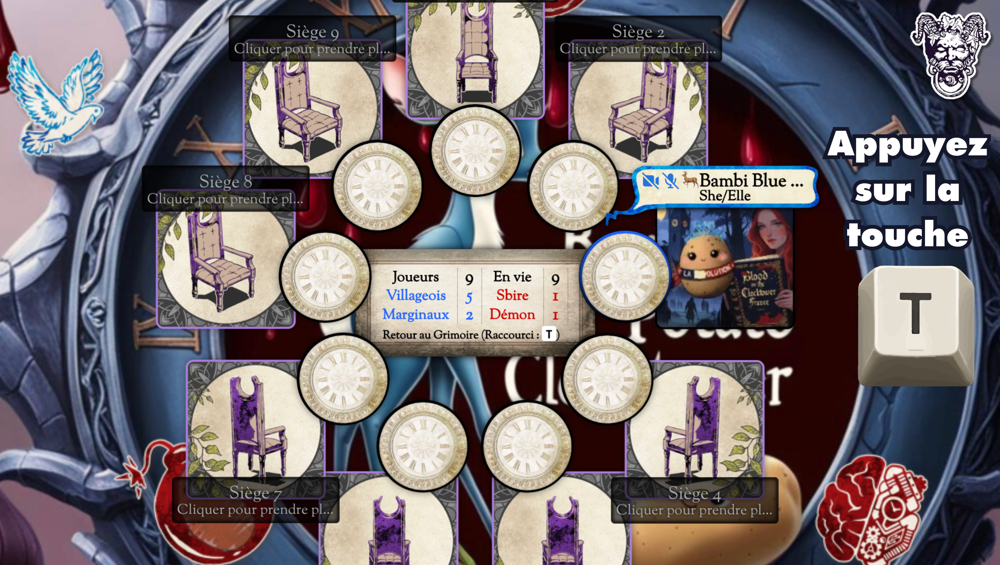
          

            

              ★ À FAIRE 
              
Appuyez sur la touche T de votre clavier. Vous êtes sans doute basculé en vue <strong style="color: #ffd97d !important;">Place du Village</strong> — réappuyez sur T pour revenir à la vue normale.

            

          

        

      

    

    <!-- BOUTON REVENIR EN HAUT -->
    <a href="#top-guide" class="back-to-top">⬆️ Revenir en haut de page</a>

  

<ul style="color:#f5f5f5; font-size:18px; line-height:1.7;">
  <li><a href="/botc-fr-bambi/" style="color:#5C2E1F; font-weight:bold; text-decoration:none;">Retour à l’accueil</a></li>
  <li><a href="./regles.html" style="color:#5C2E1F; font-weight:bold; text-decoration:none;">Règles du jeu</a></li>
</ul>

