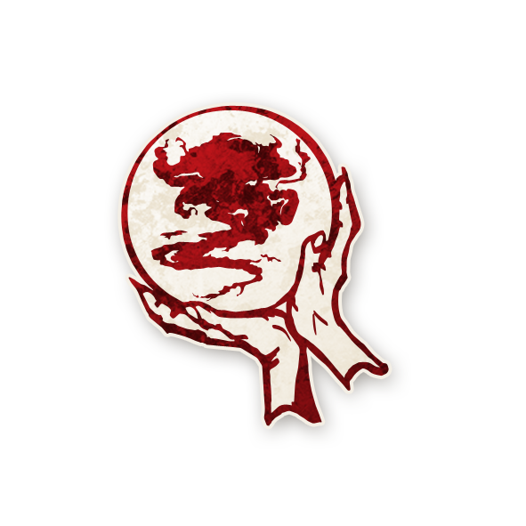
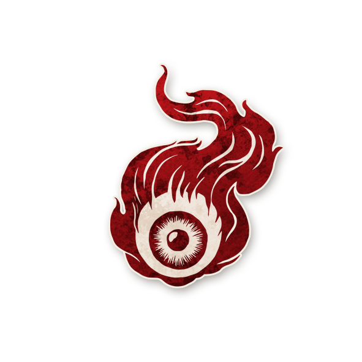
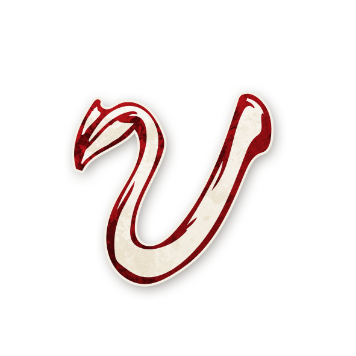
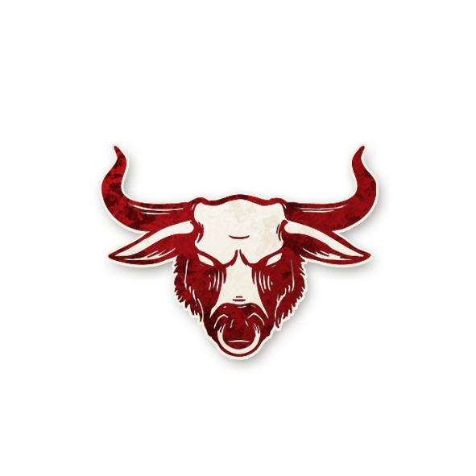
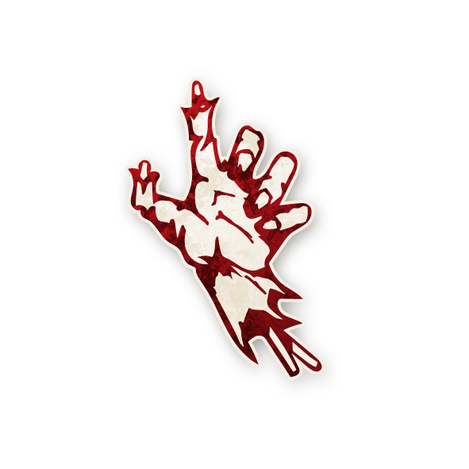

  

<!--  Page : Démons -->

<h1 style="color:#d45b5b; font-weight:bold; font-size:36px;"> Démons</h1>

  

<strong>Alignement :</strong> 🔴 Maléfique 
<strong>But :</strong> Tuer suffisamment de joueurs pour que le village ne puisse plus gagner.

Le Démon est le chef de l’équipe des forces maléfiques.   
C’est lui qui incarne la terreur nocturne du jeu.   
Si le Démon est exécuté, les joueurs du Bien remportent la partie,   
sauf cas particuliers comme celui de la <a href="./tb_roles/femmeecarlate.html" style="color:red; font-weight:bold; text-decoration:none;">Femme Écarlate</a>.

<h2 style="color:#b58b52; font-weight:bold;">📌 Exemple dans <em>Trouble Brewing</em></h2>

<ul style="color:#e0c99d; font-size:18px; line-height:1.7; margin-left:24px;">
  <li>
    <a href="./tb_roles/imp.html" style="color:#d45b5b; font-weight:bold; text-decoration:none;">Diablotin</a> : tue un joueur chaque nuit et peut transmettre son rôle à un sbire en mourant.
  </li>
</ul>

<h2 style="color:#b58b52; font-weight:bold;">💡 Conseils pour les Conteurs et Conteuses</h2>

Lorsqu’un Démon agit, veillez à :

<ul style="color:#f5f5f5; font-size:18px; line-height:1.7; margin-left:24px;">
  <li>préserver le suspense en gérant le rythme des nuits ;</li>
  <li>masquer les choix du Démon pour ne pas révéler son identité ;</li>
  <li>jouer les réactions du village avec neutralité pour maintenir la tension dramatique.</li>
</ul>

<h2 style="font-weight:800; font-size:22px; text-align:left;">
  Tous les Démons 
  <a href="./trouble_brewing.html" style="color:#b58b52; font-weight:800; text-decoration:none;">• Trouble Brewing</a> 
  <a href="./bmr.html" style="color:#ffa64d; font-weight:800; text-decoration:none;">• Bad Moon Rising</a> 
  <a href="./sv.html" style="color:#d67bff; font-weight:800; text-decoration:none;">• Sects & Violets</a>
  <a href="./experimentaux.html" style="color:#e0b97a; font-weight:800; text-decoration:none;">• Expérimentaux</a>
</h2>

  <!-- Al-Hadikhia -->
  <a href="./roles_experimentaux/alhadikhia.html" style="text-decoration:none; flex:0 0 220px; text-align:center;">
    
    Al-Hadikhia
  </a>

  <!-- Diablotin -->
  <a href="./tb_roles/imp.html" style="text-decoration:none; flex:0 0 220px; text-align:center;">
    
    Diablotin
  </a>

  <!-- Fang Gu -->
  <a href="./sv_roles/fanggu.html" style="text-decoration:none; flex:0 0 220px; text-align:center;">
    
    Fang Gu
  </a>

  <!-- Kazali -->
  <a href="./roles_experimentaux/kazali.html" style="text-decoration:none; flex:0 0 220px; text-align:center;">
    
    Kazali
  </a>

  <!-- Légion -->
  <a href="./roles_experimentaux/legion.html" style="text-decoration:none; flex:0 0 220px; text-align:center;">
    
    Légion
  </a>

  <!-- Léviathan -->
  <a href="./roles_experimentaux/leviathan.html" style="text-decoration:none; flex:0 0 220px; text-align:center;">
    
    Léviathan
  </a>

  <!-- No Dashii -->
  <a href="./sv_roles/nodashii.html" style="text-decoration:none; flex:0 0 220px; text-align:center;">
    
    No Dashii
  </a>

  <!-- Ojo -->
  <a href="./roles_experimentaux/ojo.html" style="text-decoration:none; flex:0 0 220px; text-align:center;">
    
    Ojo
  </a>

  <!-- P’tit Monstre -->
  <a href="./roles_experimentaux/lilmonsta.html" style="text-decoration:none; flex:0 0 220px; text-align:center;">
    
    P’tit Monstre
  </a>

  <!-- Po -->
  <a href="./bmr_roles/po.html" style="text-decoration:none; flex:0 0 220px; text-align:center;">
    
    Po
  </a>

  <!-- Pukka -->
  <a href="./bmr_roles/pukka.html" style="text-decoration:none; flex:0 0 220px; text-align:center;">
    
    Pukka
  </a>

  <!-- Riot -->
  <a href="./roles_experimentaux/riot.html" style="text-decoration:none; flex:0 0 220px; text-align:center;">
    
    Riot
  </a>

  <!-- Sangsue -->
  <a href="./roles_experimentaux/lleech.html" style="text-decoration:none; flex:0 0 220px; text-align:center;">
    
    Sangsue
  </a>

  <!-- Seigneur de Typhon -->
  <a href="./roles_experimentaux/lordoftyphon.html" style="text-decoration:none; flex:0 0 220px; text-align:center;">
    
    Seigneur de Typhon
  </a>

  <!-- Shabaloth -->
  <a href="./bmr_roles/shabaloth.html" style="text-decoration:none; flex:0 0 220px; text-align:center;">
    
    Shabaloth
  </a>

  <!-- Vigormortis -->
  <a href="./sv_roles/vigormortis.html" style="text-decoration:none; flex:0 0 220px; text-align:center;">
    
    Vigormortis
  </a>

  <!-- Vortox -->
  <a href="./sv_roles/vortox.html" style="text-decoration:none; flex:0 0 220px; text-align:center;">
    
    Vortox
  </a>

  <!-- Yaggababble -->
  <a href="./roles_experimentaux/yaggababble.html" style="text-decoration:none; flex:0 0 220px; text-align:center;">
    
    Yaggababble
  </a>

  <!-- Zombuul -->
  <a href="./bmr_roles/zombuul.html" style="text-decoration:none; flex:0 0 220px; text-align:center;">
    
    Zombuul
  </a>

<h2 style="color:#b58b52; font-weight:bold;"> Autres Catégories</h2>

<ul style="color:#e0c99d; font-size:18px; line-height:1.7; margin-left:24px;">
  <li><a href="./villageois.html" style="color:blue; font-weight:bold; text-decoration:none;">Villageois</a></li>
  <li><a href="./etrangers.html" style="color:blue; font-weight:bold; text-decoration:none;">Marginaux</a></li>
  <li><a href="./sbires.html" style="color:red; font-weight:bold; text-decoration:none;">Sbires</a></li>
  <li><a href="./" style="color:#f5f5f5; font-weight:bold; text-decoration:none;">Retour à la page d’accueil</a></li>
</ul>
