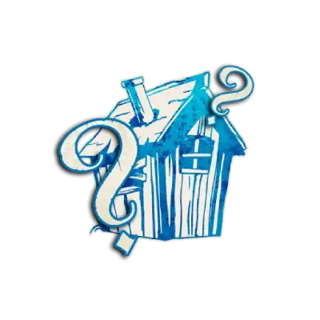

  

# Étrangers  

  

**Alignement :** 🔵 Bon  
**But :** Trouver et exécuter le Démon… malgré leurs handicaps.  

Les Étrangers compliquent la tâche du Village en faussant les informations ou en imposant des contraintes de jeu.  
Ils sèment le doute mais restent du côté des bons.  

## 📌 Exemples dans *Trouble Brewing*  
- [Majordome](./trouble_brewing/majordome.md) : Ne peut voter que si son Maître vote.  
- [Ivrogne](./trouble_brewing/ivrogne.md) : Croit être un Villageois mais sa capacité ne fonctionne pas.  
- [Reclus](./trouble_brewing/reclus.md) : Peut apparaître comme un Sbire ou un Démon.  
- [Saint](./trouble_brewing/saint.md) : Fait perdre le Village s’il est exécuté.  

---

🔗 Autres catégories :  
- [Villageois](villageois.md)  
- [Sbires](sbires.md)  
- [Démons](demons.md)  

## 📂 Navigation 
- 🏠 [Retour à l’accueil](/botc-fr-bambi/)  
