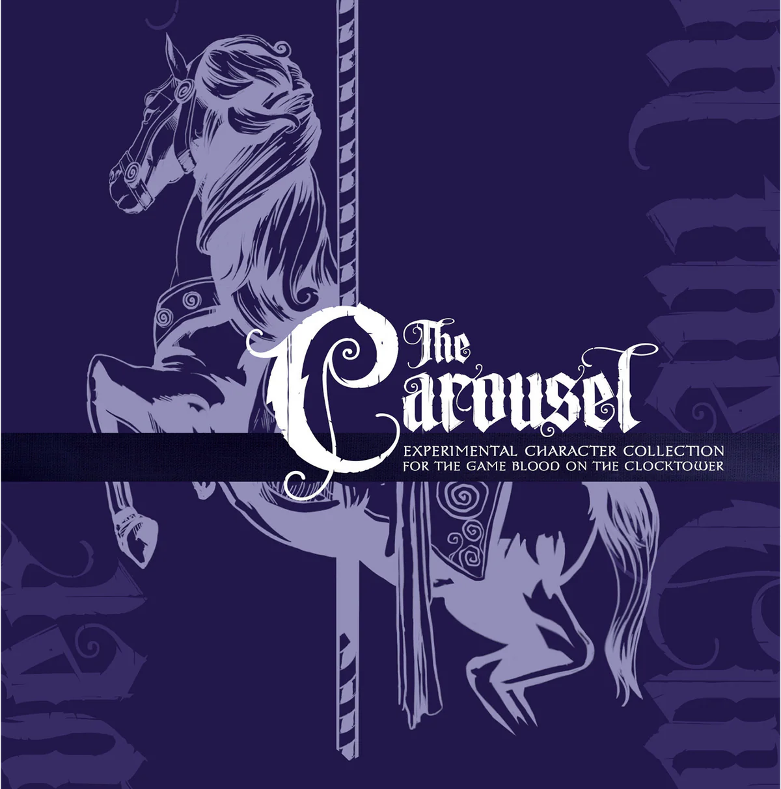

  

##
 <!-- 🧪 Rôles Expérimentaux -->
  <a href="#" style="text-decoration:none;">
    
     
    🎠 The Carousel "Expérimental"
  </a>
   
  <em style="color:#b58b52;"> </em>

  
 <!-- 🎠 Rôles Expérimentaux -->

  <a href="./experimentaux.html" style="text-decoration:none;">
    
     
    🎠 The Carousel "Expérimental"
  </a>

# 🎠 The Carousel "Expérimental"

  « 🎠 **Les rôles expérimentaux du *Carousel*** ouvrent la porte à de nouvelles mécaniques audacieuses et inédites.
Pensés pour les joueuses, joueurs et Conteurs aguerris, ces rôles repoussent les limites de *Blood on the Clocktower* et invitent à explorer des expériences de jeu aussi surprenantes que captivantes.»

## **Expérimentaux**
- Les rôles expérimentaux sont des rôles qui **n’ont pas encore de script officiel attitré**.
- Ils pourraient, à l’avenir, être intégrés dans des extensions officielles de *Blood on the Clocktower*.
- En attendant, vous êtes encouragés à **les tester et les expérimenter** dans vos propres scripts personnalisés.

👉 Recommandé aux joueuses, joueurs et Conteurs ayant déjà une bonne expérience de *Blood on the Clocktower*.

---

## 📑 Sommaire

1. [Synopsis](#1-synopsis)  
2. [Gameplay](#2-gameplay)  
3. [Villageois](#3-villageois)  
4. [Étrangers](#4-étrangers)  
5. [Sbires](#5-sbires)  
6. [Démons](#6-démons)  
7. [Téléchargements et Ressources](#7-téléchargements-et-ressources)  

##
  
<ul style="color:#e0c99d; font-size:18px; line-height:1.7;">
  <li>🏠 <a href="./index.html" style="color:#d4a76a; font-weight:bold; text-decoration:none;">Retour à la page d’accueil</a></li>
  <li>🍺 <a href="../trouble_brewing.html" style="color:#d4a76a; font-weight:bold; text-decoration:none;">Trouble Brewing</a></li>
  <li>🌛 <a href="./bmr.html" style="color:#d4a76a; font-weight:bold; text-decoration:none;">Bad Moon Rising</a></li>
  <li>💐 <a href="./sv.html" style="color:#d4a76a; font-weight:bold; text-decoration:none;">Sects & Violets</a></li>
</ul>
