

  

<!-- Bandeau cliquable -->

  <a href="./experimentaux.html" style="text-decoration:none;">
    
     
    🎠 The Carousel Expérimental
  </a>

<!-- Titre principal -->
<h1 style="color:#e0b97a; font-weight:800; font-size:42px; text-align:left; margin:10px 0 4px;">
  🎠 The Carousel Expérimental
</h1>

<!-- INTRO (inchangée) -->

  « 🎠 <strong>Les rôles expérimentaux du <em>Carousel</em></strong> ouvrent la porte à de nouvelles mécaniques audacieuses et inédites.
Pensés pour les joueuses, joueurs et Conteurs aguerris, ces rôles repoussent les limites de <em>Blood on the Clocktower</em> et invitent à explorer des expériences de jeu aussi surprenantes que captivantes.»

<!-- 1. SYNOPSIS -->
<h2 id="1-synopsis" style="color:#e0b97a; font-weight:800; font-size:22px; text-align:left; margin-top:18px;">1. Synopsis</h2>
<h3 style="color:#e0b97a; font-weight:800; font-size:20px; text-align:left; margin:6px 0 10px;">The Carousel Expérimental</h3>
<ul style="color:#e0c99d; font-size:18px; line-height:1.7; margin-left:22px;">
  <li>Les rôles expérimentaux sont des rôles qui <strong>n’ont pas encore de script officiel attitré</strong>.</li>
  <li>Ils pourraient, à l’avenir, être intégrés dans des extensions officielles de <em>Blood on the Clocktower</em>.</li>
  <li>En attendant, vous êtes encouragés à <strong>les tester et les expérimenter</strong> dans vos propres scripts personnalisés.</li>
</ul>

<!-- 2. GAMEPLAY -->
<h2 id="2-gameplay" style="color:#e0b97a; font-weight:800; font-size:22px; text-align:left; margin-top:18px;">2. Gameplay</h2>

  👉 Niveau : Expérimenté 
  🎠 Les rôles expérimentaux du <em>Carousel</em> sont recommandés aux joueuses, joueurs et Conteurs ayant déjà une bonne expérience du jeu <em>Blood on the Clocktower</em>.

<!-- SOMMAIRE NUMÉROTÉ -->
<h2 style="color:#e0b97a; font-weight:800; font-size:22px; text-align:left; margin-top:18px;">📑 Sommaire</h2>
<ol style="color:#e0c99d; font-size:18px; line-height:1.7; padding-left:20px; margin-top:6px;">
  <li><a href="#1-synopsis" style="color:#e0b97a; font-weight:bold; text-decoration:none;">Synopsis</a></li>
  <li><a href="#2-gameplay" style="color:#e0b97a; font-weight:bold; text-decoration:none;">Gameplay</a></li>
  <li><a href="#3-villageois" style="color:#e0b97a; font-weight:bold; text-decoration:none;">Villageois</a></li>
  <li><a href="#4-etrangers" style="color:#e0b97a; font-weight:bold; text-decoration:none;">Étrangers</a></li>
  <li><a href="#5-sbires" style="color:#e0b97a; font-weight:bold; text-decoration:none;">Sbires</a></li>
  <li><a href="#6-demons" style="color:#e0b97a; font-weight:bold; text-decoration:none;">Démons</a></li>
  <li><a href="#7-legendaires" style="color:#e0b97a; font-weight:bold; text-decoration:none;">Légendaires</a></li>
  <li><a href="#8-lorics" style="color:#e0b97a; font-weight:bold; text-decoration:none;">Lorics</a></li>
  <li><a href="#9-voyageurs" style="color:#e0b97a; font-weight:bold; text-decoration:none;">Voyageurs</a></li>
</ol>

<!-- 3. VILLAGEOIS -->
<h2 id="3-villageois" style="color:#4ea3ff; font-weight:800; font-size:22px; text-align:left;">3. Villageois</h2>

  <a href="roles_experimentaux/acrobat.md" style="text-decoration:none; width:280px; text-align:center;">
    
    Acrobat
  </a>

  <a href="roles_experimentaux/alchemist.md" style="text-decoration:none; width:280px; text-align:center;">
    
    Alchemist
  </a>

  <a href="roles_experimentaux/alsaahir.md" style="text-decoration:none; width:280px; text-align:center;">
    
    Alsaahir
  </a>

  <a href="roles_experimentaux/amnesiac.md" style="text-decoration:none; width:280px; text-align:center;">
    
    Amnesiac
  </a>

  <a href="roles_experimentaux/atheist.md" style="text-decoration:none; width:280px; text-align:center;">
    
    Atheist
  </a>

  <a href="roles_experimentaux/balloonist.md" style="text-decoration:none; width:280px; text-align:center;">
    
    Balloonist
  </a>

  <a href="roles_experimentaux/banshee.md" style="text-decoration:none; width:280px; text-align:center;">
    
    Banshee
  </a>

  <a href="roles_experimentaux/bounty_hunter.md" style="text-decoration:none; width:280px; text-align:center;">
    
    Bounty Hunter
  </a>

  <a href="roles_experimentaux/cannibal.md" style="text-decoration:none; width:280px; text-align:center;">
    
    Cannibal
  </a>

  <a href="roles_experimentaux/choirboy.md" style="text-decoration:none; width:280px; text-align:center;">
    
    Choirboy
  </a>

  <a href="roles_experimentaux/cult_leader.md" style="text-decoration:none; width:280px; text-align:center;">
    
    Cult Leader
  </a>

  <a href="roles_experimentaux/engineer.md" style="text-decoration:none; width:280px; text-align:center;">
    
    Engineer
  </a>

  <a href="roles_experimentaux/farmer.md" style="text-decoration:none; width:280px; text-align:center;">
    
    Farmer
  </a>

  <a href="roles_experimentaux/fisherman.md" style="text-decoration:none; width:280px; text-align:center;">
    
    Fisherman
  </a>

  <a href="roles_experimentaux/general.md" style="text-decoration:none; width:280px; text-align:center;">
    
    General
  </a>

  <a href="roles_experimentaux/high_priestess.md" style="text-decoration:none; width:280px; text-align:center;">
    
    High Priestess
  </a>

  <a href="roles_experimentaux/huntsman.md" style="text-decoration:none; width:280px; text-align:center;">
    
    Huntsman
  </a>

  <a href="roles_experimentaux/king.md" style="text-decoration:none; width:280px; text-align:center;">
    
    King
  </a>

  <a href="roles_experimentaux/knight.md" style="text-decoration:none; width:280px; text-align:center;">
    
    Knight
  </a>

  <a href="roles_experimentaux/lycanthrope.md" style="text-decoration:none; width:280px; text-align:center;">
    
    Lycanthrope
  </a>

  <a href="roles_experimentaux/magician.md" style="text-decoration:none; width:280px; text-align:center;">
    
    Magician
  </a>

  <a href="roles_experimentaux/nightwatchman.md" style="text-decoration:none; width:280px; text-align:center;">
    
    Nightwatchman
  </a>

  <a href="roles_experimentaux/noble.md" style="text-decoration:none; width:280px; text-align:center;">
    
    Noble
  </a>

  <a href="roles_experimentaux/pixie.md" style="text-decoration:none; width:280px; text-align:center;">
    
    Pixie
  </a>

  <a href="roles_experimentaux/poppy_grower.md" style="text-decoration:none; width:280px; text-align:center;">
    
    Poppy Grower
  </a>

  <a href="roles_experimentaux/preacher.md" style="text-decoration:none; width:280px; text-align:center;">
    
    Preacher
  </a>

  <a href="roles_experimentaux/princess.md" style="text-decoration:none; width:280px; text-align:center;">
    
    Princess
  </a>

  <a href="roles_experimentaux/shugenja.md" style="text-decoration:none; width:280px; text-align:center;">
    
    Shugenja
  </a>

  <a href="roles_experimentaux/steward.md" style="text-decoration:none; width:280px; text-align:center;">
    
    Steward
  </a>

  <a href="roles_experimentaux/village_idiot.md" style="text-decoration:none; width:280px; text-align:center;">
    
    Village Idiot
  </a>

<!-- 4. ÉTRANGERS -->
<h2 id="4-etrangers" style="color:#4ea3ff; font-weight:800; font-size:22px; text-align:left;">4. Étrangers</h2>

  <a href="roles_experimentaux/damsel.md" style="text-decoration:none; width:280px; text-align:center;">
    
    Damsel
  </a>

  <a href="roles_experimentaux/golem.md" style="text-decoration:none; width:280px; text-align:center;">
    
    Golem
  </a>

  <a href="roles_experimentaux/hatter.md" style="text-decoration:none; width:280px; text-align:center;">
    
    Hatter
  </a>

  <a href="roles_experimentaux/heretic.md" style="text-decoration:none; width:280px; text-align:center;">
    
    Heretic
  </a>

  <a href="roles_experimentaux/hermit.md" style="text-decoration:none; width:280px; text-align:center;">
    
    Hermit
  </a>

  <a href="roles_experimentaux/ogre.md" style="text-decoration:none; width:280px; text-align:center;">
    
    Ogre
  </a>

  <a href="roles_experimentaux/plague_doctor.md" style="text-decoration:none; width:280px; text-align:center;">
    
    Plague Doctor
  </a>

  <a href="roles_experimentaux/politician.md" style="text-decoration:none; width:280px; text-align:center;">
    
    Politician
  </a>

  <a href="roles_experimentaux/puzzlemaster.md" style="text-decoration:none; width:280px; text-align:center;">
    
    Puzzlemaster
  </a>

  <a href="roles_experimentaux/snitch.md" style="text-decoration:none; width:280px; text-align:center;">
    
    Snitch
  </a>

  <a href="roles_experimentaux/zealot.md" style="text-decoration:none; width:280px; text-align:center;">
    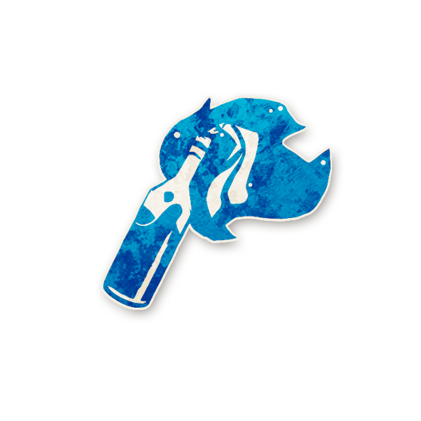
    Zealot
  </a>

<!-- 5. SBIRES -->
<h2 id="5-sbires" style="color:#d45b5b; font-weight:800; font-size:22px; text-align:left;">5. Sbires</h2>

  <a href="roles_experimentaux/boffin.md" style="text-decoration:none; width:280px; text-align:center;">
    
    Boffin
  </a>

  <a href="roles_experimentaux/boomdandy.md" style="text-decoration:none; width:280px; text-align:center;">
    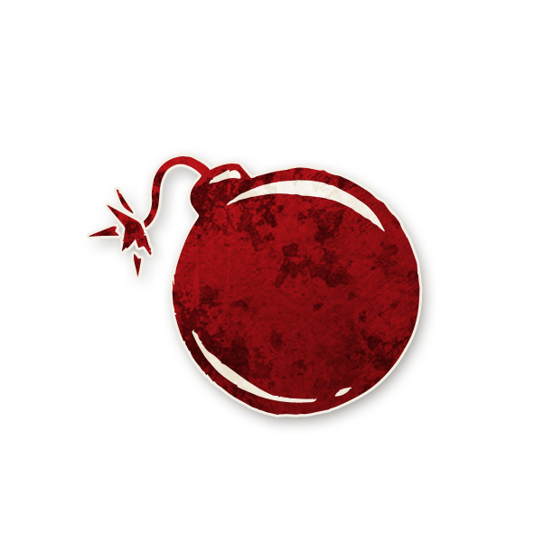
    Boomdandy
  </a>

  <a href="roles_experimentaux/fearmonger.md" style="text-decoration:none; width:280px; text-align:center;">
    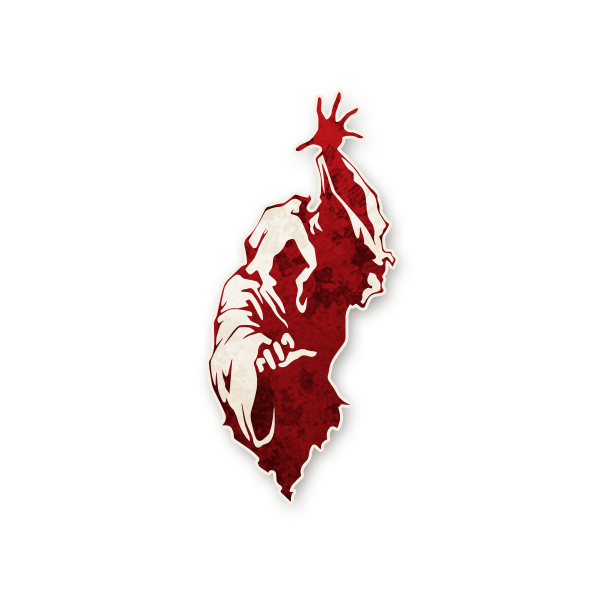
    Fearmonger
  </a>

  <a href="roles_experimentaux/goblin.md" style="text-decoration:none; width:280px; text-align:center;">
    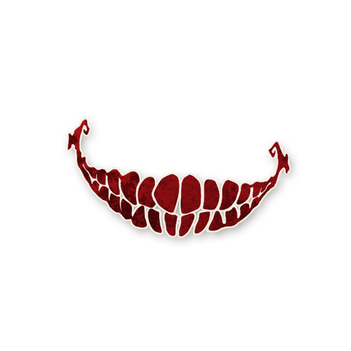
    Goblin
  </a>

  <a href="roles_experimentaux/harpy.md" style="text-decoration:none; width:280px; text-align:center;">
    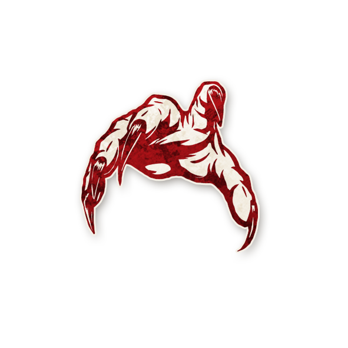
    Harpy
  </a>

  <a href="roles_experimentaux/marionette.md" style="text-decoration:none; width:280px; text-align:center;">
    
    Marionette
  </a>

  <a href="roles_experimentaux/mezepheles.md" style="text-decoration:none; width:280px; text-align:center;">
    
    Mezepheles
  </a>

  <a href="roles_experimentaux/organ_grinder.md" style="text-decoration:none; width:280px; text-align:center;">
    
    Organ Grinder
  </a>

  <a href="roles_experimentaux/psychopath.md" style="text-decoration:none; width:280px; text-align:center;">
    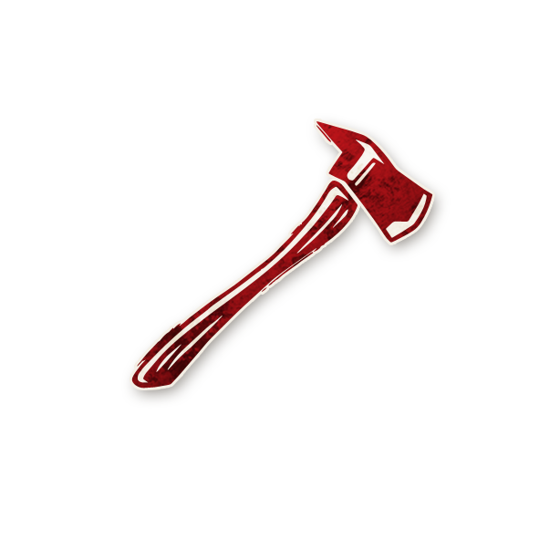
    Psychopath
  </a>

  <a href="roles_experimentaux/summoner.md" style="text-decoration:none; width:280px; text-align:center;">
    
    Summoner
  </a>

  <a href="roles_experimentaux/vizier.md" style="text-decoration:none; width:280px; text-align:center;">
    
    Vizier
  </a>

  <a href="roles_experimentaux/widow.md" style="text-decoration:none; width:280px; text-align:center;">
    
    Widow
  </a>

  <a href="roles_experimentaux/wizard.md" style="text-decoration:none; width:280px; text-align:center;">
    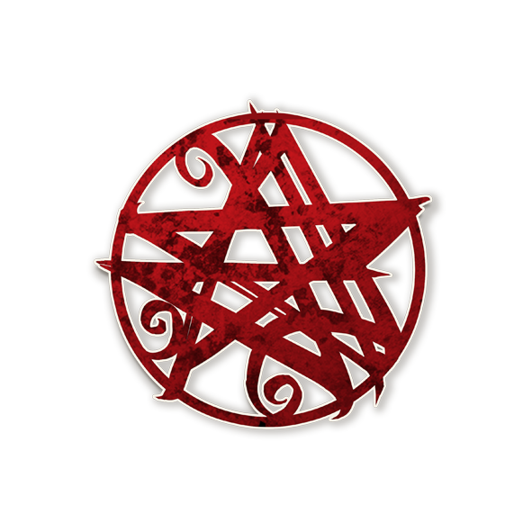
    Wizard
  </a>

  <a href="roles_experimentaux/wraith.md" style="text-decoration:none; width:280px; text-align:center;">
    
    Wraith
  </a>

  <a href="roles_experimentaux/xaan.md" style="text-decoration:none; width:280px; text-align:center;">
    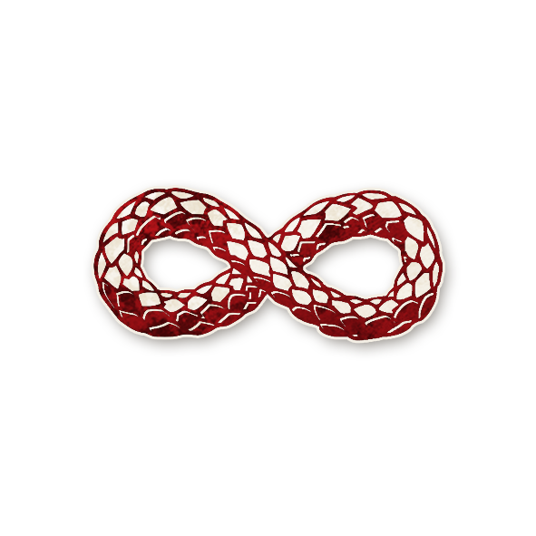
    Xaan
  </a>

<!-- 6. DÉMONS -->
<h2 id="6-demons" style="color:#d45b5b; font-weight:800; font-size:22px; text-align:left;">6. Démons</h2>

  <a href="roles_experimentaux/al_hadikhia.md" style="text-decoration:none; width:280px; text-align:center;">
    
    Al-Hadikhia
  </a>

  <a href="roles_experimentaux/kazali.md" style="text-decoration:none; width:280px; text-align:center;">
    
    Kazali
  </a>

  <a href="roles_experimentaux/legion.md" style="text-decoration:none; width:280px; text-align:center;">
    
    Legion
  </a>

  <a href="roles_experimentaux/leviathan.md" style="text-decoration:none; width:280px; text-align:center;">
    
    Leviathan
  </a>

  <a href="roles_experimentaux/lil_monsta.md" style="text-decoration:none; width:280px; text-align:center;">
    
    Lil' Monsta
  </a>

  <a href="roles_experimentaux/lleech.md" style="text-decoration:none; width:280px; text-align:center;">
    
    Lleech
  </a>

  <a href="roles_experimentaux/lord_of_typhon.md" style="text-decoration:none; width:280px; text-align:center;">
    
    Lord of Typhon
  </a>

  <a href="roles_experimentaux/ojo.md" style="text-decoration:none; width:280px; text-align:center;">
    
    Ojo
  </a>

  <a href="roles_experimentaux/riot.md" style="text-decoration:none; width:280px; text-align:center;">
    
    Riot
  </a>

  <a href="roles_experimentaux/yaggababble.md" style="text-decoration:none; width:280px; text-align:center;">
    
    Yaggababble
  </a>

<!-- 7. LÉGENDaires -->
<h2 id="7-legendaires" style="color:#e0b97a; font-weight:800; font-size:22px; text-align:left;">7. Légendaires</h2>

  <a href="legendaire_roles/deusexfiasco.md" style="text-decoration:none; width:280px; text-align:center;">
    
    Deus ex Fiasco
  </a>

  <a href="legendaire_roles/ferryman.md" style="text-decoration:none; width:280px; text-align:center;">
    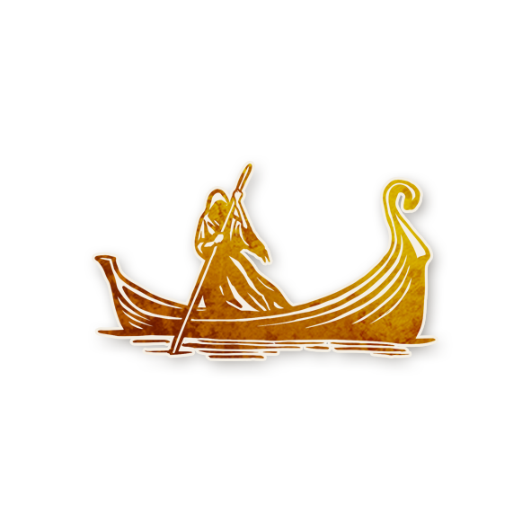
    Le Passeur
  </a>

<!-- 8. LORICS -->
<h2 id="8-lorics" style="color:#4caf50; font-weight:800; font-size:22px; text-align:left;">8. Lorics</h2>

  <a href="loric_roles/bootlegger.html" style="text-decoration:none; width:280px; text-align:center;">
    
    Bootlegger
  </a>

  <a href="loric_roles/bigwig.html" style="text-decoration:none; width:280px; text-align:center;">
    
    Big Wig
  </a>

  <a href="loric_roles/gardener.html" style="text-decoration:none; width:280px; text-align:center;">
    
    Gardener
  </a>

  <a href="loric_roles/stormcatcher.html" style="text-decoration:none; width:280px; text-align:center;">
    
    Attrape-tempête
  </a>

  <a href="loric_roles/tor.html" style="text-decoration:none; width:280px; text-align:center;">
    
    Tor
  </a>

<!-- 9. VOYAGEURS -->
<h2 id="9-voyageurs" style="color:#9b59b6; font-weight:800; font-size:22px; text-align:left;">9. Voyageurs</h2>

  <a href="voyageurs/cacklejack.md" style="text-decoration:none; width:280px; text-align:center;">
    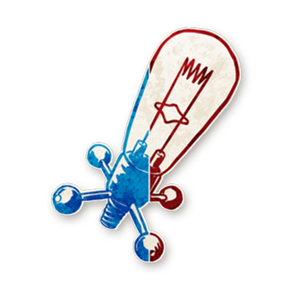
    Cacklejack
  </a>

  <a href="voyageurs/gangster.md" style="text-decoration:none; width:280px; text-align:center;">
    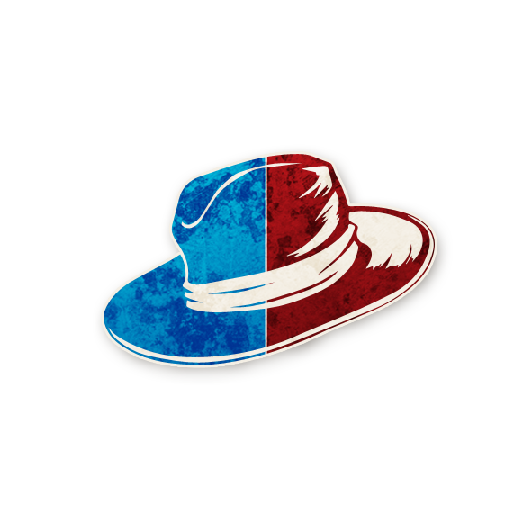
    Gangster
  </a>

  <a href="voyageurs/gnome.md" style="text-decoration:none; width:280px; text-align:center;">
    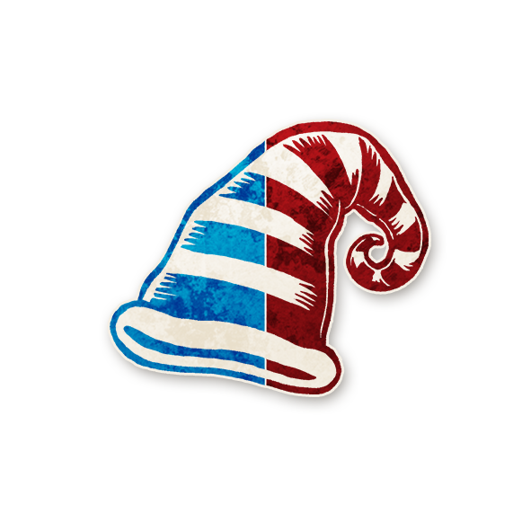
    Gnome
  </a>

<!-- Liens bas de page -->
<ul style="color:#e0c99d; font-size:18px; line-height:1.7; text-align:left; margin-top:6px;">
  <li>🏠 <a href="./index.html" style="color:#e0b97a; font-weight:bold; text-decoration:none;">Retour à la page d’accueil</a></li>
  <li>🍺 <a href="./trouble_brewing.html" style="color:#e0b97a; font-weight:bold; text-decoration:none;">Trouble Brewing</a></li>
  <li>🌛 <a href="./bmr.html" style="color:#e0b97a; font-weight:bold; text-decoration:none;">Bad Moon Rising</a></li>
  <li>💐 <a href="./sv.html" style="color:#e0b97a; font-weight:bold; text-decoration:none;">Sects &amp; Violets</a></li>
</ul>
