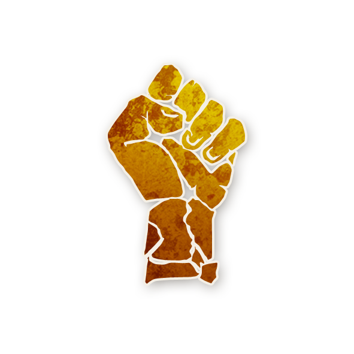
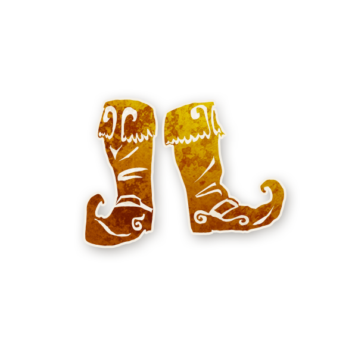
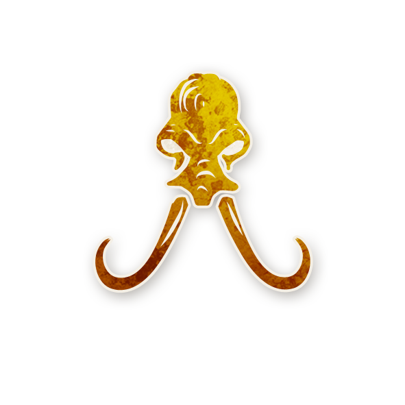

  

# 🌟 Les Légendaires

  Rôles spéciaux pour Conteurs et Conteuses — ils ajustent la partie pour l’équilibre, l’inclusivité et le fun.

---

## 📚 Sommaire

1. [Toute Partie](#-toute-partie)  
2. [Parties Personnalisées](#-parties-personnalisees)  
3. [Expérimentaux](#-experimentaux)

---

## 🎲 Toute Partie

    
  [Doomsayer](./legendaire_roles/doomsayer.html)

    
  [Ange](./legendaire_roles/ange.html)

    
  [Bouddhiste](./legendaire_roles/buddhist.html)

    
  [Bibliothécaire de l’Enfer](./legendaire_roles/hellslibrarian.html)

    
  [Révolutionnaire](./legendaire_roles/revolutionary.html)

    
  [Violoniste](./legendaire_roles/fiddler.html)

    
  [Fabricant de Jouets](./legendaire_roles/toymaker.html)

---

## ⚜️ Parties Personnalisées

    
  [Fibbin](./legendaire_roles/fibbin.html)

    
  [Duchesse](./legendaire_roles/duchess.html)

    
  [Sentinelle](./legendaire_roles/sentinel.html)

    
  [Esprit d’Ivoire](./legendaire_roles/spiritofivory.html)

    
  [Djinn](./legendaire_roles/djinn.html)

---

## 🧪 Expérimentaux

    
  [Deus ex Fiasco](./legendaire_roles/deusexfiasco.html)

    
  [Passeur](./legendaire_roles/ferryman.html)

---

🏠 <a href="/botc-fr-bambi/" style="color:#d4a76a; font-weight:bold; text-decoration:none;">Retour à l’accueil</a>

