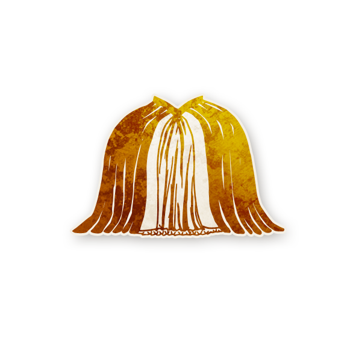

  

<!-- 👑 Duchesse -->

  <a href="./duchesse.md" style="text-decoration:none;">
    
     
    Duchesse
  </a>

---

## 🧭 Informations
- **Type :** <a href="../legendaire.md" style="color:#e0b97a; font-weight:bold; text-decoration:none;">Légendaire</a>  
- **Artiste :** Caitlin Murphy  

« Nous recevons entre six et sept précises.  
Le thé est servi à six heures quinze.  
Les scones à six heures quarante-cinq.  
Ne soyez pas en retard. Tenue de rigueur, comme toujours. »

---

## 📖 Résumé

**« Chaque jour, trois joueurs peuvent choisir de vous rendre visite. La nuit*, chaque visiteur apprend combien de visiteurs sont maléfiques, mais l’un d’entre eux reçoit une fausse information. »**

Ajoutez la <strong>Duchesse</strong> si votre script contient trop peu d’informations ou trop d’informations trompeuses.  
Elle introduit un flux d’informations régulier pour équilibrer les parties où les capacités ne révèlent pas assez.  

Chaque joueur qui rend visite à la <strong>Duchesse</strong> apprend combien de visiteurs sont maléfiques, en comptant sa propre personne.  
Cependant, l’un des trois visiteurs — choisi par le <strong>Conteur</strong> — reçoit une information fausse.  
Les visiteurs conservent leur propre capacité et peuvent l’utiliser normalement.

---

## ⚙️ Comment Conter

<ul style="color:#f5f5f5; font-size:18px; line-height:1.8; margin-left:24px;">
  <li>Au début de la partie, annoncez que la <strong>Duchesse</strong> est en jeu et ajoutez son jeton et ses rappels au grimoire.</li>
  <li>Chaque jour, n’importe quel joueur peut se porter volontaire pour lui rendre visite la nuit suivante.</li>
  <li>Si exactement trois joueurs se portent volontaires, marquez deux d’entre eux avec le rappel <strong>VISITEUR</strong>  
  et un avec le rappel <strong>FAUSSE INFO</strong>.</li>
  <li>S’il y a plus ou moins de trois volontaires, la <strong>Duchesse</strong> n’agit pas cette nuit-là.</li>
  <li>Durant la nuit, réveillez chaque joueur marqué <strong>VISITEUR</strong> ou <strong>FAUSSE INFO</strong> séparément.  
  Montrez-leur le jeton de la <strong>Duchesse</strong>, puis indiquez avec vos doigts (0, 1, 2 ou 3) combien de visiteurs sont maléfiques.  
  Si le joueur est marqué <strong>FAUSSE INFO</strong>, montrez-lui un nombre incorrect.</li>
  <li>Vous pouvez retirer la <strong>Duchesse</strong> du jeu à tout moment, en l’annonçant publiquement.</li>
</ul>

---

## 🧾 Exemples

<ul style="color:#f5f5f5; font-size:18px; line-height:1.8; margin-left:24px;">
  <li>Le <a href="../tb_roles/soldat.md" style="color:#4ea3ff; font-weight:bold; text-decoration:none;">Soldat</a>, le <a href="../bmr_roles/pacifiste.md" style="color:#4ea3ff; font-weight:bold; text-decoration:none;">Pacifiste</a> et le <a href="../sv_roles/savant.md" style="color:#4ea3ff; font-weight:bold; text-decoration:none;">Savant</a> rendent visite à la <strong>Duchesse</strong>.  
  Le <a href="../tb_roles/soldat.md" style="color:#4ea3ff; font-weight:bold; text-decoration:none;">Soldat</a> et le <a href="../bmr_roles/pacifiste.md" style="color:#4ea3ff; font-weight:bold; text-decoration:none;">Pacifiste</a> apprennent « 0 », tandis que le <a href="../sv_roles/savant.md" style="color:#4ea3ff; font-weight:bold; text-decoration:none;">Savant</a> apprend « 1 ».</li>

  <li>Le <a href="../sv_roles/mutant.md" style="color:#4ea3ff; font-weight:bold; text-decoration:none;">Mutant</a>, le <a href="../tb_roles/majordome.md" style="color:#4ea3ff; font-weight:bold; text-decoration:none;">Majordome</a> et le <a href="../bmr_roles/po.md" style="color:#d45b5b; font-weight:bold; text-decoration:none;">Po</a> rendent visite à la <strong>Duchesse</strong>.  
  Le <a href="../sv_roles/mutant.md" style="color:#4ea3ff; font-weight:bold; text-decoration:none;">Mutant</a> apprend « 1 », le <a href="../tb_roles/majordome.md" style="color:#4ea3ff; font-weight:bold; text-decoration:none;">Majordome</a> « 2 » et le <a href="../bmr_roles/po.md" style="color:#d45b5b; font-weight:bold; text-decoration:none;">Po</a> « 1 ».</li>

  <li>Le <a href="../bmr_roles/cerveau.md" style="color:#d45b5b; font-weight:bold; text-decoration:none;">Cerveau</a>, l’<a href="../tb_roles/imp.md" style="color:#d45b5b; font-weight:bold; text-decoration:none;">Imp</a> et le <a href="../bmr_roles/menestrel.md" style="color:#4ea3ff; font-weight:bold; text-decoration:none;">Ménestrel</a> rendent visite à la <strong>Duchesse</strong>.  
  Le <a href="../bmr_roles/cerveau.md" style="color:#d45b5b; font-weight:bold; text-decoration:none;">Cerveau</a> apprend « 2 », l’<a href="../tb_roles/imp.md" style="color:#d45b5b; font-weight:bold; text-decoration:none;">Imp</a> « 1 » et le <a href="../bmr_roles/menestrel.md" style="color:#4ea3ff; font-weight:bold; text-decoration:none;">Ménestrel</a> « 2 ».</li>
</ul>

---

## 💬 Explication

La <strong>Duchesse</strong> est particulièrement utile lorsque votre script contient peu de rôles informatifs.  
Elle offre une source d’information régulière sans perturber les capacités principales des autres rôles.  

C’est aux joueurs de s’organiser entre eux pour décider qui seront les trois visiteurs.  
S’ils n’arrivent pas à se mettre d’accord, la <strong>Duchesse</strong> n’agit pas cette nuit-là.  

Chaque visiteur apprend combien de visiteurs sont maléfiques, mais l’un d’entre eux reçoit forcément une information erronée,  
au choix du <strong>Conteur</strong>.  

Les joueurs conservent leurs capacités habituelles : la <strong>Duchesse</strong> ne rend pas leurs pouvoirs faux,  
elle ajoute simplement une couche d’incertitude à la partie.

---

🏠 <a href="/botc-fr-bambi/" style="color:#f5f5f5; font-weight:bold; text-decoration:none;">Retour à l’accueil</a> 
🌟 <a href="../legendaire.md" style="color:#e0b97a; font-weight:bold; text-decoration:none;">Retour aux Légendaires</a>

