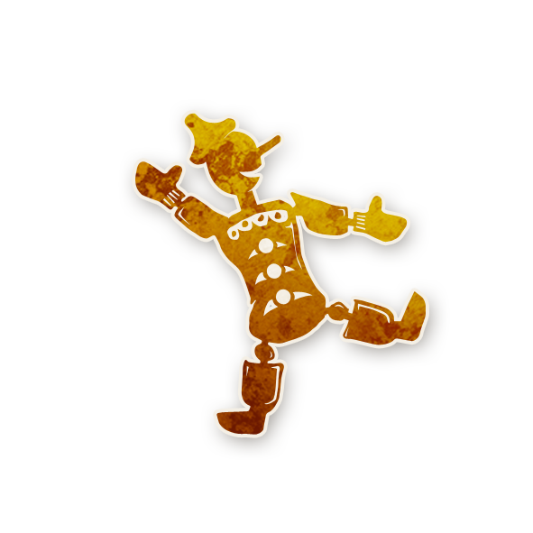

  

<!-- 🧸 Fabricant de Jouets -->

  
   
  Fabricant de Jouets

---

## 🧭 Informations
- **Type :** <a href="../legendaire.md" style="color:#d4a76a; font-weight:bold; text-decoration:none;">Légendaire</a>  
- **Artiste :** Aidan Roberts  

« Il vrombit ! Il descend les escaliers ! Il te réchauffe la nuit ! Il a le goût du sucre ! Les enfants l’adorent !  
Voici le tout nouveau... <strong>robot-bourdonnant-marcheur-chaleur-o-truc-machin</strong> !  
Amusement garanti pour tous les âges ! »

---

## 📖 Résumé

**« Le Démon peut choisir de ne pas attaquer, et doit le faire au moins une fois par partie. Les joueurs maléfiques reçoivent les informations de départ habituelles. »**

Le <strong>Fabricant de Jouets</strong> rend les petites parties plus longues et équilibrées.  
Il oblige le Démon à s’abstenir d’attaquer une nuit au cours de la partie, tout en lui donnant les informations normales de début de jeu.  
Ce rôle est particulièrement adapté aux scripts de type <strong>Teensyville</strong> (5 ou 6 joueurs).

---

## ⚙️ Comment Conter

<ul style="color:#f5f5f5; font-size:18px; line-height:1.8; margin-left:24px;">
  <li>Au début de la partie, annoncez que le <strong>Fabricant de Jouets</strong> est en jeu et ajoutez son jeton au grimoire.</li>
  <li>Marquez le Démon avec le rappel <strong>DERNIÈRE NUIT : PAS D’ATTAQUE</strong>.</li>
  <li>Lors de la première nuit, résolvez les étapes « informations des Sbires » et « informations du Démon »  
  même s’il y a moins de sept joueurs.</li>
  <li>Chaque nuit où le Démon se réveille, il peut choisir de ne pas attaquer en secouant la tête.</li>
  <li>Une fois qu’il l’a fait, retirez le rappel <strong>DERNIÈRE NUIT : PAS D’ATTAQUE</strong>.</li>
  <li>Si une nuit, le Démon allait se réveiller pour tuer et que cela mettrait fin à la partie,  
  mais qu’il n’a pas encore choisi de ne pas attaquer, il est automatiquement contraint de ne tuer personne cette nuit-là.</li>
</ul>

---

## 🧾 Exemples

<ul style="color:#f5f5f5; font-size:18px; line-height:1.8; margin-left:24px;">
  <li>Lors de la deuxième nuit, alors que cinq joueurs sont encore en vie, l’Imp choisit de ne pas attaquer.  
  Ainsi, il pourra agir la nuit suivante.  
  À la troisième nuit, il tue un joueur.</li>

  <li>Lors de la deuxième nuit, l’Imp tue un joueur.  
  À la troisième nuit, alors qu’il ne reste que trois joueurs vivants, il ne peut pas attaquer car c’est la <strong>dernière nuit</strong>.</li>
</ul>

---

## 💬 Explication

Le <strong>Fabricant de Jouets</strong> est idéal pour les petites parties, notamment dans les scripts <strong>Teensyville</strong>,  
où la liste de rôles contient seulement 6 Villageois, 2 Étrangers, 2 Sbires et 2 Démons.  

Avec ce rôle en jeu, le Démon reçoit au début de la partie :
<ul style="margin-left:24px;">
  <li>les noms de trois rôles <strong>absents</strong> du script,</li>
  <li>et, comme d’habitude, les identités des Sbires.</li>
</ul>

Une fois par partie, le Démon doit choisir de ne tuer personne.  
Si ce choix n’a pas encore été fait et que son attaque mettrait fin à la partie, il est automatiquement empêché d’agir.  

Le <strong>Fabricant de Jouets</strong> n’est pas indispensable dans une partie de <a href="../tb.md" style="color:#d4a76a; text-decoration:none;">Trouble Brewing</a>,  
mais il apporte un équilibre utile aux parties très courtes de 5 ou 6 joueurs.

---

🏠 <a href="/botc-fr-bambi/" style="color:#f5f5f5; font-weight:bold; text-decoration:none;">Retour à l’accueil</a> 
🌟 <a href="../legendaire.md" style="color:#d4a76a; font-weight:bold; text-decoration:none;">Retour aux Légendaires</a>

