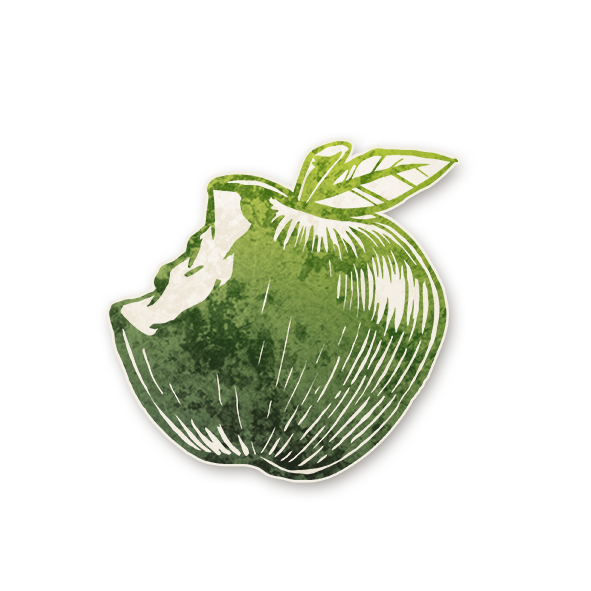

  

<!--  Logo centré cliquable -->

  <a href="./loric.html" style="text-decoration:none;">
    
     
    Loric
  </a>

#  Lorics

  « Des règles qui bousculent le village et réécrivent la partie. »

<!-- LISTE DES SECTIONS / LORICS À DROITE (PC) / EN BLOC (MOBILE) -->

  

    Lorics
  

  <ul style="list-style:none; padding-left:0; margin-top:0; margin-bottom:10px;">
    <li><a href="#presentation" style="color:#f5f5f5; text-decoration:none;">Présentation</a></li>
    <li><a href="#comment-conter" style="color:#f5f5f5; text-decoration:none;">Comment conter</a></li>
    <li><a href="#lorics" style="color:#f5f5f5; text-decoration:none;">Lorics</a></li>
  </ul>

  

    Lorics
  

  <ul style="list-style:none; padding-left:0; margin-top:0; margin-bottom:0;">
    <li><a href="./loric_roles/stormcatcher.html" style="color:#7fd1ae; text-decoration:none;">Attrape-tempête</a></li>
    <li><a href="./loric_roles/bootlegger.html" style="color:#7fd1ae; text-decoration:none;">Contrebandier</a></li>
    <li><a href="./loric_roles/bigwig.html" style="color:#7fd1ae; text-decoration:none;">Gros Bonnet</a></li>
    <li><a href="./loric_roles/hindu.html" style="color:#7fd1ae; text-decoration:none;">Hindou</a></li>
    <li><a href="./loric_roles/gardener.html" style="color:#7fd1ae; text-decoration:none;">Jardinier</a></li>
    <li><a href="./loric_roles/pope.html" style="color:#7fd1ae; text-decoration:none;">Pape</a></li>
    <li><a href="./loric_roles/tor.html" style="color:#7fd1ae; text-decoration:none;">Tor</a></li>
    <li><a href="./loric_roles/zenomancer.html" style="color:#7fd1ae; text-decoration:none;">Zénomancien</a></li>
  </ul>

---

##  Sommaire

  <a href="#presentation" style="color:#f5f5f5; font-weight:bold; text-decoration:none;"> Présentation</a> 
  <a href="#comment-conter" style="color:#f5f5f5; font-weight:bold; text-decoration:none;"> Comment Conter</a> 
  <a href="#lorics" style="color:#f5f5f5; font-weight:bold; text-decoration:none;"> Lorics</a>

---

##  Présentation

  Les <strong>Lorics</strong> sont des rôles conçus pour les conteurs et conteuses.  
  Ils ressemblent davantage à des <strong>règles spéciales</strong> qu’à des rôles classiques :  
  ils sont immortels, ne participent pas comme des joueurs et modifient le déroulement même du jeu.

  Alors que les <em>Légendaires</em> servent surtout à <strong>résoudre des situations problématiques</strong>,  
  les <strong>Lorics</strong> sont là pour <strong>créer de nouveaux enjeux</strong>, surprendre le village  
  et renouveler l’intérêt comme l’intensité de la partie.

---

##  Comment Conter

  Utilisez les Lorics quand vous le souhaitez.  
  Si vous avez joué un script particulier de nombreuses fois  
  ou si vous voulez simplement changer de rythme,  
  ajouter un <strong>Loric</strong> donne au jeu une sensation de nouveauté et de différence.

  Pour inclure un <strong>Loric</strong> dans votre partie, choisissez-en un,  
  annoncez au groupe quel Loric est en jeu,  
  puis placez son jeton au centre du côté gauche du <strong>Grimoire</strong>  
  afin de vous rappeler de son effet pendant toute la partie.

  Tous les Lorics doivent être ajoutés <strong>au début</strong> de la partie.  
  En ajouter plusieurs est possible, mais se fait à vos risques et périls :  
  plus il y en a, plus la partie peut devenir chaotique à gérer.

  <strong>Les Lorics ne peuvent ni mourir ni perdre leurs pouvoirs.</strong>  
  Vous êtes conteur ou conteuse, pas joueur ou joueuse :  
  vos Lorics sont donc immunisés contre tous les effets du jeu, y compris la mort, l’ivresse et l’empoisonnement.

  Comme les <strong>Voyageurs</strong> et les <strong>Légendaires</strong>,  
  ils ne comptent jamais dans la condition de victoire  
  « il ne reste que deux joueurs en vie » de l’équipe maléfique.

---

##  Lorics

<!-- Cartes : grille responsive, plusieurs cartes par ligne -->

  <!-- Storm Catcher -->
  <a href="./loric_roles/stormcatcher.html" style="text-decoration:none; flex:0 1 200px; text-align:center;">
    
    Attrape-tempête
  </a>

  <!-- Bootlegger -->
  <a href="./loric_roles/bootlegger.html" style="text-decoration:none; flex:0 1 200px; text-align:center;">
    
    Contrebandier
  </a>

  <!-- Big Wig -->
  <a href="./loric_roles/bigwig.html" style="text-decoration:none; flex:0 1 200px; text-align:center;">
    
    Gros Bonnet
  </a>

  <!-- Hindu -->
  <a href="./loric_roles/hindu.html" style="text-decoration:none; flex:0 1 200px; text-align:center;">
    
    Hindou
  </a>

  <!-- Gardener -->
  <a href="./loric_roles/gardener.html" style="text-decoration:none; flex:0 1 200px; text-align:center;">
    
    Jardinier
  </a>

  <!-- Pope -->
  <a href="./loric_roles/pope.html" style="text-decoration:none; flex:0 1 200px; text-align:center;">
    
    Pape
  </a>

  <!-- Tor -->
  <a href="./loric_roles/tor.html" style="text-decoration:none; flex:0 1 200px; text-align:center;">
    
    Tor
  </a>

  <!-- Zenomancer  -->
  <a href="./loric_roles/zenomancer.html" style="text-decoration:none; flex:0 1 200px; text-align:center;">
    
    Zénomancien
  </a>

---

<ul style="color:#e0c99d; font-size:18px; line-height:1.7; text-align:left; margin-top:10px;">
  <li> <a href="/botc-fr-bambi/" style="color:#f5f5f5; font-weight:bold; text-decoration:none;">Retour à l’accueil</a></li>
  <li> <a href="./loric.html" style="color:#7fd1ae; font-weight:bold; text-decoration:none;">Lorics</a></li>
</ul>
