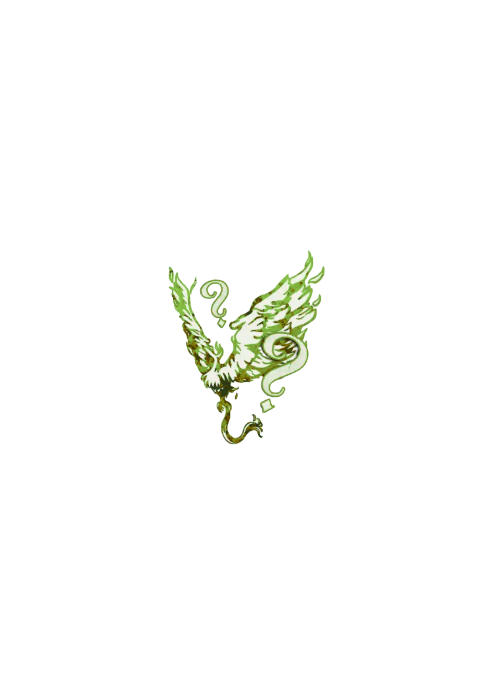

  

<!-- 🌿 Logo centré cliquable -->

  <a href="./loric_roles.html" style="text-decoration:none;">
    
     
    Lorics
  </a>

# 🌿 Lorics

  « Des règles qui bousculent le village et réécrivent la partie. »

---

## 📑 Sommaire

1. [Présentation](#1-présentation)  
2. [Lorics](#2-lorics)  
3. [Navigation](#3-navigation)  

---

## 1. Présentation

Les <strong>Lorics</strong> sont des rôles expérimentaux qui modifient la structure même du jeu&nbsp;: parole, votes, informations, rythme...  
Ils s’adressent à des conteuses et conteurs expérimentés, et créent des parties uniques, surprenantes et parfois chaotiques.  
Là où les <em>Fabled</em> corrigent les problèmes, <strong>les Lorics</strong> en créent de nouveaux pour stimuler la créativité du village.

---

## 2. Lorics 

  <a href="./loric_roles/bigwig.md" style="text-decoration:none;">
    
     
    Big Wig
  </a>
  

    La personne nommée choisit quelqu’un pour parler à sa place jusqu’au vote.  
    Si la défense n’est pas à la hauteur, le défenseur risque sa vie.
  

  <a href="./loric_roles/tor.md" style="text-decoration:none;">
    
     
    Tor
  </a>
  

    Personne ne connaît son rôle ni son alignement.  
    On les apprend uniquement à sa mort.  
    Le chaos méthodique du Grimoire s’abat sur le village.
  

---

## 3. Navigation

<ul style="color:#e0c99d; font-size:18px; line-height:1.7;">
  <li>🏠 <a href="./index.html" style="color:#d4a76a; font-weight:bold; text-decoration:none;">Retour à l’accueil</a></li>
  <li>🧳 <a href="./voyageurs.md" style="color:#d4a76a; font-weight:bold; text-decoration:none;">Voyageurs</a></li>
  <li>🧪 <a href="./roles_experimentaux.md" style="color:#d4a76a; font-weight:bold; text-decoration:none;">Rôles expérimentaux</a></li>
</ul>

