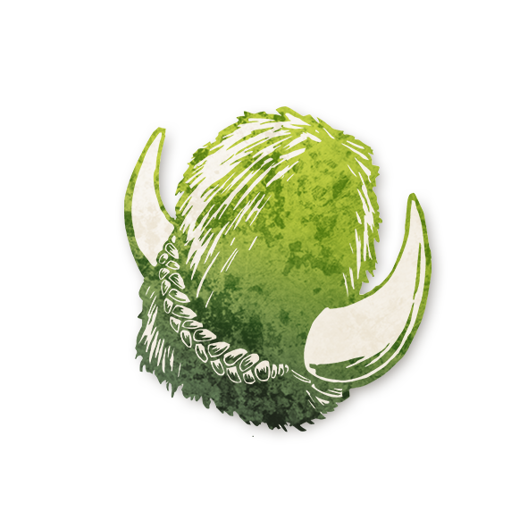

  

<!-- God of Ug -->

  <a href="./godofug.html" style="text-decoration:none;">
    
     
    Dieu d’Ug
  </a>

# Dieu d’Ug

« Bénis soient mes enfants, car ils voient la beauté dans les choses simples. »

---

##  Informations

<ul style="color:#f5f5f5; font-size:18px; line-height:1.7; margin-left:40px;">
  <li><strong>Type :</strong> <a href="../loric.html" style="color:#7fd1ae; font-weight:bold; text-decoration:none;">Loric</a></li>
  <li><strong>Artiste :</strong> Chloe McDougall</li>
  <li><strong>Révélé :</strong> 19 mars 2026</li>
  <li><strong>Nom original :</strong>
    <a href="https://wiki.bloodontheclocktower.com/God_of_Ug"
       target="_blank"
       rel="noopener noreferrer"
       style="color:#7fd1ae; font-weight:bold; text-decoration:none;">
      God of Ug
    </a>
  </li>
</ul>

---

## Résumé

<strong>« Un chapeau Ug. Quand on porte le chapeau Ug, il faut prononcer un son à la fois et voter deux fois. En cas d’échec, on passe le chapeau Ug. »</strong>

Le Dieu d’Ug oblige les joueurs à ne parler qu’avec des mots d’une seule syllabe.

<ul style="color:#f5f5f5; font-size:18px; line-height:1.7; margin-left:40px;">

  <li>Quand le joueur portant le chapeau Ug vote, son vote compte comme deux votes. Utilisez un vrai chapeau si vous le pouvez.</li>

  <li>Tout mot d’une seule syllabe compte. Les astuces avec des mots comportant des tirets ne comptent pas. Dire un seul mot à plusieurs syllabes suffit à perdre le chapeau Ug.</li>

  <li>Le Conteur choisit qui porte le chapeau Ug en premier. Si un joueur dit un mot à plusieurs syllabes, ou met trop de temps à parler, ou ne s’amuse pas, ou porte le chapeau depuis trop longtemps, le Conteur choisit un nouveau joueur pour porter le chapeau.</li>

  <li>N’importe quel joueur peut porter le chapeau Ug. Il peut refuser s’il le souhaite. Un joueur peut porter le chapeau Ug plusieurs fois.</li>

  <li>Si le Conteur n’est pas présent, le système d’honneur est utilisé. Tout joueur qui surprend le porteur du chapeau Ug à dire un mot à plusieurs syllabes peut le signaler, et le chapeau est retiré.</li>

  <li>Le Conteur peut choisir un nouveau joueur chaque jour pour commencer avec le chapeau Ug, ou garder le même joueur que la veille.</li>

</ul>

---

##  Comment Conter

Au début de la partie, donnez le chapeau Ug à n’importe quel joueur. Si vous ou un autre joueur surprenez ce joueur à dire un mot à plusieurs syllabes, donnez le chapeau Ug à un autre joueur.

Si le joueur portant le chapeau Ug vote, cela compte comme deux votes.

Règle optionnelle : si le chapeau Ug devient moins amusant, limitez-le uniquement à la phase de nomination.

---

##  Exemples

Amy porte le chapeau Ug. Lorsqu’elle est nommée, elle dit :  
« Pas moi. Je crois Ben a parlé avec son bouh. Il est bouh. »  
Amy garde le chapeau Ug.

Lewis porte le chapeau Ug. Lors d’une discussion privée avec Julien et Alex, Lewis dit :  
« Je sais que tous les deux bons. Je suis le truc noir qui peut voir un truc quand je meurs. Je veux que le Démon me tue pour que je vois ce truc et sait des trucs à vous dit le jour ap. »  
Le Conteur donne le chapeau Ug à Abdallah, car « Démon » est un mot à plusieurs syllabes.

---

   <a href="/botc-fr-bambi/" style="color:#f5f5f5; font-weight:bold; text-decoration:none;">Retour à l’accueil</a> 
   <a href="../loric.html" style="color:#7fd1ae; font-weight:bold; text-decoration:none;">Retour aux rôles Loric</a>

