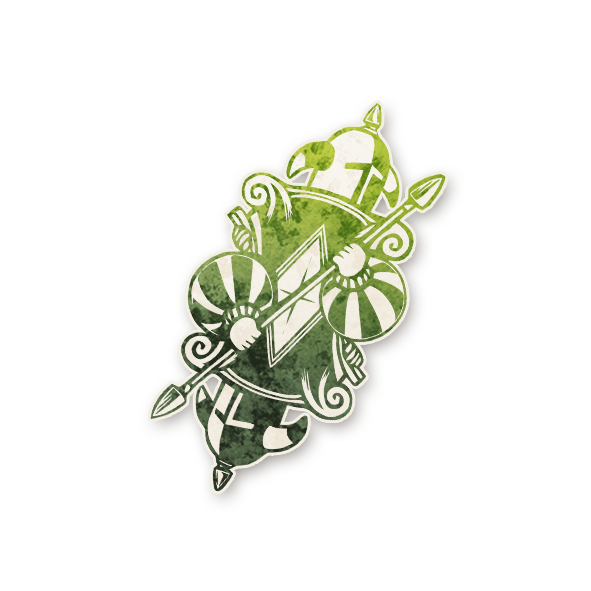

  

<!-- Knaves -->

  <a href="./knaves.html" style="text-decoration:none;">
    
     
    Knaves
  </a>

# Knaves

« Chaque mur est une porte. Chaque repas est un festin. »

---

##  Informations

<ul style="color:#f5f5f5; font-size:18px; line-height:1.7; margin-left:40px;">
  <li><strong>Type :</strong> <a href="../loric.html" style="color:#7fd1ae; font-weight:bold; text-decoration:none;">Loric</a></li>
  <li><strong>Artiste :</strong> Chloe McDougall</li>
  <li><strong>Révélé :</strong> 19 mars 2026</li>
  <li><strong>Nom original :</strong>
    <a href="https://wiki.bloodontheclocktower.com/Knaves"
       target="_blank"
       rel="noopener noreferrer"
       style="color:#7fd1ae; font-weight:bold; text-decoration:none;">
      Knaves
    </a>
  </li>
</ul>

---

## Résumé

<strong>« Il y a 2 Conteurs : l’un ment et l’autre dit la vérité. Une fois par partie, au crépuscule, ils peuvent échanger. »</strong>

Les <strong>Knaves</strong> introduisent deux Conteurs.

<ul style="color:#f5f5f5; font-size:18px; line-height:1.7; margin-left:40px;">

  <li>Quand les Knaves sont en jeu, il y a deux Conteurs. Quand les joueurs reçoivent des informations via leurs capacités, un Conteur donne des informations vraies, et l’autre donne des informations fausses.</li>

  <li>Les joueurs ne savent pas quel Conteur est lequel. Chaque joueur choisit quel Conteur lui donne son information à chaque interaction.</li>

  <li>Les Conteurs disent toujours la vérité concernant les règles du jeu et les informations hors capacités de rôle, comme les nominations, les bluffs du Démon, les informations des Sbires, etc.</li>

  <li>Si un joueur est ivre ou empoisonné, un Conteur peut dire la vérité ou mentir.</li>

  <li>Une fois par partie, généralement lorsque les joueurs du Bien commencent à comprendre qui est quel Conteur, le Conteur qui disait la vérité peut devenir celui qui ment, et inversement.</li>

</ul>

---

##  Comment Conter

<ul style="color:#f5f5f5; font-size:18px; line-height:1.7; margin-left:40px;">

  <li>Il y a deux Conteurs. Avant la première nuit, décidez lequel dira la vérité et lequel mentira.</li>

  <li>Chaque nuit, lorsqu’un joueur se réveille pour recevoir une information grâce à sa capacité, ou lorsqu’un joueur consulte un Conteur pendant la journée, demandez-lui de choisir quel Conteur lui donnera son information.</li>

  <li>Une fois par partie, au crépuscule, si les deux Conteurs sont d’accord, le Conteur qui disait la vérité devient celui qui ment, et celui qui ment devient celui qui dit la vérité.</li>

</ul>

---

##  Exemples

Il y a deux Conteurs, Ben et Lachlan. Le Chef se réveille et choisit Lachlan, qui est le Conteur menteur. Le Chef apprend « 3 », alors qu’il n’y a que 2 paires de joueurs maléfiques.

Plus tard dans la partie, les Conteurs échangent leurs rôles. Le Savant consulte Ben et Lachlan et choisit Lachlan. Le Savant reçoit alors 2 informations vraies.

---

   <a href="/botc-fr-bambi/" style="color:#f5f5f5; font-weight:bold; text-decoration:none;">Retour à l’accueil</a> 
   <a href="../loric.html" style="color:#7fd1ae; font-weight:bold; text-decoration:none;">Retour aux rôles Loric</a>

