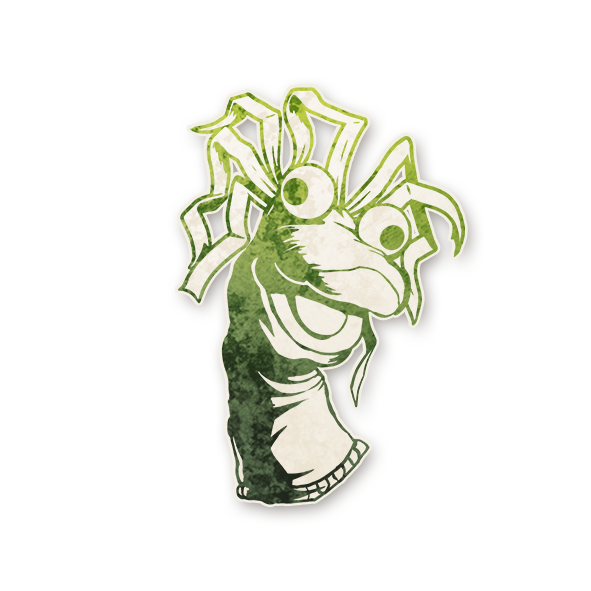

  

<!-- Ventriloquist -->

  <a href="./ventriloque.html" style="text-decoration:none;">
    
     
    Ventriloque
  </a>

# Ventriloque

  « Eh bien, les amis, approchez ! Voici mon copain Charlie : 
  il a une langue qui ferait rougir un mulet… mais ne vous inquiétez pas, c’est moi qui parle… enfin, je crois ? »

---

##  Informations

<ul style="color:#f5f5f5; font-size:18px; line-height:1.7; margin-left:40px;">
  <li><strong>Type :</strong> <a href="../loric.html" style="color:#7fd1ae; font-weight:bold; text-decoration:none;">Loric</a></li>
  <li><strong>Artiste :</strong> <em>Lachlan Bastiaen</em></li>
  <li><strong>Révélé :</strong> 12 février 2026</li>
  <li><strong>Nom original :</strong>
    <a href="https://wiki.bloodontheclocktower.com/Ventriloquist"
       target="_blank"
       rel="noopener noreferrer"
       style="color:#7fd1ae; font-weight:bold; text-decoration:none;">
      Ventriloquist
    </a>
  </li>
</ul>

---

## Résumé

<strong>Si un joueur est <em>Fou</em> d’être un <strong>nouveau rôle</strong> pendant sa nomination, il pourrait ne pas mourir s’il est exécuté aujourd’hui.</strong>

Le <strong>Ventriloque</strong> récompense les joueurs qui mentent sur qui ils sont.

<ul style="color:#f5f5f5; font-size:18px; line-height:1.7; margin-left:40px;">
  <li>
    Être <em>Fou d’être un nouveau rôle</em> signifie : <strong>revendiquer un rôle différent</strong> d’un rôle que vous avez déjà revendiqué auparavant.
  </li>
  <li>
    Un joueur ne bénéficie du Ventriloque <strong>que s’il est Fou d’être un nouveau rôle au moment où il est nommé</strong>.
  </li>
  <li>
    Peu importe son rôle réel : un joueur peut être Fou d’un rôle inventé puis plus tard de son rôle réel, ou l’inverse, ou encore de deux rôles inventés différents.
  </li>
  <li>
    Si le joueur <strong>ne meurt pas</strong>, il l’apprend <strong>après</strong> l’exécution. Il ne sait pas si c’était grâce au Ventriloque ou non.
  </li>
  <li>
    Le Conteur décide si le joueur est réellement <em>Fou</em> ou non, et peut le laisser mourir même si le joueur a essayé d’être convaincant.
  </li>
  <li>
    Cela peut protéger le Démon, mais le Conteur <strong>ne protégera pas</strong> le Démon si cela fait gagner le Mal.
  </li>
  <li>
    Un joueur n’est protégé de la mort <strong>que le jour même</strong> où il a été Fou d’être un nouveau rôle.
  </li>
</ul>

---

##  Comment Conter

Quand un joueur est nommé, avant la fin du vote, s’il est <em>Fou</em> d’être un rôle <strong>différent</strong> d’un rôle qu’il a déjà revendiqué auparavant
(même si l’un des deux est son vrai rôle), et que ce joueur est sur le point de mourir,
marquez-le avec le rappel <strong>FOU</strong>.

Si une exécution a lieu, et que la personne exécutée est marquée <strong>FOU</strong> à cause du Ventriloque,
annoncez qu’elle est exécutée, puis vous <strong>pouvez</strong> annoncer qu’elle <strong>ne meurt pas</strong>.

---

##  Exemples

<strong>Abdallah</strong> est le
<a href="../bmr_roles/parieur.html" style="color:#4ea3ff; font-weight:bold; text-decoration:none;">Parieur</a>. 
Au jour 1, il est Fou d’être le Parieur. Lorsqu’il est nommé, il est Fou d’être le
<a href="../roles_experimentaux/hatter.html" style="color:#4ea3ff; font-weight:bold; text-decoration:none;">Chapelier</a>. 
Plus tard ce jour-là, Abdallah est exécuté et <strong>ne meurt pas</strong>.

<strong>Marianna</strong> est le
<a href="../bmr_roles/professor.html" style="color:#4ea3ff; font-weight:bold; text-decoration:none;">Professeur</a>. 
Elle prétend être l’<a href="../tb_roles/empathique.html" style="color:#4ea3ff; font-weight:bold; text-decoration:none;">Empathe</a>
depuis toute la partie. 
Quand elle est nommée, elle prétend être le
<a href="../roles_experimentaux/huntsman.html" style="color:#4ea3ff; font-weight:bold; text-decoration:none;">Chasseur</a>. 
Quand elle est exécutée, Marianna <strong>ne meurt pas</strong>.

<strong>Julian</strong> est l’
<a href="../roles_experimentaux/hermit.html" style="color:#4ea3ff; font-weight:bold; text-decoration:none;">Ermite</a>. 
Julian reste silencieux pendant 3 jours. Quand il est nommé, il prétend être le
<a href="../roles_experimentaux/knight.html" style="color:#4ea3ff; font-weight:bold; text-decoration:none;">Chevalier</a>
et dit qu’<strong>Evin</strong> et <strong>Alex</strong> ne sont pas le Démon. 
Quand il est exécuté, Julian <strong>meurt</strong>, car il n’était pas vraiment Fou d’être un <strong>nouveau rôle</strong>.

---

  <a href="/botc-fr-bambi/" style="color:#f5f5f5; font-weight:bold; text-decoration:none;">Retour à l’accueil</a> 
  <a href="../loric.html" style="color:#7fd1ae; font-weight:bold; text-decoration:none;">Catégorie : Lorics</a>

