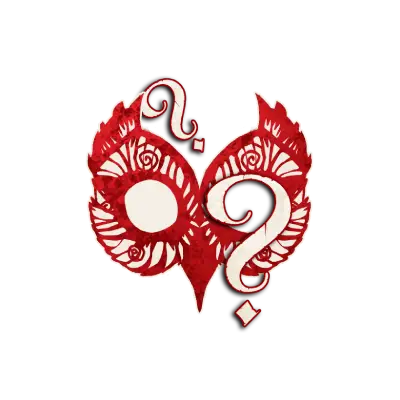

  

# ⚖️ Répartition du Village

Selon le nombre de joueurs et joueuses, la composition des rôles change.
Voici la configuration officielle : 

| Nombre de joueurs et joueuses | Villageois  | Étrangers  | Sbires  | Démons  |
| ----------------------------- | ----------------------------------------------------- | -------------------------------------------------- | ------------------------------------------- | ----------------------------------------- |
| 5                             | 3                                                     | 0                                                  | 1                                           | 1                                         |
| 6                             | 3                                                     | 1                                                  | 1                                           | 1                                         |
| 7                             | 5                                                     | 0                                                  | 1                                           | 1                                         |
| 8                             | 5                                                     | 1                                                  | 1                                           | 1                                         |
| 9                             | 5                                                     | 2                                                  | 1                                           | 1                                         |
| 10                            | 7                                                     | 0                                                  | 2                                           | 1                                         |
| 11                            | 7                                                     | 1                                                  | 2                                           | 1                                         |
| 12                            | 7                                                     | 2                                                  | 2                                           | 1                                         |
| 13                            | 9                                                     | 0                                                  | 3                                           | 1                                         |
| 14                            | 9                                                     | 1                                                  | 3                                           | 1                                         |
| 15                            | 9                                                     | 2                                                  | 3                                           | 1                                         |

---

⬅️ [Retour à l’accueil](README.md)
