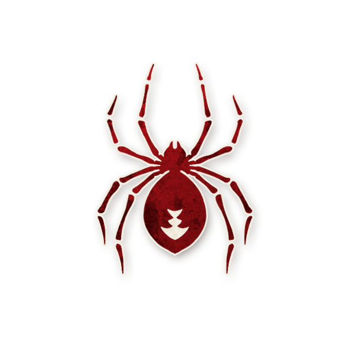
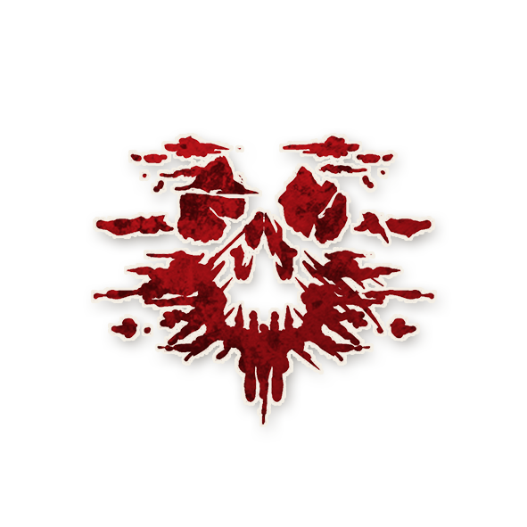

  

<!-- Alchimiste -->

  <a href="./alchemist.html" style="text-decoration:none;">
    
     
    Alchimiste
  </a>

<!-- APPARAÎT DANS -->

  <a href="../experimentaux.html" style="text-decoration:none;">
    
     
    🎠 Apparaît dans : The Carousel Expérimental
  </a>

# ⚗️ Alchimiste

  « Visite l’intérieur de la Terre. Par rectification tu trouveras la pierre cachée.  
  Au-dessus de l’or se trouve le rouge. Kether dans Malkuth. »

---

## ℹ️ Informations

<ul style="color:#f5f5f5; font-size:18px; line-height:1.7; margin-left:40px;">
  <li><strong>Type :</strong> 
    <a href="../villageois.html" style="color:#4ea3ff; font-weight:bold; text-decoration:none;">Villageois</a>
  </li>
  <li><strong>Artiste :</strong> <em>Marianna Carr</em></li>
  <li><strong>Révélé :</strong> 7 octobre 2021</li>
</ul>

---

## 📖 Résumé

<strong>« Vous avez une capacité de Sbire. Quand vous l’utilisez, la conteuse peut vous demander de choisir différemment. »</strong>

L’<strong>Alchimiste</strong> possède la capacité d’un Sbire, tout en restant un Villageois qui joue pour le Bien.

---

## 🧞 Jinxes liés

Les jinxes suivants concernent l’<strong>Alchimiste</strong> et modifient sa capacité lorsqu’il interagit avec certains Sbires.

<ul style="color:#f5f5f5; font-size:18px; line-height:1.7; margin-left:40px;">

  <li> 🧞
    
    <a href="../roles_experimentaux/boffin.html" style="color:#d45b5b; font-weight:bold; text-decoration:none;">Boffin</a> :  
    Si l’Alchimiste a la capacité du Boffin, il n’apprend pas quelle capacité a le Démon. 
  </li>

  <li> 🧞
    
    <a href="../roles_experimentaux/marionnette.html" style="color:#d45b5b; font-weight:bold; text-decoration:none;">Marionnette</a> :  
    Un Alchimiste-Marionnette n’a pas la capacité de la Marionnette et une Marionnette est en jeu.
  </li>

  <li> 🧞
    
    <a href="../bmr_roles/cerveau.html" style="color:#d45b5b; font-weight:bold; text-decoration:none;">Conspirateur</a> :  
    Un Alchimiste-Conspirateur n’a pas la capacité du Conspirateur et aucun Conspirateur n’est en jeu.
  </li>

  <li> 🧞
    
    <a href="../roles_experimentaux/organgrinder.html" style="color:#d45b5b; font-weight:bold; text-decoration:none;">Orgue de Barbarie</a> :  
    Si l’Alchimiste a la capacité de l’Orgue de Barbarie, l’Orgue de Barbarie est en jeu.  
    S’ils sont sobres tous les deux, ils sont tous deux ivres.
  </li>

  <li> 🧞
    
    <a href="../tb_roles/espion.html" style="color:#d45b5b; font-weight:bold; text-decoration:none;">Espion</a> :  
    Un Alchimiste-Espion n’a pas la capacité de l’Espion et un Espion est en jeu.  
    Après chaque exécution, si l’Alchimiste-Espion est vivant, il peut désigner publiquement un joueur vivant comme étant l’Espion.  
    Si c’est correct, le Démon doit choisir l’Espion cette nuit.
  </li>

  <li> 🧞
    
    <a href="../roles_experimentaux/summoner.html" style="color:#d45b5b; font-weight:bold; text-decoration:none;">Invocateur</a> :  
    L’Alchimiste-Invocateur ne reçoit pas de bluffs et choisit le type de Démon, mais pas le joueur.  
    S’il meurt avant que le Démon ne soit créé, les Maléfiques gagnent. [Pas de Démon]
  </li>

  <li> 🧞
    
    <a href="../roles_experimentaux/widow.html" style="color:#d45b5b; font-weight:bold; text-decoration:none;">Veuve</a> :  
    Un Alchimiste-Veuve n’a pas la capacité de la Veuve et une Veuve est en jeu.  
    Après chaque exécution, si l’Alchimiste-Veuve est vivant, il peut désigner publiquement un joueur vivant comme étant la Veuve.  
    Si c’est correct, le Démon doit choisir la Veuve cette nuit.
  </li>

  <li> 🧞
    
    <a href="../roles_experimentaux/wraith.html" style="color:#d45b5b; font-weight:bold; text-decoration:none;">Spectre</a> :  
    Un Alchimiste-Spectre n’a pas la capacité de Spectre et un Spectre est en jeu.  
    Après chaque exécution, si l’Alchimiste-Spectre est vivant, il peut désigner publiquement un joueur vivant comme étant le Spectre.  
    Si c’est correct, le Démon doit choisir le Spectre cette nuit.
  </li>

</ul>

---

## ⚙️ Détails

<ul style="color:#f5f5f5; font-size:18px; line-height:1.7; margin-left:40px;">
  <li>La capacité de l’Alchimiste est généralement celle d’un Sbire qui n’est pas en jeu, mais elle peut aussi copier un Sbire en jeu.</li>
  <li>L’Alchimiste apprend de quel Sbire il a la capacité lors de la première nuit.</li>
  <li>Il reste un Villageois bon : il gagne avec le Bien et perd avec le Mal.</li>
  <li>Il s’enregistre comme bon et comme Alchimiste, pas comme Sbire.</li>
  <li>Contrairement aux Sbires, l’Alchimiste ne se réveille pas pour apprendre qui sont les autres Sbires ni qui est le Démon.</li>
  <li>Si la capacité de Sbire de l’Alchimiste ajoute ou retire des rôles pendant la mise en place, cela s’applique tout de même lors de la mise en place.</li>
  <li>Si la capacité de Sbire implique de faire un choix, comme l’<a href="../tb_roles/empoisonneur.html" style="color:#d45b5b; font-weight:bold; text-decoration:none;">Empoisonneur</a> ou le <a href="../roles_experimentaux/vizier.html" style="color:#d45b5b; font-weight:bold; text-decoration:none;">Vizir</a>, la conteuse peut demander à l’Alchimiste de choisir différemment. Il doit alors faire un autre choix.</li>
</ul>

---

## 🎭 Comment Conter

Lors de la première nuit, réveillez l’Alchimiste.  
Montrez-lui d’abord le jeton <strong>YOU ARE</strong>, puis le jeton du Sbire dont il aura la capacité.  
Rendormez ensuite l’Alchimiste.

Si l’Alchimiste a la capacité d’un Sbire qui n’est pas en jeu, marquez l’Alchimiste avec le rappel <strong>EST L’ALCHIMISTE</strong>, puis échangez le jeton de l’Alchimiste avec celui de ce Sbire et retournez-le.  
Cela montre qu’il a cette capacité de Sbire tout en restant bon.

L’Alchimiste se réveille aux mêmes moments qu’un Sbire avec cette capacité et agit comme lui.  
Si l’Alchimiste fait un choix avec sa capacité, vous pouvez lui demander de choisir autrement :  
si c’est de jour, dites-le simplement ; si c’est de nuit, secouez la tête, montrez le texte de l’Alchimiste sur la fiche de rôle, et attendez qu’il fasse un nouveau choix.

---

## 🧩 Exemples

<strong>Cédric</strong> est l’Alchimiste et a la capacité du <a href="../tb_roles/baron.html" style="color:#d45b5b; font-weight:bold; text-decoration:none;">Baron</a>.  
Il y a donc deux Étrangers supplémentaires en jeu.

  

<strong>Mélanie</strong> est l’Alchimiste avec la capacité de l’<a href="../tb_roles/empoisonneur.html" style="color:#d45b5b; font-weight:bold; text-decoration:none;">Empoisonneur</a>.  
La première nuit, elle empoisonne le <a href="../roles_experimentaux/wizard.html" style="color:#d45b5b; font-weight:bold; text-decoration:none;">Wizard</a>.  
La nuit suivante, elle empoisonne l’<a href="../roles_experimentaux/alsaahir.html" style="color:#4ea3ff; font-weight:bold; text-decoration:none;">Alsaahir</a>.  
La troisième nuit, elle tente d’empoisonner le <a href="../roles_experimentaux/lord_of_typhon.html" style="color:#d45b5b; font-weight:bold; text-decoration:none;">Seigneur de Typhon</a>,  
mais la conteuse lui demande de choisir différemment.  
Mélanie choisit alors le <a href="../roles_experimentaux/king.html" style="color:#4ea3ff; font-weight:bold; text-decoration:none;">Roi</a> à la place.  
Le <a href="../roles_experimentaux/lord_of_typhon.html" style="color:#d45b5b; font-weight:bold; text-decoration:none;">Seigneur de Typhon</a> n’est pas empoisonné.

---

  🏠 <a href="/botc-fr-bambi/" style="color:#f5f5f5; font-weight:bold; text-decoration:none;">Retour à l’accueil</a> 
  🎠 <a href="../experimentaux.html" style="color:#e0b97a; font-weight:bold; text-decoration:none;">Retour à The Carousel Expérimental</a> 
  👨‍🌾 <a href="../villageois.html" style="color:#4ea3ff; font-weight:bold; text-decoration:none;">Retour aux Villageois</a>

