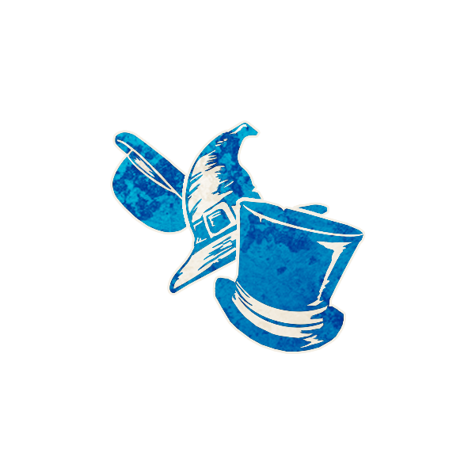

  

<!-- Chapelier -->

  <a href="./hatter.html" style="text-decoration:none;">
    
     
    Chapelier
  </a>

<!-- APPARAÎT DANS -->

  <a href="../experimentaux.html" style="text-decoration:none;">
    
     
    🎠 Apparaît dans : The Carousel Expérimental
  </a>

# 🎩 Chapelier

  « Un chapeau. Deux chapeaux. Trois chapeaux. Chapeau-thé. Chapeau-quatre. Chapeau-vif.  
  Chapeau-six. Chapeau-bâtons. »

---

## 🧾 Informations

<ul style="color:#f5f5f5; font-size:18px; line-height:1.7; margin-left:40px;">
  <li><strong>Type :</strong>
    <a href="../etrangers.html" style="color:#4ea3ff; font-weight:bold; text-decoration:none;">Étranger</a>
  </li>
  <li><strong>Artistes :</strong> <em>Aidan Roberts, Chloe McDougall, Steven Medway</em></li>
  <li><strong>Révélé :</strong> 30 novembre 2023</li>
</ul>

---

## 📖 Résumé

  <strong>« Si vous mourrez aujourd’hui ou cette nuit, les joueurs Sbires et Démon peuvent choisir de nouveaux rôles de Sbires et de Démon. »</strong>

Le <strong>Chapelier</strong> permet aux joueuses et joueurs maléfiques de  
changer leurs rôles de Sbires et de Démon lorsqu’il meurt.

---

## 🧞 Jinxes liés

<ul style="color:#f5f5f5; font-size:18px; line-height:1.7; margin-left:40px;">

  <li>
    🧞
    
    <a href="../roles_experimentaux/legion.html" style="color:#d45b5b; font-weight:bold; text-decoration:none;">Légion</a> :  
    Si une Légion est créée, tous les joueurs maléfiques deviennent Légion.  
    Si une Légion est en jeu, le Chapelier n’a pas de capacité.
  </li>

  <li>
    🧞
    
    <a href="../roles_experimentaux/leviathan.html" style="color:#d45b5b; font-weight:bold; text-decoration:none;">Leviathan</a> :  
    Le Leviathan ne peut pas entrer en jeu après le cinquième jour,  
    même si le Chapelier meurt tardivement.
  </li>

  <li>
    🧞
    
    <a href="../roles_experimentaux/lilmonsta.html" style="color:#d45b5b; font-weight:bold; text-decoration:none;">P’tit Monstre</a> :  
    Si le Chapelier meurt et que le Démon choisit de devenir P’tit Monstre,  
    il choisit également un rôle de Sbire à devenir.
  </li>

  <li>
    🧞
    
    <a href="../roles_experimentaux/summoner.html" style="color:#4ea3ff; font-weight:bold; text-decoration:none;">Invocateur</a> :  
    Si l’Invocateur crée un deuxième Démon vivant la nuit où le Chapelier meurt,  
    les morts de cette nuit-là peuvent être arbitraires.
  </li>

</ul>

---

## ⚙️ Détails

<ul style="color:#f5f5f5; font-size:18px; line-height:1.7; margin-left:40px;">

  <li>Si le Chapelier meurt <strong>pendant la journée</strong> (par exécution, exil, etc.) ou  
      <strong>pendant la nuit</strong>, chaque joueur qui a un rôle de Sbire  
      ou de Démon peut choisir un nouveau rôle du même type.</li>

  <li>Un Sbire doit devenir un autre Sbire,  
      un Démon doit devenir un autre Démon.</li>

  <li>Les joueurs maléfiques peuvent également choisir de <strong>ne pas changer</strong> de rôle.</li>

  <li>Si un joueur devient un nouveau rôle,  
      il gagne immédiatement sa nouvelle capacité,  
      même s’il s’agit d’une capacité « vous commencez en sachant »  
      ou d’un effet « une fois par partie » déjà utilisé  
      sur ce rôle chez un autre joueur auparavant.</li>

  <li>Une fois qu’un joueur a changé de rôle,  
      son ancien rôle n’a plus aucun effet sur la partie.</li>

  <li>Si un joueur meurt puis devient Chapelier (via un autre effet de script),  
      les joueurs maléfiques ne changent pas de rôle cette nuit-là.</li>

  <li>Un même rôle ne peut être choisi que par un seul joueur :  
      si un rôle de Sbire ou de Démon est déjà en jeu ou déjà choisi cette nuit-là,  
      un autre joueur ne peut pas le choisir et doit en sélectionner un autre.</li>

  <li>Une règle optionnelle consiste à autoriser le Démon  
      à devenir Sbire et un Sbire à devenir Démon  
      lorsque le Chapelier meurt, pour un chaos maximal au sein de l’équipe maléfique.</li>

</ul>

---

## 🎭 Comment Conter

Quand le Chapelier meurt (jour ou nuit), marquez son jeton avec le rappel <strong>THÉ CE SOIR (TEA PARTY TONIGHT)</strong>.  
Cette nuit-là, vous allez organiser la « fête du thé » pour les joueuses et joueurs maléfiques.

Pendant la nuit, réveillez d’abord les Sbires puis le Démon (ou dans l’ordre habituel du script) :

<ul style="color:#f5f5f5; font-size:18px; line-height:1.7; margin-left:40px;">

  <li>Montrez-leur le jeton d’information <strong>CE PERSONNAGE VOUS A CHOISI</strong>  
      puis le jeton de rôle <strong>Chapelier</strong>, pour leur signaler  
      qu’ils peuvent choisir un nouveau rôle.</li>

  <li>Pour chaque joueur maléfique, laissez-le soit :
    <ul style="margin-top:4px; margin-left:20px;">
      <li>secouer la tête pour <strong>refuser</strong> tout changement,</li>
      <li>soit pointer un jeton de rôle du même type (Sbire ou Démon) dans le grimoire.</li>
    </ul>
  </li>

  <li>Si un joueur pointe un rôle déjà choisi cette nuit par un autre joueur maléfique,  
      secouez la tête et invitez-le à choisir un autre rôle.</li>

</ul>

Une fois tous les choix effectués, rendormez les joueurs maléfiques,  
retirez le rappel <strong>THÉ CE SOIR</strong>,  
puis changez leurs jetons de rôle dans le grimoire  
pour refléter leurs nouvelles identités.

Si vous utilisez la règle optionnelle qui permet d’échanger les rôles de Sbire et de Démon,  
mettez-vous d’accord à l’avance sur la façon de gérer les réveils  
et les éventuelles confusions silencieuses entre les joueurs maléfiques.

---

## 🧩 Exemples

Le Chapelier meurt.  
L’
<a href="../roles_experimentaux/ojo.html" style="color:#d45b5b; font-weight:bold; text-decoration:none;">Ojo</a>  
choisit de devenir le 
<a href="../sv_roles/no_dashii.html" style="color:#d45b5b; font-weight:bold; text-decoration:none;">No Dashii</a>  
et l’
<a href="../bmr_roles/avocatdudiable.html" style="color:#d45b5b; font-weight:bold; text-decoration:none;">Avocat du Diable</a>  
choisit de devenir la 
<a href="../bmr_roles/scarletwoman.html" style="color:#d45b5b; font-weight:bold; text-decoration:none;">Femme Écarlate</a>.  
Leur ancienne capacité cesse immédiatement d’exister.

Le 
<a href="../sv_roles/vigormortis.html" style="color:#d45b5b; font-weight:bold; text-decoration:none;">Vigormortis</a>  
a déjà tué sa 
<a href="../sv_roles/pithag.html" style="color:#d45b5b; font-weight:bold; text-decoration:none;">Pit-Hag</a>.  
Plus tard, il tue le Chapelier.  
Cette nuit-là, le Vigormortis et la Pit-Hag décident de conserver leurs rôles actuels  
pour ne pas perdre les effets continus du Vigormortis.

L’
<a href="../bmr_roles/assassin.html" style="color:#d45b5b; font-weight:bold; text-decoration:none;">Assassin</a>  
tue une joueuse.  
Le Chapelier est exécuté le même jour.  
Cette nuit-là, l’Assassin choisit de devenir le 
<a href="../bmr_roles/cerveau.html" style="color:#d45b5b; font-weight:bold; text-decoration:none;">Conspirateur</a>  
et le Maître du Jeu secoue d’abord la tête pour rester Maître du Jeu.  
La conteuse secoue la tête à son tour (ce rôle est déjà pris)  
et l’invite à choisir un autre Sbire.  
Il choisit alors de devenir Assassin.  
Le nouveau Maître du Jeu et le nouvel Assassin entrent en jeu avec leurs capacités normales,  
et l’Assassin peut immédiatement utiliser sa nouvelle capacité pour tuer un joueur.

---

## 💡 Astuces et Conseils

<ul style="color:#f5f5f5; font-size:18px; line-height:1.7; margin-left:40px;">

  <li><strong>Ne mourrez pas… si vous pouvez l’éviter.</strong>  
      Dès que vous mourez, l’équipe maléfique peut s’adapter parfaitement au script,  
      en choisissant la combinaison de Sbires et de Démon  
      la plus dangereuse possible contre les rôles en jeu.</li>

  <li>À l’inverse, mourir très tôt peut parfois être bénéfique :  
      plus vous mourrez tôt, moins l’équipe maléfique connaît le paysage global des rôles,  
      et plus il lui est difficile de choisir « la » meilleure combinaison.  
      Vos choix pourront ensuite être confirmés ou infirmés  
      par le comportement des nouveaux rôles maléfiques.</li>

  <li>La pire fenêtre pour mourir est souvent le <strong>milieu de partie</strong> :  
      c’est le moment où le Bien commence à y voir clair,  
      et votre mort peut tout bouleverser en changeant les capacités maléfiques  
      au moment précis où la bonne équipe resserre l’étau.</li>

  <li>Le jour suivant votre mort, annoncez que vous étiez Chapelier.  
      Le groupe doit alors intégrer la possibilité  
      que les rôles maléfiques aient changé dans la nuit,  
      et ajuster immédiatement ses théories, nominations et protections.</li>

  <li>Une fois mort, observez attentivement les changements dans l’état de la partie :  
      informations qui deviennent incohérentes,  
      joueur très suspect soudain ravi de mourir,  
      morts supplémentaires inattendues, etc.  
      Tous ces indices peuvent pointer vers les nouveaux rôles  
      choisis par les Sbires et le Démon.</li>

</ul>

---

## 🎭 Bluffer en tant que Chapelier

<ul style="color:#f5f5f5; font-size:18px; line-height:1.7; margin-left:40px;">

  <li>En bluffant Chapelier, profitez de la peur de votre capacité :  
      la bonne équipe sera souvent réticente à vous exécuter,  
      de peur d’offrir à l’équipe maléfique une « refonte » complète de ses rôles.  
      Cela peut vous garder en vie bien plus longtemps que la normale.</li>

  <li>Si vous mourrez malgré tout, coordonnez-vous avec vos alliés maléfiques  
      pour qu’ils bluffent un changement de rôle crédible :  
      un Démon qui prétend devenir un Démon plus faible,  
      un Sbire qui semble perdre une capacité précieuse, etc.  
      Cela peut envoyer la bonne équipe dans un labyrinthe de théories  
      autour de Démons et Sbires qui n’ont jamais réellement existé.</li>

  <li>Le Chapelier est un excellent <strong>bluff de secours</strong> :  
      beaucoup de Chapeliers préfèrent se cacher sous d’autres rôles  
      pour empêcher les maléfiques de planifier leur transformation.  
      Si votre premier bluff s’effondre,  
      vous pouvez « révéler » Chapelier pour justifier votre envie de survivre.</li>

  <li>Après votre mort (vraie ou bluffée), faites semblant de vous dévouer  
      pour « résoudre » les changements maléfiques :  
      proposez des théories plausibles mais erronées,  
      élargissez la liste des Démons et Sbires supposés,  
      et noyez le village sous les possibilités.</li>

  <li>En tant que Démon bluffant Chapelier,  
      exagérez la menace d’une équipe maléfique qui pourrait choisir  
      les Démons les plus puissants du script si vous mourez.  
      Cela peut convaincre le village de vous garder en vie jusqu’au bout,  
      surtout si vos alliés vous défendent « à contrecœur »  
      pour montrer qu’ils prennent aussi ce risque au sérieux.</li>

  <li>Si vous prétendez que des changements ont eu lieu,  
      veillez à ce qu’ils restent dans le domaine du possible :  
      ne décrivez pas des effets que le script ne peut pas produire,  
      mais exploitez les Démons et Sbires existants pour fabriquer  
      plusieurs scénarios crédibles.</li>

</ul>

---

  🏠 <a href="/botc-fr-bambi/" style="color:#f5f5f5; font-weight:bold; text-decoration:none;">Retour à l’accueil</a> 
  🎠 <a href="../experimentaux.html" style="color:#e0b97a; font-weight:bold; text-decoration:none;">Retour à The Carousel Expérimental</a> 
  💈 <a href="../etrangers.html" style="color:#4ea3ff; font-weight:bold; text-decoration:none;">Retour aux Étrangers</a>

