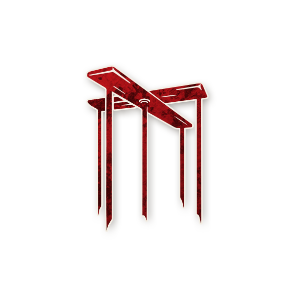
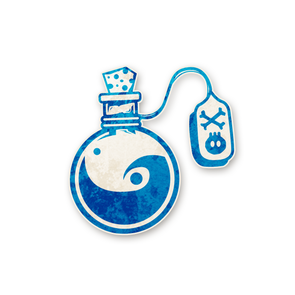
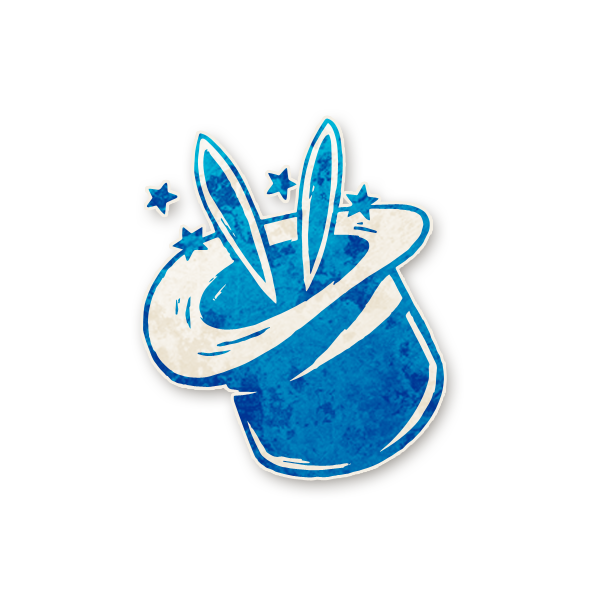

  

<!-- Marionnette -->

  <a href="./marionette.html" style="text-decoration:none;">
    
     
    Marionnette
  </a>

<!-- APPARAÎT DANS -->

  <a href="../experimentaux.html" style="text-decoration:none;">
    
     
    🎠 Apparaît dans : The Carousel Expérimental
  </a>

# 🎭 Marionnette

  « Des mots, des mots. C’est tout ce que nous avons pour nous guider. »

---

## ℹ️ Informations

<ul style="color:#f5f5f5; font-size:18px; line-height:1.7; margin-left:40px;">
  <li><strong>Type :</strong>
    <a href="../sbires.html" style="color:#d45b5b; font-weight:bold; text-decoration:none;">Sbire</a>
  </li>
  <li><strong>Artiste :</strong> Anica Kelsen</li>
  <li><strong>Révélé :</strong> 15 avril 2021</li>
</ul>

---

## 📖 Résumé

  <strong>« Vous pensez être un rôle bon, mais vous ne l’êtes pas.  
  Le Démon sait qui vous êtes. [Vous êtes voisin du Démon.] »</strong>

La <strong>Marionnette</strong> ignore qu'elle est un Sbire.  
Elle pense être un rôle bon, mais fonctionne en réalité comme une sorte d’<a href="../tb_roles/ivrogne.html" style="color:#4ea3ff; font-weight:bold; text-decoration:none;">Ivrogne</a> maléfique.

<ul style="color:#f5f5f5; font-size:18px; line-height:1.7; margin-left:40px;">

  <li>La <strong>Marionnette</strong> tire un jeton de  
      <a href="../villageois.html" style="color:#4ea3ff; font-weight:bold; text-decoration:none;">Villageois</a>  
      ou d’<a href="../etrangers.html" style="color:#4ea3ff; font-weight:bold; text-decoration:none;">Étranger</a> dans le sac,  
      mais est secrètement la <strong>Marionnette</strong>.</li>

  <li>La <strong>Marionnette</strong> est assise juste à côté du  
      Démon :  
      aucun joueur ne se trouve entre eux.</li>

  <li>Le Démon sait quel joueur est la <strong>Marionnette</strong>.</li>

  <li>La première nuit, la <strong>Marionnette</strong> ne se réveille pas  
      pour apprendre les autres joueurs maléfiques,  
      et les autres <a href="../sbires.html" style="color:#d45b5b; font-weight:bold; text-decoration:none;">Sbires</a>  
      n’apprennent pas qui est la <strong>Marionnette</strong>.</li>

  <li>La capacité du rôle bon que la <strong>Marionnette</strong> pense avoir ne fonctionne pas réellement.  
      Les Conteurs et conteuses font semblant qu’elle fonctionne normalement.  
      C’est exactement comme si ce joueur était un  
      <a href="../tb_roles/ivrogne.html" style="color:#4ea3ff; font-weight:bold; text-decoration:none;">Ivrogne</a>… mais maléfique.</li>

  <li>La <strong>Marionnette</strong> s’enregistre comme <strong>maléfique</strong> et comme un <strong>Sbire</strong>  
      pour les rôles qui détectent l’alignement ou le type,  
      comme la <a href="../sv_roles/couturiere.html" style="color:#4ea3ff; font-weight:bold; text-decoration:none;">Couturière</a>  
      ou le <a href="../sv_roles/crieur.html" style="color:#4ea3ff; font-weight:bold; text-decoration:none;">Crieur</a>.</li>

</ul>

---

## 🧞 Jinxes liés

<ul style="color:#f5f5f5; font-size:18px; line-height:1.7; margin-left:40px;">

  <li>
    
    <a href="../roles_experimentaux/alchemist.html" style="color:#4ea3ff; font-weight:bold; text-decoration:none;">Alchimiste</a> :  
    Une <strong>Marionnette-Alchimiste</strong> n’a pas de capacité de Marionnette,  
    et une <strong>Marionnette</strong> est en jeu.
  </li>

  <li>
    
    <a href="../roles_experimentaux/balloonist.html" style="color:#4ea3ff; font-weight:bold; text-decoration:none;">Aéronaute</a> :  
    Si la <strong>Marionnette</strong> pense être l’<a href="../sv_roles/balloonist.html" style="color:#4ea3ff; font-weight:bold; text-decoration:none;">Aéronaute</a>,  
    un <a href="../etrangers.html" style="color:#4ea3ff; font-weight:bold; text-decoration:none;">Étranger</a> supplémentaire a peut-être été ajouté lors de la mise en place.
  </li>

  <li>
    
    <a href="../roles_experimentaux/huntsman.html" style="color:#4ea3ff; font-weight:bold; text-decoration:none;">Chasseur</a> :  
    Si la <strong>Marionnette</strong> pense être le  
    <a href="../roles_experimentaux/huntsman.html" style="color:#4ea3ff; font-weight:bold; text-decoration:none;">Chasseur</a>,  
    la <a href="../roles_experimentaux/damsel.html" style="color:#4ea3ff; font-weight:bold; text-decoration:none;">Demoiselle</a>  
    a été ajoutée lors de la mise en place.
  </li>

  <li>
    
    <a href="../roles_experimentaux/kazali.html" style="color:#d45b5b; font-weight:bold; text-decoration:none;">Kazali</a> :  
    S’il doit y avoir une <strong>Marionnette</strong> en jeu,  
    elle entre en jeu après le Démon  
    et doit commencer comme son voisin ou sa voisine.
  </li>

  <li>
    
    <a href="../roles_experimentaux/lilmonsta.html" style="color:#d45b5b; font-weight:bold; text-decoration:none;">P'tit Monstre</a> :  
    S’il doit y avoir une <strong>Marionnette</strong> en jeu,  
    elle entre en jeu après le Démon  
    et doit commencer comme son voisin ou sa voisine.
  </li>

  <li>
    
    <a href="../roles_experimentaux/magician.html" style="color:#4ea3ff; font-weight:bold; text-decoration:none;">Magicien</a> :  
    Si le <a href="../roles_experimentaux/magician.html" style="color:#4ea3ff; font-weight:bold; text-decoration:none;">Magicien</a> est en vie,  
    le Démon ne sait pas  
    lequel de ses voisins est la <strong>Marionnette</strong>.
  </li>

  <li>
    
    <a href="../sv_roles/mathematician.html" style="color:#4ea3ff; font-weight:bold; text-decoration:none;">Mathématicien</a> :  
    Le <a href="../sv_roles/mathematician.html" style="color:#4ea3ff; font-weight:bold; text-decoration:none;">Mathématicien</a>  
    peut apprendre si la capacité supposée de la <strong>Marionnette</strong>  
    a donné une information fausse ou n’a pas fonctionné correctement.
  </li>

  <li>
    
    <a href="../roles_experimentaux/plaguedoctor.html" style="color:#d45b5b; font-weight:bold; text-decoration:none;">Docteur de Peste</a> :  
    Si les Conteurs et conteuses devraient gagner la capacité de <strong>Marionnette</strong>,  
    un des voisins bons du Démon devient la <strong>Marionnette</strong>.
  </li>

  <li>
    
    <a href="../roles_experimentaux/summoner.html" style="color:#d45b5b; font-weight:bold; text-decoration:none;">Invocateur</a> :  
    S’il doit y avoir une <strong>Marionnette</strong> en jeu,  
    elle entre en jeu après le Démon  
    et doit commencer comme son voisin ou sa voisine.
  </li>

</ul>

---

## 🎭 Comment Conter

Secrètement, vous mettez en place la <strong>Marionnette</strong>  
comme un <a href="../tb_roles/ivrogne.html" style="color:#4ea3ff; font-weight:bold; text-decoration:none;">Ivrogne</a> maléfique voisin du Démon,  
sans que les bons rôles ni les Sbires la voient comme telle.

<ul style="color:#f5f5f5; font-size:18px; line-height:1.7; margin-left:40px;">

  <li>Lors de la mise en place, avant de mettre les jetons dans le sac :
      <ul style="margin-left:20px;">
        <li>retirez le jeton <strong>Marionnette</strong> du sac ;</li>
        <li>ajoutez à la place n'importe quel jeton de  
            <a href="../villageois.html" style="color:#4ea3ff; font-weight:bold; text-decoration:none;">Villageois</a>.</li>
      </ul>
  </li>

  <li>S’il doit y avoir <strong>trois Sbires</strong> en jeu :
      <ul style="margin-left:20px;">
        <li>retirez un autre jeton de Sbire du sac ;</li>
        <li>ajoutez un second jeton de  
            <a href="../villageois.html" style="color:#4ea3ff; font-weight:bold; text-decoration:none;">Villageois</a> ;</li>
        <li>la première nuit, échangez le jeton d’un joueur bon  
            avec un jeton de Sbire non utilisé :  
            réveillez ce joueur,  
            montrez-lui le jeton d’info « VOUS ÊTES »,  
            puis le jeton de Sbire choisi,  
            puis de nouveau « VOUS ÊTES » suivi d’un pouce vers le bas (maléfique),  
            puis rendormez-le.  
            Ce joueur devient maintenant un Sbire maléfique.</li>
      </ul>
      

      Cela garantit qu’il n’y a qu’un seul jeton de Sbire dans le sac,  
      et donc qu’au moins un joueur bon sera voisin du Démon.
      

  </li>

  <li>La première nuit, choisissez un joueur bon assis à côté du  
      Démon  
      et marquez-le avec le rappel <strong>EST LA MARIONNETTE</strong>.</li>

  <li>Réveillez le Démon,  
      pointez le joueur marqué <strong>EST LA MARIONNETTE</strong>,  
      puis montrez le jeton de <strong>Marionnette</strong>.  
      Rendormez le Démon.</li>

  <li>Pendant la partie, traitez la <strong>Marionnette</strong> comme si elle était ivre :
      <ul style="margin-left:20px;">
        <li>elle se réveille quand son rôle « bon » devrait se réveiller ;</li>
        <li>vous pouvez lui donner de fausses informations,  
            ou lui faire rater sa capacité ;</li>
        <li>elle ne se réveille pas lors de l’étape  
            « Infos des Sbires » de la première nuit,  
            et n’est pas annoncée comme Sbire aux autres joueurs maléfiques.</li>
      </ul>
  </li>

</ul>

---

## 🧩 Exemples

Mélanie est la <strong>Marionnette</strong>,  
mais pense être le  
<a href="../tb_roles/croquemort.html" style="color:#4ea3ff; font-weight:bold; text-decoration:none;">Croque-Mort</a>.  
Elle se réveille chaque nuit pour apprendre qui a été exécuté dans la journée,  
mais ses informations sont souvent fausses.  
Au milieu de la partie, le Démon lui révèle  
qu’elle est en réalité la <strong>Marionnette</strong>.

Pierre est le Démon.  
Il dit à Sarah qu’elle est la <strong>Marionnette</strong>.  
Pierre ment : il n’y a en réalité aucune <strong>Marionnette</strong> en jeu.

Le Démon dit à Benoit qu’il est la <strong>Marionnette</strong>.  
Benoit pense être la <a href="../tb_roles/voyante.html" style="color:#4ea3ff; font-weight:bold; text-decoration:none;">Voyante</a>,  
mais ce n’est pas le cas.  
Benoit ne croit pas le Démon et le fait exécuter.  
Le Bien gagne.

---

## 💡 Astuces & Conseils

<ul style="color:#f5f5f5; font-size:18px; line-height:1.7; margin-left:40px;">

  <li>Comme <strong>Marionnette</strong>, vous êtes en quelque sorte un  
      <a href="../tb_roles/ivrogne.html" style="color:#4ea3ff; font-weight:bold; text-decoration:none;">Ivrogne</a> maléfique :  
      vous n’avez ni la capacité que vous pensez avoir,  
      ni l’alignement que vous pensez avoir.  
      Les techniques pour repérer un Ivrogne fonctionnent donc souvent aussi  
      pour repérer une <strong>Marionnette</strong>.  
      Si vos infos ne collent pas, ou si votre capacité « rate » quand elle devrait marcher,  
      vous pourriez être une <strong>Marionnette</strong> plutôt qu’un rôle bon.</li>

  <li>Même si vous n’en avez pas conscience,  
      votre alignement est <strong>maléfique</strong>  
      et vous vous enregistrez comme tel pour des rôles comme la  
      <a href="../sv_roles/couturiere.html" style="color:#4ea3ff; font-weight:bold; text-decoration:none;">Couturière</a>  
      ou le <a href="../sv_roles/crieur.html" style="color:#4ea3ff; font-weight:bold; text-decoration:none;">Crieur</a>.  
      Vous pouvez utiliser ces capacités pour éclaircir votre identité…  
      mais le village peut faire pareil,  
      alors ne suppliez pas trop ouvertement qu’on vous cible !</li>

  <li>Dans la plupart des cas, l’équipe du Mal voudra vous révéler la vérité.  
      Si l’un de vos voisins vous dit que vous êtes une <strong>Marionnette</strong>,  
      prenez-le au sérieux :  
      il peut mentir… mais peut aussi vous donner la clé de votre vraie identité.  
      Si vous le démasquez et que le Mal perd,  
      vous perdez avec lui.</li>

  <li>Si vous suspectez être une <strong>Marionnette</strong>  
      (à cause d’informations incohérentes,  
      ou parce qu’on vous l’a dit clairement),  
      évitez d’annoncer ce doute aux autres rôles bons :  
      s’ils vous croient, le Bien saura que le  
      Démon  
      est forcément l’un de vos voisins.</li>

  <li>Évitez de nommer ou de voter contre vos voisins,  
      sauf si les preuves sont vraiment accablantes.  
      Si vous êtes une <strong>Marionnette</strong>,  
      le Démon est forcément assis à votre gauche ou à votre droite.  
      Exécuter votre propre Démon  
      simplement parce que vous ignoriez être maléfique,  
      c’est un peu dommage pour vous…</li>

  <li>Cherchez quels types de Sbires sont en jeu.  
      La <strong>Marionnette</strong> est un Sbire discret et invisible,  
      tandis que d’autres Sbires sur le script  
      peuvent laisser des traces évidentes.  
      Confirmer la présence d’un  
      <a href="../sv_roles/sorciere.html" style="color:#d45b5b; font-weight:bold; text-decoration:none;">Sorcière</a>  
      ou d’un autre Sbire bien identifié  
      peut suffire à prouver qu’il n’y a pas de <strong>Marionnette</strong> en jeu.</li>

  <li>Si vous êtes certain·e de connaître les Sbires,  
      vous savez aussi que vous n’êtes <strong>pas</strong> secrètement la <strong>Marionnette</strong>.  
      Le nombre de Sbires est limité :  
      si vous les avez tous trouvés, le reste des joueurs bons  
      ne sont pas des Marionnettes.</li>

  <li>Chassez le Démon avec enthousiasme !  
      Si vous êtes une <strong>Marionnette</strong>,  
      votre Démon est l’un de vos voisins.  
      Si vous arrivez à prouver que le Démon est placé ailleurs  
      (par exemple grâce à un ping de  
      <a href="../tb_roles/voyante.html" style="color:#4ea3ff; font-weight:bold; text-decoration:none;">Voyante</a>  
      à l’autre bout du cercle),  
      alors vous savez que vous ne pouvez pas être la <strong>Marionnette</strong>.  
      Et si vous l’êtes, vous détournez quand même les soupçons…  
      loin de votre véritable Démon !</li>

  <li>Si vous craignez d’être la <strong>Marionnette</strong>  
      mais que vos voisins refusent de parler,  
      vous pouvez toujours essayer de leur dire que  
      <strong>eux</strong> sont votre Marionnette.  
      Un joueur maléfique saura que c’est faux,  
      tandis qu’un joueur bon devra gérer ce doute  
      et se comportera différemment.  
      Cela peut révéler qui est votre voisin secret…  
      ou qui est un allié maléfique potentiel.</li>

  <li>Si vous êtes convaincu d’être la <strong>Marionnette</strong>,  
      votre rôle est alors de protéger votre Démon.  
      Le village sait qu’une <strong>Marionnette</strong> est possible  
      et cherchera à l’identifier pour remonter jusqu’au Démon.  
      Pour éviter cela, ajustez vos informations  
      afin qu’elles semblent cohérentes :  
      par exemple, si vous pensez être un  
      <a href="../sv_roles/savant.html" style="color:#4ea3ff; font-weight:bold; text-decoration:none;">Savant</a>,  
      assurez-vous que chaque jour, l’une de vos phrases soit vraie et l’autre fausse.</li>

  <li>Si vous êtes le Démon,  
      vous devez décider comment gérer votre <strong>Marionnette</strong>.  
      La prévenir très tôt lui permet d’agir en tant que maléfique,  
      de vous protéger, et d’éviter de vous trahir  
      lorsque sa capacité « déraille ».  
      Mais garder une <strong>Marionnette</strong> dans l’ignorance  
      peut aussi être redoutable :  
      un joueur sincèrement persuadé d’être bon  
      est parfois le meilleur allié du Mal.</li>

  <li>En tant que Démon,  
      rien ne vous empêche de dire à vos deux voisins  
      qu’ils sont votre <strong>Marionnette</strong>.  
      Chacun pensera être la « vraie » Marionnette  
      et que l’autre se fait manipuler.  
      Comme une vraie <strong>Marionnette</strong> ne connaît pas son alignement,  
      ces joueurs auront tout intérêt à garder le secret  
      et à tester votre affirmation,  
      ce qui les poussera à des comportements étranges  
      et souvent contre-productifs pour le Bien.</li>

  <li>En tant que Sbire, vous pouvez aussi dire à vos voisins bons  
      qu’ils sont votre <strong>Marionnette</strong>.  
      Vous profitez du chaos et de la confusion,  
      sans risquer de faire perdre votre équipe  
      si on vous exécute après avoir découvert le mensonge.</li>

  <li>Si vous êtes bon ou bonne, mais que votre voisin est très peu coopératif,  
      vous pouvez lui dire qu’il ou elle est votre <strong>Marionnette</strong>.  
      La plupart des joueurs travailleront avec vous  
      tant qu’ils explorent cette possibilité,  
      ce qui peut vous permettre de récupérer des infos  
      ou de les impliquer davantage.  
      Pensez simplement à dire la vérité avant la fin,  
      pour qu’ils puissent se rallier au Bien.</li>

</ul>

---

## ⚔️ Combattre la Marionnette

<ul style="color:#f5f5f5; font-size:18px; line-height:1.7; margin-left:40px;">

  <li>Comme pour l’<a href="../tb_roles/ivrogne.html" style="color:#4ea3ff; font-weight:bold; text-decoration:none;">Ivrogne</a>  
      dans <em>Trouble Brewing</em>,  
      cherchez un joueur dont les informations sont fausses,  
      même si elles sont présentées avec conviction.  
      Par exemple, si quelqu’un revendique être l’  
      <a href="../tb_roles/empathique.html" style="color:#4ea3ff; font-weight:bold; text-decoration:none;">Empathique</a>  
      avec un « 0 », mais que vous suspectez fortement  
      un de ses voisins d’être maléfique,  
      cet « Empathique » pourrait bien être une <strong>Marionnette</strong>.</li>

  <li>Si un joueur prétend être le Démon  
      et affirme que <strong>vous</strong> êtes la <strong>Marionnette</strong>,  
      vous avez un vrai problème :  
      êtes-vous la <strong>Marionnette</strong> ?  
      Peut-être pas.  
      Si vous pensez que ce joueur est réellement le Démon  
      et qu’une <strong>Marionnette</strong> est en jeu,  
      discutez avec l’autre voisin du Démon  
      pour voir si c’est plutôt lui ou elle la <strong>Marionnette</strong>.  
      Si vous pensez que ce joueur n’est pas le Démon,  
      il est très probablement un Sbire.  
      Dans tous les cas, vous avez trouvé un joueur maléfique  
      (ou un bon joueur qui doit cesser de vous mentir).</li>

  <li>Si vous êtes sûr de ne pas être la <strong>Marionnette</strong>,  
      mais qu’on vous l’a affirmé, dites-le au groupe.  
      Le village voudra probablement  
      exécuter votre voisin ou voisine,  
      ce qui peut signifier :  
      <ul style="margin-left:20px;">
        <li>un Démon mort ;</li>
        <li>un Sbire mort ;</li>
        <li>ou un bon joueur mort…  
            dont le bluff ne servait plus à grand-chose.</li>
      </ul>
  </li>

  <li>Demandez combien de joueurs ont été déclarés « Marionnette ».  
      S’il y en a plus d’un,  
      il est assez probable qu’il n’y ait pas de véritable <strong>Marionnette</strong> en jeu.</li>

  <li>Surveillez vos voisins.  
      Si vous pensez qu’aucun des deux n’est le Démon,  
      et qu’aucun ne vous a affirmé que vous êtes la <strong>Marionnette</strong>,  
      vous pouvez souvent mettre ce rôle de côté  
      et jouer « normalement » :  
      gardez vos voisins en vie jusqu’au dernier jour  
      et concentrez-vous sur l’identification du  
      Démon ailleurs.</li>

  <li>Si la <strong>Marionnette</strong> est sur le script,  
      évitez d’exécuter vos propres voisins si possible :  
      vous ne serez jamais totalement certain·e.  
      Essayez d’exécuter d’abord tous les autres joueurs,  
      ou de vous assurer qu’il existe d’autres meilleurs suspects.</li>

  <li>Si vous pensez qu’une <strong>Marionnette</strong> est en jeu,  
      mais que ce n’est pas vous,  
      vous savez alors quelque chose de crucial :  
      le Démon et un Sbire sont assis côte à côte.  
      Comme un <a href="../tb_roles/chef.html" style="color:#4ea3ff; font-weight:bold; text-decoration:none;">Chef</a>  
      ou un <a href="../sv_roles/clockmaker.html" style="color:#4ea3ff; font-weight:bold; text-decoration:none;">Horloger</a>,  
      vous disposez d’une info très structurante.  
      Testez l’hypothèse « deux joueurs maléfiques voisins »  
      avec les autres infos de la partie :  
      si ça colle, vous avez probablement trouvé le duo maléfique ;  
      si ça ne colle pas, il est possible  
      qu’aucune <strong>Marionnette</strong> ne soit en jeu.</li>

  <li>Normalement, découvrir un Sbire est utile,  
      mais pas forcément décisif.  
      Sur le dernier jour,  
      apprendre qu’un joueur mort depuis longtemps  
      était en fait le <a href="../bmr_roles/cerveau.html" style="color:#d45b5b; font-weight:bold; text-decoration:none;">Conspirateur</a>  
      est intéressant,  
      mais apprendre qu’il était la <strong>Marionnette</strong>  
      est <strong>énormément</strong> plus fort :  
      même si un <a href="../sv_roles/pithag.html" style="color:#d45b5b; font-weight:bold; text-decoration:none;">Pit-Hag</a>  
      a changé plusieurs rôles,  
      ou qu’un <a href="../bmr_roles/pukka.html" style="color:#d45b5b; font-weight:bold; text-decoration:none;">Pukka</a>  
      a rendu toutes les infos suspectes,  
      le simple fait de savoir  
      qu’un joueur précis était la <strong>Marionnette</strong>  
      peut suffire à gagner la partie à 3 joueurs vivants.</li>

  <li>Repérez les joueurs qui étaient très bavards  
      et investis dans l’aide à recher les maléfiques début,  
      puis qui deviennent soudainement silencieux.  
      Il se peut qu’on leur ait révélé en cours de partie  
      qu’ils étaient la <strong>Marionnette</strong>…  
      et qu’ils aient eu un gros choc mental en essayant de tout recalculer.</li>

</ul>

---

  🏠 <a href="/botc-fr-bambi/" style="color:#f5f5f5; font-weight:bold; text-decoration:none;">Retour à l’accueil</a> 
  😈 <a href="../sbires.html" style="color:#d45b5b; font-weight:bold; text-decoration:none;">Retour aux Sbires</a> 
  🎠 <a href="../experimentaux.html" style="color:#e0b97a; font-weight:bold; text-decoration:none;">Retour à The Carousel Expérimental</a>

