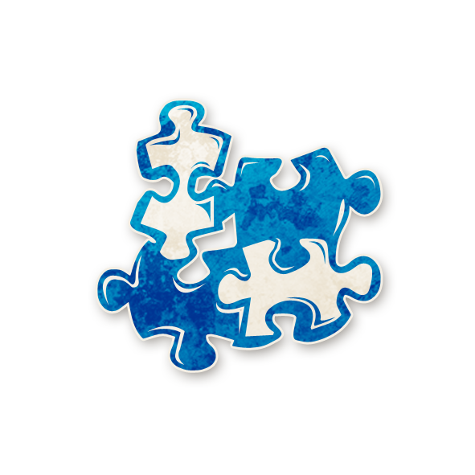

  

<!-- Maître des Puzzles -->

  <a href="./puzzlemaster.html" style="text-decoration:none;">
    
     
    Maître des Puzzles
  </a>

<!-- APPARAÎT DANS -->

  <a href="../experimentaux.html" style="text-decoration:none;">
    
     
    🎠 Apparaît dans : The Carousel Expérimental
  </a>

#  Maître des Puzzles

  « Quand on commence à penser qu’une chose n’est « que » une autre chose,  
  on est souvent au bord de l’erreur. Patience, patience.  
  Ne confonds pas ce qui est juste ou devrait être, avec ce qui est ou n’est pas. »

---

##  Informations

<ul style="color:#f5f5f5; font-size:18px; line-height:1.7; margin-left:40px;">
  <li><strong>Type :</strong>
    <a href="../etrangers.html" style="color:#4ea3ff; font-weight:bold; text-decoration:none;">Étranger</a>
  </li>
  <li>
  <strong>Nom original :</strong>
  <a href="https://wiki.bloodontheclocktower.com/Puzzlemaster"
     target="_blank"
     rel="noopener noreferrer"
     style="color:#4ea3ff; font-weight:bold; text-decoration:none;">
    Puzzlemaster
  </a>
</li>
  <li><strong>Artiste :</strong> <em>Caitlin Murphy</em></li>
  <li><strong>Révélé :</strong> 23 septembre 2021</li>
</ul>

---

##  Résumé

  <strong>« 1 joueur est ivre, même si vous êtes mort.  
  Si vous devinez (une fois) qui c’est, vous apprenez qui est le Démon, 
  si vous vous trompez, vous recevez une fausse information. »</strong>

Le <strong>Maître des Puzzles</strong> tente de déterminer qui est ivre.

<ul style="color:#f5f5f5; font-size:18px; line-height:1.7; margin-left:40px;">

  <li>Au début de la partie, un joueur devient ivre à cause du Maître des Puzzles.  
      Il le reste pour toute la partie, même après la mort du Maître des Puzzles.</li>

  <li>Ce joueur ivre sera le plus souvent un 
      <a href="../villageois.html" style="color:#4ea3ff; font-weight:bold; text-decoration:none;">Villageois</a>,  
      mais il peut aussi être un 
      <a href="../etrangers.html" style="color:#4ea3ff; font-weight:bold; text-decoration:none;">Étranger</a>.  
      Il ne sait pas qu’il est ivre.</li>

  <li>Une seule fois par partie, le Maître des Puzzles peut deviner publiquement ou en privé quel joueur est ivre.</li>

  <li>Si la devinette est correcte, la conteuse indique en secret au Maître des Puzzles quel joueur est le Démon.</li>

  <li>Si la devinette est incorrecte, la conteuse indique en secret au Maître des Puzzles un autre joueur qui n’est pas le Démon.</li>

  <li>Le Maître des Puzzles n’apprend jamais s’il a deviné juste ou non.</li>

  <li>Seul le joueur ivre à cause du Maître des Puzzles compte pour cette capacité :  
      un joueur ivre pour une autre raison (par exemple à cause de l’
      <a href="../tb_roles/ivrogne.html" style="color:#4ea3ff; font-weight:bold; text-decoration:none;">Ivrogne</a>  
      ou du 
      <a href="../bmr_roles/marin.html" style="color:#4ea3ff; font-weight:bold; text-decoration:none;">Marin</a>)  
      ne valide pas la devinette.</li>

  <li>Si le Maître des Puzzles meurt avant d’avoir utilisé sa devinette, il ne peut plus l’utiliser.  
      Le joueur ivre reste néanmoins ivre jusqu’à la fin de la partie.</li>

</ul>

---

## 🎭 Comment Conter

Pendant la préparation de la première nuit, choisissez un joueur et marquez-le avec le rappel <strong>IVRE</strong> du Maître des Puzzles.  
Ce joueur est ivre pour toute la partie (sauf s’il devient sobre à cause d’une autre capacité).

À n’importe quel moment de la partie, le Maître des Puzzles peut vous annoncer qu’il utilise sa devinette.  
Il choisit alors un joueur (en public ou en privé) comme étant celui qui est ivre.

<ul style="color:#f5f5f5; font-size:18px; line-height:1.7; margin-left:40px;">

  <li>Si le joueur deviné est effectivement marqué <strong>IVRE</strong>,  
      indiquez en secret au Maître des Puzzles quel joueur est le Démon.</li>

  <li>Sinon, indiquez en secret le nom d’un joueur qui n’est pas le Démon.</li>

</ul>

Dans tous les cas, ne révélez jamais si la devinette était correcte.  
Marquez le Maître des Puzzles avec un rappel <strong>DEVINETTE UTILISÉE</strong> pour ne pas oublier qu’il a consommé sa capacité.

Vous pouvez techniquement rendre un Sbire ou le Démon ivre avec cette capacité,  
mais faites-le seulement si vous avez une bonne raison en tête.  
En règle générale, choisir un bon rôle à information comme cible d’ivresse est plus intéressant.

---

##  Exemples

Alex est le Démon.  
Sarah est l’
<a href="../tb_roles/empathique.html" style="color:#4ea3ff; font-weight:bold; text-decoration:none;">Empathique</a>,  
mais elle est ivre à cause du Maître des Puzzles et reçoit de fausses informations.  
Le Maître des Puzzles devine publiquement que Sarah est ivre.  
En secret, la conteuse lui dit : « Alex est le Démon. »

Louis est le Démon.  
Benoit est mort et ivre à cause du Maître des Puzzles.  
Vanessa est en vie et ivre à cause du 
<a href="../bmr_roles/marin.html" style="color:#4ea3ff; font-weight:bold; text-decoration:none;">Marin</a>.  
Le Maître des Puzzles devine en privé que Vanessa est ivre.  
La conteuse lui dit en secret : « Emilien est le Démon. »  
Comme Vanessa n’était pas la bonne cible d’ivresse, cette information est fausse.

---

##  Astuces et Conseils

<ul style="color:#f5f5f5; font-size:18px; line-height:1.7; margin-left:40px;">

  <li>Considérez-vous comme un puissant rôle à information :  
      si vous trouvez le joueur ivre, vous pouvez résoudre la partie.  
      Restez en vie le plus longtemps possible et assurez-vous d’utiliser votre devinette avant de mourir.</li>

  <li>Vous savez avec certitude qu’<strong>un</strong> joueur est ivre.  
      Informez le village de cette réalité dès que raisonnable,  
      pour que les autres bons rôles intègrent cette possibilité dans leurs déductions.</li>

  <li>Ne vous révélez pas immédiatement comme Maître des Puzzles :  
      un Démon a tout intérêt à vous tuer tôt.  
      Attendez souvent le moment où vous utilisez votre devinette pour annoncer qui vous êtes,  
      un peu comme un 
      <a href="../tb_roles/mercenaire.html" style="color:#4ea3ff; font-weight:bold; text-decoration:none;">Mercenaire</a>  
      qui se révèle au moment de tirer.</li>

  <li>Parlez en privé à des joueurs que vous pensez bons.  
      Si leurs informations n’ont aucun sens pour eux-mêmes,  
      vous tenez peut-être un excellent candidat au rôle de joueur ivre.</li>

  <li>Si un rôle à capacité publique échoue de façon flagrante  
      (par exemple une 
      <a href="../tb_roles/vierge.html" style="color:#4ea3ff; font-weight:bold; text-decoration:none;">Vierge</a>  
      qui ne provoque aucune exécution lorsqu’elle est nominée,  
      ou un 
      <a href="../roles_experimentaux/golem.html" style="color:#4ea3ff; font-weight:bold; text-decoration:none;">Golem</a>  
      qui nomme sans tuer),  
      utilisez rapidement votre devinette sur ce joueur :  
      il ou elle est peut-être la personne ivre.</li>

  <li>Contrairement à beaucoup de rôles, vous gagnez à être patient et observateur :  
      écoutez les informations, regardez comment elles s’assemblent (ou non),  
      et cherchez la pièce du puzzle qui ne rentre vraiment pas dans le tableau global.</li>

  <li>Une fois votre devinette utilisée, l’information obtenue mérite souvent une exécution.  
      Si votre cible est réellement le Démon, le Bien gagne immédiatement.  
      Si ce n’est pas le cas, vous aurez au moins éliminé une suspicion forte et la partie continue.</li>

  <li>Même si vous ne devinez jamais, vous savez qu’il y a un joueur ivre en jeu.  
      C’est presque aussi puissant qu’une info de 
      <a href="../tb_roles/bibliothecaire.html" style="color:#4ea3ff; font-weight:bold; text-decoration:none;">Bibliothécaire</a> :  
      utilisez cela pour recouper les récits qui semblent trop parfaits.</li>

  <li>Suivez les conséquences de votre révélation :  
      si la personne que vous pensiez être le Démon est exécutée  
      et que la partie continue,  
      cela signifie que votre devinette était fausse…  
      et que votre cible n’était pas le joueur ivre.</li>

</ul>

---

##  Bluffer Maître des Puzzles

<ul style="color:#f5f5f5; font-size:18px; line-height:1.7; margin-left:40px;">

  <li>Le Maître des Puzzles ajoute un joueur ivre dans l’équipe du Bien,  
      sans que des rôles comme le 
      <a href="../tb_roles/bibliothecaire.html" style="color:#4ea3ff; font-weight:bold; text-decoration:none;">Bibliothécaire</a>  
      puissent le détecter.  
      En vous révélant tôt comme Maître des Puzzles,  
      vous forcez le village à douter d’une partie de ses informations…  
      idéal pour protéger un Démon mis en cause.</li>

  <li>Gardez votre « grande révélation » pour un moment clé :  
      annoncer une devinette spectaculaire qui pointe un Démon supposé  
      peut jeter le chaos dans les accusations,  
      surtout si cela remet en cause un rôle jusque-là jugé fiable.</li>

  <li>Servez-vous de ce bluff pour intégrer des cercles de confiance :  
      si le village croit que vous travaillez à trouver le joueur ivre,  
      il vous écoutera volontiers et vous confiera des informations précieuses  
      que vous pourrez retourner contre le Bien.</li>

  <li>Pour obtenir une exécution « gratuite »,  
      choisissez une personne que le village trouve un peu étrange  
      et annoncez qu’elle est ivre et que tel autre joueur est le Démon.  
      Les joueurs ont tendance à exécuter la cible révélée « au cas où ».</li>

  <li>Vous pouvez aussi faire l’inverse :  
      choisissez comme « ivre » un joueur très crédible (ou même vous-même),  
      obtenez une fausse info, puis désignez votre véritable Démon  
      comme « certainement pas le Démon ».  
      Le village sera tenté de le garder en vie jusqu’aux derniers jours.</li>

  <li>Un bluff redoutable consiste à préparer un partenaire maléfique  
      avec des informations manifestement fausses ou une capacité qui « rate ».  
      Vous arrivez ensuite en proclamant qu’il s’agit du joueur ivre.  
      Si le village vous croit, vous sauvez un allié en difficulté et obtenez une exécution ailleurs.</li>

  <li>Le Maître des Puzzles est une distraction parfaite pour un Sbire :  
      si tout le monde débat de qui est ivre et de la fiabilité des infos,  
      on parle moins de qui est réellement le Démon.</li>

  <li>Si vous sentez que vos mensonges sont sur le point d’être démasqués,  
      vous pouvez toujours vous « rattraper » en révélant que vous êtes (soi-disant) Maître des Puzzles.  
      Ce rôle a une excellente excuse pour embrouiller les pistes et rester discret longtemps.</li>

  <li>Si vous êtes maléfique et craignez qu’un vrai Maître des Puzzles vous démasque,  
      envisagez de bluffer un rôle qui produit sciemment de mauvaises informations.  
      Si le Maître des Puzzles vous choisit comme joueur ivre,  
      il ne découvrira pas le vrai Démon  
      et la confusion générale augmentera encore.</li>

</ul>

---

   <a href="/botc-fr-bambi/" style="color:#f5f5f5; font-weight:bold; text-decoration:none;">Retour à l’accueil</a> 
   <a href="../etrangers.html" style="color:#4ea3ff; font-weight:bold; text-decoration:none;">Catégorie : Étrangers</a> 
   <a href="../experimentaux.html" style="color:#e0b97a; font-weight:bold; text-decoration:none;">Retour à The Carousel Expérimental</a>

