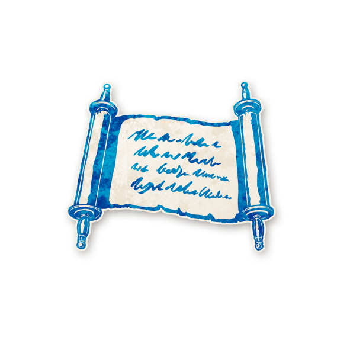

  

<!-- Intendant -->

  <a href="./steward.html" style="text-decoration:none;">
    
     
    Intendant
  </a>

<!-- APPARAÎT DANS -->

  <a href="../experimentaux.html" style="text-decoration:none;">
    
     
    Apparaît dans : The Carousel Expérimental
  </a>

# Intendant

  « Comment OSEZ-vous accuser Sa Seigneurie de méfaits ? Je la connais depuis toujours ! Depuis mes neuf ans ! »

---

##  Informations

<ul style="color:#f5f5f5; font-size:18px; line-height:1.7; margin-left:40px;">
  <li><strong>Type :</strong>
    <a href="../villageois.html" style="color:#4ea3ff; font-weight:bold; text-decoration:none;">Villageois</a>
  </li>
  <li>
  <strong>Nom original :</strong>
  <a href="https://wiki.bloodontheclocktower.com/Steward"
     target="_blank"
     rel="noopener noreferrer"
     style="color:#4ea3ff; font-weight:bold; text-decoration:none;">
    Steward
  </a>
</li>
  <li><strong>Artiste :</strong> <em>Chloe McDougall</em></li>
  <li><strong>Révélé :</strong> 18 mai 2023</li>
</ul>

---

##  Résumé

  <strong>« Vous commencez en apprenant un joueur bon. »</strong>

L’<strong>Intendant</strong> connaît un joueur bon.  
Il apprend cette information lors de la toute première nuit, ou lors de sa première nuit s’il apparaît en cours de partie.

<ul style="color:#f5f5f5; font-size:18px; line-height:1.7; margin-left:40px;">

  <li>L’Intendant apprend un joueur bon, mais n’apprend pas son rôle.</li>

  <li>L’Intendant reçoit cette information lors de la première nuit de la partie.</li>

  <li>Si l’Intendant apparaît en cours de partie, il reçoit cette information lors de sa première nuit en tant qu’Intendant.</li>

</ul>

---

##  Comment Conter

Avant la première nuit, placez un jeton de rappel <strong>CONNAÎT</strong> à côté du jeton de n’importe quel rôle bon.  
Lors de la première nuit, réveillez l’Intendant, pointez le joueur marqué <strong>CONNAÎT</strong>, puis rendormez l’Intendant.

---

##   Exemples

L’Intendant apprend que <strong>Cédric</strong> est bon.  
Cédric est le <a href="../tb_roles/croquemort.html" style="color:#4ea3ff; font-weight:bold; text-decoration:none;">Croque-mort</a>.

La <a href="../sv_roles/pithag.html" style="color:#d45b5b; font-weight:bold; text-decoration:none;">Pit-Hag</a> transforme la <a href="../roles_experimentaux/poppygrower.html" style="color:#4ea3ff; font-weight:bold; text-decoration:none;">Cultivateur de pavot</a> en Intendant.  
Cette nuit-là, l’Intendant apprend que <strong>Médhi</strong> est bon.  
Médhi est l’<a href="../tb_roles/espion.html" style="color:#d45b5b; font-weight:bold; text-decoration:none;">Espion</a>, et s’enregistre comme bon.

---

## Astuces et Conseils

<ul style="color:#f5f5f5; font-size:18px; line-height:1.7; margin-left:40px;">

  <li>Vous connaissez un joueur ou une joueuse qui n’est ni Démon ni Sbire.  
      C’est une excellente information : vous pouvez leur faire confiance,  
      et seule l’ivresse ou l’empoisonnement peut perturber leurs infos.</li>

  <li>Révélez-vous publiquement dès le début.  
      Si tout le monde sait que vous êtes deux joueurs bons,  
      cela aide immédiatement aux constructions de mondes.</li>

  <li>Discutez en privé avec ce joueur ou cette joueuse et gardez le secret  
      pour essayer de les protéger.  
      Si le Démon apprend votre information, il voudra probablement  
      tuer cette personne dès que possible.</li>

  <li>Une fois votre info publique, exigez qu’elle soit prise en compte.  
      Si vous êtes bon et que cette personne est bonne,  
      tout monde où l’un de vous deux est maléfique implique  
      que vous l’êtes tous les deux : ce qui mène souvent à un nombre d’ennemis impossible.</li>

</ul>

---

##  span style="color:#4ea3ff;">Bluffer Intendant

<ul style="color:#f5f5f5; font-size:18px; line-height:1.7; margin-left:40px;">

  <li>L’Intendant est l’un des bluffs les plus simples du jeu.  
      Vous pouvez déclarer que le joueur que vous « savez bon » est votre Démon.  
      Si on vous croit, ce joueur a l’air irréprochable : parfait bluff.</li>

  <li>Déclarez un joueur bon comme votre information et arrangez-vous  
      pour que d’autres capacités laissent croire que vous êtes maléfique.  
      Vous tomberez ensemble, mais seulement après quelques jours,  
      ce qui laisse le temps au Mal de faire son œuvre.</li>

  <li>Déclarez un joueur bon comme votre information  
      et travaillez avec lui pour « résoudre » la partie.  
      Si vous gagnez la confiance du groupe à deux,  
      vous pouvez survivre toute la partie sans attirer de soupçons.</li>

</ul>

---

   <a href="/botc-fr-bambi/" style="color:#f5f5f5; font-weight:bold; text-decoration:none;">Retour à l’accueil</a> 
   <a href="../villageois.html" style="color:#4ea3ff; font-weight:bold; text-decoration:none;">Catégorie : Villageois</a> 
   <a href="../experimentaux.html" style="color:#e0b97a; font-weight:bold; text-decoration:none;">Retour à The Carousel Expérimental</a>

