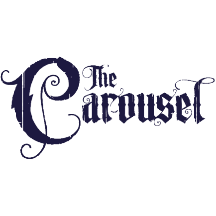
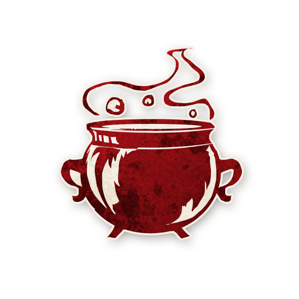

  

<!-- Idiot du Village -->

  <a href="./villageidiot.html" style="text-decoration:none;">
    
     
    Idiot du Village
  </a>

<!-- APPARAÎT DANS -->

  <a href="../experimentaux.html" style="text-decoration:none;">
    
     
    🎠 Apparaît dans : The Carousel Expérimental
  </a>

#  Idiot du Village

  « Les roses sont bleues, et les violettes sont rouges,
S’il vous plaît, inversez simplement ce que je viens de dire. »

---

##  Informations

<ul style="color:#f5f5f5; font-size:18px; line-height:1.7; margin-left:40px;">
  <li><strong>Type :</strong>
    <a href="../villageois.html" style="color:#4ea3ff; font-weight:bold; text-decoration:none;">Villageois</a>
  </li>
  <li>
  <strong>Nom original :</strong>
  <a href="https://wiki.bloodontheclocktower.com/Village_Idiot"
     target="_blank"
     rel="noopener noreferrer"
     style="color:#4ea3ff; font-weight:bold; text-decoration:none;">
    Village Idiot
  </a>
</li>
  <li><strong>Artiste :</strong> <em>Chloe McDougall</em></li>
  <li><strong>Révélé :</strong> 25 janvier 2024</li>
</ul>

---

##  Résumé

  <strong>« Chaque nuit, vous choisissez un joueur  : vous apprenez son alignement. [+0 à +2 Idiots du Village. L’un des Idiots du Village supplémentaires est ivre.] »</strong>

Les <strong>Idiots du Village</strong> forment un groupe qui apprend l’alignement des joueurs.

<ul style="color:#f5f5f5; font-size:18px; line-height:1.7; margin-left:40px;">

  <li>Parmi les Idiots du Village en jeu, l’un d’eux est ivre, choisi par le Conteur  
      pendant la mise en place de la partie.</li>

  <li>Il peut y avoir un, deux ou trois Idiots du Village en jeu,  
      quel que soit le nombre total de joueurs.</li>

  <li>S’il n’y a qu’un Idiot du Village en jeu, il est sobre.</li>

  <li>L’Idiot du Village ivre peut tout de même recevoir une information vraie.</li>

  <li>Quand des Idiots du Village sont ajoutés pendant la mise en place,  
      ils remplacent d’autres rôles de type Villageois.</li>

  <li>Si un Idiot du Village est créé en cours de partie, un seul est créé.</li>

  <li>Les Idiots du Village agissent chacun à leur tour, pas tous en même temps.</li>

  <li>Si tous les Idiots du Village sobres quittent la partie,  
      l’Idiot du Village ivre reste ivre.</li>

  <li>Si un Idiot du Village sobre devient ivre ou empoisonné par un autre effet,  
      l’Idiot du Village déjà ivre reste ivre.</li>

</ul>

---

## 🧞 Jinxes liés

<ul style="color:#f5f5f5; font-size:18px; line-height:1.7; margin-left:40px;">

  <li>
    
    <a href="../roles_experimentaux/boffin.html" style="color:#d45b5b; font-weight:bold; text-decoration:none;">Laborantin</a> :  
    S’il reste un jeton disponible, le Laborantin peut donner au Démon  
    la capacité d’<strong>Idiot du Village</strong>.
  </li>

  <li>
    
    <a href="../sv_roles/pithag.html" style="color:#d45b5b; font-weight:bold; text-decoration:none;">Guenaude</a> :  
    S’il reste un jeton disponible, la Guenaude peut créer un Idiot du Village supplémentaire.  
    Dans ce cas, l’Idiot du Village ivre peut changer.
  </li>

</ul>

---

##  Comment Conter

Pendant la mise en place, avant de mettre les jetons de rôle dans le sac,  
remplacez zéro, un ou deux jetons de Villageois par des jetons d’<strong>Idiot du Village</strong>.  
Préparez ensuite la première nuit en marquant l’un des Idiots du Village avec le rappel <strong>IVRE</strong>.

Chaque nuit, réveillez un Idiot du Village à la fois :

<ul style="color:#f5f5f5; font-size:18px; line-height:1.7; margin-left:40px;">

  <li>L’Idiot du Village pointe un joueur.</li>
  <li>DMonstrez-lui un pouce levé pour « bon » ou un pouce baissé pour « maléfique »  
      selon l’alignement réel de la cible (ou selon son ivresse, s’il s’agit de l’Idiot du Village ivre).</li>
  <li>Endormez cet Idiot du Village, puis passez au suivant jusqu’à ce que  
      tous les Idiots du Village aient agi.</li>

</ul>

---

##  Exemples

<strong>Cédric</strong>, <strong>Nicolas</strong> et <strong>Lola</strong> sont tous des Idiots du Village.  
Cédric est ivre.  
La nuit, ils choisissent chacun <strong>Thaïs</strong>, qui est un 
<a href="../roles_experimentaux/kazali.html" style="color:#d45b5b; font-weight:bold; text-decoration:none;">Kazali</a>.  
Cédric apprend que Thaïs est bonne.  
Nicolas et Lola apprennent que Thaïs est maléfique.

<strong>Céline</strong> et <strong>Vanessa</strong> sont Idiots du Village.  
Vanessa est ivre.  
<strong>Sarah</strong> est maléfique et bluffe Idiot du Village.  
Céline choisit Sarah et apprend qu’elle est maléfique.  
Vanessa choisit la joueuse Hérétiques et apprend qu’elle est bonne.  
Sarah prétend avoir choisi Céline et avoir appris qu’elle est maléfique.

---

##  Astuces et Conseils

<ul style="color:#f5f5f5; font-size:18px; line-height:1.7; margin-left:40px;">

  <li>Trouvez les autres Idiots du Village.  
      Le moyen le plus simple de savoir qui est ivre est de comparer vos informations  
      et de voir où elles concordent ou se contredisent.  
      Et si vous êtes le seul à revendiquer ce rôle, vous savez que vous êtes sobre.</li>

  <li>Collaborez avec les autres Idiots du Village pour cibler la même personne.  
      Si une seule information diffère, vous avez probablement identifié  
      qui est ivre.  
      Si toutes les informations sont identiques alors que plusieurs joueurs  
      revendiquent ce rôle, il peut y avoir des bluffeurs en plus des vrais Idiots du Village.</li>

  <li>S’il n’y a que deux Idiots du Village et que vous ne parvenez pas à savoir  
      lequel des deux est ivre, choisissez des cibles différentes.  
      Deux Idiots du Village qui choisissent toujours la même personne  
      obtiennent beaucoup moins d’informations utiles.</li>

  <li>Le fait qu’il y ait trois personnes qui revendiquent Idiot du Village  
      ne prouve la bonté de personne.  
      Méfiez-vous des rôles maléfiques qui bluffent Idiot du Village :  
      tant qu’il n’y en a pas « trop », l’un de vous peut très bien être maléfique  
      et tenter de vous faire passer pour ivre.</li>

  <li>Ignorez parfois les autres Idiots du Village et partez du principe  
      que vos propres informations sont correctes.  
      Si chacun fait cela, l’effet global sur le groupe  
      reste souvent positif malgré la présence d’un Idiot du Village ivre.</li>

  <li>Exécutez l’Idiot du Village que vous pensez être ivre  
      (au cas où il serait en réalité maléfique).</li>

  <li>Si un joueur ou une joueuse est fortement considéré comme bon ou comme maléfique,  
      ciblez-le pour savoir si vous êtes l’Idiot ivre ou non.  
      Si votre information contredit un élément presque certain,  
      il est probable que vous soyez la source de l’erreur.</li>

  <li>N’oubliez pas que le Conteur peut encore donner  
      une information correcte à l’Idiot du Village ivre afin de ne pas rendre  
      les Idiots du Village trop puissants.</li>

  <li>Attendez avant de révéler que vous êtes Idiot du Village.  
      Si trois autres joueurs ou joueuses ou plus revendiquent déjà ce rôle,  
      vous savez qu’au moins l’un ou l’une ment.</li>

</ul>

---

##  Bluffer Idiot du Village

<ul style="color:#f5f5f5; font-size:18px; line-height:1.7; margin-left:40px;">

  <li>Si vous trouvez un duo d’Idiots du Village,  
      bluffez en tant que troisième Idiot du Village et « confirmez »  
      les informations de celui ou celle qui est ivre,  
      pour renforcer de fausses pistes.</li>

  <li>Ou au contraire, bluffez troisième Idiot du Village  
      et validez les informations de l’Idiot du Village sobre,  
      afin de gagner la confiance du groupe,  
      quitte à sacrifier un maléfique moins important.  
      Vous pourrez ensuite exploiter cette confiance plus tard dans la partie.</li>

  <li>Si vous recevez Idiot du Village comme bluff de Démon ou de Sbire,  
      réfléchissez à combien d’ennemis doivent bluffer ce rôle.  
      Un Idiot du Village isolé peut paraître suspect,  
      mais plusieurs Idiots du Village maléfiques lient vos destins :  
      vous risquez d’apparaître comme une équipe maléfique toute entière.</li>

  <li>Si la bonne équipe n’exécute pas les Idiots du Village,  
      demandez au Démon de bluffer Idiot du Village à son tour.  
      Tant que les exécutions se concentrent ailleurs, vous êtes en sécurité.</li>

  <li>En tant que Démon, vous pouvez bluffer Idiot du Village  
      même si ce rôle ne fait pas partie des trois bluffs montrés au début.  
      Vous devrez simplement reculer si trois Idiots du Village sont déjà en place  
      et commencent à mener la chasse.</li>

  <li>Bluffez Idiot du Village temporairement,  
      le temps de distribuer vos « vraies » informations de bluff,  
      puis révélez plus tard un autre rôle que vous souhaitez tenir  
      comme bluff principal.</li>

  <li>Si vous recevez Idiot du Village comme bluff de Démon,  
      soyez attentif aux joueurs qui prétendent aussi être un Idiot du Village.  
      Ils peuvent être de puissants Villageois,  
      ou des Marginaux gênants comme la 
      <a href="../roles_experimentaux/damsel.html" style="color:#4ea3ff; font-weight:bold; text-decoration:none;">Demoiselle</a>  
      ou l’
      <a href="../roles_experimentaux/heretic.html" style="color:#4ea3ff; font-weight:bold; text-decoration:none;">Hérétique</a>.
  </li>

</ul>

---

   <a href="/botc-fr-bambi/" style="color:#f5f5f5; font-weight:bold; text-decoration:none;">Retour à l’accueil</a> 
   <a href="../experimentaux.html" style="color:#e0b97a; font-weight:bold; text-decoration:none;">Retour à The Carousel Expérimental</a> 
   <a href="../villageois.html" style="color:#4ea3ff; font-weight:bold; text-decoration:none;">Catégorie : Villageois</a>

