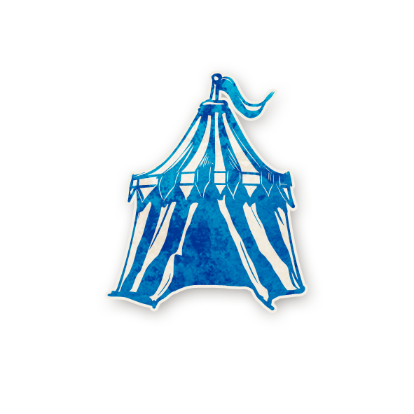
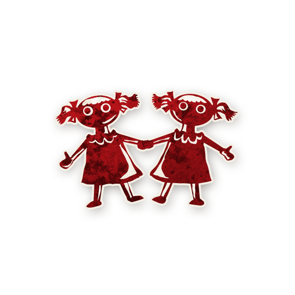
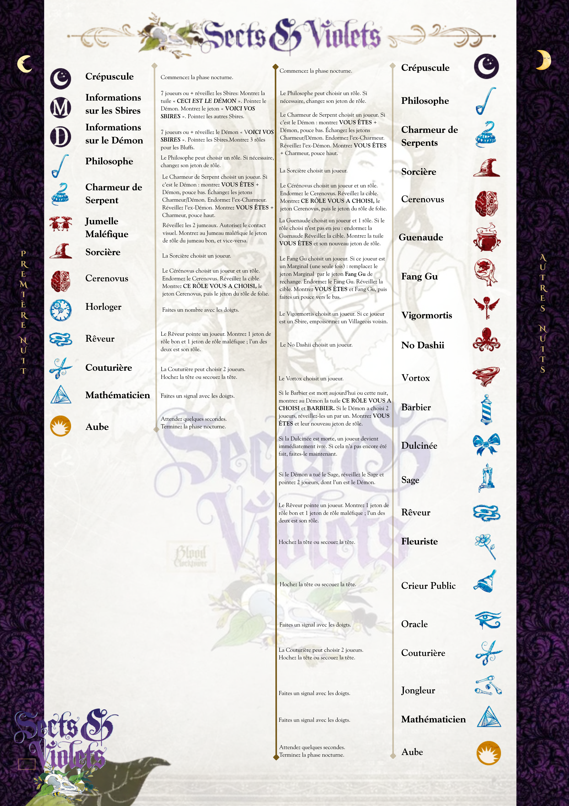

  

<!--  Logo centré cliquable -->

  <a href="./sv.html" style="text-decoration:none;">
    
     
    Sects & Violets
  </a>

  « Quand la beauté fleurit, la folie n’est jamais loin… »

<!-- LISTE DES RÔLES À DROITE, JUSTE SOUS LE LOGO -->

  

    Les Rôles de Sects &amp; Violets
  

  <!-- Villageois -->
  
Villageois

  <ul style="list-style:none; padding-left:0; margin-top:0; margin-bottom:10px;">
    <li><a href="./sv_roles/horloger.html" style="color:#4ea3ff; text-decoration:none;">Horloger</a></li>
    <li><a href="./sv_roles/reveur.html" style="color:#4ea3ff; text-decoration:none;">Rêveur</a></li>
    <li><a href="./sv_roles/charmeurdeserpent.html" style="color:#4ea3ff; text-decoration:none;">Charmeur de Serpents</a></li>
    <li><a href="./sv_roles/mathematicien.html" style="color:#4ea3ff; text-decoration:none;">Mathématicien</a></li>
    <li><a href="./sv_roles/fleuriste.html" style="color:#4ea3ff; text-decoration:none;">Fleuriste</a></li>
    <li><a href="./sv_roles/crieur.html" style="color:#4ea3ff; text-decoration:none;">Crieur</a></li>
    <li><a href="./sv_roles/oracle.html" style="color:#4ea3ff; text-decoration:none;">Oracle</a></li>
    <li><a href="./sv_roles/savant.html" style="color:#4ea3ff; text-decoration:none;">Savant</a></li>
    <li><a href="./sv_roles/couturiere.html" style="color:#4ea3ff; text-decoration:none;">Couturière</a></li>
    <li><a href="./sv_roles/philosophe.html" style="color:#4ea3ff; text-decoration:none;">Philosophe</a></li>
    <li><a href="./sv_roles/artiste.html" style="color:#4ea3ff; text-decoration:none;">Artiste</a></li>
    <li><a href="./sv_roles/jongleur.html" style="color:#4ea3ff; text-decoration:none;">Jongleur</a></li>
    <li><a href="./sv_roles/sage.html" style="color:#4ea3ff; text-decoration:none;">Sage</a></li>
  </ul>

  <!-- Marginaux -->
  
Marginaux

  <ul style="list-style:none; padding-left:0; margin-top:0; margin-bottom:10px;">
    <li><a href="./sv_roles/mutant.html" style="color:#4ea3ff; text-decoration:none;">Mutant</a></li>
    <li><a href="./sv_roles/barbier.html" style="color:#4ea3ff; text-decoration:none;">Barbier</a></li>
    <li><a href="./sv_roles/dulcinee.html" style="color:#4ea3ff; text-decoration:none;">Dulcinée</a></li>
    <li><a href="./sv_roles/maladroit.html" style="color:#4ea3ff; text-decoration:none;">Maladroit</a></li>
  </ul>

  <!-- Sbires -->
  
Sbires

  <ul style="list-style:none; padding-left:0; margin-top:0; margin-bottom:10px;">
    <li><a href="./sv_roles/sorciere.html" style="color:#c97a7a; text-decoration:none;">Sorcière</a></li>
    <li><a href="./sv_roles/cerenovus.html" style="color:#c97a7a; text-decoration:none;">Cerenovus</a></li>
    <li><a href="./sv_roles/pithag.html" style="color:#c97a7a; text-decoration:none;">Pit-Hag</a></li>
    <li><a href="./sv_roles/jumeaumalefique.html" style="color:#c97a7a; text-decoration:none;">Jumelle Maléfique</a></li>
  </ul>

  <!-- Démons -->
  
Démons

  <ul style="list-style:none; padding-left:0; margin-top:0; margin-bottom:6px;">
    <li><a href="./sv_roles/fanggu.html" style="color:#c97a7a; text-decoration:none;">Fang Gu</a></li>
    <li><a href="./sv_roles/vigormortis.html" style="color:#c97a7a; text-decoration:none;">Vigormortis</a></li>
    <li><a href="./sv_roles/nodashii.html" style="color:#c97a7a; text-decoration:none;">No Dashii</a></li>
    <li><a href="./sv_roles/vortox.html" style="color:#c97a7a; text-decoration:none;">Vortox</a></li>
  </ul>

---

##  Sommaire

<ol style="color:#d67bff; font-size:18px; line-height:1.7;">
  <li><a href="#-synopsis" style="color:#f5f5f5; text-decoration:none;">Synopsis</a></li>
  <li><a href="#-gameplay" style="color:#f5f5f5; text-decoration:none;">Gameplay</a></li>
  <li><a href="#villageois" style="color:#f5f5f5; text-decoration:none;">Villageois</a></li>
  <li><a href="#étrangers" style="color:#f5f5f5; text-decoration:none;">Étrangers</a></li>
  <li><a href="#sbires" style="color:#f5f5f5; text-decoration:none;">Sbires</a></li>
  <li><a href="#démons" style="color:#f5f5f5; text-decoration:none;">Démons</a></li>
  <li><a href="#-télécharger--imprimer" style="color:#f5f5f5; text-decoration:none;">Télécharger &amp; Imprimer</a></li>
</ol>

---

##  Synopsis

Le printemps vibrant laisse place à un été doux et accueillant.  
Des fleurs de toutes sortes s’épanouissent à perte de vue, soigneusement entretenues dans les jardins publics et les jardinières suspendues le long de la promenade.  
Les oiseaux chantent, les artistes peignent, et les philosophes méditent sur les grands mystères de la vie dans une taverne animée, tandis qu’un cirque dresse son chapiteau coloré à la lisière de la ville.

Alors que les villageois profitent de la frivolité et des festivités, se laissant aller au vin et aux rires, des forces sombres se rassemblent dans l’ombre.  
Sorcières et cultistes rôdent dans les ruines majestueuses qui bordent la cité, organisant des réunions secrètes dans les cavernes souterraines et complotant avec malveillance la chute de Ravenswood Bluff et de ses habitants insouciants.

Le moment est venu pour... Sects & Violets.

---

##  Gameplay

Sects & Violets est l’édition la plus folle et imprévisible des trois.  
Les Villageois reçoivent chaque nuit des informations puissantes, mais l’équipe du Mal dispose d’outils terriblement variés pour semer la confusion.

Les rôles changent d’alignement.  
Les joueurs changent de rôle.  
Même les Maléfiques peuvent perdre le fil de qui est qui.  
C’est aussi la première apparition de la <strong>Folie</strong>, qui peut complètement bouleverser la partie.

 Niveau : <strong>Intermédiaire à Avancé</strong> 
<em>*Recommandé pour les joueurs et joueuses aimant le chaos, la folie; les retournements inattendus et les défis logiques audacieux.*</em>

---

## [**Villageois**](villageois.html)

    
  [**Horloger**](sv_roles/horloger.html)

    
  [**Rêveur**](sv_roles/reveur.html)

    
  [**Charmeur de Serpents**](sv_roles/charmeurdeserpent.html)

    
  [**Mathématicien**](sv_roles/mathematicien.html)

    
  [**Fleuriste**](sv_roles/fleuriste.html)

    
  [**Crieur**](sv_roles/crieur.html)

    
  [**Oracle**](sv_roles/oracle.html)

    
  [**Savant**](sv_roles/savant.html)

    
  [**Couturière**](sv_roles/couturiere.html)

    
  [**Philosophe**](sv_roles/philosophe.html)

    
  [**Artiste**](sv_roles/artiste.html)

    
  [**Jongleur**](sv_roles/jongleur.html)

    
  [**Sage**](sv_roles/sage.html)

---

## [**Étrangers**](etrangers.html)

    
  [**Mutant**](sv_roles/mutant.html)

    
  [**Barbier**](sv_roles/barbier.html)

    
  [**Dulcinée**](sv_roles/dulcinee.html)

    
  [**Maladroit**](sv_roles/maladroit.html)

---

## [**Sbires**](sbires.html)

    
  [**Sorcière**](sv_roles/sorciere.html)

    
  [**Cerenovus**](sv_roles/cerenovus.html)

    
  [**Pit-Hag**](sv_roles/pithag.html)

    
  [**Jumelle Maléfique**](sv_roles/jumeaumalefique.html)

---

## [**Démons**](demons.html)

    
  [**Fang Gu**](sv_roles/fanggu.html)

    
  [**Vigormortis**](sv_roles/vigormortis.html)

    
  [**No Dashii**](sv_roles/nodashii.html)

    
  [**Vortox**](sv_roles/vortox.html)

---

##  Télécharger &amp;  Imprimer

Ces ressources sont pratiques pour <strong>imprimer</strong> et <strong>jouer en personne</strong>.

 <a href="./images/sv-roles.pdf" style="color:#d67bff; font-weight:bold; text-decoration:none;"> Télécharger le PDF de Sects &amp; Violets</a>

  
  
  

---

<ul style="color:#e0c99d; font-size:18px; line-height:1.7;">
  <li> <a href="./index.html" style="color:#f5f5f5; font-weight:bold; text-decoration:none;">Retour à la page d’accueil</a></li>
  <li> <a href="./trouble_brewing.html" style="color:#b58b52; font-weight:bold; text-decoration:none;">Trouble Brewing</a></li>
  <li> <a href="./bmr.html" style="color:#ffa64d; font-weight:bold; text-decoration:none;">Bad Moon Rising</a></li>
</ul>
