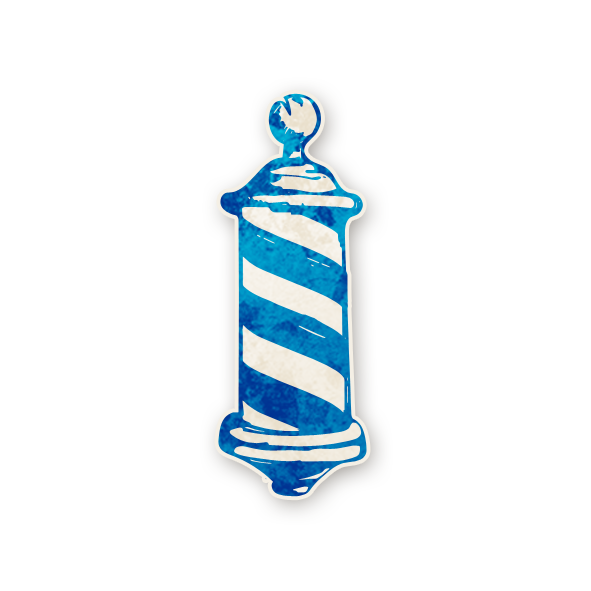

<!-- 🔷 Logo en haut à gauche -->

  

---

## 💈 Barbier

  <a href="./barbier.html" style="text-decoration:none;">
    
     
    Barbier
  </a>

---

## ℹ️ Information  

- **Type :** [**Étranger**](../etrangers.md)  
- **Artiste :** Aidan Roberts  
> *« Saviez-vous qu’autrefois, les barbiers étaient aussi chirurgiens ?  
Non ? Eh bien maintenant, vous le savez. »*

---

## 🎭 Apparaît dans  

  <a href="../sv.html" style="text-decoration:none;">
    
     
    Sects & Violets
  </a>

> *Cult of the Clocktower – épisode par Andrew Nathenson*

---

## 📖 Résumé  

> « Si vous êtes mort aujourd’hui ou cette nuit, 
> le Démon peut choisir 2 joueurs (pas un autre Démon) pour échanger leurs rôles. »

Quand le Barbier meurt, le Démon peut semer le chaos  
en intervertissant les rôles de deux joueurs de son choix.  

Leurs **alignements ne changent pas**,  
mais chacun découvre immédiatement **le nouveau rôle** qu’il obtient.  
Le Démon peut aussi **ne rien faire**.

---

## 🎬 Comment Conter  

1. Si le Barbier meurt, placez le jeton de rappel **“COUPES DE CHEVEUX CETTE NUIT”**.  
2. Cette nuit-là, **réveillez le Démon** :  
   - Montrez-lui le jeton *“ce rôle t’a choisi”* puis le jeton du Barbier.  
   - Il peut soit :  
     - refuser (secoue la tête),  
     - soit **désigner deux joueurs** (vivants ou morts).  
3. Si deux joueurs sont désignés :  
   - **Échangez leurs jetons de rôle**,  
   - Réveillez-les un par un pour leur montrer leur nouveau rôle,  
   - Rappelez-leur que **leur alignement ne change pas**.  
4. Retirez ensuite le jeton de rappel “COUPES DE CHEVEUX CETTE NUIT”.  

> ⚠️ Le Démon ne peut pas choisir un autre Démon,  
> mais peut choisir **lui-même** pour participer à l’échange.

---

## 🧾 Exemples  

- Le Barbier meurt. Le Démon **envisage** de permuter le [Horloger](horloger.md) et le [Jongleur](jongleur.md),  
  mais renonce finalement.  

- Le Barbier meurt. Le Démon **échange** le [Charmeur de Serpents](charmeur.md) vivant avec le Barbier mort :  
  → Le Barbier devient vivant, et le Charmeur est maintenant mort.  

- Le [Vortox](vortox.md) se **remplace** lui-même avec la [Sorcière](sorciere.md).  

- Le [Vigormortis](vigormortis.md) échange sa place avec une [Dulcinée](dulcinee.md) morte,  
  devenant ainsi un “mauvais” Sweetheart — la partie continue grâce à un Démon bon créé la nuit précédente.  

---

## 💡 Astuces & Conseils  

### ✂️ Ne mourez pas trop tôt
Votre mort offre **un pouvoir monstrueux au Démon**.  
Il peut bouleverser les alliances, rendre les informations fausses,  
et semer la panique dans tout le village.  

Protégez-vous, ou **bluffez un rôle que le Démon évitera**,  
comme le [Sage](sage.md) ou un rôle “épuisé” (ex. [Artiste](artiste.md), [Jongleur](jongleur.md)).  

---

### 😶 Si vous mourez malgré tout  
- **Annoncez votre rôle** après un court délai :  
  cela laisse aux autres joueurs le temps de révéler s’ils ont été changés.  
  (Cela renforcera votre crédibilité quand vous parlerez ensuite.)  

- Si vous pensez que **tous les Sbires sont morts**,  
  mourir peut même être **bénéfique** :  
  le Démon ne pourra échanger que des bons joueurs (ou rien du tout).  

---

### 💀 Pour le Démon
comme le [Sage](sage.md) ou un rôle “épuisé” (ex. [Artiste](artiste.md), [Jongleur](jongleur.md)).  
- **Échanger deux Sbires** peut brouiller totalement les informations ([Fleuriste](fleuriste.md), [Savant](savant.md), etc.).  
- **Échanger deux bons rôles** peut neutraliser un personnage gênant ([Philosophe](philosophe.md), [Sage](sage.md)…).  
- **Échanger un bon et un mauvais joueur** est risqué,  
  car un bon joueur avec une capacité maléfique peut trahir sans le vouloir.  
- Parfois, **ne rien faire** est la meilleure option :  
  les joueurs douteront du Barbier ou croiront à un échange d’évil.  

---

## 🎭 Bluff en tant que Barbier  

### 😈 Pour les joueurs maléfiques
- Les vrais Barbiers se dévoilent rarement.  
  → Imitation simple : **restez discret·ète** ou prétendez un autre rôle.  

- Vous pouvez aussi annoncer tôt que vous êtes le Barbier :  
  la plupart des joueurs préféreront vous garder en vie pour éviter un chaos prématuré.  

- Si vous mourez, aucun bon joueur ne dira avoir été échangé :  
  vous devrez donc **convaincre** que le Démon n’a rien fait  
  ou qu’il a échangé **deux Sbires**.  

- **Combo maléfique** :  
  si vous êtes trois (ex. Démon + deux Sbires),  
  faites mourir votre “Barbier” fictif, puis vos complices  
  annoncent s’être “échangés”.  
  → Vous gagnez la confiance totale du village.  

---

<ul style="color:#e0c99d; font-size:18px; line-height:1.7;">
  <li>🏠 <a href="/botc-fr-bambi/" style="color:#d4a76a; font-weight:bold; text-decoration:none;">Retour à l’accueil</a></li>
  <li>🌸 <a href="../sv.html" style="color:#d4a76a; font-weight:bold; text-decoration:none;">Sects & Violets</a></li>
  <li>🍺 <a href="../trouble_brewing.html" style="color:#d4a76a; font-weight:bold; text-decoration:none;">Trouble Brewing</a></li>
  <li>🌛 <a href="../bmr.html" style="color:#d4a76a; font-weight:bold; text-decoration:none;">Bad Moon Rising</a></li>
  <li>🧑‍🌾 <a href="../etrangers.html" style="color:blue; font-weight:bold; text-decoration:none;">Catégorie : Étrangers</a></li>
</ul>

