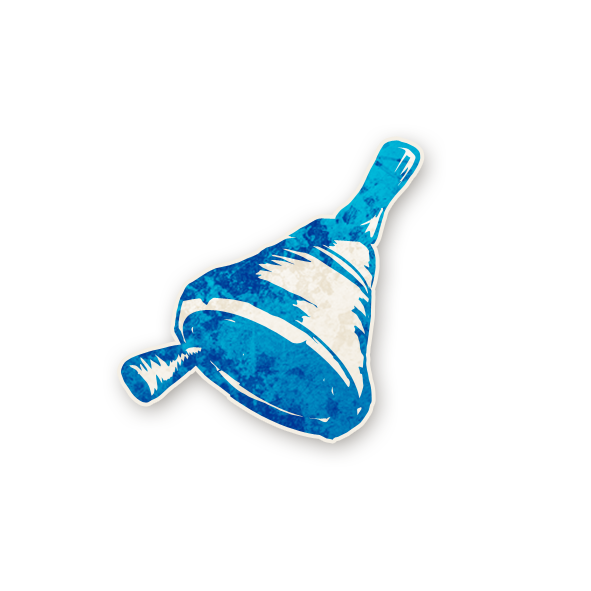

<!-- 🔷 Logo en haut à gauche -->

  

---

## 🔔 Crieur

  <a href="./crieur.html" style="text-decoration:none;">
    
     
    Crieur
  </a>

---

## ℹ️ Information  

- **Type :** [**Villageois**](../villageois.md)  
- **Artiste :** Aidan Roberts  
> *« Ôyez ! Ôyez ! Sorcellerie dans le labyrinthe !  
Un savant génial dévoile tout ! Le village est en danger ! Ôyez, ôyez ! »*

---

## 🎭 Apparaît dans  

  <a href="../sv.html" style="text-decoration:none;">
    
     
    Sects & Violets
  </a>

> *Cult of the Clocktower – épisode par Andrew Nathenson*

---

## 📖 Résumé  

> « Chaque nuit*, vous apprenez si un [Sbire](../sbires.md) a nommé aujourd’hui. »

Le Crieur sait si un [Sbire](../sbires.md) a effectué une **nomination**.  

Chaque nuit, le Crieur apprend **“oui”** ou **“non”** :  
- Il ne sait **pas combien** de Sbires ont nommé,  
- ni **lesquels** ont fait une nomination — seulement si **au moins un** l’a fait.  

---

## 🎬 Comment Conter  

- À chaque aube, placez à côté du rôle du Crieur un jeton **SBIRE N’A PAS NOMMÉ** et retirez **SBIRE A NOMMÉ** s’il existe.  
- Pendant la journée, si un [Sbire](../sbires.md) fait une nomination,  
  remplacez le jeton de rappel un **SBIRE N’A PAS NOMMÉ** par un **SBIRE A NOMMÉ**.  
- Chaque nuit (sauf la première), réveillez le Crieur :  
  - Si un “SBIRE N’A PAS NOMMÉ” → secouez la tête (non).  
  - Si un “SBIRE A NOMMÉ” → hochez la tête (oui).  
  - Puis rendormez le Crieur.  
- Retirez ensuite tous les jetons de rappel “SBIRE A NOMMÉ”.  

> 💤 Si vous avez un doute, réveillez chaque [Sbire](../sbires.md) la nuit et montrez-lui le jeton *“As-tu nommé aujourd’hui ?”*.  
Ils doivent répondre honnêtement avant de se rendormir.

---

## 🧾 Exemples  

- Quatre joueurs ont nommé aujourd’hui.  
  Deux d’entre eux sont des [Sbires](../sbires.md).  
  Beaucoup ont voté, mais personne n’a été exécuté.  
  → Cette nuit-là, le Crieur apprend **“oui”**.  

- Un [Sbire](../sbires.md) a demandé l’exil d’un Voyageur, et celui-ci a été exilé.  
  → Le Crieur apprend **“non”**, car les exils ne sont **jamais** affectés par les capacités.

---

## 💡 Astuces & Conseils  

- **Soyez attentif** à qui nomine chaque jour !  
  Votre pouvoir n’a de valeur que si vous suivez les nominations en direct.  
  Les joueurs maléfiques mentiront volontiers sur qui a nommé,  
  et les bons joueurs peuvent l’oublier après plusieurs jours.  

- Essayez de **faire nominer des joueurs différents** chaque jour.  
  Plus vous couvrez de monde, plus votre information devient puissante.  

- Un “non” ne veut **pas forcément dire sécurité** —  
  le [Démon](../demons.md) pourrait avoir nommé à la place des Sbires.  
  En revanche, un “oui” est très précieux :  
  vous savez qu’un [Sbire](../sbires.md) a agi aujourd’hui.  

- Attention à la [Sorcière](sorciere.md) :  
  elle veut aussi que les gens nomment, car cela augmente ses chances de tuer.  
  Essayez de deviner sa cible : les joueurs agressifs ou ceux qui nominent souvent sont de bons candidats.  

- Face à un [Jumeau Maléfique](jumeaumalefique.md),  
  vous pouvez demander à **un seul des deux jumeaux de nominer**.  
  Si vous obtenez “oui”, vous saurez lequel est le [Sbire](../sbires.md)…  
  sauf en cas de [Vortox](vortox.md) ou d’empoisonnement, donc croisez vos infos !  

- Vous avez une **synergie naturelle** avec la [Fleuriste](fleuriste.md) :  
  pendant qu’elle surveille les votes, vous suivez les nominations.  
  Ensemble, vous pouvez repérer les comportements suspects.  

- Si vous découvrez qu’un joueur est un [Sbire](../sbires.md) en début de partie, exécutez-le vite.  
  Mais si c’est en fin de partie, gardez-le en vie : le vrai but est de **tuer le [Démon](../demons.md)**, pas ses Sbires.

---

## 🎭 Bluff en tant que Crieur  

- Utilisez votre prétendu pouvoir pour **diriger les nominations** :  
  les bons joueurs voudront prouver qu’ils ne sont pas [Sbires](../sbires.md)  
  et suivront volontiers vos suggestions.  
  Cela peut être mortel si une [Sorcière](sorciere.md) est en jeu 😈.  

- Donnez des **infos inversées** :  
  dites “non” quand un [Sbire](../sbires.md) a nommé,  
  et “oui” quand aucun ne l’a fait.  
  Cela brouille complètement la piste des bons joueurs.  

- En fin de partie, vous pouvez même **accuser vos propres alliés maléfiques** :  
  révéler qu’un [Sbire](../sbires.md) est un “Sbire découvert” vous rend crédible,  
  et il sera trop tard pour qu’ils soient exécutés avant la fin du jeu.  

- Sur le dernier jour, accuser le [Démon](../demons.md) d’être un simple [Sbire](../sbires.md)  
  peut détourner le vote fatal loin de lui.  
  (Ne le faites pas trop tôt, sinon ils pourraient quand même l’exécuter “par précaution”.)  

- En cas de [Jumeaux Maléfiques](jumeaumalefique.md),  
  prétendez que **le bon jumeau** a déclenché votre capacité.  
  Cela peut semer un doute durable dans la tête du village.  

- Quand tous les [Sbires](../sbires.md) sont morts,  
  évitez d’en inventer d’autres.  
  Dans *Sects & Violets*, leurs actions sont souvent visibles (transformations, meurtres, folies).  
  Si tout est calme, persister à dire qu’il reste un Sbire éveillera les soupçons contre vous.

---

<ul style="color:#e0c99d; font-size:18px; line-height:1.7;">
  <li>🏠 <a href="../index.html" style="color:#d4a76a; font-weight:bold; text-decoration:none;">Retour à l’accueil</a></li>
  <li>🌸 <a href="../sv.html" style="color:#d4a76a; font-weight:bold; text-decoration:none;">Sects & Violets</a></li>
</ul>
