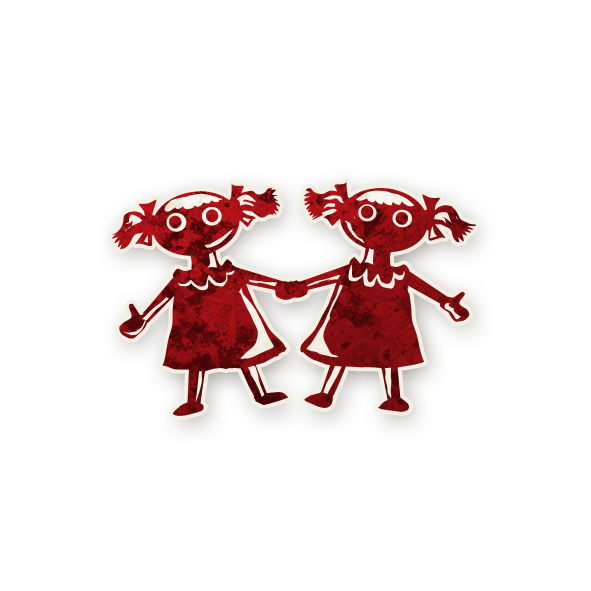

<!-- 🔴 Logo en haut à gauche -->

  

---

## 👯 Jumeau Maléfique

<!-- 🩸 Image centrée cliquable avec nom -->

  <a href="./jumeaumalefique.html" style="text-decoration:none;">
    
     
    Jumeau Maléfique
  </a>

---

## ℹ️ Information  

- **Type :** [**Sbire**](../sbires.md)  
- **Artiste :** Aidan Roberts  
> *« Je ne suis pas Sara ! Je suis Clara ! C’est **elle** Sara ! C’est **elle** la mauvaise ! Pas moi ! »*

---

## 🎭 Apparaît dans  

  <a href="../sv.html" style="text-decoration:none;">
    
     
    Sects & Violets
  </a>

> *Cult of the Clocktower – épisode par Andrew Nathenson*

---

## 📖 Résumé  

> « Vous et un joueur d’alignement opposé vous connaissez.  
> Si le joueur bon est exécuté, les Maléfiques gagnent.  
> Le Bien ne peut pas gagner si vous êtes tous deux en vie. »

Le **Jumeau Maléfique** est un sbire qui crée un lien miroir avec un joueur bon appelé le **Jumeau Bon**.  
Chacun connaît le rôle de l’autre.  
Toute la tension du jeu repose sur la confusion : lequel des deux dit la vérité ?
L'Équipe des **gentils** ne savent pas quel jumeau est bon et quel jumeau est maléfique.

- Si le **Jumeau Bon** est exécuté → 💀 le Mal gagne immédiatement.  
- Si le **Jumeau Maléfique** est exécuté → la partie continue.  
- Tant que les deux sont vivants → le Bien ne peut pas gagner, même si le Démon meurt.  

---

## 🎬 Comment Conter  

1. **Avant la première nuit :**  
   - Choisissez un joueur bon et placez sur sa fiche le jeton de rappel *Jumeau*.  

2. **Première nuit :**  
   - Réveillez les deux Jumeaux.  
   - Laissez-les se reconnaître.  
   - Montrez au Jumeau Bon le jeton de rappel *Jumeau Maléfique*.  
   - Montrez au Jumeau Maléfique le jeton du rôle du Jumeau Bon.  

3. **Pendant la partie :**  
   - Si le Jumeau Bon est exécuté → les Maléfiques gagnent.  
   - Si le Jumeau Maléfique est exécuté → la partie continue.  
   - Tant que les deux sont en vie, le camp du Bien ne peut pas gagner.  

> 💡 Si lors de la dernière nuit, une [Pit-Hag](pithag.md) crée un nouveau Jumeau Maléfique,  
> choisissez un joueur mort ou le Démon comme second jumeau pour ne pas bloquer la partie, 
> afin que la bonne équipe puisse toujours gagner.
> Évitez de choisir un Voyageur comme Jumeau.

---

## 🧾 Exemples  

- Les deux Jumeaux prétendent être l’[Horloger](horloger.md).  
  Le Jumeau Maléfique est exécuté : la partie continue.  

- La [Pit-Hag](pithag.md) transforme le [Savant](./savant.md) (le Jumeau Bon) en [Mutant](./mutant.md).  
  Les deux prétendent être le Mutant. Le Conteur exécute le Jumeau Bon : **les Maléfiques gagnent.**  

- Les deux Jumeaux se disent [Artistes](./artiste.md).  
  Le village exécute le Démon, mais la nuit suivante il n’y a pas de morts : le Jumeau Maléfique vit encore.  

- La [Pit-Hag](pithag.md) transforme un joueur bon en Jumeau Maléfique, mais il reste bon.  
  Le village l’exécute : **le Mal gagne.**

---

## 💡 Astuces & Stratégies  

### 🔴 👯 Pour le Jumeau Maléfique  

- **Retournez la situation.**  
  Dites que l’autre est le Jumeau Maléfique et répétez-le sans relâche.  

- **Imitez son rôle.**  
  Vous connaissez le rôle du Jumeau Bon, bluffez le même pour maintenir le doute.  

- **Jouez la peur et la passion.**  
  Le Jumeau Bon se bat pour ne pas être exécuté ; imitez-le pour paraître sincère.  

- **Manipulez le risque.**  
  “Si vous me tuez et que je suis le bon, vous faites gagner les Maléfiques !”  
  Cette phrase bloque souvent les votes.  

- **Travaillez avec les autres Sbires.**  
  Le [Cerenovus](cerenovus.md) peut rendre le Jumeau Bon fou d'être un autre rôle,  
  et la [Sorcière](./sorciere.md) peut le maudire pour le condamner lors d'une nomination.  

- **Le Démon peut cesser de tuer.**  
  Si les morts s’arrêtent, les bons croiront que le Démon est mort,  
  ce qui renforce votre bluff.

---

### 🔵 Pour le camp du Bien  

- **Ne vous précipitez pas.**  
  Attendez plusieurs jours d’informations avant d’exécuter l’un des deux Jumeaux.  

- **Comparez les récits.**  
  Le vrai Jumeau Bon sera cohérent, tandis que le Maléfique improvisera.  

- **Observez les comportements.**  
  Le Jumeau Maléfique parle souvent trop ou répète ses arguments.  

---

### 👍🏻 Rôles utiles contre le Jumeau Maléfique  

- [Crieur](crieur.md) – détecte si un Jumeau a fait une nomination.  
- [Jongleur](jongleur.md) – peut deviner qui est le Jumeau Maléfique.  
- [Couturière](couturiere.md) – compare les alignements.  
- [Horloger](horloger.md) – peut aider à identifier le Démon et donc le Jumeau.  

---

## 🎭 Bluff et Variantes  

- **Niez tout.**  
  Prétendez qu’il n’y a pas de Jumeau et accusez votre double de mentir.  

- **Double bluff.**  
  Jouez le rôle du “Jumeau Bon” sincère pour tromper le village.  

- **Fausse paire maléfique.**  
  Deux sbires peuvent se désigner mutuellement comme Jumeaux pour semer la confusion.  

---

## ⚔️ Combattre le Jumeau Maléfique  

- Si **un seul joueur accuse un autre** d’être le Jumeau Maléfique,  
  croyez **l’accusateur** : il est souvent le vrai Jumeau Bon.  

- Si **les morts cessent soudainement**, le Démon a probablement été tué,  
  mais la partie continue : le Jumeau Maléfique est toujours vivant.  

- Pour gagner, le Bien doit exécuter **le Démon ET le Jumeau Maléfique**.  

---

<ul style="color:#e0c99d; font-size:18px; line-height:1.7;">
  <li>🏠 <a href="/botc-fr-bambi/" style="color:#d4a76a; font-weight:bold; text-decoration:none;">Retour à l’accueil</a></li>
  <li>🔴 <a href="../sbires.html" style="color:red;" font-weight:bold; text-decoration:none;">Sbires</a></li> 
  <li>🌸 <a href="../sv.html" style="color:#d4a76a; font-weight:bold; text-decoration:none;">Sects & Violets</a></li>
  <li>🍺 <a href="../tb.html" style="color:#d4a76a; font-weight:bold; text-decoration:none;">Trouble Brewing</a></li>
  <li>🌛 <a href="../bmr.html" style="color:#d4a76a; font-weight:bold; text-decoration:none;">Bad Moon Rising</a></li>
</ul>
