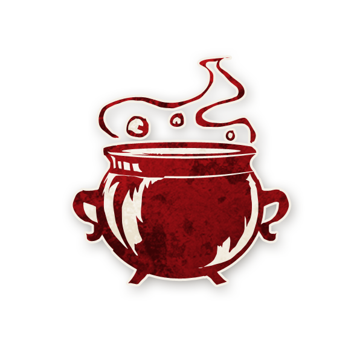

<!-- 🔴 Logo en haut à gauche -->

  

---

## 🔮 Pit-Hag  

<!-- 🩸 Image centrée cliquable -->

  <a href="./pithag.html" style="text-decoration:none;">
    
     
    Pit-Hag
  </a>

---

## ℹ️ Information  

- **Type :** [**Sbire**](../sbires.html)  
- **Artiste :** Aidan Roberts  
> *« Faites tourner le chaudron ; jetez-y des entrailles empoisonnées. Crapaud, qui sous la pierre froide a dormi trente et une nuits, ton venin bouilli sera la première offrande dans ce breuvage maudit. »*

---

## 🎭 Apparaît dans  

  <a href="../sv.html" style="text-decoration:none;">
    
     
    Sects & Violets
  </a>

> *Cult of the Clocktower – épisode par Andrew Nathenson*

---

## 📖 Résumé  

> « Chaque nuit*, choisissez un joueur et un rôle qu’il devient (s’il n’est pas déjà en jeu).
> Si un Démon est créé, les morts de cette nuit sont arbitraires. »

La **Pit-Hag** transforme les joueurs en d’autres rôles !  
Chaque nuit (sauf la première), elle choisit un joueur et un rôle qui n’est pas déjà présent dans la partie.  
Si ce rôle est déjà en jeu, rien ne se passe.  

---

## 🎬 Comment Conter  

1. **Chaque nuit (sauf la première) :**  
   - Réveillez la Pit-Hag.  
   - Elle pointe un joueur et un rôle sur sa fiche.  
   - Puis endormez la Pit-Hag.  

2. **Si le rôle choisi est déjà en jeu**, rien ne se passe.  
3. **Sinon :**  
   - Réveillez le joueur choisi.  
   - Montrez-lui le jeton de rappel  **VOUS ÊTES**, puis celui du **nouveau rôle**, puis endormez-le.  
   - Remplacez son ancien jeton de rôle par le nouveau.  
   - Rappelez-lui discrètement que son alignement ne change pas (pouce levé 👍🏻"Bon", pouce baissé 👎🏻 "Maléfique").  

4. **Si un Démon est créé :**  
- Si **la Pit-Hag** transforme un Démon en un nouveau Démon, il est préférable qu’**aucune mort n’ait lieu cette nuit-là**, 
  afin que l’équipe du bien puisse comprendre que le Démon a changé.
- Vous pouvez même **réveiller le Démon**, observer **qui il choisit d’attaquer**, puis décider que **personne ne meurt**.
- Si **la Pit-Hag** crée **un nouveau Démon maléfique**, il est conseillé de **tuer l’ancien Démon ainsi qu’un autre joueur**, 
  afin d’indiquer à l’équipe du bien que le Démon a été remplacé.
- Si **la Pit-Hag** crée **un Démon bon**, il est préférable soit de **tuer l’un des Démons** (si c’est la dernière nuit), 
  soit de **laisser les deux Démons semer le chaos** (si ce n’est pas la dernière nuit).
- Cependant, comme **tous les Démons doivent mourir pour que le bien l’emporte**, agissez avec prudence.
- Vous pouvez décider des morts ou des protections supplémentaires pour équilibrer la partie.  
- Ces morts sont considérées comme des attaques de la Pit-Hag.  

---

## 🧾 Exemples  

- La Pit-Hag transforme l’[Horloger](horloger.md) en [Mutant](mutant.md).  
- Elle tente de changer le [Savant](savant.md) en [Sage](sage.md), mais rien ne se passe car un Sage existe déjà.  
- Elle transforme le [Fleuriste](fleuriste.md) en [Jumeau Maléfique](jumeau_malefique.md).  
  Un nouveau duo de jumeaux est alors réveillé pour s’identifier mutuellement.  
- Durant la dernière nuit, elle change l’[Oracle](oracle.md) en un bon [No Dashii](nodashii.md).  
  Le Conteur tue l’ancien Démon pour qu’il n’en reste qu’un seul le lendemain.  

---

## 💡 Astuces & Stratégies  

### 🔴 En tant que Pit-Hag  

- Vous changez **le rôle**, mais pas **l’alignement**.  
  Un joueur bon transformé en [Sorcière](sorciere.md) restera bon… mais maudira quand même les autres !  
  Un sbire transformé en [Philosophe](philosophe.md) sera désormais un Villageois maléfique.  

- **Créez des Démons !**  
  Vous pouvez transformer un allié en nouveau Démon ou même créer un Démon bon.  
  Mais attention : le Conteur équilibrera toujours les morts pour éviter plusieurs Démons en vie.  

- **Changez les Villageois puissants.**  
  Un [Savant](savant.md) gênant ? Faites-en un [Rêveur](reveur.md) ou un [Maladroit](maladroit.md) !  

- **Coordonnez-vous avec votre équipe maléfique.**  
  Évitez de transformer la même cible que votre Démon tue cette nuit.  

- **Jouez avec les alignements.**  
  Un Démon transformé en autre Démon ne fera souvent **aucune mort** : les villageois remarqueront qu’il s’est passé quelque chose.  

- **Transformez-vous !**  
  Si vous êtes trop repérée, changez-vous en autre rôle pour brouiller les pistes.  
  (Mais cela mettra fin à vos transformations.)  

- **Faites semblant d’avoir agi même quand vous ne l’avez pas fait.**  
  Faites annoncer par un complice qu’il a été transformé : cela renforce votre bluff.  

- **Arrêtez d’agir à temps.**  
  Quand les transformations cessent, les joueurs penseront que la Pit-Hag est morte…  
  ce qui rend les morts précédentes encore plus confuses.  

---

### 🔵 Pour le camp du Bien  

- **Annoncez publiquement les transformations.**  
  Si vous changez de rôle, dites-le : cela prouvera souvent que vous êtes du bon côté.  

- **Tant qu’il y a des transformations, la Pit-Hag est vivante.**  
  Les morts exécuté·es jusque-là sont donc sûrement bons.  

- **Pas de transformation une nuit ?**  
  Alors soit la Pit-Hag a choisi un rôle déjà en jeu, soit elle a transformé un joueur maléfique,  
  soit elle est morte. Analysez ces possibilités !  

- **Plusieurs morts la même nuit ?**  
  Cela signifie qu’un **nouveau Démon a été créé**.  
  Observez les changements de comportements ou de rôles : c’est un indice crucial.  

- **Un bon joueur transformé en Démon reste bon.**  
  Il peut donc tuer les mauvais ! Mais pour que le Bien gagne, **tous les Démons (même bons)** doivent mourir.  

- **Bluffez intelligemment.**  
  Si vous prétendez être un rôle que la Pit-Hag ne voudra pas créer (comme la [Dulcinée](dulcinee.md)),  
  vous réduisez vos chances d’être ciblé·e.  

---
 
<ul style="color:#e0c99d; font-size:18px; line-height:1.7;">
  <li>🏠 <a href="/botc-fr-bambi/" style="color:#d4a76a; font-weight:bold; text-decoration:none;">Retour à l’accueil</a></li>
  <li>🌸 <a href="../sv.html" style="color:#d4a76a; font-weight:bold; text-decoration:none;">Sects & Violets</a></li>
  <li>🍺 <a href="../trouble_brewing.html" style="color:#d4a76a; font-weight:bold; text-decoration:none;">Trouble Brewing</a></li>
  <li>🌛 <a href="../bmr.html" style="color:#d4a76a; font-weight:bold; text-decoration:none;">Bad Moon Rising</a></li>
  <li>😈 <a href="../sbires.html" style="color:red; font-weight:bold; text-decoration:none;">Catégorie : Sbires</a></li>
</ul>
