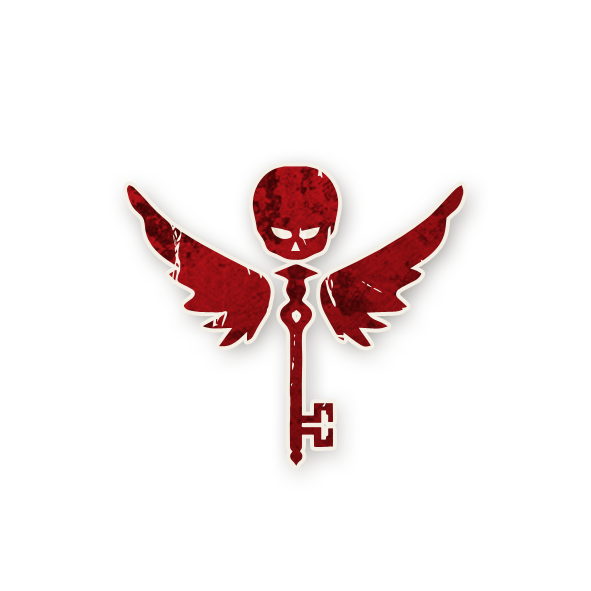

<!-- 🔴 Logo en haut à gauche -->

  

---

## 💀 Vigormortis

<!-- 🧩 Image centrée cliquable -->

  <a href="./vigormortis.html" style="text-decoration:none;">
    
     
    Vigormortis
  </a>

---

## ℹ️ Information  

- **Type :** [**Démon**](../demons.html)  
- **Artiste :** Steven Medway  
> *« Toutes les portes sont une porte. Toutes les clés sont une clé.  
> Tous les calices sont un seul calice, mais quiconque boira de l’eau que je lui donnerai n’aura plus jamais soif,  
> car cette eau deviendra en lui une source jaillissant jusque dans la vie éternelle. »*

---

## 🎭 Apparaît dans  

  <a href="../sv.html" style="text-decoration:none;">
    
     
    Sects & Violets
  </a>

> *Cult of the Clocktower – épisode par Andrew Nathenson*

---

## 📖 Résumé  

> « Chaque nuit*, choisissez un joueur : il meurt.  
> Les **Sbires** que vous tuez **gardent leur capacité** et **empoisonnent un Villageois voisin**.  
> **[-1 Étranger]** »

Le **Vigormortis** tue ses propres [Sbires](../sbires.html), mais ces derniers **conservent leur pouvoir** tant qu’il est vivant.  
Chaque Sbire ainsi tué **empoisonne un Villageois voisin** (dans le sens horaire ou antihoraire — le Conteur choisit).  
Si le Vigormortis meurt ou perd son pouvoir, **les joueurs empoisonnés redeviennent sains**.  
Lors de la mise en place, il y a **un Étranger de moins** que d’habitude.

---

## 🎬 Comment Conter  

1. **Préparation :**  
   - Retirez **1 jeton d’Étranger** et ajoutez **1 jeton de Villageois** avant de constituer le sac.  

2. **Chaque nuit (sauf la première)** :  
   - Réveillez le Vigormortis.  
   - Il désigne un joueur.  
   - Si ce joueur **n’est pas un Sbire**, il **meurt** marquez-le avec le jeton de rappel **MORT**.  
   - S’il s’agit d’un **Sbire**, il **meurt**, il conserve sa capacité marquez-le avec le jeton de rappel **MORT** et utilisez les jetons de rappel **POSSÈDE UNE CAPACITÉ**  
     et **empoisonne un Villageois voisin**.  
   - Le Villageois le plus proche du Sbire dans le sens horaire ou antihoraire est empoisonné ; indiquez-le **EMPOISONNÉ** avec le jeton de rappel.  

3. **Cas particuliers :**  
   - Si un Sbire mort devient un **non-Sbire**, il perd son pouvoir et n’empoisonne plus personne.  
   - Un Sbire mort **empoisonné ou Ivre** perd temporairement son effet jusqu’à redevenir sain.  
   - Si le Vigormortis meurt, **tous les effets cessent** immédiatement.

---

## 🧾 Exemples  

- Le Vigormortis tue la [Sorcière](sorciere.md) :  
  → La malédiction de la Sorcière reste active.  
  Le joueur maudit qui nomme **meurt** le lendemain.  

- Le Vigormortis tue le [Jumeau Maléfique](jumeau_malefique.md).  
  → Le Conteur choisit un Villageois voisin (ex. [Sage](sage.md)) à **empoisonner**.  

- Le Vigormortis tue la [Pit-Hag](./pit_hag.md).  
  → La Pit-Hag change un joueur en [Sorcière](sorciere.md), puis le Vigormortis la tue, conservant son effet.  

---

## 💡 Astuces & Stratégies 

### 🔴 En tant que Démon  

- **Tuez vos Sbires vous-même !**  
  En les tuant la nuit, vous leur garantissez de **conserver leur pouvoir** jusqu’à votre mort.  
  Une [Sorcière](orciere.md), un [Cerenovus](cerenovus.md) ou 
  une [Pit-Hag](./pit_hag.md) active en permanence, c’est le chaos assuré.  

- **Choisissez bien le moment.**  
  Tant que vos Sbires vivent, ils peuvent **voter** pour vous aider.  
  Tuez-les seulement quand ils deviennent **suspects**.  

- **Trompez le village :**  
  Tuez des joueurs que la bonne équipe s’apprêtait à exécuter — ils croiront qu’ils étaient Sbires et ignoreront leurs infos.  

- **Utilisez le poison intelligemment :**  
  Le joueur empoisonné d’un Sbire mort peut **désinformer durablement** le Village sans s’en rendre compte.  

- **Exploitez la réduction d’Étrangers :**  
  Vos Sbires peuvent **bluffer** en tant qu’Étrangers inexistants pour semer le doute.  

---
### ⚔️ Combattre le Vigormortis
### 🔵 Contre le Vigormortis  

- **Surveillez les morts nocturnes** :  
  Des morts “inutiles” ou apparemment aléatoires peuvent révéler un **Vigormortis**.  

- **Repèrez les Sbires morts encore actifs** :  
  Si une [Sorcière](./sorciere.md) ou un [Cerenovus](./cerenovus.md) continue d’agir après sa mort, le Vigormortis est en jeu.  

- **Analysez les empoisonnements** :  
  Si un Villageois commence soudainement à avoir de fausses infos, cela coïncide souvent avec la mort d’un Sbire.  

- **En fin de partie** :  
  Quand il ne reste que **3 joueurs vivants**, **2 sont presque toujours bons** dans une partie avec Vigormortis.  
  Cela vous permet de **raisonner logiquement** à partir de leurs infos fiables.  

---

<ul style="color:#e0c99d; font-size:18px; line-height:1.7;">
  <li>🏠 <a href="/botc-fr-bambi/" style="color:#d4a76a; font-weight:bold; text-decoration:none;">Retour à l’accueil</a></li>
  <li>🌸 <a href="../sv.html" style="color:#d4a76a; font-weight:bold; text-decoration:none;">Sects & Violets</a></li>
  <li>🍺 <a href="../trouble_brewing.html" style="color:#d4a76a; font-weight:bold; text-decoration:none;">Trouble Brewing</a></li>
  <li>🌛 <a href="../bmr.html" style="color:#d4a76a; font-weight:bold; text-decoration:none;">Bad Moon Rising</a></li>
  <li>👹 <a href="../demons.html" style="color:red; font-weight:bold; text-decoration:none;">Catégorie : Démons</a></li>
</ul>
