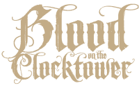
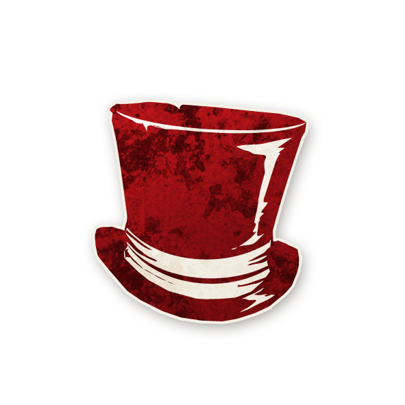

  

---
# 🎩 Baron

<!-- 🧩 Image centrée cliquable avec nom centré en dessous -->

  <a href="./baron.html" style="text-decoration:none;">
    
     
    Baron
  </a>

## 🧾 Information
- **Type :** [**Sbires**](../sbires.md)   
- **Artiste :** Aidan Roberts  
> *"Cette ville est tombée bien bas, pas vrai ? Main-d'œuvre étrangère bon marché… voilà la clé. Fourrez-les dans la mine, je dis. Un peu de travail dur n'a jamais fait de mal à personne, et une claque derrière les oreilles à tout brigand qui prétend le contraire. Tout est une question de profit, pas vrai ?"*

---

## 🎭 Apparaît dans  

# 🍺 Trouble Brewing

  « Dans le village endormi de Ravenswood Bluff, les cloches sonnent, et les secrets saignent… »

---

  <a href="../trouble_brewing.html" style="text-decoration:none;">
    
     
    Trouble Brewing
  </a>

"Cult of the Clocktower – épisode par Andrew Nathenson"

## 📖 Résumé
**« Il y a des Étrangers supplémentaires en jeu. [+2 Étrangers] »**

Le Baron modifie le nombre d’Étrangers présents dans la partie.  

- Ce changement intervient lors de la **mise en place** et est irréversible même quand le Baron mort.  
- Toute modification apportée aux rôles lors de la mise en place, indépendamment du déroulement de la partie, 
  est indiquée entre crochets à la fin de la description du rôle sur sa fiche et sur les jetons, comme ceci :**[ceci]** :
  Exemple : `[+2 Étrangers]`.  
- Les Étrangers ajoutés **remplacent toujours des Villageois**, jamais un autre type.

---

## 🎭 Comment Conter
Pendant la mise en place :  
1) Retirez **2 jetons Villageois**.  
2) Ajoutez **2 jetons Étrangers** à la place.  
3) Si vous ajoutez l’[**Ivrogne**](../tb_roles/ivrogne.md), suivez sa règle spéciale de setup.  

Ces jetons (avec ces remplacements) vont dans le sac pour être tirés par les joueurs.

---

## 🧩 Exemples
- Une partie avec **7 joueurs** la composition de base est :**(5 Villageois, 1 Sbire, 1 Démon)**. 
- Le conteur décide de mettre Baron en jeu, le Conteur retire 2 Villageois et ajoute, par exemple, un [**Saint**](../tb_roles/saint.md) et un [**Majordome**](../tb_roles/majordome.md). 
- La compisation finale aura donc 3 Villageois, 2 Étrangers, 1 Sbire, 1 Démon.  

- Une partie à **15 joueurs** (9 Villageois, 2 Étrangers, 3 Sbires, 1 Démon). Le Baron est en jeu : Le Conteur décide de mettre un [**Ivrogne**](../tb_roles/ivrogne.md) et un [**Reclus**](../tb_roles/reclus.md). Le Conteur retire par exemple le [**Moine**](../tb_roles/moine.md) et ajoute le Reclus. Pour l’Ivrogne, on n’ajoute pas le jeton de rôle dans sac : on place le jeton de rappel “Est l’Ivrogne” dans le Grimoire (un Villageois est secrètement un Étranger).  

---

## 💡Conseils & Astuces
- Votre pouvoir agit **avant même que la partie commence**, ensuite : amusez-vous à **bluffer** et semer la confusion pour aider votre Démon.  
- Revendiquez être **Étranger** : si le nombre d’Étrangers paraît trop élevé, la ville pensera à un Baron et vous pourrez passer pour un véritable Étranger.  
- **Doublez** un personnage déjà revendiqué (ex. [**Voyante**](../tb_roles/voyante.md), [**Croque-Mort**](../tb_roles/croquemort.md), [**Maire**](../tb_roles/maire.md)) afin de **dégrader la confiance** dans ses infos.  
- Faire croire qu’un **Baron** est en jeu alors qu’il n’y en a pas peut forcer la ville à douter de ses infos (on soupçonnera un [**Ivrogne**](../tb_roles/ivrogne.md)).  
- Acceptez d’être le **bouc émissaire** : mourir à la place du Démon (ou attirer un [**Mercenaire**](../tb_roles/mercenaire.md) / [**Gardien**](../tb_roles/gardien.md)) protège l’équipe maléfique.  
- Si vous ne bluffez pas Étranger, **chargez** les vrais Étrangers : la ville pourrait les exécuter.  
- Parfois, faire tuer le Baron tôt par le Démon vous rend “fiable” en mort et vous permet de **désinformer tranquillement** ensuite.

---

## ⚔️ Combattre le Baron
- Un **compte d’Étrangers inhabituel**, sii le nombre d'Étrangers diffère de celui attendu par défaut par exemple :
  vous en avez trois au lieu d'un seul, il s'agit probablement d'un Baron. 
- Dans ce cas, plusieurs options s'offrent à vous : 
  - Si vous croyez tout ce que disent les Étrangers, **gardez-les en vie** !
  - Ce sont des joueurs confirmés, même s'ils n'ont pas des capacités exceptionnelles.  
  - Si vous n'êtes pas certain de la présence d'un Baron, il est probablement préférable de les **exécuter rapidement**,
    les prétendus Étrangers peuvent être des Maléfiques qui bluffent un rôle d'Étranger 
  - Si le compte n’est “pas tout à fait juste”, cherchez l’[**Ivrogne**](../tb_roles/ivrogne.md).  
- Des rôles comme le [**Bibliothécaire**](../tb_roles/bibliothecaire.md), l’[**Enquêteur**](../tb_roles/enqueteur.md), le [**Croque-Mort**](../tb_roles/croquemort.md) ou le [**Gardien**](../tb_roles/gardien.md) aident à **déduire** la présence d’un Baron.  
- Contrairement à d’autres Sbires, l’effet du Baron est **visible dès la mise en place**. Il n’est pas toujours nécessaire de l’exécuter si vous avez une meilleure cible, exemple. [Imp](../tb_roles/imp.md)  ou [Empoisonneur](../tb_roles/empoisonneur.md)  .  
- Attention : l’[**Imp**](../tb_roles/imp.md) peut **transmettre** sa démonialité au Baron ; l’ignorer trop longtemps peut le transformer en Démon en fin de partie.

---
<ul style="color:#e0c99d; font-size:18px; line-height:1.7;">
  <li>🏠 <a href="/botc-fr-bambi/" style="color:#f5f5f5; font-weight:bold; text-decoration:none;">Retour à l’accueil</a></li>
  <li>🍺 <a href="../trouble_brewing.html" style="color:#b58b52; font-weight:bold; text-decoration:none;">Trouble Brewing</a></li>
  <li>😈 <a href="../sbires.html" style="color:red; font-weight:bold; text-decoration:none;">Retour aux Sbires</a></li>
</ul>

