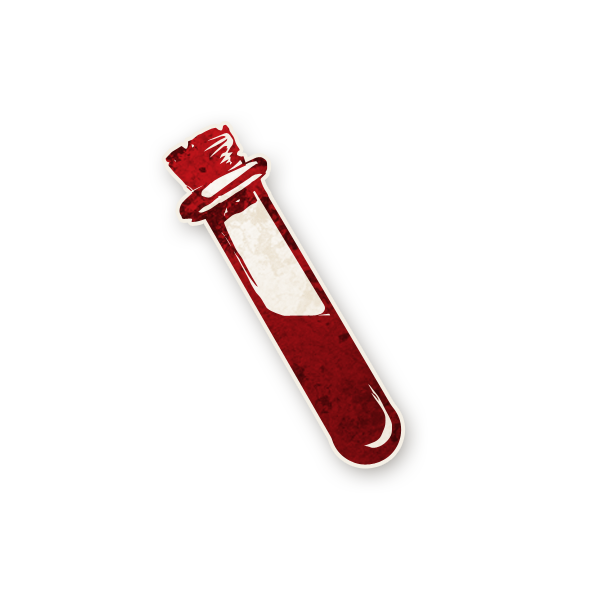

  

# Empoisonneur  

  

**Type :** Sbire  
**Artiste :** Aidan Roberts  

*"Ajoutez le composé Alpha au composé Beta... PAS TROP !"*  

---

## Apparait dans 🎭
 
- *(Cult of the Clocktower – épisode par Andrew Nathenson)*  

---

## Résumé

*Chaque nuit, choisissez un joueur : il est empoisonné cette nuit et le jour suivant.*  

- L’Empoisonneur perturbe secrètement les capacités des rôles.  
- Chaque nuit, il choisit un joueur : ce joueur est **empoisonné** pour la nuit et toute la journée suivante.  
- Un joueur empoisonné n’a plus de capacité, mais croit en avoir une. Le Conteur fait semblant : il réveille le joueur, mime ses actions et peut lui donner de **fausses informations**.  
- Si un joueur empoisonné utilise une capacité « une fois par partie », elle est perdue.  

---

## Mise en place 
- Chaque nuit, réveillez l’Empoisonneur → il désigne un joueur.  
- Placez le jeton de rappel **EMPOISONNÉ** à côté du jeton du joueur ciblé.  
- Le joueur agit normalement, mais n’a en réalité aucun effet.  
- Si sa capacité donne de l’information, le Conteur peut donner de fausses infos.  
- Au crépuscule, retirez le jeton **EMPOISONNÉ** : le joueur redevient sain.  

---

## Exemples
- L’Empoisonneur cible le [Mercenaire](../tb_roles/mercenaire.md). Le lendemain, le Mercenaire tente de tuer l'[Imp)](../tb_roles/imp.md). Rien ne se passe : sa capacité est perdue.  
- L’[Empathique](../tb_roles/empathique.md) empoisonné apprend un « 0 » alors qu’il est assis entre deux joueurs maléfiques. La nuit suivante (désormais sain), il apprend un « 2 ».  
- L’[Enquêteur](../tb_roles/enqueteur.md) empoisonné apprend que l’un de deux joueurs est le [Baron](../tb_roles/baron.md), alors qu’aucun ne l’est.  
- Le [Croque-Mort](../tb_roles/croquemort.md) empoisonné apprend une mauvaise information : l’Imp est mort, mais il croit que c’est la [Vierge](../tb_roles/vierge.md).  
- L’Empoisonneur cible le [Maire](../tb_roles/maire.md) puis devient l' **[Imp)](../tb_roles/imp.md). Comme il n’y a plus d’Empoisonneur en jeu, le Maire n’est plus empoisonné.  

---

## Conseils & Astuces  
- Les meilleures cibles sont les rôles qui donnent des infos en continu : [Empathique](../tb_roles/empathique.md), [Croque-Mort](../tb_roles/croquemort.md),[Voyante](../tb_roles/voaynte.md)**.  
- Empoisonner un joueur avec une capacité unique (**[Vierge](../tb_roles/vierge.md) , [Mercenaire](../tb_roles/mercenaire.md) , [Maire](../tb_roles/maire.md)**) peut être dévastateur.  
- Coordonnez-vous avec votre **Démon** pour ne pas cibler inutilement les mêmes personnes.  
- Vous pouvez même **empoisonner votre propre Démon** pour simuler une protection (comme si un [Moine](../tb_roles/moine.md) l’avait protégé).  
- Vous pouvez rendre la [Femme Écarlate](../tb_roles/femme_ecarlate.md)  inapte à devenir Démon si l’Imp meurt → ainsi, un autre Sbire peut prendre le relais.  
- Alterner vos cibles brouille les pistes ; mais cibler toujours la même personne peut la faire passer pour l’[Ivrogne](../tb_roles/ivrogne.md).  

---

## Combattre l’Empoisonneur 
- Le premier jour, vos infos sont généralement fiables : l’Empoisonneur ne sait pas encore qui vous êtes.  
- Méfiez-vous si vos résultats deviennent soudainement incohérents.  
- L’Empoisonneur adore cibler les leaders de table ou ceux qui prennent beaucoup la parole.  
- Différencier l’**[Ivrogne](../tb_roles/ivrogne.md)** de l’Empoisonneur est crucial : si plusieurs personnes reçoivent de fausses infos, c’est probablement lui.  
- Le **[Bibliothécaire](../tb_roles/bibliothecaire.md)** ou l’**[Enquêteur](../tb_roles/enqueteur.md)** peuvent débusquer l’Empoisonneur dès le départ.  

---

## 📂 Navigation
- 🏠 [Retour à l’accueil](/botc-fr-bambi/)  
- 🍺 [Retour à Trouble Brewing](../trouble_brewing.md)  
- 📂 **Catégories :** [Trouble Brewing](../trouble_brewing.md) ·[Sbires](../sbires.md)  
