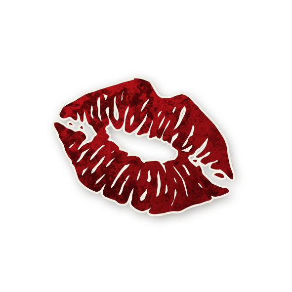

  

---

# 💃 Femme Écarlate  

<!-- 🧩 Image centrée cliquable avec nom centré en dessous -->

  <a href="./femmeecarlate.html" style="text-decoration:none;">
    
     
    Femme Écarlate
  </a>

---

## ℹ️ Information  

- **Type :** [**Sbire**](../sbires.md)  
- **Artiste :** Marianna Carr  
- *« Tu m’as révélé les secrets du Conseil de la Flamme Pourpre. Nous avons brûlé ensemble dans le feu, dans le désir et dans la communion bestiale, et je t’ai servi pour toujours. Mais ce soir, mon cher, c’est moi ta maîtresse. »*  

## 🎭 Apparaît dans  

# 🺠Trouble Brewing

  « Dans le village endormi de Ravenswood Bluff, les cloches sonnent, et les secrets saignent… »

  <a href="../trouble_brewing.html" style="text-decoration:none;">
    
     
    Trouble Brewing
  </a>

"Cult of the Clocktower – épisode par Andrew Nathenson"

## 📖 Résumé  

**« S’il y a 5 joueurs ou plus en vie et que le Démon meurt, vous devenez le Démon. (Les Voyageurs ne comptent pas.) »**

La **Femme Écarlate** devient le Démon si celui-ci meurt alors qu’il reste **au moins 5 joueurs vivants**.  

- Les Voyageurs ne comptent pas dans ce calcul.  
- Si le Démon meurt alors qu’il reste moins de 5 joueurs, la partie se termine et le Bien l’emporte.  
- Si la Femme Écarlate prend la place du Démon, elle **devient ce Démon** (par ex. l’[Imp](imp.md)) en tous points : elle attaque, elle s’enregistre comme Démon et si elle meurt, la partie s’arrête.  

---

## 🎬 Comment Conter  

Si le Démon meurt alors qu’il reste 5+ joueurs vivants :  
- **Remplacez** immédiatement le jeton de la Femme Écarlate par celui du Démon (dans *Trouble Brewing*, toujours l’[Imp](imp.md)).  
- Placez le jeton de rappel **« Est le Démon »** sur son jeton dans le Grimoire.  
- La nuit suivante, réveillez le nouveau Imp et montrez-lui le jeton **« Vous êtes »** puis le jeton **Imp**.  
- Dans d’autres éditions (avec plusieurs Démons), elle prend le type exact du Démon mort.  

---

## 🧾 Exemples  

- **Il y a 7 joueurs en vie** : L' [Imp](imp.md), la Femme Écarlate, 2 Villageois et 3 Voyageurs.  
  → L’[Imp](imp.md) est exécuté → la partie s’arrête (les Voyageurs ne comptent pas).  

- **Il y 5 joueurs vivants** : L'[Imp](imp.md), la Femme Écarlate, le [Baron](baron.md) et 2 Villageois.  
  → L’[Imp](imp.md) est exécuté → la Femme Écarlate devient l’[Imp](imp.md)  → la partie continue.  

- Laura est la Femme Écarlate. La [Voyante](voyante.md) choisit Laura et Alexis elle apprend un « non ».  
  Plus tard, l’[Imp](imp.md) meurt, Laura devient l’[Imp](imp.md).  
  La [Voyante](voyante.md) choisit à nouveau Laura et Alexis, et obtient cette fois un « oui ».  

---

## 💡 Astuces & Conseils  

- La Femme Écarlate est la plus forte lorsqu’elle **coordonne avec son Démon**.  
  → Vous pouvez organiser une mort « volontaire » du Démon pour reprendre le flambeau.  

- Rester **en vie longtemps** est essentiel. Contrairement à l’[Empoisonneur](empoisonneur.md) ou au [Baron](baron.md), votre capacité ne sert que si vous survivez à la mort du Démon.  

- Si le Démon risque d’être exécuté trop tôt, assurez-vous qu’il meure **tant qu’il reste ≥ 5 joueurs vivants**.  

- Vous ne vous enregistrez **pas comme Démon** tant que vous êtes Femme Écarlate → profitez-en pour être « confirmé » par des rôles comme la [Voyante](voyante.md) ou le [Mercenaire](mercenaire.md).  

- Si le Démon joue bien et reste discret, pas besoin d’activer votre capacité : semez le doute comme un Sbire classique.  

---

## ⚔️ Combattre la Femme Écarlate  

- Si vous êtes sûrs d’avoir tué l’[Imp](imp.md) mais que la partie continue → **suspicion immédiate** : une Femme Écarlate est probablement en jeu.  

- Si l’Imp se tue de nuit, la démonialité doit **toujours passer à la Femme Écarlate** avant un autre Sbire.  
  → Cela peut révéler où se cache le nouveau Démon.  

- Le Démon et la Femme Écarlate peuvent **co-bluffer** pour se soutenir (ex. elle se dit [Lavandière](lavandiere.md) et « confirme » le Démon).  

- La Femme Écarlate **ne s’enregistre pas comme Démon** → la [Voyante](voyante.md) ou le [Mercenaire](mercenaire.md) ne la détecteront pas.  

- Si un [Enquêteur](enqueteur.md) ou un [Croque-Mort](croquemort.md) révèle qu’elle est en jeu, gardez-la **vivante** : au dernier jour, la question devient « le Démon est-il devenu la Femme Écarlate ? ».  

- Contrairement à d’autres Sbires, elle peut vouloir tuer son propre Démon pour le remplacer.  
  → Surveillez les changements d’attitude dès qu’il ne reste plus que 5 joueurs.  
<ul style="color:#e0c99d; font-size:18px; line-height:1.7;">
  <li>🏠 <a href="/botc-fr-bambi/" style="color:#d4a76a; font-weight:bold; text-decoration:none;">Retour à l’accueil</a></li>
  <li>🍺 <a href="../trouble_brewing.html" style="color:#d4a76a; font-weight:bold; text-decoration:none;">Trouble Brewing</a></li>
  <li>🌛 <a href="../bmr.html" style="color:#d4a76a; font-weight:bold; text-decoration:none;">Bad Moon Rising</a></li>
  <li>🌸 <a href="../sv.html" style="color:#d4a76a; font-weight:bold; text-decoration:none;">Sects & Violets</a></li>
  <li>😈 <a href="../sbires.html" style="color:red; font-weight:bold; text-decoration:none;">Catégorie : Sbires</a></li>
</ul>

