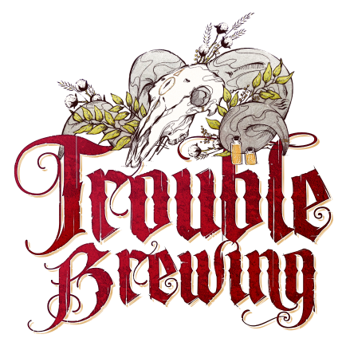

  

# Reclus

<!-- 🧩 Image centrée cliquable avec nom centré en dessous -->

  <a href="./reclus.html" style="text-decoration:none;">
    
     
    Reclus
  </a>

---
**Type :** [Étranger](../etrangers.md)  
**Artiste :** Aidan Roberts  

*« Retirez vos sales paluches de chez moi, vous m’entendez ? Grr. Y’a de mauvais coins là-bas, vers le sud… Filez donc ! Chez les miens, on n’affronte pas les démons à découvert. Ouste ! »*

---
## 🎭 Apparaît dans  

# 🺠Trouble Brewing

  « Dans le village endormi de Ravenswood Bluff, les cloches sonnent, et les secrets saignent… »

---

  <a href="../trouble_brewing.html" style="text-decoration:none;">
    
     
    Trouble Brewing
  </a>

"Cult of the Clocktower – épisode par Andrew Nathenson"

## Résumé
**Capacité :**  
*Vous pouvez être enregistré comme maléfique et comme un Sbire ou un Démon, même si vous êtes mort.*  

- Le **Reclus** est **bon**, mais peut **s’enregistrer comme maléfique**.  
- Le Conteur choisit à chaque détection si le Reclus est vu comme **bon** ou **maléfique**.  
- Il peut apparaître comme **Villageois**, **Sbire**, ou **Démon**, et ce de façon incohérente au cours d’une même partie.  
- Le Reclus **n’a pas** les pouvoirs des rôles qu’il imite (ex. : s’il « apparaît » Empoisonneur, il ne peut pas réellement empoisonner).  

---

## Mise en place / Comment gérer
- À chaque fois que le Reclus est ciblé par une capacité qui détecte ou affecte les joueurs maléfiques, le Conteur décide comment il doit s’enregistrer (bon/mauvais, Sbire/Démon).  
- Cela peut être signalé via : montrer un jeton de rôle, hochements de tête, signaux de doigts, etc.  

---

## Exemples
- Le **[Mercenaire](./mercenaire.md)** utilise sa capacité sur le Reclus. Le Conteur décide qu’il s’enregistre comme **[Imp](imp.md)** → le Reclus meurt, et le Mercenaire pense avoir trouvé le Démon.  
- L’**[Empathique](./empathique.md)** est voisin du Reclus et du **[Moine](./moine.md)**. Il apprend « 1 » la première nuit, puis « 0 » la suivante.  
- L’**[Enquêteur](./enqueteur.md)** apprend que le Reclus ou le **[Saint](./saint.md)** est la **[Femme Écarlate](femmeecarlate.md)**.  
- Le Reclus est exécuté. Le **[Croque-Mort](./croquemort.md)** apprend que c’était l’**[Imp](imp.md)**.  
- Le Reclus est voisin d’un **[Imp](imp.md)**  et d’un Voyageur maléfique. Pour ne pas trop révéler, le Conteur décide de donner au **[Cuisinier](./cuisinier.md)** une vraie info (« 0 »).  

---

## 💡Conseils & Astuces
- Annoncez tôt que vous êtes le Reclus : cela permet aux bons joueurs d’expliquer leurs infos incohérentes (**[Cuitot](./cuistot.md)**, **[Empathique](./empathique.md)**, **[Enquêteur](./enqueteur.md)**, etc.).  
- À l’inverse, cacher votre identité jusqu’au dernier jour peut vous éviter l’exécution prématurée.  
- N’oubliez pas : vous êtes **bon** ! Vous êtes donc un moins bon choix d’exécution que n’importe quel joueur réellement mauvais.  
- Vous serez souvent perçu comme **maléfique**. Un **[Mercenaire](./mercenaire.md)** risque de vous tuer par erreur, et le **[Croque-Mort](./croquemort.md)** verra souvent un rôle de Sbire/Démon.  
- Parfois, s’enregistrer comme maléfique aide : un Empathique qui voit « 1 » grâce à vous peut ainsi identifier son autre voisin comme bon.  
- Si le groupe est trop suspicieux, acceptez l’exécution avant le dernier jour pour prouver que vous n’étiez pas le Démon.  

---

## Bluff en tant que Reclus
- Vous ne vous réveillez **jamais** la nuit et n’avez pas d’actions diurnes.  
- Prétexter : « Je ne suis pas mauvais, je **m’enregistre juste comme ça** » est un **bluff parfait** pour expliquer pourquoi vous sortez comme maléfique dans les infos.  
- Jouez de manière utile et proactive pour gagner la confiance des bons joueurs.  
- Gardez ce bluff comme **roue de secours** si votre couverture tombe : révéler être Reclus « pour semer la confusion » peut sauver votre crédibilité.  
- Vous continuez de vous enregistrer maléfique même après votre mort → prolongez le bluff au-delà de la tombe, en laissant croire qu’il reste des Sbires ou Démons vivants.  
- Prétendre être un Étranger brouille aussi les pistes sur l’éventuel **[Ivrogne](./ivrogne.md)** ou la présence d’un **[Baron](baron.md)**.  

---
<ul style="color:#e0c99d; font-size:18px; line-height:1.7;">
  <li>🏠 <a href="/botc-fr-bambi/" style="color:#d4a76a; font-weight:bold; text-decoration:none;">Retour à l’accueil</a></li>
  <li>🍺 <a href="../trouble_brewing.html" style="color:#d4a76a; font-weight:bold; text-decoration:none;">Trouble Brewing</a></li>
  <li>🌛 <a href="../bmr.html" style="color:#d4a76a; font-weight:bold; text-decoration:none;">Bad Moon Rising</a></li>
  <li>🌸 <a href="../sv.html" style="color:#d4a76a; font-weight:bold; text-decoration:none;">Sects & Violets</a></li>
  <li>💈 <a href="../etrangers.html" style="color:blue; font-weight:bold; text-decoration:none;">Catégorie : Étrangers</a></li>
</ul>

