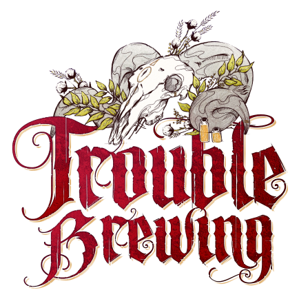

  

#  Voyante  

<!-- 🧩 Image centrée cliquable avec nom centré en dessous -->

  <a href="./voyante.html" style="text-decoration:none;">
    
     
    Voyante
  </a>

---

##  Informations

<ul style="color:#f5f5f5; font-size:18px; line-height:1.7; margin-left:40px;">
  <li>
    <strong>Type :</strong>
    <a href="../villageois.html" style="color:#4ea3ff; font-weight:bold; text-decoration:none;">
      Villageois
    </a>
  </li>

  <li>
    <strong>Artiste :</strong> John Grist
  </li>

  <li>
    <strong>Nom original :</strong>
    <a href="https://wiki.bloodontheclocktower.com/Fortune_Teller"
       target="_blank"
       rel="noopener noreferrer"
       style="color:#4ea3ff; font-weight:bold; text-decoration:none;">
    Fortune Teller
    </a>
  </li>
</ul>

« Je sens un grand mal en toi !  
  Mais… c’est peut-être seulement ton parfum.  
  Je suis allergique au sureau » 




---

##  Apparaît dans  

#  Trouble Brewing

  « Dans le village endormi de Ravenswood Bluff, les cloches sonnent, et les secrets saignent… »

  <a href="../trouble_brewing.html" style="text-decoration:none;">
    
     
    Trouble Brewing
  </a>

"Cult of the Clocktower – épisode par Andrew Nathenson"

---

##  Résumé  

**« Chaque nuit, choisissez 2 joueurs : vous apprenez si l’un d’eux est le Démon.** **Un joueur bon apparaît comme un Démon pour vous.»**  

La **Voyante** détecte si un joueur est le [Démon](../demons.md) … mais peut confondre un joueur bon avec un Démon.  

- Chaque nuit, la Voyante choisit deux joueurs et apprend si au moins l’un des deux est le Démon. 
- Elle n’apprend pas lequel des deux est le Démon, seulement qu’un des deux l’est.
- Si aucun des deux n’est le Démon, elle apprend cette information à la place.

- Malheureusement, un joueur, appelé le **FAUX DÉMON** son *faux-positif*, apparaîtra comme le Démon aux yeux de la Voyante s’il est choisi. 
- Le **FAUX DÉMON** est le même joueur pendant toute la partie. 
- Ce joueur peut être n’importe quel joueur bon, y compris la Voyante elle-même, et la Voyante ne sait pas de quel joueur il s’agit.

- La Voyante peut choisir n’importe quels joueurs, vivants, morts, ou même elle-même.
- Si elle choisit un Démon mort, la Voyante reçoit tout de même un « oui ».

---

##  Comment Conter

- Lors de la préparation de la première nuit :	
- Placez le jeton de rappel **FAUX DÉMON** de la Voyante à côté du jeton de rôle d’un Villageois ou d’un Marginal.
	-	Chaque nuit :
	-	Réveillez la Voyante.
	-	La voyante choisit deux joueurs : vivants, morts ou elle-même.
	-	Si au moins l’un des deux est :
- le Démon, ou
- le **FAUX DÉMON**,
alors hochez la tête pour indiquer oui.
	-	Sinon, secouez la tête pour indiquer non.
	-	Rendormez la Voyante.

 - *Lors des parties à 5 ou 6 joueurs **TeensyVille**, il est parfois conseillé de faire de la Voyante son propre FAUX DÉMON
car cela lui permet d'obtenir davantage d'informations.*  

---

##  Exemples   

- La Voyante choisit le [Moine](moine.md) et le [Fossoyeur](croquemort.md). Elle apprend un : **non**. 

- La Voyante choisit le [Diablotin](imp.md) et l’[Empathe](empathique.md).  Elle apprend un : **oui**.

- La Voyante choisit le [Majordome](majordome.md) vivant et un [ Diablotin](imp.md) mort. Elle apprend un  : **oui**.  

- La Voyante se choisit elle-même et le [Saint](saint.md). Le [Saint](saint.md) est le Leurre. Elle apprend un : **oui**.  

---

##  Conseils & Astuces    

- Vous n’obtenez des informations que sur les Démons. 
  Le fait d’avoir reçu un « non » sur quelqu’un ne signifie donc pas qu’il est bon : cette personne peut tout à fait être un Sbire.
  

- Si vous avez une paire de joueurs pour laquelle vous avez obtenu un « oui »,
  et une autre paire pour laquelle vous avez obtenu un « non », essayez de choisir un joueur dans chaque paire.
  -	Si vous obtenez à nouveau un « oui », alors le joueur sur lequel vous avez eu un « oui » les deux fois est celui que votre capacité détecte.
  - Sinon, c’est le joueur de la paire initiale avec « oui » que vous n’avez pas choisi cette fois-ci qu’il faut surveiller.
  - Si vous avez obtenu un « oui » sur des joueurs que vous soupçonnez, 
  confirmer lequel d’entre eux déclenche réellement votre capacité peut vous donner un objectif clair, 
  surtout si ce joueur est encore en vie à la fin de la partie.

- Vous ne disposez que d’un nombre limité de nuits pour recueillir des informations. 
  En passer trop à vous concentrer sur une ou deux personnes peut vous laisser avec peu d’éléments exploitables en fin de partie.
  C’est pourquoi il est généralement plus efficace de commencer la partie en ratissant large, 
  afin d’obtenir des informations sur autant de paires que possible.
  Ensuite, une fois que vous avez une vision d’ensemble, concentrez-vous sur les joueurs qui vous paraissent les plus suspects.
  

- N’oubliez pas que le [Diablotin](imp.md) peut se tuer lui-même et faire qu’un Sbire devienne le Démon, 
  et que s’il est exécuté, la [Femme Écarlate](femmeecarlate.md) peut devenir le Démon. 
  Ainsi, même si vous avez obtenu un « non » sur quelqu’un plus tôt dans la partie, cela ne signifie pas qu’il ne soit pas le Démon à présent.
  Si vous pensez que le Démon est mort, essayez de choisir un joueur que vous soupçonnez d’être un Sbire et 
  sur lequel vous aviez auparavant obtenu un « non », afin de voir si votre information a changé.

- Votre faux positif le **FAUX DÉMON** est choisi au début de la partie et ne se déplace pas, 
et votre capacité ne vous fera jamais recevoir de faux résultat concernant plus d’un joueur. 
- Rappelez-vous que ce faux enregistrement peut concerner n’importe qui, y compris vous-même, 
et qu’un « oui » ne constitue pas une confirmation certaine de la présence d’un Démon. 

- Vous pouvez vous choisir vous-même comme l’un des deux joueurs. 
  - Puisque vous savez que vous n’êtes pas le Démon, cela vous permet d’obtenir une information ciblée sur un joueur précis. 
  - Attention toutefois : le Conteur peut faire en sorte que vous soyez votre propre faux positif, ce qui rend cette méthode parfois inefficace.
  Faites attention à la [Recluse](reclus.md), qui peut apparaître comme le Démon à vos yeux. Cela n’est pas la même chose que le **LEURRE** qui est votre Faux-Positif.
  

- Prétendre être un rôle que le Démon n’a généralement aucun intérêt à tuer, comme le [Saint](saint.md), le [Soldat](soldat.md) ou 
la [Corneille](gardien.md), peut vous aider à survivre plus longtemps, et ainsi vous laisser le temps nécessaire pour recueillir des informations réellement utiles.

---

##  Bluffer Voyante 

- Lorsque vous bluffez en tant que Voyante, il y a plusieurs points importants à garder en tête :
 - Vous vous réveillez chaque nuit, y compris la première, et vous êtes censé avoir une information pour chaque nuit où vous êtes en vie. 
 - Vous avez donc désigné deux joueurs, et le Conteur a soit hoché la tête, soit fait non de la tête. 
 - Lorsque vous révélez être la Voyante, l’équipe du bien s’attendra à ce que vous soyez capable d’expliquer en détail chacune de vos nuits. 
 - Soyez prêt. Ayez votre discours préparé à l’avance.
 

- Vous pouvez mentir en affirmant que « ces deux joueurs ne sont pas le Démon » afin d’innocenter vos alliés maléfiques.
  La Voyante peut parfois recevoir des informations très confuses. 
  La [Recluse](reclus.md), peut apparaître comme le Démon. 
  Le Démon lui-même peut changer, par exemple en passant à un joueur qui était auparavant Sbire, 
  même en l’absence d'une [Femme Écarlate](femmeecarlate.md).
  

- Le **FAUX DÉMON** peut également apparaître comme le Démon, faisant paraître suspect un joueur bon. 
  Préoccupez-vous moins du contenu exact de vos informations ou du nombre de « oui » que vous prétendez avoir reçus, 
  et davantage de la conviction avec laquelle vous jouez votre rôle.
  

- Cela dit, votre bluff est beaucoup plus crédible si les informations que vous partagez avec le groupe sont cohérentes dans le temps.
  Si vous répétez que certains joueurs ne sont pas le Démon, ils auront tendance à être gardés en vie. 
  Si vous répétez que certains joueurs pourraient être le Démon, ils auront tendance à être exécutés…  
  mais pourraient ensuite se retourner contre vous si la partie ne se termine pas.
  

- Si un joueur bon devient particulièrement gênant, concentrer toute votre attention sur lui en affirmant qu’il apparaît 
  comme le Démon à vos yeux peut rapidement conduire à son exécution.  
  Vous pourrez toujours prétendre après coup qu’il s’agissait de votre **FAUX DÉMON**. 
  Cette stratégie est particulièrement dévastatrice lorsque vous devez absolument faire exécuter un joueur sans y parvenir par des moyens classiques. 
  Vous pouvez notamment faire exécuter un [Saint](saint.md), ou faire tuer un [Maire](maire.md) ou un [Soldat](soldat.md), 
  ou au minimum convaincre l’équipe du bien de ne plus leur faire confiance.  
- Même semer le doute sur un [Fossoyeur](croquemort.md), un [Empathe](empathique.md) ou un rôle similaire peut suffire à rendre leurs informations suspectes.

- N’oubliez pas que la Voyante peut choisir des joueurs morts, et peut même se choisir elle-même. 
  Dire au groupe qu’un joueur mort est le Démon implique que toutes ses informations étaient douteuses, 
  et aussi (dans les parties à un seul Sbire) qu’il ne reste qu’un seul joueur maléfique en vie. 
  Cette désinformation, bien qu’apparemment anodine, peut faire basculer la partie en votre faveur en augmentant la méfiance entre les joueurs vivants. 
  Elle est particulièrement efficace si vous faites passer une [Corneille](gardien.md) pour le Démon qui se serait tué lui-même pendant la nuit.
- Si vous êtes le [Diablotin](imp.md), vous pouvez vous révéler publiquement comme [Voyante](voyante.md) et mourir volontairement la nuit, afin de rendre vos informations plus crédibles.

- Si vous êtes la [Femme Écarlate](femmeecarlate.md), vous pouvez accuser publiquement votre véritable Démon 
et mener la charge pour son exécution. 
- Cela donnera à des rôles comme le [Fossoyeur](croquemort.md) une information positive indiquant « Démon », ce qui renforce considérablement votre bluff.
- Si vous savez qu’une [Recluse](reclus.md) est en jeu, affirmez avoir obtenu un « oui » sur elle. 
  Si vous êtes, ou avez discuté avec, une [Espionne](espion.md),  
  vous pouvez même annoncer ce « oui » avant que la [Recluse](reclus.md) ne révèle son rôle, ce qui rendra votre information encore plus crédible.

---

<ul style="color:#e0c99d; font-size:18px; line-height:1.7;">
  <li> <a href="/botc-fr-bambi/" style="color:#f5f5f5; font-weight:bold; text-decoration:none;">Retour à l’accueil</a></li>
  <li> <a href="../trouble_brewing.html" style="color:#b58b52; font-weight:bold; text-decoration:none;">Trouble Brewing</a></li>
  <li> <a href="../villageois.html" style="color:#4ea3ff; font-weight:bold; text-decoration:none;">Catégorie : Villageois</a></li>
</ul>
