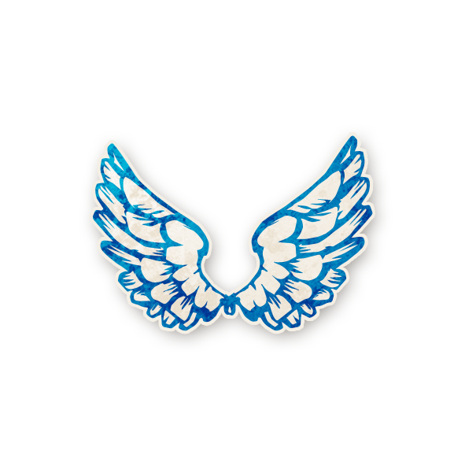
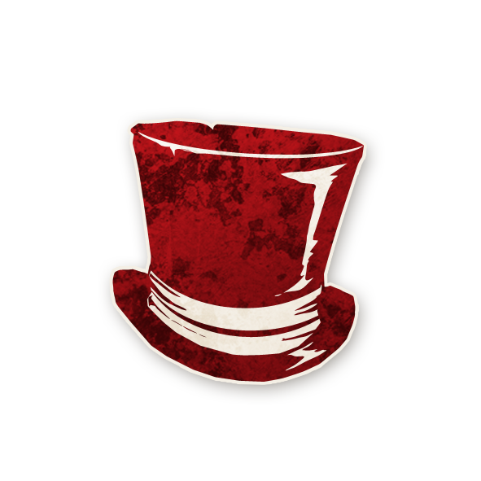

  

<!-- 🍺 Titre doré -->
<h1 style="color:#b58b52; font-weight:bold; font-size:42px; margin-bottom:20px;">🍺 Trouble Brewing</h1>

<!-- 🧭 Logo centré avec nom cliquable (même format que les rôles) -->

    
  [**Trouble Brewing**](trouble_brewing.md)

---

<!-- 📖 Synopsis -->
<h2 style="color:#b58b52; font-weight:bold; font-size:28px;">📖 Synopsis</h2>

Les nuages ☁️ s’amoncellent au-dessus de <strong>Ravenswood Bluff</strong>, enveloppant cette ville endormie et ses Villageois superstitieux d’une ombre inquiétante.  
Le linge fraîchement lavé danse de façon étrange entre les chaumières. Des cheminées crachent des volutes de fumée.  
Des senteurs exotiques s’infiltrent par les fissures des fenêtres, tandis que des chaudrons cachés bouillonnent dans l’ombre.

Un vent d’automne anormalement chaud s’insinue le long des murs couverts de lierre et murmure à l’oreille des plus téméraires.  
Les mères appellent leurs enfants à rentrer, alors que le tonnerre gronde à l’horizon.  
Mais en tendant l’oreille… des bruits plus étranges encore résonnent depuis la forêt voisine.

Sous l’œil vigilant du monastère qui domine la ville, des silhouettes passent de porte en porte.  
Celles et ceux qui savent lire les signes comprennent qu’il y a…  
Trouble Brewing.

---
<!-- 🎲 Gameplay -->
<h2 style="color:#b58b52; font-weight:bold; font-size:28px;">🎲 Gameplay</h2>

<strong>Trouble Brewing</strong> contient un peu de tout :

<ul style="color:#e0c99d; font-size:18px; line-height:1.7; margin-left:40px;">
  <li>Certains rôles reçoivent passivement des informations.</li>
  <li>D’autres doivent agir pour découvrir qui est qui.</li>
  <li>Quelques-uns cherchent simplement à attirer l’attaque du Démon.</li>
</ul>

Tant le Bien que le Mal peuvent prendre l’avantage en effectuant des <strong>sacrifices bien calculés</strong>. 
C’est une chasse au Démon relativement simple, mais les Sbires et le Démon disposent de nombreux moyens pour semer la confusion. 
Les joueurs et joueuses du Bien devront remettre en question ce qu’ils croient savoir s’ils veulent espérer survivre.

👉 Niveau : <strong>Débutant</strong> 
<em>**Ce module est recommandé pour les nouveaux joueurs, joueuses et Conteurs.**</em>

----

## [**Villageois**](villageois.md)

    
  [**Lavandière**](tb_roles/lavandiere.md)

    
  [**Bibliothécaire**](tb_roles/bibliothecaire.md)

 

    
  [**Enquêteur**](tb_roles/enqueteur.md)

 

    
  [**Cuistot**](tb_roles/cuistot.md)

 

    
  [**Empathique**](tb_roles/empathique.md)

 

    
  [**Voyante**](tb_roles/voyante.md)

 

    
  [**Croque-Mort**](tb_roles/croquemort.md)

 

    
  [**Moine**](tb_roles/moine.md)

 

    
  [**Gardien**](tb_roles/gardien.md)

 

    
  [**Vierge**](tb_roles/vierge.md)

 

    
  [**Mercenaire**](tb_roles/mercenaire.md)

 

    
  [**Soldat**](tb_roles/soldat.md)

 

    
  [**Maire**](tb_roles/maire.md)

---

## [**Étrangers**](etrangers.md)  

    
  [**Majordome**](tb_roles/majordome.md)

 

    
  [**Ivrogne**](tb_roles/ivrogne.md)

 

    
  [**Reclus**](tb_roles/reclus.md)

 

    
  [**Saint**](tb_roles/saint.md)

---

## [**Sbires**](sbires.md)

    
  [**Empoisonneur**](tb_roles/empoisonneur.md)

 

    
  [**Espion**](tb_roles/espion.md)

    
  [**Femme Écarlate**](tb_roles/femmeecarlate.md)

    
  [**Baron**](tb_roles/baron.md)

---

## [**Démons**](demons.md) 

    
  [**Imp**](tb_roles/imp.md)

----

<h2 style="color:#b58b52; font-weight:bold; font-size:28px;">📥 Télécharger & 🖨️ Imprimer</h2>

Ces ressources sont pratiques pour <strong>imprimer</strong> et <strong>jouer en personne</strong>.

<h3 style="color:#b58b52; font-weight:bold; font-size:22px;">📄 PDF complet</h3>

👉 <a href="./trouble_brewing.pdf" style="color:#d4a76a; font-weight:bold; text-decoration:none;">📄 Télécharger le PDF de Trouble Brewing</a>

<h3 style="color:#b58b52; font-weight:bold; font-size:22px;">🖼️ Images pratiques</h3>

  
  
  

<h2 style="color:#b58b52; font-weight:bold; font-size:24px;">📂 Navigation</h2>

- 🏠 [Retour à la page d’accueil](README.md)  
