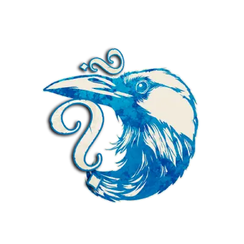

  

#  Villageois  

  

**Alignement :** 🔵 Bon  
**But :** Trouver et exécuter le Démon.  

[Les Villageois possèdent des capacités puissantes et fiables.   
[Leur rôle est de collecter des informations, de protéger leurs alliés et de mener le Village à la victoire.   

## 📌 Exemples dans *Trouble Brewing*  
- [Croque-Mort](./trouble_brewing/croquemort.md) : [Apprend le rôle des morts de jour exécutés.   
- [Empathique](./trouble_brewing/empathique.md) : [Apprend combien de ses voisins sont maléfiques.     
- [Moine](./trouble_brewing/moine.md) : [Protège un joueur des attaques nocturnes.   
- [Mercenaire](./trouble_brewing/mercenaire.md) : [Peut tuer le Démon d’un seul coup (une fois par partie).   

 

---

🔗 Autres catégories :  
- [Étrangers](/botc-fr-bambi/etrangers.md)  
- [Sbires](/botc-fr-bambi/sbires.md)  
- [Démons](/botc-fr-bambi/demons.md)  
 
## 📂 Navigation 
- 🏠 [Retour à l’accueil](/botc-fr-bambi/)  
