

  

#  Villageois  

  

**Alignement :** 🔵 Bon  
**But :** Trouver et exécuter le Démon.  

Les Villageois possèdent des capacités puissantes et fiables.

Leur rôle est de collecter des informations, de protéger leurs alliés et de mener le Village à la victoire.

##  Exemples dans **Trouble Brewing**  
- [Fossoyeur](./tb_roles/croquemort.md) : Apprend le rôle des morts de jour exécutés.
- [Empathe](./tb_roles/empathique.md) : Apprend combien de ses voisins sont maléfiques.    
- [Moine](./tb_roles/moine.md) : Protège un joueur ou une joueuse des attaques ou des capacités nocturnes du Démon.   
- [Pourfendeuse](./tb_roles/mercenaire.md) : Peut tuer le Démon d’un seul coup (une fois par partie).   

<h2 style="font-weight:800; font-size:22px; text-align:left;">
  Tous les Villageois 
  • Trouble Brewing 
  • Bad Moon Rising 
  • Sects & Violets 
  • Expérimentaux
</h2>

<!-- GRID VILLAGEOIS (ALPHABÉTIQUE) -->

  <!-- A -->
  <a href="./roles_experimentaux/acrobat.html" style="text-decoration:none; flex:0 0 220px; text-align:center;">
    
    Acrobate
  </a>

  <a href="./roles_experimentaux/balloonist.html" style="text-decoration:none; flex:0 0 220px; text-align:center;">
    
    Aéronaute
  </a>

  <a href="./roles_experimentaux/alchemist.html" style="text-decoration:none; flex:0 0 220px; text-align:center;">
    
    Alchimiste
  </a>

  <a href="./roles_experimentaux/alsaahir.html" style="text-decoration:none; flex:0 0 220px; text-align:center;">
    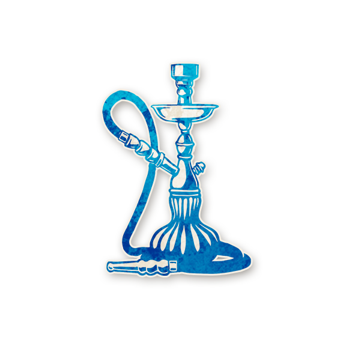
    Alsaahir
  </a>

  <a href="./roles_experimentaux/amnesiac.html" style="text-decoration:none; flex:0 0 220px; text-align:center;">
    
    Amnésique
  </a>

  <a href="./tb_roles/bibliothecaire.html" style="text-decoration:none; flex:0 0 220px; text-align:center;">
    
    Archiviste
  </a>

  <a href="./sv_roles/artiste.html" style="text-decoration:none; flex:0 0 220px; text-align:center;">
    
    Artiste
  </a>

  <a href="./roles_experimentaux/atheist.html" style="text-decoration:none; flex:0 0 220px; text-align:center;">
    
    Athée
  </a>

  <a href="./bmr_roles/aubergiste.html" style="text-decoration:none; flex:0 0 220px; text-align:center;">
    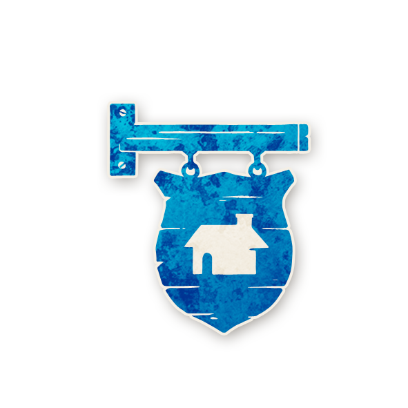
    Aubergiste
  </a>

  <!-- B -->
  <a href="./roles_experimentaux/banshee.html" style="text-decoration:none; flex:0 0 220px; text-align:center;">
    
    Banshee
  </a>

  <!-- C -->
  <a href="./roles_experimentaux/cannibal.html" style="text-decoration:none; flex:0 0 220px; text-align:center;">
    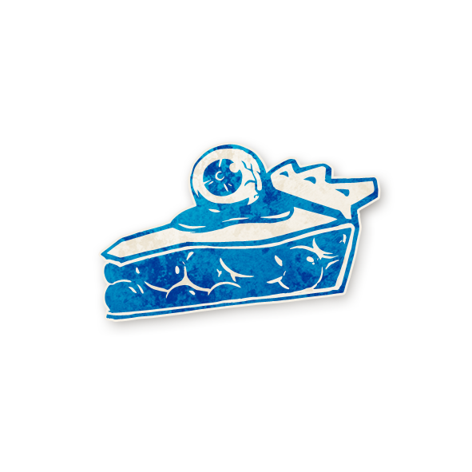
    Cannibale
  </a>

  <a href="./sv_roles/charmeurdeserpent.html" style="text-decoration:none; flex:0 0 220px; text-align:center;">
    
    Charmeur de Serpent
  </a>

  <a href="./roles_experimentaux/huntsman.html" style="text-decoration:none; flex:0 0 220px; text-align:center;">
    
    Chasseur
  </a>

  <a href="./roles_experimentaux/bountyhunter.html" style="text-decoration:none; flex:0 0 220px; text-align:center;">
    
    Chasseur de primes
  </a>

  <a href="./roles_experimentaux/cultleader.html" style="text-decoration:none; flex:0 0 220px; text-align:center;">
    
    Chef de secte
  </a>

  <a href="./roles_experimentaux/knight.html" style="text-decoration:none; flex:0 0 220px; text-align:center;">
    
    Chevalier
  </a>

  <a href="./bmr_roles/commere.html" style="text-decoration:none; flex:0 0 220px; text-align:center;">
    
    Commère
  </a>

  <a href="./tb_roles/gardien.html" style="text-decoration:none; flex:0 0 220px; text-align:center;">
    
    Corneille
  </a>

  <a href="./bmr_roles/courtisan.html" style="text-decoration:none; flex:0 0 220px; text-align:center;">
    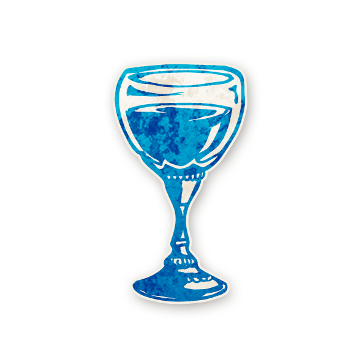
    Courtisan
  </a>

  <a href="./sv_roles/couturiere.html" style="text-decoration:none; flex:0 0 220px; text-align:center;">
    
    Couturière
  </a>

  <a href="./sv_roles/crieur.html" style="text-decoration:none; flex:0 0 220px; text-align:center;">
    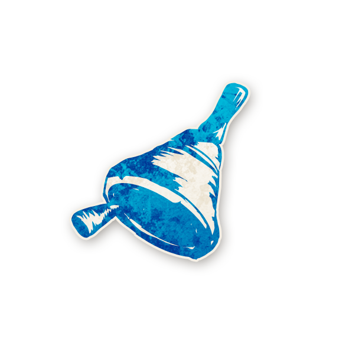
    Crieur
  </a>

  <a href="./tb_roles/cuistot.html" style="text-decoration:none; flex:0 0 220px; text-align:center;">
    
    Cuisinier
  </a>

  <a href="./roles_experimentaux/poppygrower.html" style="text-decoration:none; flex:0 0 220px; text-align:center;">
    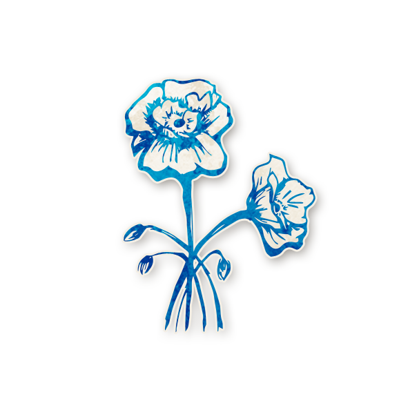
    Cultivateur de pavot
  </a>

  <!-- D -->
  <a href="./bmr_roles/damedethe.html" style="text-decoration:none; flex:0 0 220px; text-align:center;">
    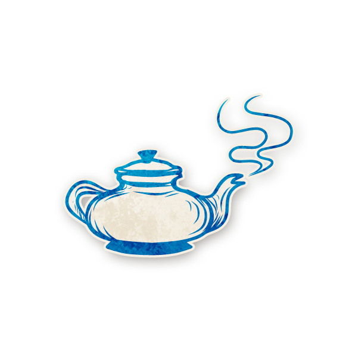
    Dame de Thé
  </a>

  <a href="./tb_roles/enqueteur.html" style="text-decoration:none; flex:0 0 220px; text-align:center;">
    
    Détective
  </a>

  <!-- E -->
  <a href="./tb_roles/empathique.html" style="text-decoration:none; flex:0 0 220px; text-align:center;">
    
    Empathe
  </a>

  <a href="./roles_experimentaux/choirboy.html" style="text-decoration:none; flex:0 0 220px; text-align:center;">
    
    Enfant de Chœur
  </a>

  <a href="./bmr_roles/exorciste.html" style="text-decoration:none; flex:0 0 220px; text-align:center;">
    
    Exorciste
  </a>

  <!-- F -->
  <a href="./bmr_roles/femmedechambre.html" style="text-decoration:none; flex:0 0 220px; text-align:center;">
    
    Femme de Chambre
  </a>

  <a href="./roles_experimentaux/farmer.html" style="text-decoration:none; flex:0 0 220px; text-align:center;">
    
    Fermier
  </a>

  <a href="./sv_roles/fleuriste.html" style="text-decoration:none; flex:0 0 220px; text-align:center;">
    
    Fleuriste
  </a>

  <a href="./tb_roles/croquemort.html" style="text-decoration:none; flex:0 0 220px; text-align:center;">
    
    Fossoyeur
  </a>

  <a href="./bmr_roles/fou.html" style="text-decoration:none; flex:0 0 220px; text-align:center;">
    
    Fou
  </a>

  <!-- G -->
  <a href="./roles_experimentaux/general.html" style="text-decoration:none; flex:0 0 220px; text-align:center;">
    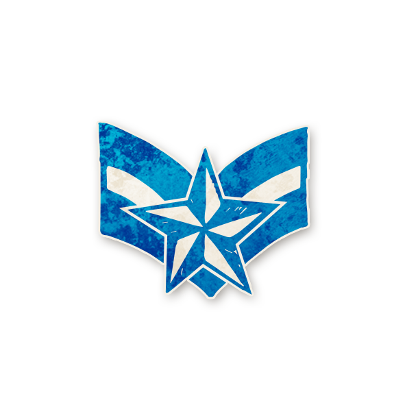
    Général
  </a>

  <a href="./roles_experimentaux/highpriestess.html" style="text-decoration:none; flex:0 0 220px; text-align:center;">
    
    Grande prêtresse
  </a>

  <a href="./bmr_roles/grandmere.html" style="text-decoration:none; flex:0 0 220px; text-align:center;">
    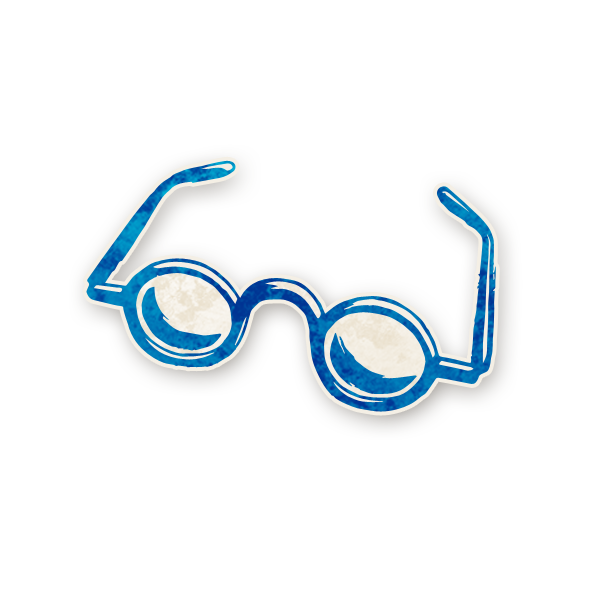
    Grand-Mère
  </a>

  <!-- H -->
  <a href="./sv_roles/horloger.html" style="text-decoration:none; flex:0 0 220px; text-align:center;">
    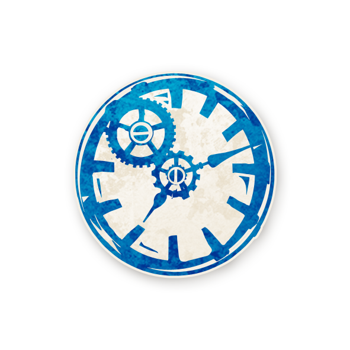
    Horloger
  </a>

  <!-- I -->
  <a href="./roles_experimentaux/villageidiot.html" style="text-decoration:none; flex:0 0 220px; text-align:center;">
    
    Idiot du village
  </a>

  <a href="./roles_experimentaux/engineer.html" style="text-decoration:none; flex:0 0 220px; text-align:center;">
    
    Ingénieur
  </a>

  <a href="./tb_roles/vierge.html" style="text-decoration:none; flex:0 0 220px; text-align:center;">
    
    Innocente
  </a>

  <a href="./roles_experimentaux/steward.html" style="text-decoration:none; flex:0 0 220px; text-align:center;">
    
    Intendant
  </a>

  <!-- J -->
  <a href="./sv_roles/jongleur.html" style="text-decoration:none; flex:0 0 220px; text-align:center;">
    
    Jongleur
  </a>

  <!-- L -->
  <a href="./tb_roles/lavandiere.html" style="text-decoration:none; flex:0 0 220px; text-align:center;">
    
    Lavandière
  </a>

  <a href="./roles_experimentaux/lycanthrope.html" style="text-decoration:none; flex:0 0 220px; text-align:center;">
    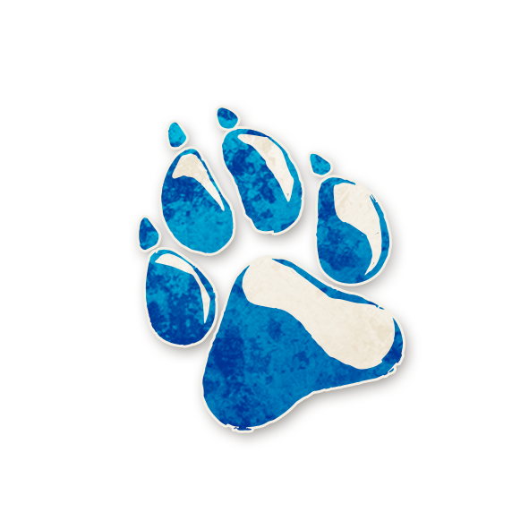
    Lycanthrope
  </a>

  <!-- M -->
  <a href="./tb_roles/maire.html" style="text-decoration:none; flex:0 0 220px; text-align:center;">
    
    Maire
  </a>

  <a href="./roles_experimentaux/magician.html" style="text-decoration:none; flex:0 0 220px; text-align:center;">
    
    Magicien
  </a>

  <a href="./bmr_roles/marin.html" style="text-decoration:none; flex:0 0 220px; text-align:center;">
    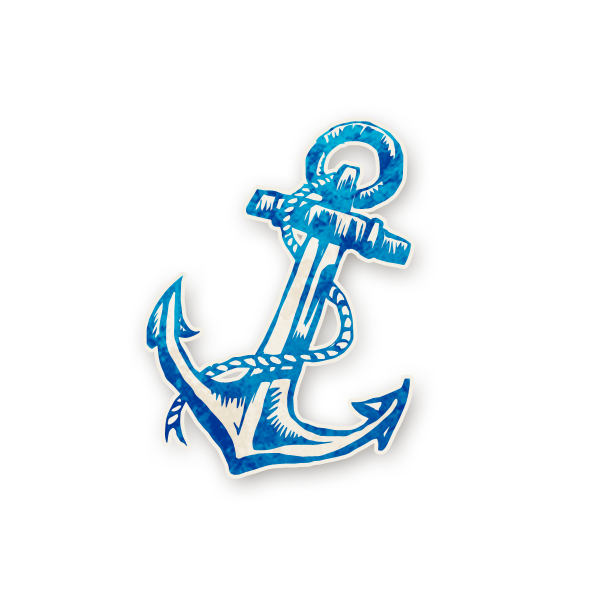
    Marin
  </a>

  <a href="./sv_roles/mathematicien.html" style="text-decoration:none; flex:0 0 220px; text-align:center;">
    
    Mathématicien
  </a>

  <a href="./bmr_roles/menestrel.html" style="text-decoration:none; flex:0 0 220px; text-align:center;">
    
    Ménestrel
  </a>

  <a href="./tb_roles/moine.html" style="text-decoration:none; flex:0 0 220px; text-align:center;">
    
    Moine
  </a>

  <!-- N -->
  <a href="./roles_experimentaux/noble.html" style="text-decoration:none; flex:0 0 220px; text-align:center;">
    
    Noble
  </a>

  <!-- O -->
  <a href="./sv_roles/oracle.html" style="text-decoration:none; flex:0 0 220px; text-align:center;">
    
    Oracle
  </a>

  <!-- P -->
  <a href="./bmr_roles/pacifiste.html" style="text-decoration:none; flex:0 0 220px; text-align:center;">
    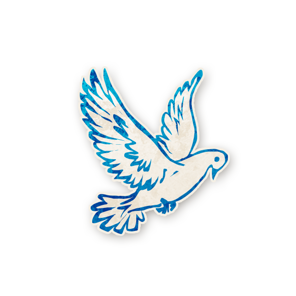
    Pacifiste
  </a>

  <a href="./bmr_roles/parieur.html" style="text-decoration:none; flex:0 0 220px; text-align:center;">
    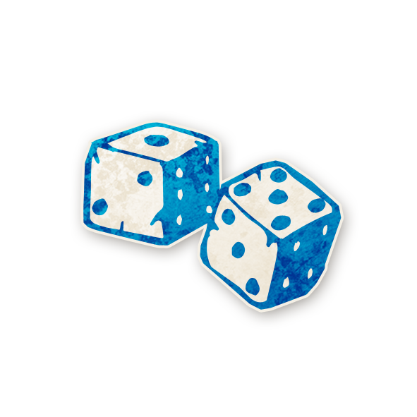
    Parieur
  </a>

  <a href="./sv_roles/philosophe.html" style="text-decoration:none; flex:0 0 220px; text-align:center;">
    
    Philosophe
  </a>

  <a href="./roles_experimentaux/pixie.html" style="text-decoration:none; flex:0 0 220px; text-align:center;">
    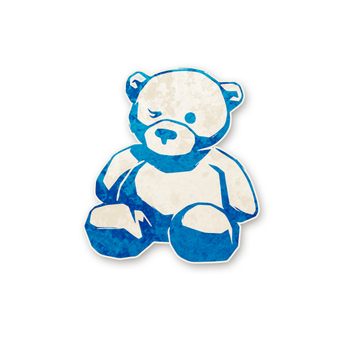
    Pixie
  </a>

  <a href="./tb_roles/mercenaire.html" style="text-decoration:none; flex:0 0 220px; text-align:center;">
    
    Pourfendeuse
  </a>

  <a href="./roles_experimentaux/preacher.html" style="text-decoration:none; flex:0 0 220px; text-align:center;">
    
    Prédicateur
  </a>

  <a href="./roles_experimentaux/princess.html" style="text-decoration:none; flex:0 0 220px; text-align:center;">
    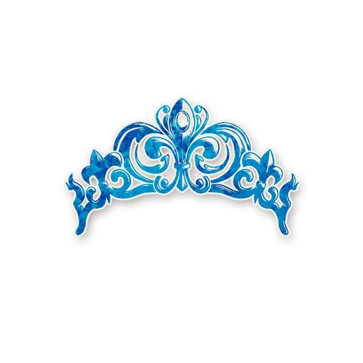
    Princesse
  </a>

  <a href="./bmr_roles/professeur.html" style="text-decoration:none; flex:0 0 220px; text-align:center;">
    
    Professeur
  </a>

  <!-- R -->
  <a href="./sv_roles/reveur.html" style="text-decoration:none; flex:0 0 220px; text-align:center;">
    
    Rêveur
  </a>

  <a href="./roles_experimentaux/king.html" style="text-decoration:none; flex:0 0 220px; text-align:center;">
    
    Roi
  </a>

  <!-- S -->
  <a href="./sv_roles/sage.html" style="text-decoration:none; flex:0 0 220px; text-align:center;">
    
    Sage
  </a>

  <a href="./sv_roles/savant.html" style="text-decoration:none; flex:0 0 220px; text-align:center;">
    
    Savant
  </a>

  <a href="./roles_experimentaux/shugenja.html" style="text-decoration:none; flex:0 0 220px; text-align:center;">
    
    Shugenja
  </a>

  <a href="./tb_roles/soldat.html" style="text-decoration:none; flex:0 0 220px; text-align:center;">
    
    Soldat
  </a>

  <!-- V -->
  <a href="./roles_experimentaux/nightwatchman.html" style="text-decoration:none; flex:0 0 220px; text-align:center;">
    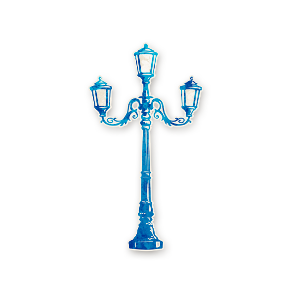
    Veilleur de nuit
  </a>

  <a href="./tb_roles/voyante.html" style="text-decoration:none; flex:0 0 220px; text-align:center;">
    
    Voyante
  </a>

 
---

## Autres catégories :  
- [Étrangers](etrangers.md)  
- [Sbires](sbires.md)  
- [Démons](demons.md)  
 

 <a href="./" style="color:#e0c99d; font-weight:bold; text-decoration:none;">Retour à la page d’accueil</a>

