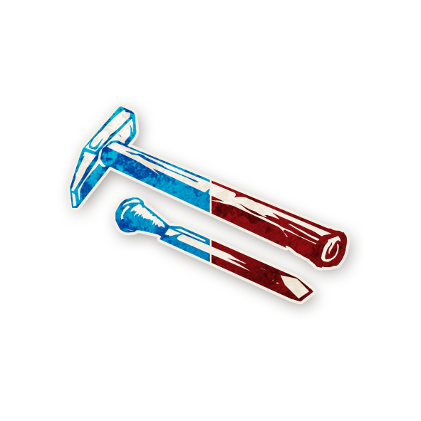

  

<!-- 🧪 Apprenti -->

  
   
  Apprenti

---

## 🧭 Informations

- **Type :** <a href="./voyageurs.html" style="color:#9b59b6; font-weight:bold; text-decoration:none;">Voyageur</a>  
- **Édition :** <a href="../bmr.html" style="color:#f5f5f5; font-weight:bold; text-decoration:none;">Bad Moon Rising</a>  
- **Artiste :** Aidan Roberts

« Des années que je voyage pour étudier l’Art. Quel art ? Celui des gens simples. Rien d’inquiétant. Pas encore. »

---

## 🎭 Apparaît dans

  

  🌙 <a href="../bmr.html" style="color:#f5f5f5; font-weight:bold; text-decoration:none; font-size:22px;">Bad Moon Rising</a>

---

## 📖 Résumé

« Lors de votre première nuit, vous gagnez une capacité de Villageois si vous êtes bon, ou une capacité de Sbire si vous êtes maléfique. »

L’<strong>Apprenti</strong> gagne une seule capacité selon son alignement et la conserve jusqu’à sa mort.

<ul style="color:#f5f5f5; font-size:18px; line-height:1.7;">
  <li>Si l’Apprenti est bon, il gagne la capacité d’un Villageois.</li>
  <li>S’il est maléfique, il gagne la capacité d’un Sbire.</li>
  <li>Il apprend sa capacité dès sa première nuit et agit immédiatement si ce rôle agit cette nuit-là.</li>
  <li>Seules les capacités listées sur les fiches de rôles peuvent être attribuées.</li>
  <li>L’Apprenti reste Voyageur (exil possible, ne compte pas pour « il ne reste que 2 joueurs en vie », etc.).</li>
  <li>Les effets qui « détectent un personnage » détectent toujours <em>Apprenti</em> (Voyageur), pas le rôle copié.</li>
</ul>

---

## 🎬 Mise en place & fonctionnement

<ul style="color:#f5f5f5; font-size:18px; line-height:1.7;">
  <li>La première nuit où l’Apprenti est en jeu : réveillez-le, montrez « VOUS ÊTES », puis un jeton Villageois (s’il est bon) ou Sbire (s’il est maléfique).</li>
  <li>Dans le Grimoire, remplacez temporairement son jeton par celui du personnage dont il gagne la capacité et marquez-le « EST L’APPRENTI ».</li>
  <li>En pratique, choisissez souvent un personnage non en jeu pour éviter les doublons visibles.</li>
</ul>

---

## 🧾 Exemples

<ul style="color:#f5f5f5; font-size:18px; line-height:1.7;">
  <li>Apprenti maléfique : gagne la capacité de l’<a href="../bmr_roles/assassin.html" style="color:#d45b5b; font-weight:bold; text-decoration:none;">Assassin</a>. Cette nuit-là, il tue une cible clé.</li>
  <li>Apprenti bon : gagne la capacité de la <a href="../bmr_roles/femme_de_chambre.html" style="color:#4ea3ff; font-weight:bold; text-decoration:none;">Femme de Chambre</a>. Il apprend qui se réveille la nuit. Plus tard, le <a href="../bmr_roles/parieur.html" style="color:#4ea3ff; font-weight:bold; text-decoration:none;">Parieur</a> le devine « <a href="../bmr_roles/dame_de_the.html" style="color:#4ea3ff; font-weight:bold; text-decoration:none;">Dame de Thé</a> » et meurt, car l’Apprenti n’est pas Dame de Thé.</li>
</ul>

---

## 🧿 Conseils et astuces (camp du Bien)

<ul style="color:#f5f5f5; font-size:18px; line-height:1.7;">
  <li>Adaptez-vous totalement à la capacité reçue : <a href="../bmr_roles/parieur.html" style="color:#4ea3ff; font-weight:bold; text-decoration:none;">Parieur</a>, <a href="../bmr_roles/marin.html" style="color:#4ea3ff; font-weight:bold; text-decoration:none;">Marin</a>, etc.</li>
  <li>Vous pouvez bluffer une capacité qui attire le Démon (ex. <a href="../bmr_roles/courtisan.html" style="color:#4ea3ff; font-weight:bold; text-decoration:none;">Courtisan</a>) : perdre un Voyageur est moins grave que perdre un Villageois clé.</li>
  <li>Les doublons sont rares : si quelqu’un prétend la même capacité, méfiez-vous.</li>
  <li>Coordonnez-vous tôt avec des joueurs confirmés bons pour synchroniser vos actions.</li>
</ul>

---

## 🔥 Conseils et astuces (camp du Mal)

<ul style="color:#f5f5f5; font-size:18px; line-height:1.7;">
  <li>Votre plan dépend de la capacité gagnée : <a href="../bmr_roles/assassin.html" style="color:#d45b5b; font-weight:bold; text-decoration:none;">Assassin</a>, <a href="../bmr_roles/courtisan.html" style="color:#4ea3ff; font-weight:bold; text-decoration:none;">Courtisan</a> (en bluff), <a href="../bmr_roles/exorciste.html" style="color:#4ea3ff; font-weight:bold; text-decoration:none;">Exorciste</a> (en bluff), etc.</li>
  <li>Annoncez publiquement une capacité de Villageois crédible et préparez des détails concrets sur son usage.</li>
  <li>En cas de conflit, prétendez un doublon rare ou accusez l’autre de mentir.</li>
  <li>Coordination précoce avec Démon et Sbires : une bonne synchro peut gagner la partie (votes, protections, assassinats).</li>
</ul>

---

## 📚 Rappels utiles

<ul style="color:#f5f5f5; font-size:18px; line-height:1.7;">
  <li>L’Apprenti peut être exilé comme tout Voyageur.</li>
  <li>Il ne compte pas pour la condition « il ne reste que 2 joueurs en vie ».</li>
  <li>Il garde sa capacité jusqu’à sa mort.</li>
</ul>

---

<ul style="color:#f5f5f5; font-size:18px; line-height:1.7;">
  <li>🏠 <a href="/botc-fr-bambi/" style="color:#f5f5f5; font-weight:bold; text-decoration:none;">Retour à l’accueil</a></li>
  <li>🌙 <a href="../bmr.html" style="color:#f5f5f5; font-weight:bold; text-decoration:none;">Retour à Bad Moon Rising</a></li>
  <li>🧳 <a href="./voyageurs.html" style="color:#9b59b6; font-weight:bold; text-decoration:none;">Retour aux Voyageurs</a></li>
</ul>
