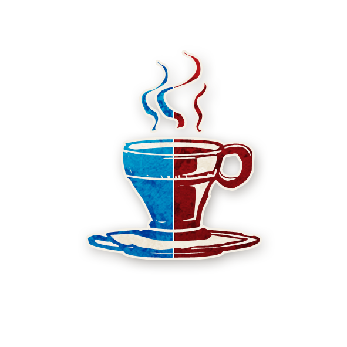

  

<!--  Barista -->

  
   
  Barista

---

##  Informations

<ul style="color:#f5f5f5; font-size:18px; line-height:1.7; margin-left:40px;">
  <li>
    <strong>Type :</strong>
    <a href="../voyageurs.html" style="color:#9b59b6; font-weight:bold; text-decoration:none;">Voyageur</a>
  </li>
  <li>
    <strong>Édition :</strong>
    <a href="/botc-fr-bambi/sv.html" style="color:#9b59b6; font-weight:bold; text-decoration:none;">Sects & Violets</a>  
  </li>
  <li><strong>Artiste :</strong> <em>Aidan Roberts</em></li>
  <li>
    <strong>Nom original :</strong>
    <a href="https://wiki.bloodontheclocktower.com/Barista"
       target="_blank"
       rel="noopener noreferrer"
       style="color:#9b59b6; font-weight:bold; text-decoration:none;">
Barista
    </a>
  </li>
</ul>

----

« Un café sans crème, Monsieur ? Toutes mes excuses, nous n’avons plus de crème… que diriez-vous d’un café sans lait ? »

---

## Apparaît dans

  

   <a href="/botc-fr-bambi/sv.html" style="color:#9b59b6; font-weight:bold; text-decoration:none; font-size:22px;">Sects & Violets</a>

---

##  Résumé

**« Chaque nuit, jusqu’au crépuscule : 1) un joueur devient sobre, sain et reçoit des informations véridiques, ou 2) sa capacité agit deux fois. Le joueur apprend lequel des deux effets s’applique. »**

Le <strong>Barista</strong> peut soit rendre un joueur parfaitement lucide et en bonne santé, soit lui permettre d’utiliser sa capacité deux fois plus que d’habitude.  
Le <strong>Conteur</strong> choisit chaque nuit le joueur affecté et l’effet appliqué. Le Barista ignore ces choix, mais le joueur concerné en est informé.

---

## Comment Conter

<ul style="color:#f5f5f5; font-size:18px; line-height:1.8;">
  <li>Chaque nuit, retirez les jeton de rappel précédents de la Barista.</li>
  <li>Placez soit le jeton de rappel <strong>SOBRE ET SAIN</strong>, soit le jeton de rappel <strong>AGIT DEUX FOIS</strong> à côté d’un jeton de rôle.</li>
  <li>Réveillez le joueur ou la joueuse concerné, montrez-lui le jeton d’info « CE RÔlE T’A CHOISI », puis celui de la Barista.</li>
  <li>Montrez-lui ensuite un doigt (s’il est sobre et sain) ou deux doigts (s’il agit deux fois). Endormez-le.</li>
  <li>Un joueur marqué <strong>SOBRE ET SAIN</strong> ne peut pas être ivre ou empoisonné jusqu’au crépuscule et reçoit toujours des informations véridiques, même avec un <a href="../sv_roles/vortox.html" style="color:#d45b5b; font-weight:bold; text-decoration:none;">Vortox</a> en jeu.</li>
  <li>Un joueur marqué <strong>AGIT DEUX FOIS</strong> agit normalement à son moment habituel, puis agit à nouveau immédiatement après.  
  Si sa capacité est facultative, il peut agir deux fois ; si elle est obligatoire, il doit le faire deux fois.</li>
</ul>

---

## Exemples

<ul style="color:#f5f5f5; font-size:18px; line-height:1.8;">
  <li>La Barista rend le <a href="../sv_roles/savant.html" style="color:#4ea3ff; font-weight:bold; text-decoration:none;">Savant</a> sobre et sain.</li>
  <li>La <a href="../sv_roles/maladroit.html" style="color:#4ea3ff; font-weight:bold; text-decoration:none;">Maladroit</a> agit deux fois : il meurt et doit choisir deux joueurs ; si l’un est maléfique, le Mal gagne.</li>
  <li>La nuit suivante, la Barista fait agir la <a href="../sv_roles/sorciere.html" style="color:#d45b5b; font-weight:bold; text-decoration:none;">Sorcière</a> deux fois : deux joueurs sont maudits.</li>
</ul>

---

## Conseils & Astuces pour les  Bons

<ul style="color:#f5f5f5; font-size:18px; line-height:1.8;">
  <li>Votre capacité agit de manière passive : le Conteur décide à qui elle profite. Écoutez les autres et déduisez qui a été affecté.</li>
  <li>Le Conteur favorisera généralement le Bien (environ deux bons joueurs pour un maléfique), mais certains effets iront aussi vers le Mal pour préserver le mystère.</li>
  <li>Rester en vie le plus longtemps possible augmente les chances que votre pouvoir aide le groupe.</li>
  <li>Un joueur qui agit deux fois peut être décisif, surtout s’il s’agit d’un <a href="../sv_roles/artiste.html" style="color:#4ea3ff; font-weight:bold; text-decoration:none;">Artiste</a>, d’une <a href="../sv_roles/couturiere.html" style="color:#4ea3ff; font-weight:bold; text-decoration:none;">Couturière</a> ou d’un <a href="../sv_roles/horloger.html" style="color:#4ea3ff; font-weight:bold; text-decoration:none;">Horloger</a>.</li>
  <li>Ne sous-estimez pas la valeur d’un joueur sûr d’être sobre et sain : ses infos sont 100 % fiables, même avec un <a href="../sv_roles/vortox.html" style="color:#d45b5b; font-weight:bold; text-decoration:none;">Vortox</a> en jeu.</li>
  <li>Encouragez les joueurs concernés à parler publiquement de ce qu’ils ont appris, car leurs paroles auront plus de poids.</li>
</ul>

---

##  Conseils & Astuces pour les  Maléfiques

<ul style="color:#f5f5f5; font-size:18px; line-height:1.8;">
  <li>Votre pouvoir est passif : profitez-en pour observer calmement la confusion qu’il crée.</li>
  <li>Le Conteur utilisera votre capacité au profit du Mal plus souvent, mais parfois aussi pour aider le Bien afin de brouiller les pistes.  
  Cela vous sert : si votre effet ne touchait que le Mal, on saurait que vous êtes maléfique.</li>
  <li>Restez en vie le plus longtemps possible pour multiplier les effets favorables à votre camp.</li>
  <li>Si des Sbires sont affectés, ils pourront souvent agir deux fois :  
  deux malédictions de <a href="../sv_roles/sorciere.html" style="color:#d45b5b; font-weight:bold; text-decoration:none;">Sorcière</a>, deux folies de <a href="../sv_roles/cerenovus.html" style="color:#d45b5b; font-weight:bold; text-decoration:none;">Cerenovus</a>, ou deux transformations de la <a href="../sv_roles/pithag.html" style="color:#d45b5b; font-weight:bold; text-decoration:none;">Guenaude</a>.</li>
  <li>Incitez les joueurs maléfiques à prétendre avoir été rendus « sobres et sains » pour justifier des informations trompeuses.</li>
  <li>Si vous survivez longtemps, votre équipe bénéficiera de plusieurs doubles actions ou informations falsifiées sous couvert de sincérité.</li>
</ul>

---

##  Rappels utiles

<ul style="color:#f5f5f5; font-size:18px; line-height:1.8;">
  <li>La Barista peut être exilé comme tout Voyageur.</li>
  <li>La Barista ne compte pas dans les conditions de victoire.</li>
  <li>Les jeton de rappel <strong>SOBRE ET SAIN</strong> et <strong>AGIT DEUX FOIS</strong> expirent au crépuscule suivant.</li>
</ul>

---

<ul style="color:#f5f5f5; font-size:18px; line-height:1.8;">
  <li> <a href="/botc-fr-bambi/" style="color:#f5f5f5; font-weight:bold; text-decoration:none;">Retour à l’accueil</a></li>
  <li> <a href="./voyageurs.html" style="color:#9b59b6; font-weight:bold; text-decoration:none;">Retour aux Voyageurs</a></li>
</ul>
