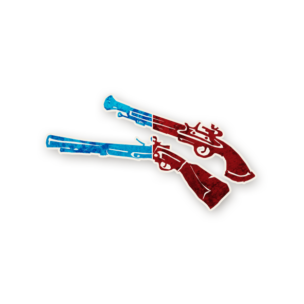

  

 [**Voyageurs**](voyageurs/voyageurs.md)  

# Les Voyageurs 🧳

---

## 📖 Présentation  

Les **Voyageurs** sont des rôles spéciaux pour les joueuses et joueurs qui arrivent en retard ⏰ ou qui devront partir tôt. 🚪
Un Voyageur peut rejoindre la partie à tout moment, et la quitter à tout moment.  

- Les Voyageurs ont souvent des capacités extrêmement puissantes ⚡, mais obtiennent peu d’informations.  
- Ils ont **un maximum de pouvoir**… mais **un minimum de responsabilité**.  
- Si un Voyageur est **Maléfique 😈**, il apprend qui est le Démon.  
  (Mais il ne connaît pas les Sbires et ne reçoit pas de bluffs.)  

---

## 📂 Contenu  

1. [Trouble Brewing](#-trouble-brewing)  
2. [Sects & Violets](#-sects--violets)  
3. [Bad Moon Rising](#-bad-moon-rising)  
4. [Expérimentaux](#-expérimentaux)  

---

## 🔵 Trouble Brewing  

   [Flingeur](flingeur.md)
  

---

## 🟣 Sects & Violets  

*(à venir)*  

---

## 🟠 Bad Moon Rising  

*(à venir)*  

---

## ⚫️ Expérimentaux  

*(à venir)*  

---

## 📂 Navigation  
- 🏠 [Retour à la page d’accueil](../README.md)  
